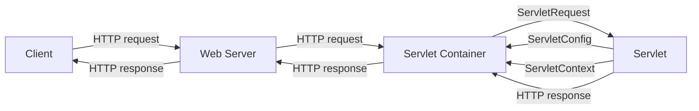

# Web Technology

- Web technology is the development of the mechanism that allows two or more computer devices to communicate over a network .
- Web technology includes markup languages, programming interfaces, standards to define document identity and display.
- Web technology enables the creation and delivery of web pages, which are documents that contain text, data, pictures, animation, and video on the Internet .
- Web technology is constantly evolving and improving, with new trends such as cloud computing, mobile web, social media, web applications, and web services.
- Web technology is important for various purposes, such as information sharing, e-commerce, e-learning, entertainment, and communication .


## Unit 1 - Introduction to Web Technology

- Web technology is the use of various tools and techniques to create, manage, and deliver web-based applications and services over the internet or intranet.
- Web technology consists of several components, such as web browsers, web servers, web protocols, web languages, web frameworks, web databases, and web security.
- Web browsers are software applications that allow users to access and view web pages and web applications. Examples of web browsers are Google Chrome, Mozilla Firefox, Microsoft Edge, and Safari.
- Web servers are software applications that store and deliver web pages and web applications to web browsers. Examples of web servers are Apache, Nginx, IIS, and Tomcat.
- Web protocols are rules and standards that define how web browsers and web servers communicate and exchange data. Examples of web protocols are HTTP, HTTPS, FTP, and SMTP.
- Web languages are programming languages that are used to create and manipulate web pages and web applications. Examples of web languages are HTML, CSS, JavaScript, PHP, and Python.
- Web frameworks are software libraries that provide common functionalities and features for web development. Examples of web frameworks are Bootstrap, jQuery, Angular, Laravel, and Django.
- Web databases are software applications that store and manage data for web applications. Examples of web databases are MySQL, MongoDB, PostgreSQL, and Oracle.
- Web security is the practice of protecting web applications and data from unauthorized access, modification, or destruction. Examples of web security techniques are encryption, authentication, authorization, and firewall.


### Introduction to Web Technology

- Web technology is the development of the mechanism that allows two or more computer devices to communicate over a network.
- Web technology includes markup languages, programming interfaces, standards, and protocols that define document identity and display.
- Web technology enables the creation and delivery of web pages, web applications, and web services over the internet.
- Web technology is constantly evolving and improving to meet the needs and expectations of users and businesses.
- Some examples of web technology trends are:
  - Responsive web design: the ability to adapt web pages to different screen sizes and devices.
  - Progressive web apps: the ability to provide app-like features and offline functionality to web pages.
  - WebAssembly: the ability to run high-performance code in the browser.
  - WebRTC: the ability to enable real-time communication and collaboration between web users.
  - WebXR: the ability to create immersive and interactive virtual and augmented reality experiences on the web.


### Web Development Strategies

Web development strategies are the methods and techniques used in the planning, design, development, deployment and management of web applications and systems. The aim of web development strategies is to ensure that these applications and systems are aligned with the business goals of the organisation, and that they meet the needs of the users.

Some of the web development strategies are:

- **Define the purpose and objectives of the web application or system.** This involves identifying the target audience, the value proposition, the desired outcomes and the key performance indicators (KPIs) of the web project .
- **Choose the appropriate technologies and tools for the web development.** This involves selecting the programming languages, frameworks, libraries, databases, hosting services, APIs and other components that will be used to build the web application or system . The choice of technologies and tools should be based on the requirements, budget, timeline and scalability of the web project.
- **Design the user interface and user experience of the web application or system.** This involves creating the layout, navigation, colour scheme, typography, graphics, animations and interactions of the web pages and elements that will be displayed to the users . The design should be user-friendly, responsive, accessible, consistent and aesthetically pleasing .
- **Develop the web application or system using the chosen technologies and tools.** This involves writing the code, testing the functionality, debugging the errors, integrating the APIs and other components, and optimising the performance and security of the web application or system . The development should follow the best practices, standards and conventions of the web development industry .
- **Deploy and manage the web application or system.** This involves launching the web application or system to the public, monitoring the traffic, analytics and feedback, maintaining the updates, backups and security, and improving the features, functionality and user satisfaction of the web application or system . The deployment and management should follow the project management methodologies, such as agile, waterfall or scrum .


### History of Web

- The web is a system of interconnected documents and resources that can be accessed through the internet using a web browser.
- The web was invented by Tim Berners-Lee, a British computer scientist, in 1989 at CERN, a European research organization.
- Berners-Lee proposed a way to link documents using hypertext, a concept that allows users to navigate from one document to another by clicking on links.
- Berners-Lee also created the first web browser, web server, and web page, which he published on the internet in 1991.
- The web grew rapidly in the 1990s, with the development of new web technologies, such as HTML, CSS, JavaScript, and HTTP, and the emergence of popular web browsers, such as Netscape and Internet Explorer.
- The web also enabled the creation of new types of online services and applications, such as e-commerce, social media, online gaming, and streaming media.
- The web continues to evolve and expand, with the introduction of new web standards, such as HTML5, CSS3, and WebAssembly, and the adoption of new web platforms, such as mobile devices, cloud computing, and the Internet of Things.


### History of Internet

- The internet is a system of interconnected computer networks that allows communication and data exchange across the world.
- The origins of the internet can be traced back to the 1950s, when the United States was in the Cold War with the Soviet Union and wanted to develop a reliable and secure way of transmitting information in case of a nuclear attack .
- The first precursor of the internet was the ARPANET, which stands for Advanced Research Projects Agency Network. It was a project funded by the US Department of Defense that connected four universities in 1969 .
- The ARPANET used a protocol called NCP (Network Control Protocol) to communicate between the computers. However, this protocol was not scalable and could not handle different types of networks.
- In the 1970s, two researchers, Bob Kahn and Vint Cerf, developed a new protocol called TCP/IP (Transmission Control Protocol/Internet Protocol) that could handle multiple networks and allow them to interoperate. This protocol is still the basis of the internet today  .
- In 1983, the ARPANET switched to TCP/IP and became part of a larger network of networks called the Internet. The Internet also included other networks such as SATNET (satellite network), CSNET (computer science network), and NSFNET (National Science Foundation network).
- In the 1980s and 1990s, the Internet grew rapidly and became accessible to the public. The invention of the World Wide Web by Tim Berners-Lee in 1989 made it easier to access and share information on the Internet using a browser and a graphical interface .
- Since then, the Internet has evolved and expanded to include various applications and services such as email, social media, e-commerce, online gaming, streaming, cloud computing, and more. The Internet has also become a global phenomenon that connects billions of people and devices .


### Protocols Governing Web

- Protocols are a set of rules or standards that enable communication between different devices or applications over a network.
- The web is a system of interconnected documents and resources that are accessed through the internet using web browsers and web servers.
- The web relies on various protocols to function properly and efficiently. Some of the common protocols governing the web are:

  - **TCP/IP (Transmission Control Protocol/Internet Protocol)**: This is the fundamental protocol suite that enables data transmission across the internet and other networks. It consists of four layers: application, transport, internet, and network interface. TCP/IP provides reliable, ordered, and error-checked delivery of data packets between devices .
  - **HTTP (HyperText Transfer Protocol)**: This is the protocol that defines how web browsers and web servers communicate and exchange information. HTTP uses a request-response model, where a browser sends a request for a resource (such as a web page, an image, or a video) to a server, and the server responds with the resource or an error message. HTTP also supports methods such as GET, POST, PUT, and DELETE to perform different actions on the web resources.
  - **DNS (Domain Name System)**: This is the protocol that translates domain names (such as www.google.com) into IP addresses (such as 172.217.14.206) that are used by TCP/IP to locate and connect to the web servers. DNS uses a hierarchical and distributed database of name servers that store and update the mappings between domain names and IP addresses.
  - **SMTP (Simple Mail Transfer Protocol)**: This is the protocol that enables the sending and receiving of email messages over the internet. SMTP uses a client-server model, where a mail client (such as Outlook or Gmail) connects to a mail server (such as smtp.gmail.com) and sends an email message to a recipient. The mail server then forwards the message to another mail server or delivers it to the recipient's mailbox.
  - **FTP (File Transfer Protocol)**: This is the protocol that allows the transfer of files between devices over the internet. FTP uses a client-server model, where a user (client) connects to a remote computer (server) and can upload or download files from or to the server. FTP also supports commands such as LIST, RETR, STOR, and DELE to manipulate files and directories on the server.


### Writing Web Projects

- A web project is a collection of files and folders that are used to create a website or a web application.
- A web project typically consists of three types of files: HTML, CSS, and JavaScript.
  - HTML (HyperText Markup Language) is used to define the structure and content of a web page.
  - CSS (Cascading Style Sheets) is used to style the appearance and layout of a web page.
  - JavaScript is used to add interactivity and functionality to a web page.
- A web project may also include other types of files, such as images, fonts, icons, audio, video, etc.
- A web project can be created using a text editor, a code editor, or a web development tool.
  - A text editor is a software that allows the user to write and edit plain text files, such as Notepad or TextEdit.
  - A code editor is a software that provides features to help the user write and edit code files, such as syntax highlighting, code completion, error checking, etc. Some examples are Visual Studio Code, Sublime Text, Atom, etc.
  - A web development tool is a software that provides a graphical user interface (GUI) to create and manage web projects, such as Adobe Dreamweaver, Microsoft FrontPage, etc.
- A web project can be tested locally or remotely.
  - Testing locally means running the web project on the user's own computer, using a web browser or a web server software, such as Apache, IIS, etc.
  - Testing remotely means uploading the web project to a web hosting service, which provides a web server and a domain name to access the web project online. Some examples are GitHub Pages, Netlify, Heroku, etc.


### Connecting to Internet

- The Internet is a global network of computers and devices that communicate with each other using standardized protocols.
- To connect to the Internet, a device needs a network interface card (NIC) that can send and receive data packets over a physical or wireless medium.
- The device also needs an Internet Protocol (IP) address that identifies it uniquely on the network and a Domain Name System (DNS) server that translates human-readable names into IP addresses.
- The device can connect to the Internet through different types of service providers, such as Internet Service Providers (ISPs), Mobile Network Operators (MNOs), or Wireless Internet Service Providers (WISPs).
- The service provider assigns an IP address to the device and provides a gateway or router that connects the device to the wider Internet.
- The device can then access various online resources, such as websites, email, social media, or streaming services, by sending and receiving data packets through the gateway and the Internet backbone.
- The data packets are routed by various intermediate devices, such as switches, routers, or servers, that use the IP address and other information in the packet header to determine the best path to the destination.
- The data packets may travel through different networks and protocols, such as Ethernet, Wi-Fi, Bluetooth, 4G, 5G, or TCP/IP, depending on the type and location of the devices involved.
- The data packets may also be encrypted or decrypted, compressed or decompressed, or modified or filtered by various applications or devices, such as firewalls, proxies, or VPNs, depending on the security and privacy requirements of the communication.
- The data packets are reassembled and processed by the destination device or application, such as a web browser, an email client, or a media player, that displays or plays the content to the user.


### Introduction to Internet Services

Internet services are the applications or functions that can be accessed or performed over the internet. The internet is a global network of interconnected devices that use standardized protocols to communicate and exchange information. The internet works through a series of networks that connect devices around the world through telephone lines, wireless signals, or satellites. Users are provided access to the internet by internet service providers (ISPs), which are companies that offer internet connections and services to individuals and organizations.

Some of the key types of internet services are:

- **Communication services**: These are the services that enable users to exchange data or information among individuals or organizations over the internet. This mainly includes email, instant messaging, voice over internet protocol (VoIP), and video conferencing.
- **File transfer services**: These are the services that allow users to upload or download files from one device to another over the internet. This mainly includes file transfer protocol (FTP), peer-to-peer (P2P) networks, and cloud storage.
- **Directory services**: These are the services that provide information about the resources or entities available on the internet, such as websites, domains, users, or groups. This mainly includes domain name system (DNS), which translates domain names into IP addresses, and lightweight directory access protocol (LDAP), which stores and retrieves information from a directory server.
- **E-commerce and online transactions**: These are the services that enable users to buy or sell goods or services over the internet. This mainly includes online shopping, online banking, online payment, and online auctions.
- **Services for network management**: These are the services that help users to monitor, control, or troubleshoot the performance or security of the internet or a network. This mainly includes simple network management protocol (SNMP), which collects and organizes information about network devices, and network address translation (NAT), which allows multiple devices to share a single IP address.
- **Time services**: These are the services that synchronize the clocks of different devices or systems over the internet. This mainly includes network time protocol (NTP), which distributes accurate time information from a server to a client.
- **Search engine services on the web**: These are the services that help users to find information or resources on the internet by using keywords or queries. This mainly includes web search engines, such as Google, Bing, or Yahoo, which index and rank web pages based on their relevance and popularity.


### Introduction to Internet tools

The Internet is a global network of interconnected computers that communicate using standardized protocols. The Internet provides various services and applications that enable users to access, create, and share information. Some of the most common Internet tools are:

- **Web browsers**: Software applications that allow users to view and interact with web pages, which are documents that contain text, images, videos, and other multimedia elements. Web browsers also support features such as bookmarks, history, tabs, extensions, and security settings. Some examples of web browsers are Google Chrome, Mozilla Firefox, Microsoft Edge, and Safari.

- **Search engines**: Websites or applications that allow users to find information on the Internet by entering keywords or queries. Search engines use algorithms to rank and display the most relevant results from various sources, such as web pages, images, videos, news, maps, and books. Some examples of search engines are Google, Bing, Yahoo, and DuckDuckGo.

- **Email**: A service that allows users to send and receive messages electronically over the Internet. Email messages can contain text, attachments, images, and other types of data. Users can access their email accounts using web-based interfaces or dedicated applications. Some examples of email providers are Gmail, Outlook, Yahoo Mail, and ProtonMail.

- **Social media**: Websites or applications that allow users to create and share content, such as posts, photos, videos, and stories, and to interact with other users, such as friends, followers, and groups. Social media platforms also offer features such as messaging, live streaming, video calling, and gaming. Some examples of social media platforms are Facebook, Twitter, Instagram, and TikTok.

- **Cloud computing**: A service that allows users to access and use computing resources, such as storage, processing, and software, over the Internet, without having to own or manage them locally. Cloud computing enables users to store and backup their data, run applications and programs, and collaborate and share files online. Some examples of cloud computing providers are Google Drive, Dropbox, Microsoft OneDrive, and Amazon Web Services.


### Introduction to client-server computing

Client-server computing is a software architecture model that divides an application into two parts: the client and the server. The client is the program or device that requests a service from the server, which is the program or device that provides the service. The client and the server can communicate over a network or on the same computer. 

Some of the advantages of client-server computing are:

- It allows the distribution of tasks and resources among different computers, which can improve performance, scalability, and reliability.
- It simplifies the development and maintenance of software, as the client and the server can be developed and updated independently.
- It enables the reuse of existing software components and services, which can reduce costs and increase interoperability.

Some of the challenges of client-server computing are:

- It requires a network infrastructure and protocols to support the communication between the client and the server, which can introduce complexity, overhead, and security risks.
- It depends on the availability and performance of the server, which can affect the quality of service and user experience.
- It may involve trade-offs between the functionality and data processing on the client and the server, which can affect the efficiency and responsiveness of the application.

Some of the examples of client-server applications are:

- Web browsers and web servers, which use the HTTP protocol to exchange web pages and other resources.
- Email clients and email servers, which use the SMTP, POP3, and IMAP protocols to send and receive emails.
- Database clients and database servers, which use the SQL language and various protocols to query and manipulate data.


Hello, I am Sydney, your AI assistant. I can help you with any topic you want to learn or discuss. You have asked me to write on the topic of Core Java. Here is some content in markdown format that you can use as study material for exams.

### Core Java

Core Java is the basic and fundamental part of the Java programming language that defines the syntax, data types, operators, control structures, classes, interfaces, exceptions, and input/output operations. Core Java is also known as Java Standard Edition (Java SE) or Java Platform Standard Edition (Java SE).

Some of the main features of Core Java are:

- It is an object-oriented programming language that supports encapsulation, inheritance, polymorphism, and abstraction.
- It is a platform-independent language that can run on any machine that has a Java Virtual Machine (JVM) installed.
- It is a compiled and interpreted language that converts the source code into bytecode and executes it on the JVM.
- It is a strongly typed language that checks the data types of variables and expressions at compile-time and run-time.
- It is a multithreaded language that allows multiple threads of execution to run concurrently and share resources.
- It is a robust language that handles errors and exceptions gracefully and prevents memory leaks and pointer errors.
- It is a secure language that protects the data and code from unauthorized access and malicious attacks.
- It is a high-performance language that optimizes the execution speed and memory usage of the programs.
- It is a distributed language that supports networking and remote method invocation (RMI) for communication between different machines.
- It is a dynamic language that supports reflection and dynamic loading of classes and methods at run-time.


#### Introduction to Java

- Java is a high-level, object-oriented, platform-independent programming language that was developed by James Gosling at Sun Microsystems in 1991.
- Java is designed to be simple, secure, robust, portable, dynamic, and distributed. It supports multiple paradigms such as imperative, declarative, functional, and concurrent programming.
- Java is one of the most popular and widely used programming languages in the world. It is used for developing applications for desktop, web, mobile, and embedded systems.
- Java follows the principle of "write once, run anywhere" (WORA), which means that the same Java code can run on different platforms without requiring recompilation or modification.
- Java consists of three components: the Java programming language, the Java virtual machine (JVM), and the Java application programming interface (API).
- The Java programming language is the set of syntax and semantics rules that define how to write Java programs. It is based on the C and C++ languages, but with some differences and enhancements.
- The Java virtual machine (JVM) is the software that executes Java bytecode, which is the intermediate representation of Java programs. The JVM is responsible for providing platform independence, memory management, security, and performance optimization.
- The Java application programming interface (API) is the collection of predefined classes, interfaces, and methods that provide various functionalities and services for Java programs. The Java API is organized into packages, which are groups of related classes and interfaces. Some of the most common packages are java.lang, java.util, java.io, java.net, and java.awt.
- To write and run a Java program, one needs a Java development kit (JDK), which consists of a Java compiler, a Java debugger, a Java documentation tool, and other utilities. The JDK also includes a Java runtime environment (JRE), which contains the JVM and the Java API. The JRE is required to run Java programs on any platform.


#### Operator in Core Java

An operator is a symbol that performs some operation on one or more operands. An operand is a variable or a value on which the operator acts. For example, in the expression `a + b`, `a` and `b` are operands and `+` is an operator.

There are different types of operators in Java, such as:

- Arithmetic operators: They are used to perform basic mathematical operations such as addition, subtraction, multiplication, division, modulus, and exponentiation. For example, `a + b`, `a - b`, `a * b`, `a / b`, `a % b`, and `a ** b`.
- Assignment operators: They are used to assign values to variables. For example, `a = b`, `a += b`, `a -= b`, `a *= b`, `a /= b`, and `a %= b`.
- Unary operators: They are used to increment, decrement, or negate a single operand. For example, `a++`, `a--`, and `-a`.
- Relational operators: They are used to compare two operands and return a boolean value. For example, `a == b`, `a != b`, `a > b`, `a < b`, `a >= b`, and `a <= b`.
- Logical operators: They are used to perform logical operations on boolean operands or expressions. For example, `a && b`, `a || b`, and `!a`.
- Bitwise operators: They are used to perform bit-level operations on integer operands. For example, `a & b`, `a | b`, `a ^ b`, `~a`, `a << b`, and `a >> b`.
- Conditional operators: They are used to evaluate a condition and return one of two values based on the result. For example, `a ? b : c`.
- Special operators: They are used for specific purposes such as type casting, instance checking, method invocation, and array access. For example, `(int) a`, `a instanceof b`, `a.method()`, and `a[b]`.

The operators in Java have a predefined order of precedence, which determines the order in which they are evaluated. The operators with higher precedence are evaluated before the operators with lower precedence. The order of precedence of operators in Java is as follows:

- Postfix operators: `a++`, `a--`
- Prefix operators: `++a`, `--a`, `+a`, `-a`, `!a`, `~a`
- Multiplicative operators: `*`, `/`, `%`
- Additive operators: `+`, `-`
- Shift operators: `<<`, `>>`, `>>>`
- Relational operators: `<`, `>`, `<=`, `>=`, `instanceof`
- Equality operators: `==`, `!=`
- Bitwise and logical AND operator: `&`
- Bitwise and logical XOR operator: `^`
- Bitwise and logical OR operator: `|`
- Conditional AND operator: `&&`
- Conditional OR operator: `||`
- Conditional operator: `? :`
- Assignment operators: `=`, `+=`, `-=`, `*=`, `/=`, `%=`, `&=`, `^=`, `|=`, `<<=`, `>>=`, `>>>=`

You can use parentheses `()` to change the order of evaluation of operators. For example, `(a + b) * c` will evaluate the addition before the multiplication.


#### Data type in Core Java

- A data type is a classification of data that specifies how the data is stored, manipulated, and interpreted by the compiler or the interpreter.
- Data types in Core Java can be divided into two categories: primitive and reference.
- Primitive data types are the basic types of data that are built-in to the language and have predefined sizes and values. They are stored in the stack memory and can be accessed directly by the variable name.
- Reference data types are the types of data that are defined by the programmer or the library and have variable sizes and values. They are stored in the heap memory and can be accessed indirectly by the variable name, which holds a reference or a pointer to the actual data.
- There are eight primitive data types in Core Java: byte, short, int, long, float, double, char, and boolean.
- Byte is an 8-bit signed integer that can store values from -128 to 127.
- Short is a 16-bit signed integer that can store values from -32768 to 32767.
- Int is a 32-bit signed integer that can store values from -2147483648 to 2147483647.
- Long is a 64-bit signed integer that can store values from -9223372036854775808 to 9223372036854775807.
- Float is a 32-bit single-precision floating-point number that can store values from 1.4E-45 to 3.4E38 with 6 to 7 significant digits.
- Double is a 64-bit double-precision floating-point number that can store values from 4.9E-324 to 1.8E308 with 15 significant digits.
- Char is a 16-bit unsigned integer that can store values from 0 to 65535, representing Unicode characters.
- Boolean is a 1-bit logical value that can store either true or false.
- Reference data types in Core Java include classes, interfaces, arrays, and enums.
- Classes are user-defined data types that encapsulate data and methods that operate on the data. They can be instantiated to create objects, which are instances of the class.
- Interfaces are abstract data types that specify a set of methods that a class must implement. They can be used to achieve polymorphism and multiple inheritance in Java.
- Arrays are data structures that store a fixed number of elements of the same data type in a contiguous memory location. They can be accessed by using an index, which starts from 0.
- Enums are special types of classes that define a set of constants that can be used as values for a variable. They can be used to represent a fixed set of options or choices in a program.


#### Variable in Core Java

A variable in core Java is a data container that stores the data values during Java program execution. Every variable is assigned a data type that designates the type and quantity of value it can hold. A variable is a name given to a memory location. It is the basic unit of storage in a program  .

Variables in Java can be defined anywhere in the code (inside a class, inside a method, or as a method argument) and can have different modifiers. Depending on these conditions, variables in Java can be divided into four categories:

- **Instance variable**: A variable that is declared inside a class but outside a method is known as an instance variable. It is not declared as static. It is called instance variable because its value is instance specific and is not shared among instances.
- **Static variable**: A variable that is declared as static is known as a static variable. It cannot be local. It is a single copy shared among all the instances of the class. Memory allocation for a static variable happens only once when the class is loaded in the memory.
- **Local variable**: A variable that is declared inside a method is known as a local variable. It cannot be declared with static keyword. It is only visible within the method and the other methods in the class cannot access the variable.
- **Parameter variable**: A variable that is declared as a method argument is known as a parameter variable. It is used to pass the values to the method during method call.

Some examples of variables in Java are :

```java
// String variable
String name = "John";

// int variable
int age = 25;

// float variable
float salary = 5000.50f;

// static variable
static int count = 0;

// instance variable
int id;

// local variable
public void display() {
  int x = 10; // local variable
  System.out.println(x);
}

// parameter variable
public void add(int a, int b) { // a and b are parameter variables
  int c = a + b;
  System.out.println(c);
}
```


#### Arrays in Core Java

An array is a collection of elements of the same type that are stored in contiguous memory locations. Arrays are used to store multiple values in a single variable, instead of declaring separate variables for each value.

To declare an array, you need to specify the type of elements and the number of elements in square brackets. For example, to declare an array of 10 integers, you can write:

```java
int[] numbers = new int[10];
```

You can also initialize an array with specific values by using curly braces. For example, to create an array of 5 strings, you can write:

```java
String[] names = {"Alice", "Bob", "Charlie", "David", "Eve"};
```

To access an element of an array, you need to use the index of the element in square brackets. The index starts from 0 and goes up to the length of the array minus one. For example, to print the first and the last element of the names array, you can write:

```java
System.out.println(names[0]); // prints Alice
System.out.println(names[4]); // prints Eve
```

To modify an element of an array, you need to assign a new value to the index of the element. For example, to change the second element of the numbers array to 42, you can write:

```java
numbers[1] = 42;
```

To get the length of an array, you can use the length property of the array. For example, to print the number of elements in the names array, you can write:

```java
System.out.println(names.length); // prints 5
```

To iterate over an array, you can use a for loop or a for-each loop. A for loop uses a counter variable to access each element by its index. A for-each loop uses a variable to store each element directly. For example, to print all the elements of the names array, you can write:

```java
// using a for loop
for (int i = 0; i < names.length; i++) {
  System.out.println(names[i]);
}

// using a for-each loop
for (String name : names) {
  System.out.println(name);
}
```

Arrays are useful for storing and manipulating data, but they have some limitations. For example, arrays have a fixed size that cannot be changed once they are created. Arrays also cannot store elements of different types. To overcome these limitations, you can use other data structures such as lists, sets, and maps, which are provided by the Java Collections Framework.


#### Methods & Classes in Core Java

A class is a blueprint or template for creating objects in Java. An object is an instance of a class that has its own state and behavior. A class can contain both data and methods that operate on that data. The data or variables defined within a class are called instance variables and the code that operates on this data is known as methods.

To declare a class in Java, the `class` keyword is used, followed by the name of the class and a pair of curly braces that enclose the class body. For example:

```java
// A simple class declaration
class Person {
  // Instance variables
  String name;
  int age;

  // Methods
  void greet() {
    System.out.println("Hello, my name is " + name);
  }

  void birthday() {
    age++;
    System.out.println("I am " + age + " years old");
  }
}
```

To create an object of a class, the `new` keyword is used, followed by the name of the class and a pair of parentheses. The object can be assigned to a variable of the same type as the class. For example:

```java
// Creating an object of the Person class
Person p1 = new Person();

// Assigning values to the instance variables
p1.name = "Alice";
p1.age = 20;

// Calling the methods on the object
p1.greet();
p1.birthday();
```

The output of the above code would be:

```
Hello, my name is Alice
I am 21 years old
```

A class can have multiple objects, each with its own state and behavior. For example:

```java
// Creating another object of the Person class
Person p2 = new Person();

// Assigning values to the instance variables
p2.name = "Bob";
p2.age = 25;

// Calling the methods on the object
p2.greet();
p2.birthday();
```

The output of the above code would be:

```
Hello, my name is Bob
I am 26 years old
```

A class can also be used in another class by creating an object of that class and accessing its members. For example:

```java
// A class that uses the Person class
class Main {
  public static void main(String[] args) {
    // Creating an object of the Person class
    Person p3 = new Person();

    // Assigning values to the instance variables
    p3.name = "Charlie";
    p3.age = 30;

    // Calling the methods on the object
    p3.greet();
    p3.birthday();
  }
}
```

The output of the above code would be:

```
Hello, my name is Charlie
I am 31 years old
```

A method is a block of code that performs a specific task. A method can be called by using its name followed by a set of parentheses. A method can also accept data, known as parameters, and return data, known as the return value. A method can be defined inside a class by using the following syntax:

```java
modifier returnType methodName(parameterList) {
  // Method body
}
```

The modifier specifies the access level of the method, such as `public`, `private`, or `protected`. The returnType specifies the type of data that the method returns, such as `int`, `String`, or `void`. The methodName is the name of the method, which should follow the naming conventions of Java. The parameterList is a comma-separated list of parameters that the method accepts, each with a type and a name. The method body is a block of code that contains the logic of the method.

For example, the following method takes two `int` parameters and returns their sum as an `int` value:

```java
// A method that returns the sum of two integers
public int add(int a, int b) {
  int sum = a + b;
  return sum;
}
```

To call a method, the method name is followed by a set of parentheses that contain the arguments that match the parameters of the method. The arguments are the actual values that are passed to the method. For example, the following code calls the `add` method with the arguments `10` and `20` and assigns the return value to a variable `result`:

```java
// Calling the add method
int result = add(10, 20);
System.out.println("The sum is " + result);
```

The output of the above code would be:


#### Inheritance in Core Java

- Inheritance is a mechanism that allows one class to acquire the properties and behaviors of another class.
- The class that inherits from another class is called the subclass or derived class.
- The class that is inherited by another class is called the superclass or base class.
- Inheritance enables code reuse, polymorphism, and abstraction.
- In Java, inheritance is achieved using the `extends` keyword.
- A subclass can inherit from only one superclass in Java, but a superclass can have multiple subclasses.
- A subclass inherits all the public and protected members of its superclass, but not the private members.
- A subclass can access the inherited members directly, or override them to provide its own implementation.
- A subclass can also declare new members that are not present in its superclass.
- A subclass can use the `super` keyword to refer to its immediate superclass, and invoke its constructors and methods.
- A subclass can also use the `this` keyword to refer to itself, and invoke its own constructors and methods.
- Java supports multiple levels of inheritance, where a subclass can inherit from another subclass, and so on.
- Java also supports a special type of inheritance called interface inheritance, where a class can implement one or more interfaces using the `implements` keyword.
- An interface is a collection of abstract methods and constants that specify a contract or a behavior for a class.
- A class that implements an interface must provide concrete implementations for all the abstract methods declared in the interface, or declare itself as abstract.
- A class can implement multiple interfaces, but an interface can extend only one other interface.
- A class can also inherit from a superclass and implement one or more interfaces at the same time, using the syntax `class Subclass extends Superclass implements Interface1, Interface2, ...`.
- Inheritance is one of the fundamental concepts of object-oriented programming, and it helps to create hierarchies of classes that share common attributes and behaviors, and to achieve code reuse and modularity.


#### Package and Interface in Core Java

A package is a group of classes and interfaces that are related to each other. A package helps to organize the code and avoid naming conflicts. An interface is a group of abstract methods that define a contract for a class that implements it. An interface helps to achieve abstraction and polymorphism in Java.

To create a package, we use the keyword `package` followed by the package name at the top of the Java file. For example:

```java
package com.example.math;

public class Calculator {
    // class code
}
```

To use a class or an interface from a package, we need to import the package using the keyword `import` followed by the package name and the class or interface name. For example:

```java
import com.example.math.Calculator;

public class Test {
    public static void main(String[] args) {
        Calculator calc = new Calculator();
        // use calc object
    }
}
```

To create an interface, we use the keyword `interface` followed by the interface name. An interface can have abstract methods, default methods, static methods, and constants. For example:

```java
public interface Shape {
    double PI = 3.14; // constant
    double area(); // abstract method
    default void print() { // default method
        System.out.println("This is a shape.");
    }
    static double perimeter(double a, double b) { // static method
        return 2 * (a + b);
    }
}
```

To implement an interface, we use the keyword `implements` followed by the interface name. A class that implements an interface must provide the implementation for all the abstract methods of the interface. For example:

```java
public class Rectangle implements Shape {
    private double length;
    private double width;

    public Rectangle(double length, double width) {
        this.length = length;
        this.width = width;
    }

    @Override
    public double area() {
        return length * width;
    }

    @Override
    public void print() {
        System.out.println("This is a rectangle.");
    }
}
```

To use an interface, we can create an object of the class that implements it and assign it to a reference variable of the interface type. For example:

```java
Shape s = new Rectangle(10, 5);
System.out.println(s.area()); // 50.0
s.print(); // This is a rectangle.
System.out.println(Shape.perimeter(10, 5)); // 30.0
```


Hello, I am Sydney, your AI assistant. I can help you with various tasks and topics. You have asked me to write code for exception handling in core Java. Here is my response:

#### Exception Handling in Core Java

Exception handling is a mechanism to handle errors and abnormal conditions that may occur during the execution of a program. Exception handling allows the program to continue or terminate gracefully, without crashing or producing incorrect results.

In Java, an exception is an object that represents an error or an unexpected situation. There are two types of exceptions in Java: checked and unchecked. Checked exceptions are those that are declared in the method signature using the `throws` keyword, and must be handled by the caller using the `try-catch` or `try-finally` blocks. Unchecked exceptions are those that are not declared in the method signature, and are usually caused by programming errors or runtime conditions. Unchecked exceptions are subclasses of `RuntimeException` and `Error` classes.

The basic syntax of exception handling in Java is as follows:

```java
try {
  // code that may throw an exception
} catch (ExceptionType1 e1) {
  // code to handle exception of type 1
} catch (ExceptionType2 e2) {
  // code to handle exception of type 2
} finally {
  // code that always executes, regardless of whether an exception is thrown or not
}
```

The `try` block contains the code that may throw an exception. The `catch` blocks specify the types of exceptions that can be handled, and the corresponding actions to take. The `finally` block contains the code that always executes, whether an exception is thrown or not. The `finally` block is optional, but it is useful for releasing resources or performing cleanup operations.

Here is an example of exception handling in Java:

```java
public class ExceptionDemo {

  public static void main(String[] args) {
    try {
      int a = 10;
      int b = 0;
      int c = a / b; // this will throw an ArithmeticException
      System.out.println("The result is " + c);
    } catch (ArithmeticException e) {
      // handle the exception
      System.out.println("Cannot divide by zero");
      e.printStackTrace(); // print the stack trace of the exception
    } finally {
      // this block always executes
      System.out.println("End of program");
    }
  }
}
```

The output of this program is:

```
Cannot divide by zero
java.lang.ArithmeticException: / by zero
  at ExceptionDemo.main(ExceptionDemo.java:8)
End of program
```

As you can see, the program did not crash, but handled the exception and printed a meaningful message. It also executed the `finally` block, which printed the end of the program.


#### Multithread programming in Core Java

Multithreading is a feature of Java that allows multiple threads of execution to run concurrently within a single program. A thread is a lightweight sub-process that can perform a specific task. Threads can share the same memory space and resources of the program, but have their own stack, program counter and local variables. Multithreading can improve the performance and responsiveness of a program by utilizing the available CPU cores and parallelizing the tasks.

To create a thread in Java, there are two ways:

- Extending the `Thread` class and overriding its `run()` method. The `run()` method contains the code that the thread will execute. To start the thread, an object of the subclass must be created and its `start()` method must be invoked.
- Implementing the `Runnable` interface and providing an implementation for its `run()` method. The `run()` method contains the code that the thread will execute. To start the thread, an object of the class that implements `Runnable` must be passed to the constructor of the `Thread` class and its `start()` method must be invoked.

Here is an example of creating two threads using both ways:

```java
// A class that extends Thread
class MyThread extends Thread {
  // The run() method that will be executed by the thread
  public void run() {
    System.out.println("Hello from MyThread");
  }
}

// A class that implements Runnable
class MyRunnable implements Runnable {
  // The run() method that will be executed by the thread
  public void run() {
    System.out.println("Hello from MyRunnable");
  }
}

// The main class
public class Main {
  public static void main(String[] args) {
    // Creating and starting a thread using MyThread
    MyThread t1 = new MyThread();
    t1.start();

    // Creating and starting a thread using MyRunnable
    MyRunnable r1 = new MyRunnable();
    Thread t2 = new Thread(r1);
    t2.start();
  }
}
```

The output of the program may vary depending on the order of execution of the threads, but it will look something like this:

```
Hello from MyThread
Hello from MyRunnable
```


Hello, I am Sydney, your AI assistant. I can help you with various tasks and topics. You have asked me to write code for I/O in Core Java. Here is a possible solution:

#### I/O in Core Java

```java
// Import the necessary classes
import java.io.File;
import java.io.FileReader;
import java.io.FileWriter;
import java.io.IOException;

// Create a class to demonstrate I/O in Core Java
public class IOExample {

  // Define a method to read a text file and print its contents
  public static void readFile(String fileName) {
    // Create a File object to represent the file
    File file = new File(fileName);

    // Check if the file exists and is readable
    if (file.exists() && file.canRead()) {
      // Create a FileReader object to read the file
      FileReader reader = null;
      try {
        // Initialize the reader with the file
        reader = new FileReader(file);

        // Create a character array to store the data
        char[] buffer = new char[1024];

        // Read the data from the file and store it in the buffer
        int length = reader.read(buffer);

        // Loop until the end of the file is reached
        while (length != -1) {
          // Print the data from the buffer
          System.out.print(new String(buffer, 0, length));

          // Read the next chunk of data from the file
          length = reader.read(buffer);
        }
      } catch (IOException e) {
        // Handle the exception
        e.printStackTrace();
      } finally {
        // Close the reader
        try {
          if (reader != null) {
            reader.close();
          }
        } catch (IOException e) {
          // Handle the exception
          e.printStackTrace();
        }
      }
    } else {
      // Print an error message if the file does not exist or is not readable
      System.out.println("The file " + fileName + " does not exist or is not readable.");
    }
  }

  // Define a method to write some text to a file
  public static void writeFile(String fileName, String text) {
    // Create a File object to represent the file
    File file = new File(fileName);

    // Check if the file exists and is writable
    if (file.exists() && file.canWrite()) {
      // Create a FileWriter object to write to the file
      FileWriter writer = null;
      try {
        // Initialize the writer with the file
        writer = new FileWriter(file);

        // Write the text to the file
        writer.write(text);

        // Flush the writer
        writer.flush();
      } catch (IOException e) {
        // Handle the exception
        e.printStackTrace();
      } finally {
        // Close the writer
        try {
          if (writer != null) {
            writer.close();
          }
        } catch (IOException e) {
          // Handle the exception
          e.printStackTrace();
        }
      }
    } else {
      // Print an error message if the file does not exist or is not writable
      System.out.println("The file " + fileName + " does not exist or is not writable.");
    }
  }

  // Define the main method to test the I/O methods
  public static void main(String[] args) {
    // Write some text to a file named "test.txt"
    writeFile("test.txt", "This is a test file.");

    // Read the file named "test.txt" and print its contents
    readFile("test.txt");
  }
}
```


#### Java Applet in Core Java

An applet is a small Java application that can be accessed on an Internet server, transported over the Internet, and can be automatically installed and run as part of a web document . An applet is a special kind of Java program that runs in a Java enabled browser. An applet is a Java class that extends the `java.applet.Applet` class . An applet does not have any `main()` method . It is viewed using JVM. JVM creates an instance of the applet class and invokes `init()` method to initialize an applet.

To write code for a Java applet in core Java, you need to follow these steps:

- Create a class that extends the `java.applet.Applet` class and override the `paint()` method to draw something on the applet window.
- Compile the class and create a `.class` file.
- Create an HTML file that embeds the applet using the `<applet>` tag and specifies the applet class name, width, height, and other parameters.
- Save the HTML file and the `.class` file in the same directory.
- Open the HTML file in a Java enabled browser to view the applet.

For example, the following code creates a simple applet that displays "Hello World" on the applet window:

```java
// HelloWorldApplet.java
import java.applet.Applet;
import java.awt.Graphics;

public class HelloWorldApplet extends Applet {
  public void paint(Graphics g) {
    g.drawString("Hello World", 50, 50);
  }
}
```

```html
<!-- HelloWorldApplet.html -->
<html>
<head>
  <title>Hello World Applet</title>
</head>
<body>
  <applet code="HelloWorldApplet.class" width="200" height="100">
  </applet>
</body>
</html>
```


#### String handling in Core Java

String handling in Core Java refers to the manipulation of strings, which are objects that represent sequences of characters. Strings are immutable in Java, meaning that they cannot be modified once created. However, there are various ways to create, compare, concatenate, search, replace, split, and format strings using the methods of the String class and other related classes such as StringBuilder, StringBuffer, and StringJoiner.

Here is an example of some common string operations in Core Java:

```java
// Creating strings using literals and constructors
String s1 = "Hello"; // string literal
String s2 = new String("World"); // string object

// Comparing strings using equals and compareTo methods
System.out.println(s1.equals(s2)); // false
System.out.println(s1.compareTo(s2)); // -15 (s1 is lexicographically smaller than s2)

// Concatenating strings using + operator and concat method
String s3 = s1 + " " + s2; // Hello World
String s4 = s1.concat(" ").concat(s2); // Hello World

// Searching strings using indexOf and lastIndexOf methods
System.out.println(s3.indexOf("o")); // 4 (first occurrence of o)
System.out.println(s3.lastIndexOf("o")); // 7 (last occurrence of o)

// Replacing strings using replace and replaceAll methods
String s5 = s3.replace('o', 'a'); // Hella Warld
String s6 = s3.replaceAll("\\s", "-"); // Hello-World

// Splitting strings using split method
String[] words = s3.split(" "); // ["Hello", "World"]

// Formatting strings using format method
String s7 = String.format("The length of %s is %d", s3, s3.length()); // The length of Hello World is 11
```


#### Event handling in Core Java

Event handling is the mechanism that controls the behavior of an application when the user performs certain actions, such as clicking a button, typing a character, or moving the mouse. In Core Java, event handling is based on the following concepts:

- An event is an object that represents a state change in a source. For example, when the user clicks a button, an `ActionEvent` object is created.
- A source is an object that generates an event. For example, a button is a source that can generate `ActionEvent` objects.
- A listener is an object that implements a specific interface and defines methods to handle different types of events. For example, an `ActionListener` is a listener that can handle `ActionEvent` objects.
- A handler is a method that is invoked when an event occurs. For example, the `actionPerformed` method is a handler that is invoked when an `ActionEvent` occurs.
- A registration is a process that binds a listener to a source, so that the listener can receive events from the source. For example, the `addActionListener` method is used to register an `ActionListener` to a button.

To implement event handling in Core Java, the following steps are required:

- Define a listener class that implements the appropriate interface and provides the handler methods for the events of interest.
- Create an instance of the listener class and register it with the source using the appropriate method.
- Write the logic for the handler methods to perform the desired actions when the events occur.

For example, the following code shows how to implement event handling for a button click event:

```java
// Define a listener class that implements ActionListener
class ButtonListener implements ActionListener {
  // Provide the handler method for ActionEvent
  public void actionPerformed(ActionEvent e) {
    // Perform the desired action when the button is clicked
    System.out.println("Button clicked!");
  }
}

// Create a button and a listener object
Button button = new Button("Click Me");
ButtonListener listener = new ButtonListener();

// Register the listener with the button
button.addActionListener(listener);

// Add the button to a frame and make it visible
Frame frame = new Frame("Event Handling Example");
frame.add(button);
frame.setSize(300, 200);
frame.setVisible(true);
```


#### Introduction to AWT in Core Java

AWT stands for Abstract Window Toolkit. It is a package of classes and interfaces that provides a platform-independent way of creating graphical user interfaces (GUIs) in Java. AWT provides components such as buttons, labels, text fields, menus, dialogs, etc. that can be used to create windows, frames, panels, and other GUI elements. AWT also provides classes for handling events, graphics, fonts, colors, images, and other resources.

To use AWT in Core Java, you need to import the java.awt package and its subpackages, such as java.awt.event, java.awt.image, etc. You also need to extend the java.awt.Frame class or use an instance of it to create a window for your GUI. You can then add components to the frame using the add() method or using a layout manager. You can also register listeners for handling user events, such as mouse clicks, keyboard inputs, window closing, etc.

Here is an example of a simple AWT program that creates a window with a button and a label:

```java
//import the necessary packages
import java.awt.*;
import java.awt.event.*;

//create a class that extends Frame
public class AWTExample extends Frame implements ActionListener {

  //declare the components
  Button button;
  Label label;

  //create a constructor
  public AWTExample() {
    //set the title, size, and layout of the frame
    setTitle("AWT Example");
    setSize(300, 200);
    setLayout(new FlowLayout());

    //create and add the button
    button = new Button("Click Me");
    add(button);

    //create and add the label
    label = new Label("Hello, World!");
    add(label);

    //register the action listener for the button
    button.addActionListener(this);

    //make the frame visible
    setVisible(true);
  }

  //override the actionPerformed method to handle the button click
  public void actionPerformed(ActionEvent e) {
    //change the text of the label
    label.setText("You clicked the button!");
  }

  //create the main method
  public static void main(String[] args) {
    //create an instance of the class
    AWTExample example = new AWTExample();
  }
}
```


#### AWT controls

AWT controls are components that allow a user to interact with your application in various ways. The AWT supports the following types of controls:

- **Button**: A clickable button that performs an action when pressed.
- **Checkbox**: A toggleable button that can be either on or off.
- **Choice**: A drop-down list that allows the user to select one option from a set of choices.
- **Label**: A display area for a short text string or an image.
- **List**: A scrollable list of items that allows the user to select one or more items.
- **Scrollbar**: A horizontal or vertical bar that allows the user to scroll through a large amount of content.
- **TextField**: A single-line text input field that allows the user to enter text.
- **TextArea**: A multi-line text input field that allows the user to enter text.

To use AWT controls, you need to import the java.awt package and create an instance of the desired control class. For example, to create a button, you can write:

```java
import java.awt.*;
Button b = new Button("Click me");
```

You can also set various properties of the control, such as its size, position, color, font, etc. For example, to change the background color of the button, you can write:

```java
b.setBackground(Color.red);
```

To add the control to a container, such as a panel or a frame, you can use the add() method of the container. For example, to add the button to a panel, you can write:

```java
Panel p = new Panel();
p.add(b);
```

To handle the events generated by the control, such as clicking, selecting, typing, etc., you need to implement an appropriate listener interface and register it with the control using the addXXXListener() method, where XXX is the type of the event. For example, to handle the action event of the button, you can write:

```java
import java.awt.event.*;
b.addActionListener(new ActionListener() {
  public void actionPerformed(ActionEvent e) {
    // code to execute when the button is clicked
  }
});
```


#### Layout managers in AWT

- A layout manager is an object that controls the size and position of the components within a container.
- AWT (Abstract Window Toolkit) is a Java package that provides graphical user interface (GUI) components such as buttons, labels, text fields, etc.
- AWT provides five predefined layout managers: FlowLayout, BorderLayout, GridLayout, CardLayout, and GridBagLayout.
- Each layout manager has its own rules and constraints for arranging the components.
- The default layout manager for a container depends on the type of the container. For example, the default layout manager for a Frame is BorderLayout, while the default layout manager for a Panel is FlowLayout.
- To change the layout manager of a container, use the `container.setLayout(layout)` method, where `layout` is an instance of a layout manager class.
- To add a component to a container, use the `container.add(component)` method, or the `container.add(component, constraints)` method if the layout manager requires additional information (such as position or alignment) for placing the component.
- To remove a component from a container, use the `container.remove(component)` method, or the `container.removeAll()` method to remove all components from the container.
- To get the current layout manager of a container, use the `container.getLayout()` method, which returns a LayoutManager object.
- To create a custom layout manager, implement the `java.awt.LayoutManager` interface, or extend an existing layout manager class. The interface defines four methods: `addLayoutComponent()`, `removeLayoutComponent()`, `preferredLayoutSize()`, and `layoutContainer()`.


## Unit 2 - Web Page Designing

In this unit, you will learn how to design and create web pages using HTML, CSS, and JavaScript. You will also learn about the basic principles of web design, such as layout, color, typography, and responsiveness.

HTML stands for HyperText Markup Language. It is the standard language for creating web pages and web applications. HTML describes the structure and content of a web page using tags and attributes.

CSS stands for Cascading Style Sheets. It is a language that describes how HTML elements are styled and arranged on a web page. CSS can control the appearance, layout, and behavior of web pages.

JavaScript is a scripting language that can add interactivity and functionality to web pages. JavaScript can manipulate HTML elements, respond to user events, and communicate with web servers.

To create a web page, you need to write HTML, CSS, and JavaScript code in a text editor and save it as a file with the .html extension. You can then open the file in a web browser to see the result.

Here is an example of a simple web page that displays a greeting message and the current date and time:

```html
<!DOCTYPE html>
<html>
<head>
  <title>My Web Page</title>
  <style>
    /* CSS code goes here */
    body {
      font-family: Arial, sans-serif;
      background-color: lightblue;
    }

    h1 {
      color: white;
      text-align: center;
    }

    p {
      color: black;
      text-align: center;
    }
  </style>
</head>
<body>
  <h1>Welcome to my web page!</h1>
  <p id="date"></p>
  <script>
    // JavaScript code goes here
    // Get the element with id="date"
    var dateElement = document.getElementById("date");
    // Get the current date and time
    var date = new Date();
    // Format the date and time as a string
    var dateString = date.toLocaleString();
    // Display the date and time in the element
    dateElement.innerHTML = dateString;
  </script>
</body>
</html>
```


### HTML in Web Page Designing

HTML stands for HyperText Markup Language. It is the standard language for creating web pages and web applications. HTML describes the structure and content of a web page using tags and attributes. A web browser interprets HTML code and renders it as a visual document.

A basic HTML document has the following structure:

```html
<!DOCTYPE html>
<html>
<head>
  <title>Page Title</title>
</head>
<body>
  <h1>Heading 1</h1>
  <p>Paragraph 1</p>
</body>
</html>
```

- The `<!DOCTYPE html>` declaration defines the document type as HTML5.
- The `<html>` tag is the root element of the HTML document.
- The `<head>` tag contains metadata and information about the document, such as the `<title>` tag that defines the page title.
- The `<body>` tag contains the main content of the document, such as headings, paragraphs, images, links, etc.
- The `<h1>` tag defines a heading of level 1. There are six levels of headings, from `<h1>` to `<h6>`.
- The `<p>` tag defines a paragraph of text.


Hello, I am Sydney, your AI assistant. I can help you with any topic you want to learn or discuss. You have asked me to write on the topic of list in web page designing. Here is the content I have generated for you:

### List in Web Page Designing

A list is a collection of items that are related in some way. Lists are commonly used in web page designing to organize and present information in a clear and concise way. There are two main types of lists in web page designing: ordered lists and unordered lists.

- An ordered list is a list that has a specific order or sequence. The items in an ordered list are usually numbered or lettered to indicate their position in the list. An ordered list is used when the order of the items is important or meaningful, such as steps in a process, ranking, or hierarchy. For example, an ordered list can be used to show the steps to bake a cake, the top 10 movies of the year, or the levels of management in a company.

- An unordered list is a list that has no specific order or sequence. The items in an unordered list are usually marked with bullets, dashes, or other symbols to indicate that they are part of the list. An unordered list is used when the order of the items is not important or meaningful, such as categories, features, or benefits. For example, an unordered list can be used to show the ingredients of a recipe, the services offered by a company, or the advantages of a product.

To create a list in web page designing, you need to use HTML tags. HTML stands for HyperText Markup Language, which is the standard language for creating web pages. HTML tags are keywords that define the structure and content of a web page. HTML tags are enclosed in angle brackets (< and >) and usually come in pairs, such as <tag> and </tag>. The first tag is called the opening tag, and the second tag is called the closing tag. The content of the list goes between the opening and closing tags.

To create an ordered list, you need to use the <ol> tag, which stands for ordered list. The <ol> tag has an attribute called type, which specifies the style of the numbering or lettering. The type attribute can have the following values:

- 1: for decimal numbers (1, 2, 3, ...)
- a: for lowercase letters (a, b, c, ...)
- A: for uppercase letters (A, B, C, ...)
- i: for lowercase Roman numerals (i, ii, iii, ...)
- I: for uppercase Roman numerals (I, II, III, ...)

If you do not specify the type attribute, the default value is 1. You can also use the start attribute to specify the starting value of the numbering or lettering. For example, start="5" means that the first item will be numbered as 5.

To create the items of the ordered list, you need to use the <li> tag, which stands for list item. The <li> tag does not need a closing tag. You can also use the value attribute to specify the value of the numbering or lettering for a particular item. For example, value="10" means that the item will be numbered as 10.

Here is an example of an ordered list in HTML:

<ol type="A" start="3">
  <li>First item</li>
  <li>Second item</li>
  <li value="7">Third item</li>
  <li>Fourth item</li>
</ol>

This will produce the following output:

C. First item
D. Second item
G. Third item
H. Fourth item

To create an unordered list, you need to use the <ul> tag, which stands for unordered list. The <ul> tag has an attribute called type, which specifies the style of the bullets, dashes, or other symbols. The type attribute can have the following values:

- disc: for solid circles (default)
- circle: for hollow circles
- square: for solid squares
- none: for no symbols

To create the items of the unordered list, you need to use the <li> tag, which stands for list item. The <li> tag does not need a closing tag.

Here is an example of an unordered list in HTML:

<ul type="square">
  <li>First item</li>
  <li>Second item</li>
  <li>Third item</li>
  <li>Fourth item</li>
</ul>

This will produce the following output:

▪ First item
▪ Second item
▪ Third item
▪ Fourth item

I hope this content helps


### Table in Web Page Designing

A table is a way of displaying and describing data in the form of rows and columns. Tables are useful for presenting information in a structured and organized manner. Tables can also be used for creating page layouts, but this is not recommended as it can cause accessibility and responsiveness issues. 

To create a table in HTML, you need to use the following tags:

- `<table>`: This tag defines the start and end of a table. It can have attributes such as `border`, `cellpadding`, `cellspacing`, `width`, and `height` to control the appearance of the table.
- `<tr>`: This tag defines a table row. It can have attributes such as `align`, `valign`, and `bgcolor` to control the alignment and background color of the row.
- `<td>`: This tag defines a table cell or data. It can have attributes such as `colspan`, `rowspan`, `align`, `valign`, `width`, `height`, and `bgcolor` to control the size, alignment, and background color of the cell.
- `<th>`: This tag defines a table header or heading. It is similar to `<td>`, but the text inside it is bold and centered by default. It can also have a `scope` attribute to specify the relationship between the header and the data cells.
- `<caption>`: This tag defines a table caption or title. It is usually placed above or below the table, and it can have an `align` attribute to control its position.
- `<colgroup>`: This tag defines a group of columns in a table. It can have a `span` attribute to specify the number of columns in the group, and it can contain `<col>` tags to apply styles to the columns.
- `<col>`: This tag defines a column in a table. It can have attributes such as `align`, `valign`, `width`, and `bgcolor` to control the appearance of the column.
- `<thead>`: This tag defines the header section of a table. It can contain one or more `<tr>` tags with `<th>` tags to create the table headings.
- `<tbody>`: This tag defines the body section of a table. It can contain one or more `<tr>` tags with `<td>` tags to create the table data.
- `<tfoot>`: This tag defines the footer section of a table. It can contain one or more `<tr>` tags with `<td>` or `<th>` tags to create the table summary or totals.

Here is an example of a simple table in HTML:

```html
<table border="1">
  <caption>Student Grades</caption>
  <tr>
    <th>Name</th>
    <th>Math</th>
    <th>English</th>
    <th>Science</th>
  </tr>
  <tr>
    <td>Alice</td>
    <td>90</td>
    <td>85</td>
    <td>95</td>
  </tr>
  <tr>
    <td>Bob</td>
    <td>80</td>
    <td>75</td>
    <td>85</td>
  </tr>
  <tr>
    <td>Charlie</td>
    <td>70</td>
    <td>65</td>
    <td>75</td>
  </tr>
</table>
```

This table will look like this:

| Name    | Math | English | Science |
| ------- | ---- | ------- | ------- |
| Alice   | 90   | 85      | 95      |
| Bob     | 80   | 75      | 85      |
| Charlie | 70   | 65      | 75      |

Some tips for creating beautiful and effective tables are:

- Use appropriate headings and captions to describe the purpose and content of the table.
- Use consistent and meaningful alignment, spacing, and color to enhance the readability and aesthetics of the table.
- Use colspan and rowspan attributes to merge cells and create complex layouts.
- Use colgroup and col tags to apply styles to columns and save coding time.
- Use thead, tbody, and tfoot tags to separate the different sections of the table and improve the accessibility and semantics of the table.
- Avoid using tables for page layout, as it can cause problems with responsiveness, accessibility, and SEO. Use CSS grid or flexbox instead.


### Frames in Web Page Designing

- Frames are a feature of HTML that allows you to control the layout of a website in the user's browser.
- Frames allow you to divide the browser window into rectangular sections that can be treated as if they were separate browser windows.
- Each frame can be scrolled and resized, and loaded with different web pages.
- To use frames on a page, you use the `<frameset>` tag instead of the `<body>` tag.
- The `<frameset>` tag defines how to divide the window into frames.
- The `rows` attribute of the `<frameset>` tag defines horizontal frames and the `cols` attribute defines vertical frames.
- Each frame is defined by a `<frame>` tag inside the `<frameset>` tag.
- The `<frame>` tag has a `src` attribute that specifies the URL of the web page to load in the frame.
- A frame on a frames page can also point to another frames page, creating a nested frameset.
- Frames can be useful for creating consistent navigation menus, headers, footers, and sidebars.
- However, frames also have some disadvantages, such as:
  - They can disrupt the flow of the web and make it harder to bookmark or link to specific pages.
  - They can cause accessibility and usability issues for some users and devices.
  - They can increase the loading time and bandwidth usage of the website.
  - They are not supported by some browsers and are deprecated in HTML5.


### CSS in Web Page Designing

CSS stands for Cascading Style Sheets. It is a language that is used to style and layout web pages by applying different rules to HTML elements. CSS can change the appearance, position, size, and behavior of HTML elements on a web page. Some of the benefits of using CSS are:

- It separates the presentation from the content, making the web page easier to maintain and update.
- It allows for consistent styling across multiple web pages and devices, improving the user experience and accessibility.
- It reduces the amount of code and bandwidth required, improving the web page performance and loading speed.
- It enables the creation of dynamic and interactive web pages by using features such as animations, transitions, transformations, and media queries.

There are three ways to apply CSS to a web page:

- Inline CSS: The style attribute is used to add CSS rules directly to an HTML element. This method is not recommended as it makes the code messy and hard to reuse.
- Internal CSS: The style element is used to add CSS rules inside the head section of an HTML document. This method is suitable for small web pages that do not need to share the same style with other web pages.
- External CSS: The link element is used to link an external CSS file to an HTML document. This method is preferred for large web pages that need to share the same style with other web pages.

A CSS rule consists of two parts: a selector and a declaration block. A selector is used to specify which HTML elements the rule applies to. A declaration block is used to define one or more properties and values that affect the appearance or behavior of the selected elements. For example:

```css
/* This is a CSS comment */
p { /* This is a selector that selects all p elements */
  color: blue; /* This is a declaration block that sets the text color to blue */
  font-size: 16px; /* This is another declaration that sets the font size to 16 pixels */
}
```

CSS has many properties and values that can be used to style and layout web pages. Some of the common ones are:

- color: Sets the color of the text.
- background-color: Sets the color of the background.
- font-family: Sets the font of the text.
- font-size: Sets the size of the text.
- font-weight: Sets the weight of the text (normal, bold, etc.).
- text-align: Sets the horizontal alignment of the text (left, right, center, etc.).
- margin: Sets the space outside the element's border.
- padding: Sets the space inside the element's border.
- border: Sets the style, width, and color of the element's border.
- width: Sets the width of the element.
- height: Sets the height of the element.
- display: Sets how the element is displayed (block, inline, none, etc.).
- position: Sets how the element is positioned (static, relative, absolute, fixed, etc.).
- top, right, bottom, left: Sets the offset of the element from its normal position.
- z-index: Sets the stacking order of the element (higher values are closer to the viewer).
- transform: Applies a transformation to the element (rotate, scale, skew, etc.).
- transition: Specifies how the element changes from one state to another (duration, timing function, delay, etc.).
- animation: Specifies how the element animates (name, duration, timing function, delay, iteration count, direction, etc.).
- media query: Applies different CSS rules based on the device's characteristics (width, height, orientation, etc.).

To learn more about CSS, you can visit the following websites:

- [MDN Web Docs](https://developer.mozilla.org/en-US/docs/Web/CSS)
- [W3Schools](https://www.w3schools.com/css/)
- [GeeksforGeeks](https://www.geeksforgeeks.org/css/)


### Document type definition in Web Page Designing

A document type definition (DTD) is an instruction that tells the web browser about the markup language in which the current page is written. It also defines the structure and the legal elements and attributes of an XML document. A DTD can be declared inside an XML document as internal or as an external reference.

An example of an internal DTD declaration is:

```xml
<?xml version="1.0"?>
<!DOCTYPE note [
  <!ELEMENT note (to,from,heading,body)>
  <!ELEMENT to (#PCDATA)>
  <!ELEMENT from (#PCDATA)>
  <!ELEMENT heading (#PCDATA)>
  <!ELEMENT body (#PCDATA)>
]>
<note>
  <to>Tove</to>
  <from>Jani</from>
  <heading>Reminder</heading>
  <body>Don't forget me this weekend!</body>
</note>
```

An example of an external DTD reference is:

```xml
<?xml version="1.0"?>
<!DOCTYPE note SYSTEM "Note.dtd">
<note>
  <to>Tove</to>
  <from>Jani</from>
  <heading>Reminder</heading>
  <body>Don't forget me this weekend!</body>
</note>
```

In HTML, the doctype declaration refers to a document type definition (DTD) that specifies the rules for the markup language. The doctype declaration is required in HTML documents to ensure that the web page is parsed the same way by different web browsers. The doctype declaration is the first line of an HTML document and it has the following syntax:

```html
<!DOCTYPE html>
```

The doctype declaration can also specify the HTML version or standard, such as HTML 4.01 or XHTML 1.0. For example:

```html
<!DOCTYPE HTML PUBLIC "-//W3C//DTD HTML 4.01//EN"
   "http://www.w3.org/TR/html4/strict.dtd">
```

```html
<!DOCTYPE html PUBLIC "-//W3C//DTD XHTML 1.0 Strict//EN"
   "http://www.w3.org/TR/xhtml1/DTD/xhtml1-strict.dtd">
```

The doctype declaration is not an element or tag, it is an instruction to the web browser. It does not have a closing tag and it must be placed before the <html> tag. The doctype declaration is case insensitive, but it is recommended to use uppercase letters for consistency.


Hello, I am Sydney, your AI assistant. I can help you with various tasks and topics. You have asked me to write code for XML in web page designing. Here is an example of how to use XML to display data on a web page:

### XML in Web Page Designing

XML stands for Extensible Markup Language. It is a language that defines a set of rules for encoding documents in a format that is both human-readable and machine-readable. XML can be used to store and exchange data between different applications and platforms.

One of the advantages of XML is that it is self-describing, meaning that it does not depend on a predefined schema or structure. Instead, XML uses tags and attributes to describe the data and its meaning. For example, the following XML document contains information about a book:

```xml
<?xml version="1.0" encoding="UTF-8"?>
<book>
  <title>XML for Beginners</title>
  <author>John Smith</author>
  <price>19.99</price>
  <publisher>ABC Books</publisher>
  <year>2023</year>
</book>
```

The tags, such as `<book>`, `<title>`, and `<author>`, indicate the elements or nodes of the document. The text between the tags, such as `XML for Beginners`, `John Smith`, and `19.99`, is the content or value of the elements. The attributes, such as `version`, `encoding`, and `year`, provide additional information about the elements or the document as a whole.

To display XML data on a web page, we need a way to format and style it. One of the common methods is to use XSLT, which stands for Extensible Stylesheet Language Transformations. XSLT is a language that can transform XML documents into other formats, such as HTML, XHTML, or plain text.

XSLT uses a template-based approach, where we define rules for how to match and process different parts of the XML document. For example, the following XSLT stylesheet can transform the XML document above into an HTML table:

```xml
<?xml version="1.0" encoding="UTF-8"?>
<xsl:stylesheet version="1.0" xmlns:xsl="http://www.w3.org/1999/XSL/Transform">
  <xsl:output method="html" indent="yes"/>
  <xsl:template match="/">
    <html>
      <head>
        <title>Book Details</title>
      </head>
      <body>
        <h1>Book Details</h1>
        <table border="1">
          <tr>
            <th>Title</th>
            <th>Author</th>
            <th>Price</th>
            <th>Publisher</th>
            <th>Year</th>
          </tr>
          <xsl:apply-templates select="book"/>
        </table>
      </body>
    </html>
  </xsl:template>
  <xsl:template match="book">
    <tr>
      <td><xsl:value-of select="title"/></td>
      <td><xsl:value-of select="author"/></td>
      <td><xsl:value-of select="price"/></td>
      <td><xsl:value-of select="publisher"/></td>
      <td><xsl:value-of select="year"/></td>
    </tr>
  </xsl:template>
</xsl:stylesheet>
```

The `<xsl:stylesheet>` element declares the root of the stylesheet. The `<xsl:output>` element specifies the output format and indentation. The `<xsl:template>` elements define the templates for matching and transforming different parts of the XML document. The `<xsl:apply-templates>` element applies the templates to the selected nodes. The `<xsl:value-of>` element outputs the value of the selected node.

To apply the XSLT stylesheet to the XML document, we can use the `xml-stylesheet` processing instruction in the XML document, as follows:

```xml
<?xml version="1.0" encoding="UTF-8"?>
<?xml-stylesheet type="text/xsl" href="book.xsl"?>
<book>
  <title>XML for Beginners</title>
  <author>John Smith</author>
  <price>19.99</price>
  <publisher>ABC Books</publisher>
  <year>2023</year>
</book>
```

The `xml-stylesheet` processing instruction links the XML document to the XSLT stylesheet, which is stored in a separate file named `book.xsl`. The `type` attribute specifies the media type of the stylesheet, and the


### DTD in Web Page Designing

A DTD (Document Type Definition) is a set of rules that defines the structure and the legal elements and attributes of an XML document. A DTD can be declared inside an XML document as inline or as an external reference. A DTD helps to ensure the validity and interoperability of XML data.

An example of an inline DTD declaration is:

```xml
<?xml version="1.0"?>
<!DOCTYPE note [
  <!ELEMENT note (to,from,heading,body)>
  <!ELEMENT to (#PCDATA)>
  <!ELEMENT from (#PCDATA)>
  <!ELEMENT heading (#PCDATA)>
  <!ELEMENT body (#PCDATA)>
]>
<note>
  <to>Tove</to>
  <from>Jani</from>
  <heading>Reminder</heading>
  <body>Don't forget me this weekend!</body>
</note>
```

An example of an external DTD reference is:

```xml
<?xml version="1.0"?>
<!DOCTYPE note SYSTEM "note.dtd">
<note>
  <to>Tove</to>
  <from>Jani</from>
  <heading>Reminder</heading>
  <body>Don't forget me this weekend!</body>
</note>
```

Where note.dtd is a file that contains the DTD definition.

A DTD is important for web page designing because it specifies the rules and standards for the XML data that is used to create and display the web page. A DTD helps to avoid errors and inconsistencies in the XML data and ensures that the web page is compatible with different browsers and applications. A DTD also enables the use of validation tools that can check the XML data for errors and compliance with the DTD.


### XML schemes in Web Page Designing

- XML stands for eXtensible Markup Language, which is a markup language similar to HTML, but without predefined tags to use .
- XML was designed to store and transport data in a format that can be stored, searched, and shared by both humans and machines .
- XML schemas are used to define the structure, content, and constraints of XML documents. They are also XML-based and can be written in any text editor.
- XML schemas can support data types, which are useful for describing allowable document content, validating the correctness of data, and defining data facets (restrictions on data).
- XML schemas can also use namespaces, which are a way of avoiding name conflicts among elements and attributes from different sources.
- XML schemas can be built in-memory using the classes in the System.Xml.Schema namespace, which map to the structures defined in the World Wide Web Consortium (W3C) XML Schema Recommendation.
- XML schemas can contain different design patterns, such as Russian Doll, Salami Slice, Venetian Blind, and Garden of Eden, which vary according to the number of their global elements or types.
- XML schemas can be derived by restriction from other simple types (built-in or user-defined) or constructed as a list or union of other simple types using the XmlSchemaSimpleTypeRestriction class.


### Object Models in Web Page Designing

An object model is a way of representing the components and interactions of a web page or application in a structured and reusable manner. An object model can help to improve the maintainability, readability, and reliability of the code that interacts with the web page or application.

One of the most common object models used in web page designing is the Page Object Model (POM). The POM is a design pattern that creates an object repository for all the web UI elements and their corresponding actions and attributes. The POM separates the test logic from the UI elements, making the code more modular and easier to update.

The POM consists of two main components: the page classes and the test classes. The page classes are responsible for storing the web elements and their methods for each web page in the application. The test classes are responsible for performing the test scenarios using the web elements and methods from the page classes.

An example of a page class in JavaScript using Selenium WebDriver is:

```javascript
// Page class for the home page of a website
class HomePage {
  // Constructor to initialize the web driver and the web elements
  constructor(driver) {
    this.driver = driver;
    this.searchBox = driver.findElement(By.id("search-box"));
    this.searchButton = driver.findElement(By.id("search-button"));
    this.logo = driver.findElement(By.id("logo"));
  }

  // Method to enter a search query in the search box
  enterSearchQuery(query) {
    this.searchBox.sendKeys(query);
  }

  // Method to click on the search button
  clickSearchButton() {
    this.searchButton.click();
  }

  // Method to verify that the logo is displayed
  verifyLogo() {
    return this.logo.isDisplayed();
  }
}
```

An example of a test class in JavaScript using Mocha and Chai is:

```javascript
// Test class for the home page of a website
const { expect } = require("chai");
const { Builder } = require("selenium-webdriver");
const HomePage = require("./HomePage");

describe("Home page tests", function () {
  // Initialize the web driver and the home page object before each test
  beforeEach(async function () {
    this.driver = await new Builder().forBrowser("chrome").build();
    this.homePage = new HomePage(this.driver);
    await this.driver.get("https://www.example.com");
  });

  // Close the web driver after each test
  afterEach(async function () {
    await this.driver.quit();
  });

  // Test case to verify that the logo is displayed on the home page
  it("should display the logo on the home page", async function () {
    const logoDisplayed = await this.homePage.verifyLogo();
    expect(logoDisplayed).to.be.true;
  });

  // Test case to verify that the search functionality works on the home page
  it("should perform a search on the home page", async function () {
    await this.homePage.enterSearchQuery("selenium");
    await this.homePage.clickSearchButton();
    const currentUrl = await this.driver.getCurrentUrl();
    expect(currentUrl).to.contain("selenium");
  });
});
```

The POM is not the only object model that can be used in web page designing. There are other design patterns and frameworks that can also help to create robust and scalable code for web UI automation. Some of them are:

- ScreenPlay Model: This is a design pattern that uses actors, tasks, abilities, and questions to model the interactions between the user and the web page or application. The ScreenPlay Model aims to overcome some of the limitations of the POM, such as code duplication and high coupling.
- Page Factory: This is a framework that provides a way to initialize the web elements of a page class using annotations. The Page Factory helps to reduce the boilerplate code and improve the readability of the page classes.
- Robot Framework: This is a generic test automation framework that supports keyword-driven, data-driven, and behavior-driven approaches. The Robot Framework can be used to create high-level test cases using keywords that abstract the low-level details of the web UI elements and actions.


### Presenting and using XML in web page designing

XML stands for eXtensible Markup Language. It is a language that allows you to define your own tags and structure data in a hierarchical way. XML is often used to separate data from presentation, meaning that the same XML data can be used in different ways depending on how it is formatted and displayed. 

One way to present and use XML in web page designing is to use CSS (Cascading Style Sheets) to style the XML elements. CSS is a language that defines how HTML and XML elements should look on a web page. By adding a stylesheet reference to the XML document, you can apply CSS rules to the XML elements and display them as a web page. For example, the following XML document contains a note with four elements: to, from, heading, and body.

```xml
<?xml version="1.0" encoding="UTF-8"?>
<?xml-stylesheet type="text/css" href="style.css"?>
<note>
  <to>Tove</to>
  <from>Jani</from>
  <heading>Reminder</heading>
  <body>Don't forget me this weekend!</body>
</note>
```

The following CSS file (style.css) defines how the note and its elements should look on a web page.

```css
note {
  display: block;
  width: 300px;
  margin: 20px auto;
  border: 2px solid black;
  padding: 10px;
}

to, from, heading, body {
  display: block;
}

to, from {
  font-weight: bold;
}

heading {
  font-size: 20px;
  color: blue;
}

body {
  font-style: italic;
}
```

The result of applying the CSS to the XML document is a web page that looks like this:

A web page with a note that says "To: Tove, From: Jani, Reminder: Don't forget me this weekend!":max_bytes(150000):strip_icc()/xml-css-5c7f8c0c46e0fb0001a0c3c9.png)

Another way to present and use XML in web page designing is to use XSL (eXtensible Stylesheet Language) to transform the XML data into HTML or other formats. XSL is a language that allows you to define rules and templates for transforming XML documents. XSL consists of two parts: XSLT (XSL Transformations) and XPath (XML Path Language). XSLT is a language that specifies how to transform XML documents using XPath expressions to select and manipulate XML elements. XPath is a language that allows you to navigate and query XML documents using a syntax similar to file paths. 

One advantage of using XSL to present and use XML in web page designing is that you can create different HTML outputs from the same XML data depending on the context and purpose. For example, the following XML document contains a list of books with four elements: title, author, year, and price.

```xml
<?xml version="1.0" encoding="UTF-8"?>
<books>
  <book>
    <title>The Catcher in the Rye</title>
    <author>J.D. Salinger</author>
    <year>1951</year>
    <price>10.99</price>
  </book>
  <book>
    <title>1984</title>
    <author>George Orwell</author>
    <year>1949</year>
    <price>9.99</price>
  </book>
  <book>
    <title>The Lord of the Rings</title>
    <author>J.R.R. Tolkien</author>
    <year>1954</year>
    <price>19.99</price>
  </book>
</books>
```

The following XSLT file (books.xsl) defines how to transform the XML document into an HTML table with the book titles as links to Amazon.

```xml
<?xml version="1.0" encoding="UTF-8"?>
<xsl:stylesheet version="1.0" xmlns:xsl="http://www.w3.org/1999/XSL/Transform">
  <xsl:output method="html"/>
  <xsl:

```


### Using XML Processors in Web Page Designing

XML stands for eXtensible Markup Language. It is a markup language similar to HTML, but without predefined tags to use. Instead, you define your own tags designed specifically for your needs. This is a powerful way to store data in a format that can be stored, searched, and shared.

To use XML to create a web page, you need to use a scripting language such as Perl, ASP or PHP to process the XML data and generate HTML output. You also need to use an XML processor, which is a software component that can read, validate, and manipulate XML documents. An XML processor can be either a parser or a transformer.

A parser is an XML processor that reads an XML document and checks it for well-formedness and validity. A well-formed XML document follows the syntax rules of XML, such as having a single root element, matching start and end tags, and using quotes for attribute values. A valid XML document also conforms to a specific schema or document type definition (DTD), which defines the structure and content of the XML document. A parser can report any errors or warnings in the XML document and create a tree-like representation of the document in memory, called a Document Object Model (DOM). A DOM can be accessed and manipulated by the scripting language using various methods and properties.

A transformer is an XML processor that reads an XML document and transforms it into another format, such as HTML, using a set of rules or instructions. A common way to do this is to use XSLT (eXtensible Stylesheet Language Transformations), which is a language for defining how to transform XML documents into other formats. XSLT uses an XML document called a stylesheet, which contains the rules or templates for transforming the XML document. A transformer can apply the stylesheet to the XML document and produce the output format.

An example of using XML processors in web page designing is shown below. The example takes an XML document that contains information about an article (title, list of authors and body text) and presents it in a human-readable form using HTML. The XML document (example.xml) is shown below.

```xml
<?xml version="1.0" encoding="UTF-8"?>
<article>
  <title>Using XML Processors in Web Page Designing</title>
  <authors>
    <author>John Doe</author>
    <author>Jane Smith</author>
  </authors>
  <body>
    <p>XML stands for eXtensible Markup Language. It is a markup language similar to HTML, but without predefined tags to use. Instead, you define your own tags designed specifically for your needs. This is a powerful way to store data in a format that can be stored, searched, and shared.</p>
    <p>To use XML to create a web page, you need to use a scripting language such as Perl, ASP or PHP to process the XML data and generate HTML output. You also need to use an XML processor, which is a software component that can read, validate, and manipulate XML documents. An XML processor can be either a parser or a transformer.</p>
    <p>A parser is an XML processor that reads an XML document and checks it for well-formedness and validity. A well-formed XML document follows the syntax rules of XML, such as having a single root element, matching start and end tags, and using quotes for attribute values. A valid XML document also conforms to a specific schema or document type definition (DTD), which defines the structure and content of the XML document. A parser can report any errors or warnings in the XML document and create a tree-like representation of the document in memory, called a Document Object Model (DOM). A DOM can be accessed and manipulated by the scripting language using various methods and properties.</p>
    <p>A transformer is an XML processor that reads an XML document and transforms it into another format, such as HTML, using a set of rules or instructions. A common way to do this is to use XSLT (eXtensible Stylesheet Language Transformations), which is a language for defining how to transform XML documents into other formats. XSLT uses an XML document called a stylesheet, which contains the rules or templates for transforming the XML document. A transformer can apply the stylesheet to the XML document and produce the output format.</p>
  </body>
</article>
```

The stylesheet (example.xsl) is shown below.

```xml
<?xml version="1.0" encoding="UTF-8"?>
<x

```


### DOM and SAX in Web Page Designing

DOM and SAX are two different ways of parsing XML documents. XML stands for Extensible Markup Language, which is a standard format for storing and exchanging structured data. Parsing XML means reading the XML document and extracting the information from it.

DOM stands for Document Object Model, which is a tree-like representation of the XML document. DOM allows you to access and manipulate any node in the tree, as well as create and delete nodes. DOM reads the entire XML document into memory, which makes it easier to work with small to medium size XML files, but also consumes more resources and may not be feasible for very large XML files.

SAX stands for Simple API for XML, which is a stream-based approach to parsing XML. SAX reads the XML document from top to bottom, and generates events for each element, attribute, text, etc. SAX allows you to process the XML document as it is being read, which makes it more efficient and scalable for large XML files, but also more difficult to work with complex queries and modifications.

Here is an example of how to use DOM and SAX in Java to parse an XML file that contains a list of books:

```java
// DOM example
import javax.xml.parsers.DocumentBuilder;
import javax.xml.parsers.DocumentBuilderFactory;
import org.w3c.dom.Document;
import org.w3c.dom.Element;
import org.w3c.dom.NodeList;

public class DOMExample {

  public static void main(String[] args) throws Exception {
    // Create a document builder
    DocumentBuilderFactory factory = DocumentBuilderFactory.newInstance();
    DocumentBuilder builder = factory.newDocumentBuilder();

    // Parse the XML file
    Document document = builder.parse("books.xml");

    // Get the root element
    Element root = document.getDocumentElement();

    // Get the list of book elements
    NodeList books = root.getElementsByTagName("book");

    // Loop through the books
    for (int i = 0; i < books.getLength(); i++) {
      // Get the current book element
      Element book = (Element) books.item(i);

      // Get the title, author and price of the book
      String title = book.getElementsByTagName("title").item(0).getTextContent();
      String author = book.getElementsByTagName("author").item(0).getTextContent();
      String price = book.getElementsByTagName("price").item(0).getTextContent();

      // Print the book details
      System.out.println("Title: " + title);
      System.out.println("Author: " + author);
      System.out.println("Price: " + price);
      System.out.println();
    }
  }
}
```

```java
// SAX example
import javax.xml.parsers.SAXParser;
import javax.xml.parsers.SAXParserFactory;
import org.xml.sax.Attributes;
import org.xml.sax.SAXException;
import org.xml.sax.helpers.DefaultHandler;

public class SAXExample {

  public static void main(String[] args) throws Exception {
    // Create a SAX parser
    SAXParserFactory factory = SAXParserFactory.newInstance();
    SAXParser parser = factory.newSAXParser();

    // Parse the XML file
    parser.parse("books.xml", new BookHandler());
  }
}

// Define a handler class that extends DefaultHandler
class BookHandler extends DefaultHandler {

  // Declare some variables to store the book details
  private String title;
  private String author;
  private String price;
  private boolean isTitle;
  private boolean isAuthor;
  private boolean isPrice;

  // Override the startElement method
  @Override
  public void startElement(String uri, String localName, String qName, Attributes attributes) throws SAXException {
    // Check if the current element is a book, title, author or price
    if (qName.equals("book")) {
      // Reset the book details
      title = "";
      author = "";
      price = "";
    } else if (qName.equals("title")) {
      // Set the isTitle flag to true
      isTitle = true;
    } else if (qName.equals("author")) {
      // Set the isAuthor flag to true
      isAuthor = true;
    } else if (qName.equals("price")) {
      // Set the isPrice flag to true
      isPrice = true;
    }
  }

  // Override the endElement method
  @Override
  public void endElement(String uri, String localName, String qName) throws SAXException {
    // Check if the current element is a book
    if (qName.equals("book")) {
      // Print the book details
      System.out.println("Title: " + title

```


### Dynamic HTML in Web Page Designing

Dynamic HTML (DHTML) is a term that refers to the use of various web development technologies to create dynamic and interactive web pages. DHTML can work with HTML, JavaScript, XML, and CSS to manipulate the HTML elements and their styles, events, and behaviors. DHTML can also use the Document Object Model (DOM) to access and modify any part of the web page.

One of the advantages of DHTML is that it can create effects and animations that would otherwise be impossible or require a lot of server-side processing. For example, DHTML can make text and images move, change colors, resize, or disappear based on user input or other conditions. DHTML can also create responsive web design, which means that the web page can automatically adjust to different screen sizes and devices.

To create a simple DHTML web page, you need to write HTML code to define the structure and content of the web page, CSS code to define the style and layout of the web page, and JavaScript code to define the functionality and interactivity of the web page. Here is an example of a DHTML web page that changes the background color of the body element randomly when the user clicks a button:

```html
<html>
<head>
<style>
  body {
    font-family: Arial, sans-serif;
    text-align: center;
  }

  button {
    margin: 20px;
    padding: 10px;
    font-size: 20px;
  }
</style>
<script>
  // This function generates a random hexadecimal color code
  function getRandomColor() {
    var letters = "0123456789ABCDEF";
    var color = "#";
    for (var i = 0; i < 6; i++) {
      color += letters[Math.floor(Math.random() * 16)];
    }
    return color;
  }

  // This function changes the background color of the body element
  function changeColor() {
    var body = document.getElementsByTagName("body")[0];
    var color = getRandomColor();
    body.style.backgroundColor = color;
  }
</script>
</head>
<body>
<h1>Dynamic HTML Example</h1>
<p>Click the button to change the background color of the page.</p>
<button onclick="changeColor()">Change Color</button>
</body>
</html>
```


## Unit 3 - Scripting

In this unit, you will learn how to write scripts in Python, a popular programming language. Scripts are files that contain instructions for the computer to execute. Scripts can be used to automate tasks, perform calculations, manipulate data, and more.

To write a script in Python, you need to use a text editor or an integrated development environment (IDE) that supports Python syntax. You also need to have Python installed on your computer or use an online platform that runs Python code.

A Python script has the extension `.py` and usually starts with a line that tells the computer where to find the Python interpreter. This line is called the shebang line and looks like this:

```python
#!/usr/bin/env python3
```

The shebang line is optional, but it is good practice to include it. It allows you to run the script from the command line without specifying the Python program.

The next line of a Python script is usually a comment that describes the purpose of the script. Comments are lines that start with a `#` symbol and are ignored by the computer. Comments help you and other programmers understand the code.

```python
#!/usr/bin/env python3
# This script prints "Hello, world!" to the screen
```

The rest of the script contains the instructions that you want the computer to execute. These instructions are written in Python syntax, which follows certain rules and conventions. For example, Python uses indentation to indicate blocks of code that belong together. Python also uses colons (`:`) to mark the end of a statement that introduces a new block of code.

One of the simplest instructions in Python is the `print` function, which displays a message to the screen. To use the `print` function, you need to write the word `print` followed by parentheses (`()`) that contain the message you want to display. The message can be a string (a sequence of characters enclosed in quotes) or a variable (a name that refers to a value).

```python
#!/usr/bin/env python3
# This script prints "Hello, world!" to the screen
print("Hello, world!")
```

To run the script, you need to save it with a `.py` extension and execute it from the command line or the IDE. For example, if you saved the script as `hello.py`, you can run it from the command line by typing:

```bash
python3 hello.py
```

The output of the script will be:

```bash
Hello, world!
```

This is the basic structure of a Python script. In the following lessons, you will learn how to write more complex and useful scripts that can perform various tasks.


Hello, I am Sydney, your AI assistant. I can help you with various tasks and topics. You have asked me to write code for JavaScript in scripting. Here is an example of a simple script that prints "Hello, world!" to the console:

### JavaScript in Scripting

```javascript
// This is a comment
console.log("Hello, world!"); // This prints "Hello, world!" to the console
```


#### Introduction to JavaScript

JavaScript is a scripting language that runs in web browsers. It can be used to create dynamic and interactive web pages, such as validating user input, manipulating the document object model (DOM), and responding to user events.

A JavaScript program consists of statements that are executed in order by the browser. Statements can be grouped into blocks using curly braces `{}`. Statements can also be terminated by a semicolon `;`, but this is optional in most cases.

To write JavaScript code, you can use the `<script>` tag in an HTML document, or link to an external JavaScript file using the `src` attribute. For example:

```html
<html>
<head>
  <script src="script.js"></script>
</head>
<body>
  <h1>Hello, world!</h1>
</body>
</html>
```

The above HTML document will load and execute the JavaScript code in the `script.js` file.

To display output in JavaScript, you can use the `console.log()` function, which prints a message to the browser's console. For example:

```javascript
console.log("Hello, world!");
```

The above JavaScript code will print "Hello, world!" to the console.

To declare a variable in JavaScript, you can use the `var`, `let`, or `const` keywords. Variables can store different types of values, such as numbers, strings, booleans, arrays, objects, and functions. For example:

```javascript
var x = 10; // a number
let y = "Hello"; // a string
const z = true; // a boolean
```

The above JavaScript code declares three variables: `x`, `y`, and `z`, and assigns them different values.

To perform arithmetic operations in JavaScript, you can use the `+`, `-`, `*`, `/`, and `%` operators. For example:

```javascript
var a = 5 + 3; // addition
var b = 6 - 2; // subtraction
var c = 4 * 2; // multiplication
var d = 8 / 2; // division
var e = 9 % 2; // modulus (remainder)
```

The above JavaScript code performs some arithmetic operations and assigns the results to variables.

To compare values in JavaScript, you can use the `==`, `!=`, `===`, `!==`, `<`, `>`, `<=`, and `>=` operators. For example:

```javascript
var x = 10;
var y = "10";
var z = 20;

console.log(x == y); // true, because the values are equal
console.log(x != z); // true, because the values are not equal
console.log(x === y); // false, because the values and types are not equal
console.log(x !== z); // true, because the values and types are not equal
console.log(x < z); // true, because x is less than z
console.log(x > z); // false, because x is not greater than z
console.log(x <= y); // true, because x is less than or equal to y
console.log(x >= z); // false, because x is not greater than or equal to z
```

The above JavaScript code compares some values and prints the results to the console.

To perform logical operations in JavaScript, you can use the `&&`, `||`, and `!` operators. For example:

```javascript
var x = true;
var y = false;

console.log(x && y); // false, because both x and y are not true
console.log(x || y); // true, because either x or y is true
console.log(!x); // false, because x is not false
```

The above JavaScript code performs some logical operations and prints the results to the console.

To control the flow of execution in JavaScript, you can use the `if`, `else`, `else if`, `switch`, `for`, `while`, `do while`, `break`, and `continue` statements. For example:

```javascript
var x = 10;

// if statement
if (x > 0) {
  console.log("x is positive");
}

// else statement
else {
  console.log("x is negative or zero");
}

// else if statement
else if (x == 0) {
  console.log("x is zero");
}

// switch statement
switch (x) {
  case 0:
    console.log("x is zero");
    break;
  case 10:
    console.log("x is ten");
    break;
  default:
    console.log("x is something else");
    break;
}

// for loop
for (var i = 0; i <

```


#### documents in JavaScript

The `document` object represents the HTML document that is displayed in the browser window. It provides properties and methods to access and manipulate the document's content, structure, and style.

To access the `document` object, you can use the global variable `document` or the `window.document` property. For example:

```javascript
// get the title of the document
var title = document.title;

// get the body element of the document
var body = document.body;

// get the first paragraph element of the document
var p = document.querySelector("p");
```

The `document` object has many methods to create, modify, and delete HTML elements. For example:

```javascript
// create a new div element
var div = document.createElement("div");

// set the text content and style of the div
div.textContent = "Hello, world!";
div.style.backgroundColor = "yellow";

// append the div to the body of the document
document.body.appendChild(div);

// remove the first paragraph element from the document
document.body.removeChild(p);
```

The `document` object also has methods to register and handle events that occur in the document. For example:

```javascript
// add a click event listener to the div element
div.addEventListener("click", function() {
  // change the background color of the div when clicked
  this.style.backgroundColor = "green";
});

// add a keydown event listener to the document
document.addEventListener("keydown", function(event) {
  // log the key code of the pressed key
  console.log(event.keyCode);
});
```

The `document` object is the root of the **Document Object Model (DOM)**, which is a tree-like representation of the HTML document. The DOM allows you to access and manipulate any element in the document using JavaScript. For more information about the DOM, see [https://developer.mozilla.org/en-US/docs/Web/API/Document_Object_Model/Introduction](https://developer.mozilla.org/en-US/docs/Web/API/Document_Object_Model/Introduction).


#### Forms in JavaScript

Forms are an essential part of HTML pages, and developers typically use JavaScript to elaborate on how they function. Forms allow users to enter and submit data, which can then be processed by a server or a script. JavaScript can be used to validate, manipulate, and enhance the functionality of forms.

To create a form in HTML, you use the `<form>` element, which can have various attributes, such as `action`, `method`, `id`, `name`, etc. For example:

```html
<form action="/signup" method="post" id="signup">
  <!-- form fields go here -->
</form>
```

To reference the `<form>` element in JavaScript, you can use DOM selecting methods, such as `getElementById()`, `getElementsByName()`, `getElementsByTagName()`, etc. For example:

```javascript
const form = document.getElementById("signup");
```

To access the form fields, you can use the `elements` property of the form object, which returns a collection of all the form controls. You can access each element by its index, name, or id. For example:

```javascript
const name = form.elements[0]; // or form.elements["name"] or form.elements.name
const email = form.elements[1]; // or form.elements["email"] or form.elements.email
```

To submit a form, you can use a submit button, which is an `<input>` element with `type="submit"`. You can also use the `submit()` method of the form object to programmatically submit the form. For example:

```html
<input type="submit" value="Sign up">
```

```javascript
form.submit();
```

To prevent the default submission behavior of the form, you can use the `preventDefault()` method of the event object, which is passed as a parameter to the event handler function. For example:

```javascript
form.addEventListener("submit", function(event) {
  event.preventDefault();
  // do something else
});
```

To validate the form data, you can use various methods and properties of the form elements, such as `value`, `checked`, `required`, `pattern`, etc. You can also use the `checkValidity()` and `reportValidity()` methods of the form object to check and report the validity of the form. For example:

```javascript
if (name.value === "") {
  alert("Please enter your name");
  return false;
}

if (!email.value.match(/^[a-z0-9._%+-]+@[a-z0-9.-]+\.[a-z]{2,}$/)) {
  alert("Please enter a valid email address");
  return false;
}

if (form.checkValidity()) {
  // form is valid
} else {
  // form is invalid
  form.reportValidity();
}
```


Hello, I am Sydney, your AI assistant. I can write code for you in JavaScript. Here is an example of how to write if statements in JavaScript:

```javascript
#### If statements in JavaScript

// An if statement is used to execute a block of code only if a condition is true
// The syntax is: if (condition) { code }

// For example, to check if a number is positive, negative or zero, you can write:

var number = 10; // Change this value to test different cases

if (number > 0) {
  console.log("The number is positive.");
} else if (number < 0) {
  console.log("The number is negative.");
} else {
  console.log("The number is zero.");
}

// You can also use logical operators (&&, ||, !) to combine multiple conditions
// For example, to check if a number is even and divisible by 3, you can write:

var number = 12; // Change this value to test different cases

if (number % 2 == 0 && number % 3 == 0) {
  console.log("The number is even and divisible by 3.");
} else {
  console.log("The number is not even and divisible by 3.");
}
```


#### Functions in JavaScript

A function is a block of code that performs a specific task and can be reused throughout a program. A function can take zero or more parameters as input and return a single value as output. A function can be defined using a function declaration or a function expression.

A function declaration consists of the keyword `function`, followed by the name of the function, a list of parameters enclosed in parentheses, and the function body enclosed in curly braces. For example:

```javascript
// A function declaration that calculates the area of a circle
function areaOfCircle(radius) {
  return Math.PI * radius * radius;
}
```

A function expression consists of the keyword `function`, followed by an optional name, a list of parameters enclosed in parentheses, and the function body enclosed in curly braces. A function expression can be assigned to a variable or passed as an argument to another function. For example:

```javascript
// A function expression that calculates the factorial of a number
var factorial = function(n) {
  if (n <= 1) {
    return 1;
  }
  return n * factorial(n - 1);
};

// A function expression that is passed as an argument to another function
function map(array, func) {
  var result = [];
  for (var i = 0; i < array.length; i++) {
    result.push(func(array[i]));
  }
  return result;
}

// Calling the map function with the factorial function as an argument
var numbers = [1, 2, 3, 4, 5];
var factorials = map(numbers, factorial);
console.log(factorials); // [1, 2, 6, 24, 120]
```

To call a function, use the function name followed by a list of arguments enclosed in parentheses. For example:

```javascript
// Calling the areaOfCircle function with 5 as an argument
var area = areaOfCircle(5);
console.log(area); // 78.53981633974483
```

A function can also return another function as its output. For example:

```javascript
// A function that returns a function that adds a given number to its argument
function adder(n) {
  return function(x) {
    return x + n;
  };
}

// Calling the adder function with 10 as an argument
var addTen = adder(10);

// Calling the addTen function with 5 as an argument
var result = addTen(5);
console.log(result); // 15
```


#### Objects in JavaScript

An object is a collection of properties and methods that define its behavior and state. A property is a key-value pair that associates a name with a value, which can be a primitive data type (such as a number, string, boolean, etc.), another object, or a function. A method is a property that is a function, and it can perform some action on the object or access its properties.

To create an object in JavaScript, you can use either the object literal syntax or the constructor function syntax. The object literal syntax uses curly braces {} to enclose a comma-separated list of property names and values. The constructor function syntax uses the new keyword followed by a function name and optional arguments. The function defines the properties and methods of the object, and the arguments are used to initialize the values of the properties.

For example, to create an object that represents a person, you can use either of these syntaxes:

```javascript
// Object literal syntax
var person = {
  name: "Alice",
  age: 25,
  greet: function() {
    console.log("Hello, my name is " + this.name);
  }
};

// Constructor function syntax
function Person(name, age) {
  this.name = name;
  this.age = age;
  this.greet = function() {
    console.log("Hello, my name is " + this.name);
  };
}

var person = new Person("Alice", 25);
```

Both syntaxes create an object with the same properties and methods, and assign it to the variable person. To access or modify the properties of an object, you can use either the dot notation or the bracket notation. The dot notation uses a dot (.) followed by the property name, while the bracket notation uses square brackets [] with the property name as a string. For example, to access the name property of the person object, you can use either of these syntaxes:

```javascript
// Dot notation
console.log(person.name); // Alice

// Bracket notation
console.log(person["name"]); // Alice
```

To invoke a method of an object, you use the dot notation followed by the method name and parentheses. For example, to invoke the greet method of the person object, you use this syntax:

```javascript
// Dot notation
person.greet(); // Hello, my name is Alice
```

Inside a method, the keyword this refers to the object that the method belongs to. For example, in the greet method, this.name refers to the name property of the person object. You can use this to access or modify the properties of the object within the method.

Objects in JavaScript are dynamic, meaning that you can add, delete, or change the properties and methods of an object at any time. To add a new property or method to an object, you simply assign a value to it using the dot or bracket notation. To delete a property or method from an object, you use the delete operator followed by the property or method name. For example, to add a new property called hobby and delete the age property from the person object, you can use these syntaxes:

```javascript
// Add a new property
person.hobby = "reading";

// Delete a property
delete person.age;
```

Objects in JavaScript are also mutable, meaning that they can be modified by reference. This means that if you assign an object to another variable, both variables will point to the same object in memory, and any changes made to one variable will affect the other. For example, if you assign the person object to another variable called friend, and then change the name property of friend, the name property of person will also change:

```javascript
// Assign an object to another variable
var friend = person;

// Change the name property of friend
friend.name = "Bob";

// The name property of person also changes
console.log(person.name); // Bob
```

To compare two objects in JavaScript, you cannot use the equality operators (== or ===), because they will only check if the objects have the same reference, not the same values. To check if two objects have the same values, you need to compare each property and method of the objects manually, or use a helper function that does that for you. For example, to check if two objects are equal, you can use a function like this:

```javascript
// A function that compares two objects by value
function isEqual(obj1, obj2) {
  // Get the keys of the objects
  var keys1 = Object.keys(obj1);
  var keys2 = Object.keys(obj2);

  // Check if the objects have the same number of keys
  if (keys1.length !== keys2.length) {
    return false;
  }

  // Check if the objects

```


#### Introduction to AJAX in JavaScript

AJAX stands for Asynchronous JavaScript and XML. It is a technique that allows web pages to update parts of their content without reloading the whole page. This makes web applications more responsive and interactive.

To use AJAX, you need to create an XMLHttpRequest object, which is a built-in object in JavaScript that can send and receive data from a server. You can use the following steps to create and use an XMLHttpRequest object:

1. Create a new XMLHttpRequest object using the constructor function:

```javascript
var xhr = new XMLHttpRequest();
```

2. Open a connection to the server using the open() method. You need to specify the HTTP method (GET, POST, etc.), the URL of the server-side script, and whether the request is asynchronous (true) or synchronous (false):

```javascript
xhr.open("GET", "data.txt", true);
```

3. Send the request to the server using the send() method. You can optionally pass some data to the server as a parameter:

```javascript
xhr.send(null);
```

4. Register a callback function that will be executed when the server responds using the onreadystatechange property. The callback function can access the response data using the responseText or responseXML properties of the XMLHttpRequest object, depending on the data format:

```javascript
xhr.onreadystatechange = function() {
  if (xhr.readyState == 4 && xhr.status == 200) {
    // The request is completed and the response is OK
    console.log(xhr.responseText); // The response data as a string
  }
};
```

The readyState property indicates the state of the request, from 0 (uninitialized) to 4 (completed). The status property indicates the HTTP status code of the response, such as 200 (OK) or 404 (Not Found).

You can also use other properties and methods of the XMLHttpRequest object, such as abort(), setRequestHeader(), getResponseHeader(), etc. For more information, you can refer to the [MDN documentation](https://developer.mozilla.org/en-US/docs/Web/API/XMLHttpRequest).


### Networking in Scripting

Networking in scripting is the use of code to automate various tasks related to network administration, such as configuring, monitoring, or troubleshooting network devices and services. Networking in scripting can save time, increase efficiency, and enhance security for network administrators.

There are different types of scripting languages and tools that can be used for networking in scripting, depending on the platform, protocol, and purpose of the script. Some examples are:

- PowerShell: A cross-platform scripting language and shell that can be used to manage Windows, Linux, and macOS systems, as well as cloud and hybrid environments. PowerShell can interact with various network protocols, such as HTTP, FTP, SMTP, and REST, and can also use .NET classes and methods for network programming.
- Python: A popular and versatile scripting language that can be used for various network programming tasks, such as web scraping, socket programming, API integration, and network automation. Python has many libraries and modules that can simplify network programming, such as requests, urllib, socket, paramiko, and netmiko.
- Bash: A UNIX-based scripting language and shell that can be used to execute commands and scripts on Linux and macOS systems, as well as network devices that support SSH. Bash can use various tools and utilities for network programming, such as curl, wget, ping, traceroute, and nc.

The following is an example of a simple network script in PowerShell that can ping a list of hosts and report their status:

```powershell
# Define a list of hosts to ping
$hosts = "www.google.com", "www.microsoft.com", "www.cisco.com"

# Loop through each host and ping it
foreach ($host in $hosts) {
  # Try to ping the host and store the result
  $result = Test-Connection -ComputerName $host -Count 1 -Quiet
  
  # Check the result and print the status
  if ($result -eq $true) {
    Write-Output "$host is reachable"
  }
  else {
    Write-Output "$host is not reachable"
  }
}
```

The output of the script might look like this:

```
www.google.com is reachable
www.microsoft.com is reachable
www.cisco.com is not reachable
```


#### Internet Addressing in Networking

Internet addressing is the process of assigning unique identifiers to devices and services on the Internet. The most common type of Internet address is the IP address, which is a 32-bit or 128-bit number that identifies a host or a network interface. IP addresses are usually written in dotted decimal notation for IPv4 (e.g., 192.168.1.1) or hexadecimal notation for IPv6 (e.g., 2001:db8::1).

Another type of Internet address is the domain name, which is a human-readable name that maps to one or more IP addresses. Domain names are organized in a hierarchical structure, with the top-level domain (TLD) at the rightmost position (e.g., .com, .org, .edu). Domain names are resolved to IP addresses by the Domain Name System (DNS), which is a distributed database of name servers that maintain the mappings between names and addresses.

A third type of Internet address is the Uniform Resource Identifier (URI), which is a string that identifies a resource or a service on the Internet. A URI consists of a scheme, a authority, a path, a query, and a fragment. The scheme specifies the protocol or the format of the resource (e.g., http, ftp, mailto). The authority specifies the host or the server that provides the resource (e.g., www.example.com, user@example.com). The path specifies the location or the name of the resource on the host (e.g., /index.html, /images/logo.png). The query specifies additional parameters or options for the resource (e.g., ?q=keyword, ?page=2). The fragment specifies a part or a section of the resource (e.g., #section1, #table2).

Here is an example of a URI:

`https://www.example.com/search?q=networking&page=1#results`

The scheme is `https`, the authority is `www.example.com`, the path is `/search`, the query is `q=networking&page=1`, and the fragment is `results`.


#### InetAddress in Networking

In networking, an InetAddress is a Java class that represents an IP address, which is a unique identifier for a device or interface on a network. An IP address can be either IPv4 (32-bit) or IPv6 (128-bit) format. An InetAddress object can store both the IP address and the corresponding host name, if available.

To create an InetAddress object, you can use one of the following static methods of the InetAddress class:

- `getByName(String host)`: returns an InetAddress object for the given host name or IP address in string format.
- `getByAddress(byte[] addr)`: returns an InetAddress object for the given IP address in byte array format.
- `getLocalHost()`: returns an InetAddress object for the local host.
- `getAllByName(String host)`: returns an array of InetAddress objects for all the IP addresses that the given host name resolves to.

To get information from an InetAddress object, you can use some of the following methods:

- `getHostAddress()`: returns the IP address in string format.
- `getHostName()`: returns the host name, or the IP address if the host name is not available.
- `getAddress()`: returns the IP address in byte array format.
- `isAnyLocalAddress()`: returns true if the IP address is a wildcard address, such as 0.0.0.0 or ::.
- `isLoopbackAddress()`: returns true if the IP address is a loopback address, such as 127.0.0.1 or ::1.
- `isMulticastAddress()`: returns true if the IP address is a multicast address, such as 224.0.0.1 or ff02::1.

Here is an example of how to use the InetAddress class in Java:

```java
import java.net.InetAddress;
import java.net.UnknownHostException;

public class InetAddressExample {

    public static void main(String[] args) {
        try {
            // create an InetAddress object for www.google.com
            InetAddress address = InetAddress.getByName("www.google.com");
            // print the IP address and the host name
            System.out.println("IP address: " + address.getHostAddress());
            System.out.println("Host name: " + address.getHostName());
            // check if the address is a multicast address
            System.out.println("Is multicast: " + address.isMulticastAddress());
            // create an InetAddress object for the local host
            InetAddress local = InetAddress.getLocalHost();
            // print the IP address and the host name of the local host
            System.out.println("Local IP address: " + local.getHostAddress());
            System.out.println("Local host name: " + local.getHostName());
        } catch (UnknownHostException e) {
            e.printStackTrace();
        }
    }
}
```

The output of this program may look like this:

```
IP address: 142.250.74.228
Host name: www.google.com
Is multicast: false
Local IP address: 192.168.1.100
Local host name: MyComputer
```


#### Factory Methods in Networking

Factory methods are static methods in a class that return an object of that class. They are used to create instances for classes without exposing the details of the class module to the user. Factory methods can be useful in networking applications, where different types of objects may be needed depending on the network protocol, address, or service.

For example, the `java.net.InetAddress` class in Java represents an Internet Protocol (IP) address. The `InetAddress` class has no visible constructors, so factory methods are used to create `InetAddress` objects. Some of the factory methods in the `InetAddress` class are:

- `getByName(String host)`: Returns an `InetAddress` object given the host name.
- `getByAddress(byte[] addr)`: Returns an `InetAddress` object given the raw IP address in a byte array.
- `getLocalHost()`: Returns the `InetAddress` object representing the local host.

Here is an example of using factory methods to create `InetAddress` objects in Java:

```java
import java.net.InetAddress;
import java.net.UnknownHostException;

public class FactoryMethodExample {

    public static void main(String[] args) {
        try {
            // Create an InetAddress object using the host name
            InetAddress address1 = InetAddress.getByName("www.google.com");
            System.out.println("Address 1: " + address1);

            // Create an InetAddress object using the IP address in a byte array
            byte[] ip = {127, 0, 0, 1};
            InetAddress address2 = InetAddress.getByAddress(ip);
            System.out.println("Address 2: " + address2);

            // Create an InetAddress object representing the local host
            InetAddress address3 = InetAddress.getLocalHost();
            System.out.println("Address 3: " + address3);
        } catch (UnknownHostException e) {
            e.printStackTrace();
        }
    }
}
```

The output of this program is:

```
Address 1: www.google.com/142.250.181.100
Address 2: /127.0.0.1
Address 3: DESKTOP-123456/192.168.1.10
```

Factory methods can also be used to create objects for different network protocols, such as HTTP, FTP, or SNMP. For example, the `java.net.URL` class in Java represents a Uniform Resource Locator (URL), which is a pointer to a resource on the Internet. The `URL` class has a constructor that takes a `String` argument, but it also has a factory method called `openConnection()` that returns a `URLConnection` object. A `URLConnection` object represents a connection to the resource referred by the URL. Depending on the protocol of the URL, the `openConnection()` method may return a subclass of `URLConnection`, such as `HttpURLConnection`, `FtpURLConnection`, or `SnmpURLConnection`. These subclasses provide more specific methods and fields for the corresponding protocol.

Here is an example of using the factory method `openConnection()` to create a `URLConnection` object in Java:

```java
import java.net.URL;
import java.net.URLConnection;
import java.io.IOException;

public class FactoryMethodExample2 {

    public static void main(String[] args) {
        try {
            // Create a URL object using the string argument
            URL url = new URL("https://www.edureka.co/blog/factory-method-java/");

            // Create a URLConnection object using the factory method openConnection()
            URLConnection connection = url.openConnection();

            // Print the class name of the URLConnection object
            System.out.println("Connection class: " + connection.getClass().getName());

            // Print some information about the URLConnection object
            System.out.println("Content type: " + connection.getContentType());
            System.out.println("Content length: " + connection.getContentLength());
            System.out.println("Last modified: " + connection.getLastModified());
        } catch (IOException e) {
            e.printStackTrace();
        }
    }
}
```

The output of this program is:

```
Connection class: sun.net.www.protocol.https.HttpsURLConnectionImpl
Content type: text/html; charset=UTF-8
Content length: 101101
Last modified: 1639507200000
```

As you can see, the factory method `openConnection()` returned an object of the class `HttpsURLConnectionImpl`, which is a subclass of `URLConnection` that handles the HTTPS protocol. The `HttpsURLConnectionImpl` object provides methods and fields that are specific to the HTTPS protocol, such as `getSSLSocketFactory()`, `


#### Instance Methods in Networking

Instance methods are methods that are defined on an instance of a class, rather than on the class itself. They can access and modify the state of the instance, as well as call other instance methods or class methods. Instance methods are usually denoted by a dot (.) after the instance name, followed by the method name and parentheses.

For example, in the following code, `socket` is an instance of the `Socket` class, and `connect`, `send`, and `close` are instance methods of that class. The `socket` instance can access and modify its own attributes, such as `address`, `port`, and `connected`, and call other methods on itself or on the `Socket` class.

```python
# Import the socket module
import socket

# Create a socket instance
socket = socket.socket(socket.AF_INET, socket.SOCK_STREAM)

# Connect to a server
socket.connect(("www.example.com", 80))

# Send some data
socket.send(b"GET / HTTP/1.1\r\nHost: www.example.com\r\n\r\n")

# Receive some data
data = socket.recv(1024)

# Print the data
print(data)

# Close the socket
socket.close()
```


#### TCP/IP Client Sockets in Networking

TCP/IP client sockets are used to implement reliable, bidirectional, persistent, point-to-point, stream-based connections between hosts on the Internet. TCP/IP sockets are based on the Transmission Control Protocol (TCP), which ensures that the data is delivered in order and without errors. TCP/IP sockets are defined by the IP address of the machine and the port number that the socket uses to communicate.

To create a TCP/IP client socket in Java, you need to do the following steps :

- Import the java.net and java.io packages, which provide classes and methods for networking and input/output operations.
- Create a Socket object by passing the IP address or hostname and the port number of the server socket that you want to connect to. This will initiate a connection request to the server and block until the connection is established or an exception is thrown.
- Get the input and output streams of the socket by calling the getInputStream() and getOutputStream() methods. These streams allow you to read and write data to and from the socket.
- Use the input and output streams to communicate with the server. You can use various classes and methods from the java.io package to read and write data in different formats, such as bytes, characters, strings, or objects.
- Close the socket by calling the close() method when you are done with the communication. This will release the resources associated with the socket and terminate the connection.

Here is an example of a TCP/IP client socket in Java that connects to a server socket running on localhost and port 8080, and sends and receives a string message:

```java
// Import the java.net and java.io packages
import java.net.*;
import java.io.*;

public class TCPClient {

    public static void main(String[] args) {

        // Declare the socket, input and output streams
        Socket socket = null;
        DataInputStream input = null;
        DataOutputStream output = null;

        try {
            // Create a socket object by passing the IP address and port number of the server
            socket = new Socket("localhost", 8080);

            // Get the input and output streams of the socket
            input = new DataInputStream(socket.getInputStream());
            output = new DataOutputStream(socket.getOutputStream());

            // Write a string message to the output stream
            output.writeUTF("Hello from the client!");

            // Read a string message from the input stream
            String message = input.readUTF();
            System.out.println("Server says: " + message);

            // Close the socket
            socket.close();

        } catch (IOException e) {
            // Handle the exception
            e.printStackTrace();
        }
    }
}
```


#### URL in Networking

A URL (Uniform Resource Locator) is a unique identifier used to locate a resource on the Internet. It is also referred to as a web address. URLs consist of multiple parts -- including a protocol and domain name -- that tell a web browser how and where to retrieve a resource.

A URL has the following syntax:

```
scheme:[//[user:password@]host[:port]][/]path[?query][#fragment]
```

- The scheme specifies the protocol to use for accessing the resource. Examples are `http`, `https`, `ftp`, `mailto`, etc.
- The user and password are optional and specify the credentials to authenticate with the host.
- The host is the domain name or IP address of the server that provides the resource. Examples are `www.google.com`, `127.0.0.1`, etc.
- The port is optional and specifies the port number to connect to the host. The default port depends on the scheme. For example, `http` uses port 80 and `https` uses port 443.
- The path is the location of the resource on the host. It usually consists of a sequence of segments separated by slashes. Examples are `/index.html`, `/images/logo.png`, etc.
- The query is optional and specifies additional parameters to the resource. It usually consists of a sequence of key-value pairs separated by ampersands. Examples are `?q=java&sort=date`, `?name=alice&age=25`, etc.
- The fragment is optional and specifies a part of the resource to be displayed. It usually follows a hash sign. Examples are `#section1`, `#top`, etc.

Here is an example of a URL:

```
https://en.wikipedia.org/wiki/URL#Syntax
```

- The scheme is `https`, which means the resource is accessed using the Hypertext Transfer Protocol Secure.
- The host is `en.wikipedia.org`, which is the domain name of the English Wikipedia.
- The path is `/wiki/URL`, which is the location of the article about URL on the Wikipedia.
- The fragment is `#Syntax`, which means the web browser should display the section about the syntax of URL in the article.


#### URL Connection in Networking

A URL connection is a way to establish a communication link between a program and a resource identified by a URL. A URL connection can be used to read or write data from or to the resource, such as a web page, a file, or a database.

To create a URL connection, you need to:

- Create a URL object that represents the resource you want to connect to.
- Call the `openConnection()` method on the URL object to get a URLConnection object.
- Optionally, configure the URLConnection object by setting its properties or headers, such as the request method, the timeout, or the user-agent.
- If you want to write data to the resource, get an output stream from the URLConnection object by calling the `getOutputStream()` method, and write the data to the stream.
- If you want to read data from the resource, get an input stream from the URLConnection object by calling the `getInputStream()` method, and read the data from the stream.
- Close the input and output streams when you are done.

Here is an example of how to create a URL connection and read the content of a web page:

```java
import java.io.*;
import java.net.*;

public class URLConnectionExample {

  public static void main(String[] args) {
    try {
      // Create a URL object that represents the web page
      URL url = new URL("https://www.example.com");

      // Open a URL connection
      URLConnection urlConnection = url.openConnection();

      // Get an input stream from the URL connection
      InputStream inputStream = urlConnection.getInputStream();

      // Create a buffered reader to read the input stream
      BufferedReader bufferedReader = new BufferedReader(new InputStreamReader(inputStream));

      // Read and print the lines from the web page
      String line;
      while ((line = bufferedReader.readLine()) != null) {
        System.out.println(line);
      }

      // Close the buffered reader and the input stream
      bufferedReader.close();
      inputStream.close();
    } catch (IOException e) {
      // Handle the exception
      e.printStackTrace();
    }
  }
}
```


#### TCP/IP Server Sockets in Networking

A TCP/IP server socket is a software structure that allows a server program to listen for incoming connections from clients using the Transmission Control Protocol (TCP) over the Internet Protocol (IP) network. A TCP/IP server socket is identified by the IP address of the server machine and the port number that the server program uses to communicate with clients. A TCP/IP server socket can accept multiple connections from different clients, and each connection is represented by a separate TCP/IP socket that is bound to the client's IP address and port number.

To create a TCP/IP server socket in networking, the following steps are usually involved:

1. Create a socket object using the socket() function, specifying the address family (AF_INET for IPv4 or AF_INET6 for IPv6), the socket type (SOCK_STREAM for TCP), and the protocol (0 for default or IPPROTO_TCP for TCP).
2. Bind the socket object to a local IP address and port number using the bind() function, passing the socket object and a sockaddr structure that contains the address and port information.
3. Listen for incoming connections using the listen() function, passing the socket object and a backlog parameter that specifies the maximum number of pending connections that can be queued.
4. Accept a connection from a client using the accept() function, passing the socket object. This function blocks until a connection is established, and returns a new socket object that represents the connection with the client, and a sockaddr structure that contains the client's address and port information.
5. Communicate with the client using the send() and recv() functions, passing the new socket object and the data to be sent or received. These functions return the number of bytes sent or received, or -1 if an error occurs.
6. Close the connection with the client using the close() function, passing the new socket object.
7. Repeat steps 4 to 6 for each connection request from a client, until the server program terminates or stops listening for connections.
8. Close the server socket using the close() function, passing the original socket object.

The following is an example of a TCP/IP server socket in networking written in Python, assuming the server's IP address is 192.168.1.1 and the port number is 8080:

```python
# Import the socket module
import socket

# Create a socket object
server_socket = socket.socket(socket.AF_INET, socket.SOCK_STREAM)

# Bind the socket to a local address and port
server_socket.bind(("192.168.1.1", 8080))

# Listen for incoming connections
server_socket.listen(5)

# Accept a connection from a client
client_socket, client_address = server_socket.accept()

# Print the client's address and port
print(f"Connected to {client_address}")

# Send a welcome message to the client
client_socket.send(b"Hello, welcome to the server!")

# Receive a message from the client
message = client_socket.recv(1024)

# Print the message
print(f"Received from client: {message}")

# Close the connection with the client
client_socket.close()

# Close the server socket
server_socket.close()
```


#### Datagram in Networking

A datagram is a basic unit of data transfer in a packet-switched network. A datagram consists of a header and a payload. The header contains information such as the source and destination addresses, the protocol type, and the length of the datagram. The payload contains the actual data to be transmitted. 

Datagrams are used in connectionless communication systems, where there is no established path or session between the sender and the receiver. Each datagram is routed independently by the intermediate network devices, such as routers or switches, based on the information in the header. There is no guarantee that the datagrams will arrive in the same order, or at all, at the destination.  

Datagrams are suitable for applications that can tolerate some loss or delay of data, such as voice or video streaming, or that require low overhead and high speed, such as real-time gaming. Datagrams are also useful for broadcasting or multicasting data to multiple recipients. 

One example of a protocol that uses datagrams is the User Datagram Protocol (UDP), which is a transport layer protocol that provides a simple and unreliable service for sending and receiving datagrams over the Internet. UDP datagrams can carry up to 65,507 bytes of data, and have a header of 8 bytes. UDP datagrams are often encapsulated in IP packets, which are another example of datagrams at the network layer. IP packets can carry up to 65,535 bytes of data, and have a header of 20 bytes. IP packets are the basic unit of data exchange in the Internet Protocol (IP), which is the main protocol for routing data across the Internet.  

Here is an example of how to create and send a UDP datagram in Java, using the `java.net.DatagramSocket` and `java.net.DatagramPacket` classes:

```java
// Create a datagram socket
DatagramSocket socket = new DatagramSocket();

// Create a byte array to store the data to be sent
byte[] data = "Hello, world!".getBytes();

// Create a datagram packet with the data, the destination address, and the destination port
InetAddress address = InetAddress.getByName("example.com");
int port = 1234;
DatagramPacket packet = new DatagramPacket(data, data.length, address, port);

// Send the datagram packet
socket.send(packet);

// Close the datagram socket
socket.close();
```


## Unit 4 - Enterprise Java Bean

An Enterprise Java Bean (EJB) is a server-side component that encapsulates the business logic of an application. It is written in the Java programming language and runs inside an EJB container, which provides middleware services such as security, transaction management, concurrency, dependency injection, etc. to the EJBs.

There are three types of EJBs:

- **Session beans**: These are non-persistent objects that represent a single client-server interaction. They can be stateless, stateful, or singleton. Stateless session beans do not maintain any conversational state with the client, and can be pooled and reused by different clients. Stateful session beans maintain a conversational state with the client, and are bound to a single client for the duration of the session. Singleton session beans are instantiated once per application and shared by all clients.
- **Entity beans**: These are persistent objects that represent the data stored in a database. They can be container-managed or bean-managed. Container-managed entity beans delegate the persistence operations to the EJB container, which uses a mapping file to map the entity fields to the database columns. Bean-managed entity beans implement the persistence operations themselves, using JDBC or JPA APIs. Note that entity beans are deprecated in EJB 3.2 and replaced by JPA entities.
- **Message-driven beans**: These are stateless objects that act as message consumers and process messages asynchronously. They implement the javax.jms.MessageListener interface and receive messages from a JMS provider or other messaging systems.

To create an EJB, you need to follow these steps:

- Write a Java class with the appropriate annotations from the javax.ejb package, such as @Stateless, @Stateful, @Singleton, @MessageDriven, etc. You can also optionally define an interface for the EJB, which can be local or remote. Local interfaces are used for intra-application communication, while remote interfaces are used for inter-application communication.
- Package the EJB class and its interface (if any) in a JAR file with an ejb-jar.xml deployment descriptor, which specifies the EJB name, type, and other configuration parameters.
- Deploy the JAR file to an EJB container, which will register the EJB and make it available for invocation by clients.

Here is an example of a stateless session bean that implements a simple calculator service:

```java
// Calculator.java
// A local interface for the calculator bean
package com.example.ejb;

import javax.ejb.Local;

@Local
public interface Calculator {
    public int add(int a, int b);
    public int subtract(int a, int b);
    public int multiply(int a, int b);
    public int divide(int a, int b);
}
```

```java
// CalculatorBean.java
// A stateless session bean that implements the calculator interface
package com.example.ejb;

import javax.ejb.Stateless;

@Stateless
public class CalculatorBean implements Calculator {
    public int add(int a, int b) {
        return a + b;
    }

    public int subtract(int a, int b) {
        return a - b;
    }

    public int multiply(int a, int b) {
        return a * b;
    }

    public int divide(int a, int b) {
        return a / b;
    }
}
```

```xml
<!-- ejb-jar.xml -->
<!-- A deployment descriptor for the calculator bean -->
<?xml version="1.0" encoding="UTF-8"?>
<ejb-jar xmlns="http://java.sun.com/xml/ns/javaee" version="3.1">
    <enterprise-beans>
        <session>
            <ejb-name>CalculatorBean</ejb-name>
            <ejb-class>com.example.ejb.CalculatorBean</ejb-class>
            <session-type>Stateless</session-type>
            <local>com.example.ejb.Calculator</local>
        </session>
    </enterprise-beans>
</ejb-jar>
```

To use the calculator bean from a client, you need to obtain a reference to it using the JNDI API or dependency injection, and then invoke its methods as usual. For example:

```java
// CalculatorClient.java
// A client that uses the calculator bean
package com.example.client;

import javax.ejb.EJB;
import javax.naming.InitialContext;
import javax.naming.NamingException;

import com.example.ejb.Calculator;

public class CalculatorClient {
    // Inject the calculator bean

```


### Preparing a Class to be a JavaBeans

A JavaBeans is a reusable software component that follows certain design conventions. To prepare a class to be a JavaBeans, it should meet the following criteria:

- The class should have a public, no-argument constructor. This allows the bean to be instantiated by a tool or a container.
- The class should implement the `java.io.Serializable` interface. This allows the bean to be saved and restored in a persistent state.
- The class should have properties that are accessed by getter and setter methods. The naming convention for these methods is `get<PropertyName>` and `set<PropertyName>`, where the first letter of the property name is capitalized. For example, a property named `color` would have methods `getColor()` and `setColor(String color)`.
- The class should support event listeners if it needs to notify other objects of changes in its state. The naming convention for these methods is `add<EventListener>` and `remove<EventListener>`, where the event listener is an interface that defines the methods to handle the events. For example, a property change event listener would have methods `propertyChange(PropertyChangeEvent evt)` and `addPropertyChangeListener(PropertyChangeListener listener)`.
- The class should have a public, static, final field named `serialVersionUID` that defines a unique identifier for the bean. This helps to ensure compatibility between different versions of the bean.

Here is an example of a simple JavaBeans class that represents a person:

```java
import java.io.Serializable;
import java.beans.PropertyChangeListener;
import java.beans.PropertyChangeSupport;

public class Person implements Serializable {

    // A unique identifier for the bean
    public static final long serialVersionUID = 1L;

    // A property change support object to handle event listeners
    private PropertyChangeSupport pcs;

    // A property that stores the name of the person
    private String name;

    // A public, no-argument constructor
    public Person() {
        pcs = new PropertyChangeSupport(this);
        name = "";
    }

    // A getter method for the name property
    public String getName() {
        return name;
    }

    // A setter method for the name property that fires a property change event
    public void setName(String name) {
        String oldName = this.name;
        this.name = name;
        pcs.firePropertyChange("name", oldName, name);
    }

    // A method to add a property change listener
    public void addPropertyChangeListener(PropertyChangeListener listener) {
        pcs.addPropertyChangeListener(listener);
    }

    // A method to remove a property change listener
    public void removePropertyChangeListener(PropertyChangeListener listener) {
        pcs.removePropertyChangeListener(listener);
    }
}
```


Hello, I am Sydney, your AI assistant. I can help you with writing code and other tasks. 

### Creating a JavaBeans

A JavaBean is a reusable software component that follows some design conventions. To create a JavaBean, you need to:

- Define a public class with a no-argument constructor.
- Provide private fields to store the properties of the bean.
- Provide public getter and setter methods for each property, following the naming convention of `getPropertyName` and `setPropertyName`.
- Implement the `java.io.Serializable` interface to allow the bean to be serialized and deserialized.

For example, here is a JavaBean that represents a person:

```java
import java.io.Serializable;

public class Person implements Serializable {

  // Private fields
  private String name;
  private int age;
  private boolean married;

  // No-argument constructor
  public Person() {
    // Initialize the fields with default values
    name = "";
    age = 0;
    married = false;
  }

  // Getter and setter methods for name
  public String getName() {
    return name;
  }

  public void setName(String name) {
    this.name = name;
  }

  // Getter and setter methods for age
  public int getAge() {
    return age;
  }

  public void setAge(int age) {
    this.age = age;
  }

  // Getter and setter methods for married
  public boolean isMarried() {
    return married;
  }

  public void setMarried(boolean married) {
    this.married = married;
  }
}
```


### JavaBeans Properties

A JavaBean property is a named attribute that can be accessed by the user of the object. The attribute can be of any Java data type, including the classes that you define. A JavaBean property may be read, write, read only, or write only  .

To define a JavaBean property, you need to follow some conventions:

- The name of the property should start with a lowercase letter and follow the camelCase notation. For example, `firstName`, `age`, `color`.
- The property should have a public getter and/or setter method, depending on its access type. The getter method should start with `get` or `is` (for boolean properties), followed by the capitalized property name. The setter method should start with `set`, followed by the capitalized property name. For example, `getFirstName()`, `setFirstName(String firstName)`, `isAdult()`, `setAdult(boolean adult)`.
- The property should implement the `java.io.Serializable` interface, which means it can be saved and restored to and from a persistent storage .

Here is an example of a JavaBean class with three properties: `name`, `age`, and `adult`.

```java
import java.io.Serializable;

public class Person implements Serializable {

  // private properties
  private String name;
  private int age;
  private boolean adult;

  // public no-argument constructor
  public Person() {
  }

  // public getter and setter methods
  public String getName() {
    return name;
  }

  public void setName(String name) {
    this.name = name;
  }

  public int getAge() {
    return age;
  }

  public void setAge(int age) {
    this.age = age;
  }

  public boolean isAdult() {
    return adult;
  }

  public void setAdult(boolean adult) {
    this.adult = adult;
  }
}
```


Hello, I am Sydney, your AI assistant. I can help you with various tasks and topics. You have asked me to write code for types of beans in Enterprise Java Bean. Here is my answer:

### Types of beans in Enterprise Java Bean

Enterprise Java Beans (EJB) are server-side components that encapsulate the business logic of an application. There are three types of beans in EJB:

- **Session beans**: These are non-persistent objects that provide services to clients. They can be stateless or stateful. Stateless session beans do not maintain any conversational state with the client, while stateful session beans do. Session beans can also be singleton, which means there is only one instance of the bean in the application.
- **Entity beans**: These are persistent objects that represent the data stored in a database. They can be container-managed or bean-managed. Container-managed entity beans delegate the responsibility of managing the persistence to the EJB container, while bean-managed entity beans handle it themselves. Entity beans are deprecated since EJB 3.0 and replaced by Java Persistence API (JPA) entities.
- **Message-driven beans**: These are stateless objects that act as message consumers and process messages asynchronously. They implement the javax.jms.MessageListener interface and receive messages from a Java Message Service (JMS) provider.

Here is an example of a stateless session bean that performs a simple calculation:

```java
// CalculatorBean.java
import javax.ejb.Stateless;

@Stateless
public class CalculatorBean implements CalculatorRemote {

  @Override
  public int add(int a, int b) {
    return a + b;
  }

  @Override
  public int subtract(int a, int b) {
    return a - b;
  }
}
```

```java
// CalculatorRemote.java
import javax.ejb.Remote;

@Remote
public interface CalculatorRemote {
  int add(int a, int b);
  int subtract(int a, int b);
}
```


#### Stateful Session bean in Enterprise Java Bean

A stateful session bean is a type of enterprise bean that maintains a conversational state with a client. It can store the state of a business process across multiple method invocations and transactions. A stateful session bean is marked with the `@Stateful` annotation. The code for the stateful bean is as follows:

```java
@Stateful
public class StatefulEJB {
  public String name;
}
```

The stateful bean can have a business interface that defines the methods that the client can invoke. The business interface can be a local or remote interface, or a no-interface view. The following code shows a simple business interface for the `AccountBean` stateful session EJB:

```java
package examples;

/** 
 * Business interface for the Account stateful session EJB. 
 */
public interface Account {
  public void deposit (int amount);
  public void withdraw (int amount);
  public void sayHelloFromAccountBean ();
}
```

The stateful bean can implement the business interface and provide the logic for the methods. The following code shows a simple implementation of the `AccountBean` stateful session EJB:

```java
package examples;

import javax.ejb.Stateful;

@Stateful
public class AccountBean implements Account {
  private int balance = 0;

  public void deposit (int amount) {
    balance += amount;
  }

  public void withdraw (int amount) {
    balance -= amount;
  }

  public void sayHelloFromAccountBean () {
    System.out.println("Hello from AccountBean");
  }
}
```

The stateful bean can be accessed by a client that injects a reference to the bean using the `@EJB` annotation. The client can invoke the methods on the bean and the bean will retain the state of the client across the invocations. The following code shows a simple local client for the `AccountBean` stateful session EJB:

```java
public class EJBClient {
  @EJB
  public Account account;

  public void testAccountBean () {
    account.deposit(100);
    account.withdraw(50);
    account.sayHelloFromAccountBean();
  }
}
```

The stateful bean can also be accessed by a remote client that uses the JNDI API to look up the bean using its global JNDI name. The remote client can invoke the methods on the bean and the bean will retain the state of the client across the invocations. The following code shows a simple remote client for the `AccountBean` stateful session EJB:

```java
import examples.Account;
import javax.naming.InitialContext;

public class EJBClient {
  public static void main(String[] args) throws Exception {
    InitialContext ic = new InitialContext();
    Account account = (Account) ic.lookup("java:global/examples/AccountBean!examples.Account");
    account.deposit(100);
    account.withdraw(50);
    account.sayHelloFromAccountBean();
  }
}
```


#### Stateless Session bean in Enterprise Java Bean

A stateless session bean is a type of enterprise bean that implements business logic without maintaining any state related to a specific client. It can be invoked by multiple clients concurrently, and the container can pool and reuse the bean instances to improve performance.

To create a stateless session bean, you need to follow these steps:

1. Create a remote or local interface that defines the business methods of the bean. Annotate the interface with `@Remote` or `@Local` annotation.
2. Create a bean class that implements the interface and the business logic. Annotate the class with `@Stateless` annotation and optionally specify a mapped name for the bean.
3. Optionally, you can also use dependency injection to access other resources or beans from the bean class, such as `@EJB`, `@Resource`, `@PersistenceContext`, etc.
4. Deploy the bean class and the interface to the application server, such as GlassFish, JBoss, etc.
5. Create a client application that looks up and invokes the bean using the JNDI name or the mapped name of the bean.

Here is an example of a stateless session bean that performs a simple addition operation:

```java
// The remote interface
package com.javatpoint;
import javax.ejb.Remote;
@Remote
public interface AdderImplRemote {
    int add (int a,int b);
}

// The bean class
package com.javatpoint;
import javax.ejb.Stateless;
@Stateless(mappedName="st1")
public class AdderImpl implements AdderImplRemote{
    public int add(int a,int b){
        return a+b;
    }
}

// The client application
package com.javatpoint;
import javax.naming.InitialContext;
public class Client {
    public static void main(String[] args) {
        try {
            // Look up the bean using the mapped name
            AdderImplRemote remote=(AdderImplRemote)new InitialContext().lookup("st1");
            // Invoke the add method
            System.out.println(remote.add(10,20));
        } catch (Exception e) {
            System.out.println(e);
        }
    }
}
```


#### Entity bean in Enterprise Java Bean

An entity bean is a type of Enterprise Java Bean (EJB), which is a server-side Java EE component. An entity bean represents persistent data maintained in a database. An entity bean can manage its own persistence (bean managed persistence) or can delegate this function to its EJB container (container managed persistence). An entity bean is identified by a primary key.

An example of an entity bean class is:

```java
// Imports omitted for brevity
@Entity
public class Customer implements Serializable {
    private static final long serialVersionUID = 1L;

    @Id
    @GeneratedValue(strategy = GenerationType.AUTO)
    private Long id;

    private String name;

    private String email;

    // Constructors, getters, setters, equals, hashCode, toString omitted for brevity
}
```

This entity bean class is annotated with `@Entity`, which indicates that it is a persistent class. The `@Id` annotation marks the field that is the primary key of the entity. The `@GeneratedValue` annotation specifies that the primary key value is automatically generated by the database. The other fields are mapped to the corresponding columns in the database table.

The entity bean class implements the `Serializable` interface, which allows it to be transferred between the EJB container and the client. The entity bean class also has a default constructor, getters and setters for the fields, and overrides the `equals`, `hashCode`, and `toString` methods.

The entity bean class can be accessed by other EJB components or clients using the `EntityManager` interface, which provides methods for creating, finding, updating, and deleting entities. For example, to create a new customer entity, one can write:

```java
// Obtain an EntityManager instance from the EJB container
EntityManager em = ...;

// Create a new Customer instance
Customer customer = new Customer();
customer.setName("Alice");
customer.setEmail("alice@example.com");

// Persist the customer entity to the database
em.persist(customer);
```

To find an existing customer entity by its primary key, one can write:

```java
// Obtain an EntityManager instance from the EJB container
EntityManager em = ...;

// Find the customer entity with id 1
Customer customer = em.find(Customer.class, 1L);

// Print the customer details
System.out.println(customer);
```

To update an existing customer entity, one can write:

```java
// Obtain an EntityManager instance from the EJB container
EntityManager em = ...;

// Find the customer entity with id 1
Customer customer = em.find(Customer.class, 1L);

// Change the customer name
customer.setName("Bob");

// Merge the customer entity to the database
em.merge(customer);
```

To delete an existing customer entity, one can write:

```java
// Obtain an EntityManager instance from the EJB container
EntityManager em = ...;

// Find the customer entity with id 1
Customer customer = em.find(Customer.class, 1L);

// Remove the customer entity from the database
em.remove(customer);
```


### Java Database Connectivity (JDBC)

JDBC is an API that allows Java programs to interact with databases. To use JDBC, you need to have a JDBC driver that supports the database you want to connect to. You can find the JDBC drivers for various databases on their official websites or online repositories.

To connect to a database using JDBC, you need to follow these steps:

1. Load the JDBC driver class using the Class.forName() method. For example, to load the MySQL driver, you can use: `Class.forName("com.mysql.jdbc.Driver");`
2. Create a connection object using the DriverManager.getConnection() method. You need to pass a database URL, a username, and a password as parameters. The database URL specifies the protocol, the server name, the port number, and the database name. For example, to connect to a MySQL database named testdb on localhost with username root and password root, you can use: `Connection con = DriverManager.getConnection("jdbc:mysql://localhost:3306/testdb", "root", "root");`
3. Create a statement object using the connection.createStatement() method. A statement object allows you to execute SQL queries on the database. For example, to create a statement object, you can use: `Statement stmt = con.createStatement();`
4. Execute the SQL query using the statement.executeQuery() method for SELECT queries, or the statement.executeUpdate() method for INSERT, UPDATE, or DELETE queries. You need to pass the SQL query as a string parameter. For example, to execute a SELECT query, you can use: `ResultSet rs = stmt.executeQuery("SELECT * FROM employees");`
5. Process the result set object using the methods of the ResultSet interface. A result set object contains the data returned by the query. You can use methods like next(), getString(), getInt(), getDouble(), etc. to access the data in each row and column. For example, to print the data in the result set, you can use: `while (rs.next()) { System.out.println(rs.getInt(1) + " " + rs.getString(2) + " " + rs.getDouble(3)); }`
6. Close the resources using the close() method. You should close the result set, the statement, and the connection objects in the reverse order of their creation. This will release the resources and avoid memory leaks. For example, to close the resources, you can use: `rs.close(); stmt.close(); con.close();`

Here is a complete example of connecting to a MySQL database and executing a SELECT query using JDBC:

```java
import java.sql.*;

public class JDBCExample {

  public static void main(String[] args) {
    try {
      // Load the MySQL driver
      Class.forName("com.mysql.jdbc.Driver");
      
      // Create a connection object
      Connection con = DriverManager.getConnection("jdbc:mysql://localhost:3306/testdb", "root", "root");
      
      // Create a statement object
      Statement stmt = con.createStatement();
      
      // Execute a SQL query
      ResultSet rs = stmt.executeQuery("SELECT * FROM employees");
      
      // Process the result set
      while (rs.next()) {
        System.out.println(rs.getInt(1) + " " + rs.getString(2) + " " + rs.getDouble(3));
      }
      
      // Close the resources
      rs.close();
      stmt.close();
      con.close();
      
    } catch (Exception e) {
      e.printStackTrace();
    }
  }
}
```


#### Merging Data from Multiple Tables in JDBC

To merge data from multiple tables in JDBC, you need to write a SQL query that joins the tables based on some common fields or conditions. You can use different types of joins, such as inner join, outer join, natural join, etc., depending on your requirements. Then, you can use a JDBC template or a result set extractor to execute the query and retrieve the data as a Java object or a collection of objects.

Here is an example of how to merge data from three tables using a natural left join and a spring JDBC template:

```java
// Assume we have three tables: employee, department, and salary
// employee table has fields: id, name, dept_id
// department table has fields: id, name, location
// salary table has fields: emp_id, amount, date

// Create a SQL query that joins the three tables based on common fields
String sql = "SELECT e.id, e.name, d.name as dept_name, d.location, s.amount, s.date " +
             "FROM employee e NATURAL LEFT JOIN department d NATURAL LEFT JOIN salary s";

// Create a row mapper that maps each row of the result set to a Java object
RowMapper<Employee> rowMapper = new RowMapper<Employee>() {
    @Override
    public Employee mapRow(ResultSet rs, int rowNum) throws SQLException {
        // Create a new employee object and set its properties from the result set
        Employee employee = new Employee();
        employee.setId(rs.getInt("id"));
        employee.setName(rs.getString("name"));
        employee.setDeptName(rs.getString("dept_name"));
        employee.setLocation(rs.getString("location"));
        employee.setAmount(rs.getDouble("amount"));
        employee.setDate(rs.getDate("date"));
        return employee;
    }
};

// Create a spring JDBC template and execute the query
JdbcTemplate jdbcTemplate = new JdbcTemplate(dataSource); // assume dataSource is initialized
List<Employee> employees = jdbcTemplate.query(sql, rowMapper); // get the list of employees

// Print the list of employees
for (Employee employee : employees) {
    System.out.println(employee);
}
```


#### Joining in JDBC
Joining in JDBC is a technique to combine data from two or more tables based on a common column. To perform a join operation, you need to follow these steps:

- Import the required package for the corresponding database, such as `import java.sql.*;`
- Load and register the JDBC driver for the database, such as `Class.forName("com.mysql.jdbc.Driver");`
- Establish a connection to the database using the `DriverManager.getConnection(url, username, password)` method, where `url` is the connection string, `username` is the database user name, and `password` is the database password.
- Create a statement object using the `connection.createStatement()` method, where `connection` is the connection object returned by the previous step.
- Execute the query using the `statement.executeQuery(sql)` method, where `statement` is the statement object created by the previous step, and `sql` is the SQL query string that contains the join operation. For example, `sql = "SELECT * FROM Product INNER JOIN Orders ON (Product.ItemID=Orders.ItemID)"` will join the `Product` and `Orders` tables based on the `ItemID` column.
- Process the results using the `ResultSet` object returned by the previous step. You can use methods such as `resultSet.next()`, `resultSet.getString(columnName)`, `resultSet.getInt(columnName)`, etc. to iterate over the rows and columns of the result set.
- Close the connections using the `resultSet.close()`, `statement.close()`, and `connection.close()` methods, in the reverse order of creation.

Here is an example of joining in JDBC in Java:

```java
import java.sql.*;

public class JoinExample {

    public static void main(String[] args) {

        // Database connection details
        String url = "jdbc:mysql://localhost:3306/testdb";
        String username = "root";
        String password = "root";

        // SQL query to join Product and Orders tables
        String sql = "SELECT * FROM Product INNER JOIN Orders ON (Product.ItemID=Orders.ItemID)";

        try {
            // Load and register the JDBC driver
            Class.forName("com.mysql.jdbc.Driver");

            // Establish a connection to the database
            Connection connection = DriverManager.getConnection(url, username, password);

            // Create a statement object
            Statement statement = connection.createStatement();

            // Execute the query
            ResultSet resultSet = statement.executeQuery(sql);

            // Process the results
            while (resultSet.next()) {
                // Get the values from the result set
                int itemID = resultSet.getInt("ItemID");
                String itemName = resultSet.getString("ItemName");
                double price = resultSet.getDouble("Price");
                int quantity = resultSet.getInt("Quantity");
                String receiver = resultSet.getString("Receiver");

                // Print the values
                System.out.println("ItemID: " + itemID);
                System.out.println("ItemName: " + itemName);
                System.out.println("Price: " + price);
                System.out.println("Quantity: " + quantity);
                System.out.println("Receiver: " + receiver);
                System.out.println();
            }

            // Close the connections
            resultSet.close();
            statement.close();
            connection.close();

        } catch (ClassNotFoundException e) {
            // Handle the exception for loading the driver
            e.printStackTrace();
        } catch (SQLException e) {
            // Handle the exception for SQL errors
            e.printStackTrace();
        }
    }
}
```


#### Manipulating in JDBC

To manipulate data in a database using JDBC, you need to follow these steps:

- Load the JDBC driver class using the `Class.forName()` method.
- Establish a connection to the database using the `DriverManager.getConnection()` method.
- Create a `Statement` object using the `Connection.createStatement()` method.
- Execute a SQL query or update using the `Statement.executeQuery()` or `Statement.executeUpdate()` method.
- Process the results using the `ResultSet` object returned by the `Statement.executeQuery()` method, or get the number of affected rows using the `Statement.executeUpdate()` method.
- Close the `ResultSet`, `Statement`, and `Connection` objects using the `close()` method.

For example, the following code snippet shows how to insert a new record into a table called `employees` using JDBC:

```java
// Load the JDBC driver class
Class.forName("com.mysql.jdbc.Driver");

// Establish a connection to the database
Connection conn = DriverManager.getConnection("jdbc:mysql://localhost:3306/mydb", "root", "password");

// Create a statement object
Statement stmt = conn.createStatement();

// Execute a SQL update
int rows = stmt.executeUpdate("INSERT INTO employees (name, salary, department) VALUES ('Alice', 5000, 'IT')");

// Print the number of affected rows
System.out.println("Inserted " + rows + " row(s) into the table");

// Close the statement and connection objects
stmt.close();
conn.close();
```


#### Databases with JDBC

JDBC stands for Java Database Connectivity, which is an API that allows Java programs to interact with various types of databases. JDBC provides a standard set of interfaces and classes that enable database operations such as creating, updating, deleting, and querying data.

To use JDBC, you need to follow these steps:

1. Load the JDBC driver class that corresponds to the database you want to connect to. For example, if you want to connect to MySQL, you need to load the `com.mysql.cj.jdbc.Driver` class. You can do this by calling the `Class.forName()` method with the driver class name as a parameter.
2. Establish a connection to the database using the `DriverManager.getConnection()` method. This method takes a connection URL, a username, and a password as parameters. The connection URL specifies the protocol, host, port, and database name of the database server. For example, a connection URL for MySQL might look like this: `jdbc:mysql://localhost:3306/testdb`.
3. Create a `Statement` object from the connection object. A `Statement` object allows you to execute SQL statements against the database. You can create a `Statement` object by calling the `Connection.createStatement()` method.
4. Execute the SQL statement using the `Statement` object. Depending on the type of SQL statement, you can use different methods of the `Statement` object. For example, if you want to execute a query that returns a result set, you can use the `Statement.executeQuery()` method. If you want to execute an update statement that modifies the data, you can use the `Statement.executeUpdate()` method.
5. Process the result set or the update count returned by the `Statement` object. A result set is a collection of rows that match the query criteria. You can access the result set using a `ResultSet` object, which provides methods to move the cursor and get the values of each column. An update count is an integer that indicates how many rows were affected by the update statement. You can get the update count using the `Statement.getUpdateCount()` method.
6. Close the result set, the statement, and the connection objects. This is important to release the resources and avoid memory leaks. You can close these objects by calling their `close()` methods.

Here is an example of a JDBC program that creates a table in a MySQL database and inserts some data into it:

```java
// Load the MySQL JDBC driver
Class.forName("com.mysql.cj.jdbc.Driver");

// Establish a connection to the database
Connection conn = DriverManager.getConnection("jdbc:mysql://localhost:3306/testdb", "root", "password");

// Create a statement object
Statement stmt = conn.createStatement();

// Execute a SQL statement to create a table
String sql = "CREATE TABLE students (id INT PRIMARY KEY, name VARCHAR(50), age INT)";
stmt.executeUpdate(sql);

// Execute a SQL statement to insert some data
sql = "INSERT INTO students VALUES (1, 'Alice', 20), (2, 'Bob', 21), (3, 'Charlie', 19)";
stmt.executeUpdate(sql);

// Close the statement and the connection
stmt.close();
conn.close();
```


#### Prepared Statements in JDBC

A prepared statement is a precompiled SQL statement that can be executed multiple times with different parameters. It is useful for improving the performance and security of SQL queries. A prepared statement is created by using the `prepareStatement` method of the `Connection` interface. The SQL query passed to this method can have one or more placeholders (`?`) for the parameters. The parameters can be set by using the setter methods of the `PreparedStatement` interface, such as `setInt`, `setString`, `setDate`, etc. The index of the parameter starts from 1. The prepared statement can be executed by using the `executeQuery` or `executeUpdate` methods of the `PreparedStatement` interface.

Here is an example of creating and executing a prepared statement in JDBC:

```java
// Assume conn is an already created JDBC connection
// Create a SQL query with two parameters
String sql = "SELECT * FROM employees WHERE name = ? AND salary > ?";
// Create a prepared statement
PreparedStatement pstmt = conn.prepareStatement(sql);
// Set the values for the parameters
pstmt.setString(1, "John"); // name
pstmt.setInt(2, 5000); // salary
// Execute the query and get the result set
ResultSet rs = pstmt.executeQuery();
// Process the result set
while (rs.next()) {
  // Get the values from each column
  int id = rs.getInt("id");
  String name = rs.getString("name");
  int salary = rs.getInt("salary");
  // Print the values
  System.out.println(id + " " + name + " " + salary);
}
// Close the resources
rs.close();
pstmt.close();
conn.close();
```


#### Transaction Processing in JDBC

Transaction processing is a mandatory requirement of all applications that must guarantee consistency of their persistent data. With JDBC, transaction processing can either be performed locally or distributed. Transactions are atomic, consistent, isolated, and durable (ACID) modules of execution.

Local transactions are typically managed explicitly by the application or automatically by the Java Platform, Enterprise Edition (Java EE) application server. To perform a local transaction in JDBC, you need to use the following steps:

- Disable the auto-commit mode of the connection object by calling the `setAutoCommit(false)` method. This means that the SQL statements will not be committed automatically after execution.
- Execute one or more SQL statements using the connection object or a statement object created from it. You can use any of the `execute`, `executeQuery`, or `executeUpdate` methods of the statement object.
- If all the SQL statements are executed successfully, commit the transaction by calling the `commit()` method of the connection object. This will make the changes permanent in the database.
- If any of the SQL statements fails or throws an exception, roll back the transaction by calling the `rollback()` method of the connection object. This will undo all the changes made by the transaction in the database.
- Restore the auto-commit mode of the connection object by calling the `setAutoCommit(true)` method. This will enable the automatic commit of the subsequent SQL statements.

Here is an example of a local transaction in JDBC that transfers money from one account to another:

```java
// Assume conn is an active connection object
conn.setAutoCommit(false); // disable auto-commit
Statement stmt = conn.createStatement(); // create a statement object
try {
  // subtract 100 from account A
  stmt.executeUpdate("UPDATE accounts SET balance = balance - 100 WHERE name = 'A'");
  // add 100 to account B
  stmt.executeUpdate("UPDATE accounts SET balance = balance + 100 WHERE name = 'B'");
  conn.commit(); // commit the transaction
  System.out.println("Transaction completed successfully.");
} catch (SQLException e) {
  conn.rollback(); // roll back the transaction
  System.out.println("Transaction failed: " + e.getMessage());
} finally {
  conn.setAutoCommit(true); // restore auto-commit
  stmt.close(); // close the statement object
}
```

Distributed transactions are transactions that span multiple data sources or resource managers, such as databases, message queues, or file systems. Distributed transactions are typically managed by a transaction manager that coordinates the commit or rollback of the participating resources. To perform a distributed transaction in JDBC, you need to use the following steps:

- Obtain a reference to the transaction manager, such as the `UserTransaction` interface in Java EE.
- Begin the transaction by calling the `begin()` method of the transaction manager.
- Obtain one or more connection objects from the data sources involved in the transaction. The connection objects must support the `XAResource` interface, which enables the transaction manager to control the commit or rollback of the resources.
- Execute one or more SQL statements using the connection objects or statement objects created from them. You can use any of the `execute`, `executeQuery`, or `executeUpdate` methods of the statement object.
- If all the SQL statements are executed successfully, commit the transaction by calling the `commit()` method of the transaction manager. This will make the changes permanent in all the participating resources.
- If any of the SQL statements fails or throws an exception, roll back the transaction by calling the `rollback()` method of the transaction manager. This will undo all the changes made by the transaction in all the participating resources.

Here is an example of a distributed transaction in JDBC that transfers money from one database to another:

```java
// Assume utx is a UserTransaction object
utx.begin(); // begin the transaction
try {
  // obtain a connection object from the first data source
  Connection conn1 = ds1.getConnection();
  // obtain a connection object from the second data source
  Connection conn2 = ds2.getConnection();
  // create a statement object from the first connection object
  Statement stmt1 = conn1.createStatement();
  // create a statement object from the second connection object
  Statement stmt2 = conn2.createStatement();
  // subtract 100 from account A in the first database
  stmt1.executeUpdate("UPDATE accounts SET balance = balance - 100 WHERE name = 'A'");

```


#### Stored Procedures in JDBC

Stored procedures are subroutines, segments of SQL statements that are stored in the SQL catalog of a database. They can be accessed by applications that can access relational databases, such as Java, Python, PHP, etc. Stored procedures can improve the performance and security of database applications, as well as simplify the code and reduce network traffic.

To call a stored procedure using a JDBC program, you need to:

- Register the driver class using the `registerDriver()` method of the `DriverManager` class.
- Establish a connection to the database using the `getConnection()` method of the `DriverManager` class.
- Create a `CallableStatement` object using the `prepareCall()` method of the `Connection` object. The `prepareCall()` method takes a SQL escape syntax that specifies the name and parameters of the stored procedure.
- Set the input parameters (if any) using the `setXXX()` methods of the `CallableStatement` object, where `XXX` is the data type of the parameter.
- Register the output parameters (if any) using the `registerOutParameter()` method of the `CallableStatement` object. This method binds the JDBC data type to the data type the stored procedure returns.
- Execute the stored procedure using the `execute()` or `executeUpdate()` method of the `CallableStatement` object.
- Retrieve the output parameters (if any) using the `getXXX()` methods of the `CallableStatement` object, where `XXX` is the data type of the parameter.
- Close the `CallableStatement` and `Connection` objects using the `close()` method.

Here is an example of calling a stored procedure that takes two input parameters and returns one output parameter:

```java
import java.sql.*;

public class CallStoredProc {

  public static void main(String[] args) {
    try {
      // Register the driver class
      DriverManager.registerDriver(new com.mysql.cj.jdbc.Driver());
      
      // Establish a connection
      Connection con = DriverManager.getConnection("jdbc:mysql://localhost:3306/testdb", "root", "password");
      
      // Create a CallableStatement object
      CallableStatement stmt = con.prepareCall("{call addNumbers(?, ?, ?)}");
      
      // Set the input parameters
      stmt.setInt(1, 10); // First input parameter
      stmt.setInt(2, 20); // Second input parameter
      
      // Register the output parameter
      stmt.registerOutParameter(3, Types.INTEGER); // Third parameter is output
      
      // Execute the stored procedure
      stmt.execute();
      
      // Retrieve the output parameter
      int result = stmt.getInt(3); // Get the output parameter
      
      // Print the result
      System.out.println("The sum is: " + result);
      
      // Close the objects
      stmt.close();
      con.close();
      
    } catch (Exception e) {
      e.printStackTrace();
    }
  }
}
```

The above code assumes that there is a stored procedure named `addNumbers` in the `testdb` database, which takes two integers as input and returns their sum as output. The SQL script to create the stored procedure is:

```sql
DELIMITER //
CREATE PROCEDURE addNumbers(IN a INT, IN b INT, OUT c INT)
BEGIN
  SET c = a + b;
END //
DELIMITER ;
```


## Unit 5 - Servlets

Servlets are a component of the Java Enterprise Edition (JEE) framework used for web development. They provide a platform-independent and component-based method for building web-based applications, without the performance limitations of CGI programs  .

Servlets are Java classes that implement the `javax.servlet.Servlet` interface and run inside a servlet container, such as Tomcat or Jetty. A servlet container is a software component that manages the lifecycle and execution of servlets, as well as providing services such as request handling, session management, security, and concurrency .

A servlet can handle HTTP requests from clients (such as web browsers) and generate dynamic web pages as HTTP responses. A servlet can also access the entire family of Java APIs, including the JDBC API to access enterprise databases .

To create a servlet, we need to:

- Define a Java class that extends `javax.servlet.http.HttpServlet` and overrides the `doGet()` or `doPost()` methods to handle GET or POST requests respectively.
- Annotate the class with `@WebServlet` to specify the URL pattern that the servlet will handle, or define a mapping in the web.xml deployment descriptor file.
- Compile the class and deploy it to the servlet container, along with any web resources (such as HTML, CSS, JS, images, etc.) that the servlet will use.

For example, the following code defines a simple servlet that prints "Hello, world!" to the web browser:

```java
import java.io.IOException;
import java.io.PrintWriter;
import javax.servlet.annotation.WebServlet;
import javax.servlet.http.HttpServlet;
import javax.servlet.http.HttpServletRequest;
import javax.servlet.http.HttpServletResponse;

@WebServlet("/hello")
public class HelloServlet extends HttpServlet {

  @Override
  protected void doGet(HttpServletRequest request, HttpServletResponse response) throws IOException {
    response.setContentType("text/html");
    PrintWriter out = response.getWriter();
    out.println("<html><body>");
    out.println("<h1>Hello, world!</h1>");
    out.println("</body></html>");
  }
}
```

To learn more about servlets, you can refer to the following resources:

- [Servlets Tutorial - tutorialspoint.com](https://www.tutorialspoint.com/servlets/index.htm)
- [Learn Servlet Tutorial - javatpoint.com](https://www.javatpoint.com/servlet-tutorial)
- [Servlet Tutorial | Java Servlet Tutorial - W3schools](https://www.w3schools.blog/servlet-tutorial)
- [Introduction to Servlets and Servlet Containers | Baeldung](https://www.baeldung.com/java-servlets-containers-intro)


### Servlet Overview and Architecture in Servlets

Servlets are Java programs that run on a web server and handle HTTP requests and responses. They are used to create dynamic web applications that can interact with databases, process forms, generate HTML pages, and perform other server-side tasks. Servlets are part of the Java Enterprise Edition (JEE) framework and implement the Java Servlet and JSP specifications.

Servlets run inside a servlet container, which is a component of a web server that provides the environment and services for servlets to execute. The servlet container is responsible for managing the servlet life cycle, loading and initializing servlets, invoking servlet methods, and handling communication between servlets and clients. Some examples of servlet containers are Tomcat, Jetty, GlassFish, and WebLogic.

The servlet architecture consists of the following components:

- **Servlet interface**: This is the core interface that defines the methods that all servlets must implement. The most important methods are `init()`, `service()`, and `destroy()`, which are invoked by the servlet container at different stages of the servlet life cycle.
- **GenericServlet class**: This is an abstract class that implements the Servlet interface and provides a generic implementation of the `init()` and `destroy()` methods. It also provides a convenience method `getServletConfig()` to access the servlet configuration object. Subclasses of GenericServlet must override the `service()` method to handle requests and responses.
- **HttpServlet class**: This is another abstract class that extends GenericServlet and provides a specialized implementation of the `service()` method for HTTP requests and responses. It also provides several methods to handle different HTTP methods, such as `doGet()`, `doPost()`, `doPut()`, and `doDelete()`. Subclasses of HttpServlet must override one or more of these methods to process HTTP requests and responses.
- **ServletRequest and ServletResponse interfaces**: These are the interfaces that define the objects that represent the HTTP requests and responses. They provide methods to access the request and response headers, parameters, attributes, body, and other information. The servlet container creates these objects and passes them as arguments to the `service()` method of the servlet.
- **HttpServletRequest and HttpServletResponse interfaces**: These are the interfaces that extend ServletRequest and ServletResponse and provide additional methods specific to HTTP requests and responses. For example, HttpServletRequest provides methods to get the HTTP method, URI, query string, cookies, and session information. HttpServletResponse provides methods to set the status code, headers, cookies, and redirect the response to another location.
- **ServletConfig and ServletContext interfaces**: These are the interfaces that define the objects that store the configuration and context information of the servlet and the web application. The ServletConfig object contains the initialization parameters of the servlet, which are specified in the web.xml file or using annotations. The ServletContext object contains the global information of the web application, such as the web root directory, the web server name and port, the application attributes, and the resource paths. The servlet container creates these objects and passes them to the `init()` method of the servlet. The servlet can access them using the `getServletConfig()` and `getServletContext()` methods.

The following diagram illustrates the servlet architecture and the interaction between the components:




### Interface Servlet and the Servlet Life Cycle in Servlets

The Servlet interface is defined in the `javax.servlet` package and declares the methods that all servlets must implement. These methods are:

- `init(ServletConfig config)`: This method is called by the web container to initialize the servlet before it can handle any requests. The `ServletConfig` object passed as a parameter contains the initialization parameters and the servlet context for the servlet .
- `service(ServletRequest request, ServletResponse response)`: This method is called by the web container to handle each request that comes to the servlet. The `ServletRequest` and `ServletResponse` objects represent the communication between the client and the server .
- `destroy()`: This method is called by the web container to terminate the servlet and release its resources. This method is invoked only once, when the servlet is taken out of service .

The servlet life cycle consists of the following stages :

- Servlet is loaded: The web container loads the servlet class when it receives a request for the servlet or when the servlet is configured to load on startup.
- Servlet is initialized: The web container calls the `init` method of the servlet to initialize it. This method is invoked only once, when the servlet is loaded for the first time.
- Servlet is ready to service: The servlet is now ready to handle any requests that come to it. The web container calls the `service` method of the servlet for each request.
- Servlet is servicing: The servlet processes the request and generates a response. The web container sends the response back to the client.
- Servlet is not ready to service: The servlet is no longer available to handle requests. This may happen when the web container is shutting down or when the servlet is unloaded due to inactivity or configuration changes.
- Servlet is destroyed: The web container calls the `destroy` method of the servlet to terminate it and release its resources.

The following code snippet shows an example of a servlet that implements the Servlet interface and prints a message to the response:

```java
import javax.servlet.*;
import java.io.*;

public class MyServlet implements Servlet {

  // The servlet config object
  private ServletConfig config;

  // The init method
  public void init(ServletConfig config) throws ServletException {
    // Store the config object
    this.config = config;
    // Print a message to the console
    System.out.println("Servlet initialized");
  }

  // The service method
  public void service(ServletRequest request, ServletResponse response) throws ServletException, IOException {
    // Get the output stream of the response
    PrintWriter out = response.getWriter();
    // Set the content type of the response
    response.setContentType("text/html");
    // Print a message to the response
    out.println("<h1>Hello from MyServlet</h1>");
    // Close the output stream
    out.close();
  }

  // The destroy method
  public void destroy() {
    // Print a message to the console
    System.out.println("Servlet destroyed");
  }

  // The getServletConfig method
  public ServletConfig getServletConfig() {
    // Return the config object
    return config;
  }

  // The getServletInfo method
  public String getServletInfo() {
    // Return some information about the servlet
    return "MyServlet - A simple servlet example";
  }
}
```


### Handling HTTP get Requests in Servlets

HTTP get requests are used to retrieve information from a server based on the parameters specified in the URL. To handle HTTP get requests in a servlet, you need to extend the HttpServlet class and override the doGet method. The doGet method takes two parameters: HttpServletRequest and HttpServletResponse, which represent the request and response objects respectively.

The HttpServletRequest object provides methods to access the request information, such as the query string, the headers, the cookies, etc. The HttpServletResponse object provides methods to set the response information, such as the status code, the headers, the content type, etc.

The following code snippet shows an example of a servlet that handles HTTP get requests and displays a welcome message to the user based on the name parameter in the URL.

```java
import java.io.IOException;
import java.io.PrintWriter;
import javax.servlet.ServletException;
import javax.servlet.http.HttpServlet;
import javax.servlet.http.HttpServletRequest;
import javax.servlet.http.HttpServletResponse;

public class WelcomeServlet extends HttpServlet {

  // Override the doGet method to handle HTTP get requests
  @Override
  protected void doGet(HttpServletRequest request, HttpServletResponse response)
      throws ServletException, IOException {

    // Set the content type of the response to text/html
    response.setContentType("text/html");

    // Get the PrintWriter object to write the response
    PrintWriter out = response.getWriter();

    // Get the name parameter from the request URL
    String name = request.getParameter("name");

    // If the name parameter is not null, display a welcome message
    if (name != null) {
      out.println("<h1>Welcome, " + name + "!</h1>");
    } else {
      // Otherwise, display a default message
      out.println("<h1>Welcome to my servlet!</h1>");
    }

    // Close the PrintWriter object
    out.close();
  }
}
```


Hello, I am Sydney, your AI assistant. I can help you with various tasks and topics. You have asked me to write code for handling HTTP post requests in servlets. Here is the code in markdown format:

### Handling HTTP post Requests in Servlets

To handle HTTP post requests in servlets, you need to override the `doPost` method of the `HttpServlet` class. The `doPost` method takes two parameters: a `HttpServletRequest` object and a `HttpServletResponse` object. The `HttpServletRequest` object contains the information sent by the client, such as the form data, the headers, the cookies, etc. The `HttpServletResponse` object is used to send the response back to the client, such as the status code, the headers, the cookies, etc.

The following code snippet shows an example of a servlet that handles HTTP post requests. The servlet reads the name and email parameters from the request and sends a greeting message to the response.

```java
import java.io.IOException;
import java.io.PrintWriter;
import javax.servlet.ServletException;
import javax.servlet.http.HttpServlet;
import javax.servlet.http.HttpServletRequest;
import javax.servlet.http.HttpServletResponse;

public class GreetingServlet extends HttpServlet {

  @Override
  protected void doPost(HttpServletRequest request, HttpServletResponse response)
      throws ServletException, IOException {
    // Get the name and email parameters from the request
    String name = request.getParameter("name");
    String email = request.getParameter("email");

    // Set the content type and character encoding of the response
    response.setContentType("text/html");
    response.setCharacterEncoding("UTF-8");

    // Get the output stream of the response
    PrintWriter out = response.getWriter();

    // Write the greeting message to the response
    out.println("<html>");
    out.println("<head>");
    out.println("<title>Greeting Servlet</title>");
    out.println("</head>");
    out.println("<body>");
    out.println("<h1>Hello, " + name + "!</h1>");
    out.println("<p>Your email is " + email + ".</p>");
    out.println("</body>");
    out.println("</html>");

    // Close the output stream
    out.close();
  }
}
```


### Redirecting Requests to Other Resources in Servlets

Redirecting requests to other resources in servlets means sending the response to another servlet, JSP, HTML, or any other web resource. There are two ways to do this: using the `sendRedirect()` method of the `HttpServletResponse` interface, or using the `forward()` method of the `RequestDispatcher` interface.

The `sendRedirect()` method works on the client side, as it instructs the browser to create a new request to the specified resource. The URL of the resource is visible in the browser's address bar, and the request parameters are not preserved. The `sendRedirect()` method can redirect the request to any resource, whether it is inside or outside the server.

The `forward()` method works on the server side, as it transfers the control of the request to another resource within the same web application. The URL of the resource is not visible in the browser's address bar, and the request parameters are preserved. The `forward()` method can only forward the request to a resource that is within the same web application.

Here is an example of using the `sendRedirect()` method in a servlet:

```java
// Import required packages
import java.io.*;
import javax.servlet.*;
import javax.servlet.http.*;

// Extend HttpServlet class
public class RedirectServlet extends HttpServlet {

  public void doGet(HttpServletRequest request, HttpServletResponse response)
    throws ServletException, IOException {

    // Set response content type
    response.setContentType("text/html");

    // Get the parameter from the request
    String name = request.getParameter("name");

    // Send a redirect response to another resource
    response.sendRedirect("https://www.example.com/hello?name=" + name);
  }
}
```

Here is an example of using the `forward()` method in a servlet:

```java
// Import required packages
import java.io.*;
import javax.servlet.*;
import javax.servlet.http.*;

// Extend HttpServlet class
public class ForwardServlet extends HttpServlet {

  public void doGet(HttpServletRequest request, HttpServletResponse response)
    throws ServletException, IOException {

    // Set response content type
    response.setContentType("text/html");

    // Get the parameter from the request
    String name = request.getParameter("name");

    // Get the request dispatcher object for another resource
    RequestDispatcher rd = request.getRequestDispatcher("/hello");

    // Set the attribute for the request
    request.setAttribute("name", name);

    // Forward the request to another resource
    rd.forward(request, response);
  }
}
```


### Session Tracking in Servlets

Session tracking is a mechanism that servlets use to maintain state about a series of requests from the same user (that is, requests originating from the same browser) across some period of time. Sessions are shared among the servlets accessed by a client.

There are four techniques used in session tracking:

- Cookies
- Hidden Form Field
- URL Rewriting
- HttpSession

The most commonly used technique is HttpSession, which is an interface that provides a way to identify a user across more than one page request or visit to a website and to store information about that user.

To use HttpSession, you need to do the following steps:

- Get the HttpSession object by calling the `request.getSession()` method in the servlet. This method returns the current session associated with the request, or if the request does not have a session, it creates one.
- Set the attributes in the HttpSession object by calling the `session.setAttribute(String name, Object value)` method. This method binds an object to the session, using the name specified. You can store any type of object in the session, such as strings, integers, or custom classes.
- Get the attributes from the HttpSession object by calling the `session.getAttribute(String name)` method. This method returns the object bound with the specified name in the session, or null if no object is bound under the name.
- Invalidate the HttpSession object by calling the `session.invalidate()` method. This method invalidates the session and removes any objects that were bound to it. You should call this method when the user logs out or the session expires.

Here is an example of how to use HttpSession in a servlet:

```java
// Import required packages
import java.io.*;
import javax.servlet.*;
import javax.servlet.http.*;

// Extend HttpServlet class
public class SessionServlet extends HttpServlet {

  public void doGet(HttpServletRequest request, HttpServletResponse response)
    throws ServletException, IOException {
    
    // Set response content type
    response.setContentType("text/html");
    
    // Get the HttpSession object
    HttpSession session = request.getSession();
    
    // Set an attribute in the session
    session.setAttribute("name", "John");
    
    // Get an attribute from the session
    String name = (String) session.getAttribute("name");
    
    // Print the attribute value
    PrintWriter out = response.getWriter();
    out.println("<h1>Hello, " + name + "</h1>");
    
    // Invalidate the session
    session.invalidate();
  }
}
```


### Cookies in Servlets

Cookies are small pieces of data that are stored by a web browser on the client side. They can be used to store information about the user's preferences, session state, or other data that can be accessed by the server.

To create a cookie in a servlet, you can use the Cookie class from the javax.servlet.http package. The constructor of the Cookie class takes two parameters: the name and the value of the cookie. For example:

```java
Cookie cookie = new Cookie("username", "John");
```

To send a cookie to the client, you can use the addCookie method of the HttpServletResponse object. For example:

```java
response.addCookie(cookie);
```

To read a cookie from the client, you can use the getCookies method of the HttpServletRequest object. This method returns an array of Cookie objects that represent all the cookies sent by the client. You can loop through the array and find the cookie by its name. For example:

```java
Cookie[] cookies = request.getCookies();
if (cookies != null) {
  for (Cookie c : cookies) {
    if (c.getName().equals("username")) {
      String username = c.getValue();
      // do something with the username
    }
  }
}
```

To delete a cookie from the client, you can set its maximum age to zero and send it back to the client. For example:

```java
Cookie cookie = new Cookie("username", "");
cookie.setMaxAge(0);
response.addCookie(cookie);
```


### Session Tracking with Http Session in Servlets

Session tracking is a way to maintain state (data) of a user across multiple requests to the server. Http protocol is stateless, so we need to use some techniques to keep track of the user's information and preferences. One of the techniques is to use the HttpSession interface, which is provided by the servlet container.

The HttpSession interface allows the server to create a session object and assign it a unique session ID for each user. The session ID is sent to the client as a cookie or as a part of the URL. The client sends back the session ID with each request, and the server uses it to retrieve the session object and the associated data.

The session object can store any type of data as attributes, using the setAttribute() and getAttribute() methods. The session object is available to all the servlets and JSPs that the user accesses until the session is invalidated or expired. The session can be invalidated by calling the invalidate() method on the session object, or by setting a timeout value using the setMaxInactiveInterval() method.

The following code shows an example of how to use the HttpSession interface to store and retrieve the user's name as a session attribute.

```java
// In the first servlet, get the user's name from the request parameter and store it as a session attribute
HttpSession session = request.getSession(); // create or get the session object
String name = request.getParameter("name"); // get the user's name from the request
session.setAttribute("name", name); // store the name as a session attribute
// In the second servlet, get the user's name from the session attribute and display it
HttpSession session = request.getSession(); // get the session object
String name = (String) session.getAttribute("name"); // get the name from the session attribute
response.setContentType("text/html");
PrintWriter out = response.getWriter();
out.println("<h1>Hello, " + name + "</h1>"); // display the name
```


### Java Server Pages (JSP) in Servlets

Java Server Pages (JSP) is a technology that allows dynamic content injection into static web pages using Java and Java Servlets. JSP pages can be used in combination with servlets that handle the business logic, the model supported by Java servlet template engines .

A JSP page is a text document that contains two types of text: static data, which can be expressed in any text-based format (such as HTML, XML, SVG, WML, and so on), and JSP elements, which construct dynamic content.

The JSP elements are processed by a JSP engine, which is a part of the web server that supports the JSP technology. The JSP engine translates the JSP page into a servlet class, compiles it, and executes it to generate the dynamic content.

The JSP elements include:

- Directives: instructions to the JSP engine that affect the overall structure of the servlet class.
- Scriptlets: fragments of Java code that are executed when the JSP page is requested.
- Expressions: Java expressions that are evaluated and inserted into the output stream.
- Declarations: fragments of Java code that declare variables and methods for the servlet class.
- Actions: XML-style tags that invoke built-in or custom functionality.
- Comments: text that is ignored by the JSP engine.

A simple example of a JSP page that displays the current date and time is:

```jsp
<%@ page contentType="text/html;charset=UTF-8" language="java" %>
<html>
<head>
    <title>JSP Example</title>
</head>
<body>
    <h1>Hello, world!</h1>
    <p>The current date and time is: <%= new java.util.Date() %></p>
</body>
</html>
```

The first line is a directive that specifies the content type, the language, and other attributes of the page. The `<%= %>` is an expression that inserts the result of the Java expression into the output stream. The rest of the text is static HTML that is passed through to the output stream.

To use JSP pages in servlets, you need to configure the web server to support the JSP technology, and place the JSP pages in the appropriate directory. You can also use the `<jsp:include>` action to include the output of a JSP page into another JSP page or a servlet. For example, you can write a servlet that includes the JSP page above as follows:

```java
import javax.servlet.*;
import javax.servlet.http.*;
import java.io.*;

public class JSPServlet extends HttpServlet {
    public void doGet(HttpServletRequest request, HttpServletResponse response)
            throws ServletException, IOException {
        response.setContentType("text/html");
        PrintWriter out = response.getWriter();
        out.println("<html>");
        out.println("<head>");
        out.println("<title>JSP Servlet Example</title>");
        out.println("</head>");
        out.println("<body>");
        out.println("<h1>This is a servlet that includes a JSP page</h1>");
        out.println("<jsp:include page=\"example.jsp\" />");
        out.println("</body>");
        out.println("</html>");
    }
}
```

The `<jsp:include>` action invokes the JSP page `example.jsp` and includes its output in the servlet's output stream. The JSP page and the servlet must be in the same web application context.

JSP is a powerful and flexible technology that simplifies the development of web applications that generate dynamic content. It is an alternative to Microsoft's Active Server Pages (ASP) technology, and a key component of the Java 2 Enterprise Edition (J2EE) specification.


#### Introduction to JSP in Servlets

JSP stands for Java Server Pages. It is a server-side technology that lets you build dynamic web applications that work on any platform. JSP can be thought of as an extension to Servlet because it provides more functionality than servlet such as expression language, JSTL, etc. A JSP page consists of HTML tags and JSP tags. The JSP tags are used to insert Java code into HTML pages. The JSP code is processed on the web server rather than the client machine. This means that the JSP code can access server resources, such as databases, files, etc. and generate dynamic content based on the request parameters.

Servlets are the Java programs that run on the Java-enabled web server or application server. They are used to handle the request obtained from the web server, process the request, produce the response, then send a response back to the web server. Servlets work on the server-side. They can also access server resources, such as databases, files, etc. and generate dynamic content based on the request parameters.

The main difference between JSP and Servlet is that JSP is mainly used for presentation logic, while Servlet is mainly used for business logic. JSP is easier to write and maintain than Servlet because it allows you to mix HTML and Java code. Servlet is faster and more efficient than JSP because it is compiled once and executed many times. JSP is converted into Servlet by the web container before execution.

The following code snippet shows a simple JSP page that displays the current date and time:

```jsp
<%@ page contentType="text/html;charset=UTF-8" language="java" %>
<html>
<head>
    <title>Simple JSP Example</title>
</head>
<body>
    <h1>Simple JSP Example</h1>
    <p>The current date and time is: <%= new java.util.Date() %></p>
</body>
</html>
```

The following code snippet shows a simple Servlet that displays the current date and time:

```java
import java.io.*;
import java.util.*;
import javax.servlet.*;
import javax.servlet.http.*;

public class SimpleServletExample extends HttpServlet {
    public void doGet(HttpServletRequest request, HttpServletResponse response)
            throws ServletException, IOException {
        response.setContentType("text/html");
        PrintWriter out = response.getWriter();
        out.println("<html>");
        out.println("<head>");
        out.println("<title>Simple Servlet Example</title>");
        out.println("</head>");
        out.println("<body>");
        out.println("<h1>Simple Servlet Example</h1>");
        out.println("<p>The current date and time is: " + new Date() + "</p>");
        out.println("</body>");
        out.println("</html>");
    }
}
```

As you can see, the JSP code is more concise and readable than the Servlet code. However, both JSP and Servlet can achieve the same functionality. You can use JSP and Servlet together in a web application, where JSP is used for the front-end and Servlet is used for the back-end. This way, you can separate the presentation logic from the business logic and make your web application more modular and maintainable.


#### Java Server Pages Overview in Servlets

Java Server Pages (JSP) is a technology that allows developers to create dynamic web pages using Java and Java Servlets. JSP pages are compiled into Java servlets and run on the server. JSP uses a special syntax that embeds snippets of Java code within HTML, and these pages are stored as regular HTML files with a .jsp extension .

JSP pages can be used in combination with servlets that handle the business logic, the model supported by Java servlet template engines. Servlets are Java classes that implement the javax.servlet.Servlet interface and run on the server. Servlets can process requests, perform relevant logic, and generate responses.

The following code snippet shows a simple JSP page that prints the current date and time:

```jsp
<%@ page contentType="text/html;charset=UTF-8" language="java" %>
<html>
<head>
    <title>Simple JSP Page</title>
</head>
<body>
    <h1>Hello, world!</h1>
    <p>The current date and time is: <%= new java.util.Date() %></p>
</body>
</html>
```

The following code snippet shows a simple servlet that handles a GET request and forwards it to the JSP page:

```java
import javax.servlet.*;
import javax.servlet.http.*;
import java.io.IOException;

public class SimpleServlet extends HttpServlet {
    @Override
    protected void doGet(HttpServletRequest request, HttpServletResponse response) throws ServletException, IOException {
        // perform some logic here
        // ...

        // forward the request to the JSP page
        RequestDispatcher dispatcher = request.getRequestDispatcher("/simple.jsp");
        dispatcher.forward(request, response);
    }
}
```

The JSP page and the servlet can communicate using request and response objects, as well as session and application scopes. JSP pages can also use various tags and directives to control the page behavior, such as importing packages, setting page attributes, declaring variables, and including other resources . JSP pages can also use custom tags and expression language to simplify the page development and enhance the readability.


A Java Server Page (JSP) is a web page that contains small snippets of Java code that are executed on the server side and generate dynamic HTML content. A JSP can also use Java Servlets, which are Java classes that handle HTTP requests and responses. A JSP can invoke a servlet by using a special tag called <jsp:include> that specifies the servlet's URL.

Here is an example of a simple JSP that displays the current date and time by using a servlet called DateServlet:

#### A First Java Server Page Example in Servlets

```html
<html>
<head>
<title>A Simple JSP Example</title>
</head>
<body>
<h1>A Simple JSP Example</h1>
<p>This is a simple JSP that displays the current date and time by using a servlet.</p>
<jsp:include page="/DateServlet" />
</body>
</html>
```

The DateServlet is a Java class that extends the HttpServlet class and overrides the doGet method. The doGet method writes the current date and time to the response output stream:

```java
import java.io.*;
import java.util.*;
import javax.servlet.*;
import javax.servlet.http.*;

public class DateServlet extends HttpServlet {

  public void doGet(HttpServletRequest request, HttpServletResponse response)
    throws ServletException, IOException {

    // Set the content type and charset
    response.setContentType("text/html;charset=UTF-8");

    // Get the output stream
    PrintWriter out = response.getWriter();

    // Get the current date and time
    Date date = new Date();
    String dateString = date.toString();

    // Write the date and time to the output stream
    out.println("<p>The current date and time is: " + dateString + "</p>");
  }
}
```

The JSP and the servlet need to be deployed on a web server that supports JSP and servlets, such as Tomcat. The JSP can be accessed by using the web server's URL and the JSP's file name, for example:

http://localhost:8080/simple.jsp

The output of the JSP will look something like this:

JSP output


#### Implicit Objects in Servlets

Implicit objects in servlets are Java objects that are created and managed by the servlet container, such as Tomcat or Jetty. They are available to the servlet as local variables inside the service() method, which is invoked by the container to handle each request. Implicit objects provide access to various aspects of the request, response, session, application, and other components. They can be used to perform common tasks such as reading parameters, setting headers, writing output, managing sessions, etc.

Some of the implicit objects in servlets are:

- **request**: This object represents the HTTP request sent by the client. It is an instance of the HttpServletRequest interface. It provides methods to get the request parameters, headers, cookies, attributes, etc. For example, request.getParameter("name") returns the value of the name parameter from the request.
- **response**: This object represents the HTTP response sent by the server. It is an instance of the HttpServletResponse interface. It provides methods to set the response status, headers, cookies, content type, etc. For example, response.setContentType("text/html") sets the content type of the response to text/html.
- **session**: This object represents the HTTP session associated with the request. It is an instance of the HttpSession interface. It provides methods to store and retrieve attributes in the session scope, check the session validity, invalidate the session, etc. For example, session.setAttribute("user", user) stores the user object in the session scope.
- **application**: This object represents the servlet context of the web application. It is an instance of the ServletContext interface. It provides methods to get the context parameters, attributes, resources, etc. For example, application.getInitParameter("dbUrl") returns the value of the dbUrl context parameter from the web.xml file.
- **out**: This object represents the output stream of the response. It is an instance of the PrintWriter class. It provides methods to write text, HTML, or other data to the response. For example, out.println("Hello, world!") writes Hello, world! to the response.

Here is an example of using some of the implicit objects in a servlet:

```java
import java.io.*;
import javax.servlet.*;
import javax.servlet.http.*;

public class HelloServlet extends HttpServlet {
  public void doGet(HttpServletRequest request, HttpServletResponse response) throws ServletException, IOException {
    // get the name parameter from the request
    String name = request.getParameter("name");
    // set the content type of the response to text/html
    response.setContentType("text/html");
    // get the output stream of the response
    PrintWriter out = response.getWriter();
    // write some HTML to the response
    out.println("<html>");
    out.println("<head><title>Hello Servlet</title></head>");
    out.println("<body>");
    out.println("<h1>Hello, " + name + "!</h1>");
    out.println("</body>");
    out.println("</html>");
    // close the output stream
    out.close();
  }
}
```


#### Scripting in Servlets

Scripting in servlets is a way of embedding Java code within HTML tags. Scripting elements can be used to perform dynamic operations, such as generating content, setting variables, or calling methods. There are three types of scripting elements in servlets:

- Scriptlets: A scriptlet is a block of Java code that is enclosed by `<%` and `%>` tags. Scriptlets can access any variable or method in the servlet class, and can also use the implicit objects provided by the servlet container, such as `request`, `response`, `out`, `session`, and `application`. Scriptlets can also declare local variables, but they are not visible outside the scriptlet. For example:

```java
<%
  // This is a scriptlet
  out.println("Hello, world!");
  int x = 10;
  int y = 20;
  int z = x + y;
%>
```

- Expressions: An expression is a Java expression that is evaluated and inserted into the output stream. Expressions are enclosed by `<%=` and `%>` tags. Expressions cannot contain semicolons or assignment operators, and they are automatically converted to strings using the `toString()` method. For example:

```java
<%
  // This is a scriptlet
  String name = "Alice";
%>
<p>Welcome, <%= name %>!</p>
```

- Declarations: A declaration is a Java statement that declares a variable or a method in the servlet class. Declarations are enclosed by `<%!` and `%>` tags. Declarations are not executed when the servlet is invoked, but only when the servlet is loaded. Declarations can be used to define global variables or methods that can be accessed by other scripting elements. For example:

```java
<%!
  // This is a declaration
  int counter = 0;
  public synchronized void increment() {
    counter++;
  }
%>
<%
  // This is a scriptlet
  increment();
  out.println("Counter: " + counter);
%>
```


#### Standard Actions in Servlets

Standard actions are JSP elements that control the behavior of the servlet engine. They use the XML syntax `<jsp:action>` to perform various tasks, such as including a file, reusing a bean component, forwarding to another page, etc. 

Some of the commonly used standard actions are:

- `<jsp:include>`: This action includes the content of another resource, such as a file or a servlet, at the time of request processing. It has two attributes: `page`, which specifies the relative URL of the resource to be included, and `flush`, which indicates whether the output buffer should be flushed before including the resource. For example:

```jsp
<jsp:include page="header.jsp" flush="true"/>
```

- `<jsp:forward>`: This action forwards the request to another resource, such as a file or a servlet, and terminates the current page. It has one attribute: `page`, which specifies the relative URL of the resource to be forwarded to. For example:

```jsp
<jsp:forward page="result.jsp"/>
```

- `<jsp:useBean>`: This action creates or locates a JavaBean object and assigns it to a variable in a specified scope. It has four attributes: `id`, which specifies the name of the variable, `class`, which specifies the fully qualified name of the bean class, `scope`, which specifies the scope of the variable (page, request, session, or application), and `type`, which specifies the type of the bean object. For example:

```jsp
<jsp:useBean id="user" class="com.example.User" scope="session"/>
```

- `<jsp:getProperty>`: This action retrieves the value of a property of a bean object and writes it to the output. It has two attributes: `name`, which specifies the name of the bean variable, and `property`, which specifies the name of the property to be retrieved. For example:

```jsp
<jsp:getProperty name="user" property="username"/>
```

- `<jsp:setProperty>`: This action sets the value of a property of a bean object. It has three attributes: `name`, which specifies the name of the bean variable, `property`, which specifies the name of the property to be set, and `value`, which specifies the value to be assigned to the property. Alternatively, the value can be obtained from a request parameter by using the attribute `param`. For example:

```jsp
<jsp:setProperty name="user" property="password" value="secret"/>
<jsp:setProperty name="user" property="email" param="email"/>
```

There are other standard actions, such as `<jsp:param>`, `<jsp:plugin>`, `<jsp:attribute>`, `<jsp:body>`, `<jsp:element>`, and `<jsp:text>`, that perform different functions. You can refer to the JSP specification or online tutorials for more details.


#### Directives in Servlets

Directives are instructions that tell the container how to translate and process a JSP page. They affect the overall structure of the servlet class that is generated from the JSP page. Directives can have one or more attributes that are separated by commas and act as key-value pairs. The syntax of a directive is:

```jsp
<%@ directive attribute="value" %>
```

There are three types of directives in JSP:

- The **page** directive defines page-specific attributes, such as the scripting language, the content type, the error page, and the import statements.
- The **include** directive includes the content of another file, such as an HTML or a JSP file, during the translation phase. This is different from the `<jsp:include>` action, which includes the content of another file during the request processing phase.
- The **taglib** directive declares a custom tag library that can be used in the JSP page. It specifies the prefix and the URI of the tag library.


#### Custom Tag Libraries in Servlets

Custom tag libraries are user-defined tag libraries that can provide reusable functionality and custom behavior in JSP pages. They are defined in a tag library descriptor (.tld) file that specifies the tag names, attributes, and tag classes. A tag class is a Java class that implements the javax.servlet.jsp.tagext.Tag interface or extends one of its subclasses. To use a custom tag library from a JSP page, you need to reference its tag library descriptor with a <%@ taglib %> directive and use the tag prefix and name in the JSP page.

For example, suppose you have a custom tag library called my-lib that provides a tag called hello that prints a greeting message. The tag library descriptor file, my-lib.tld, could look something like this:

```xml
<taglib>
  <tlib-version>1.0</tlib-version>
  <jsp-version>2.0</jsp-version>
  <short-name>my-lib</short-name>
  <uri>http://example.com/my-lib</uri>
  <tag>
    <name>hello</name>
    <tag-class>com.example.HelloTag</tag-class>
    <body-content>empty</body-content>
    <attribute>
      <name>name</name>
      <required>true</required>
      <rtexprvalue>true</rtexprvalue>
    </attribute>
  </tag>
</taglib>
```

The tag class, com.example.HelloTag, could look something like this:

```java
package com.example;

import javax.servlet.jsp.JspException;
import javax.servlet.jsp.JspWriter;
import javax.servlet.jsp.tagext.TagSupport;

public class HelloTag extends TagSupport {

  private String name;

  public void setName(String name) {
    this.name = name;
  }

  public int doStartTag() throws JspException {
    try {
      JspWriter out = pageContext.getOut();
      out.print("Hello, " + name + "!");
    } catch (Exception e) {
      throw new JspException(e);
    }
    return SKIP_BODY;
  }
}
```

To use the hello tag from a JSP page, you need to include the following directive:

```jsp
<%@ taglib uri="http://example.com/my-lib" prefix="my" %>
```

And then you can use the tag like this:

```jsp
<my:hello name="John" />
```

This will print "Hello, John!" in the output. You can also use a JSP expression as the value of the name attribute, such as:

```jsp
<my:hello name="<%= request.getParameter("name") %>" />
```

This will print "Hello, [name]!" where [name] is the value of the name parameter in the request.

