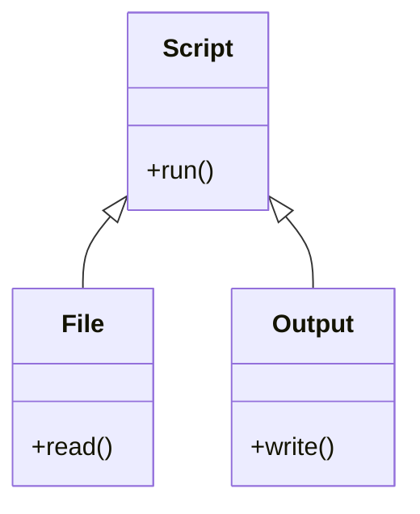
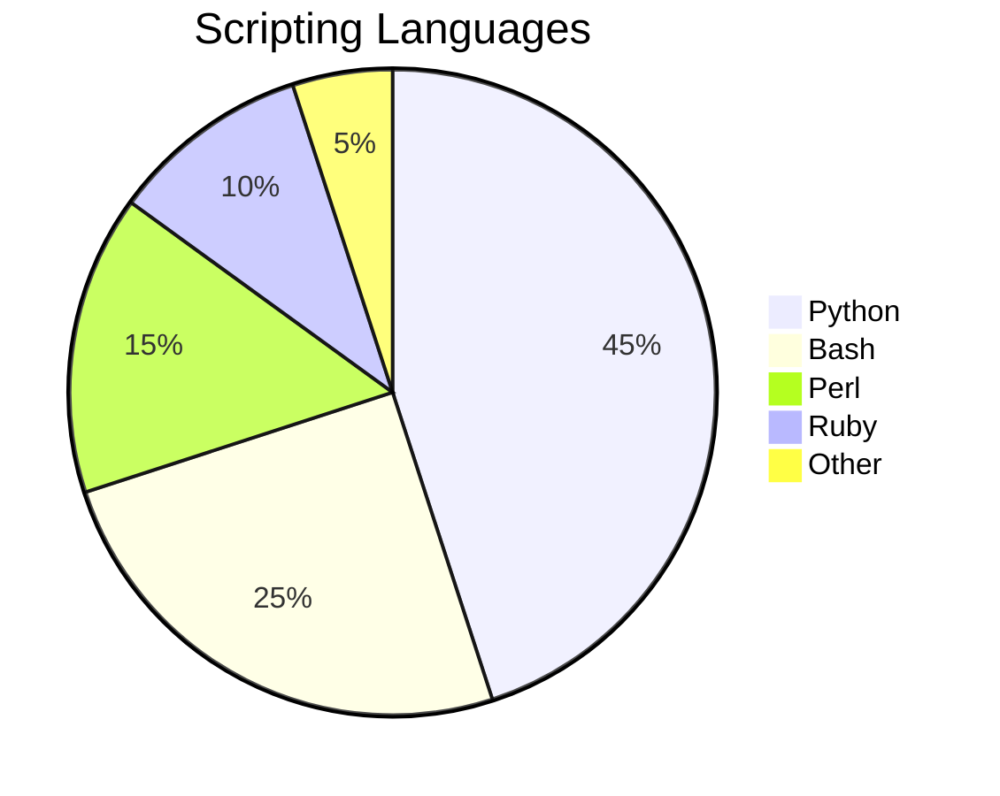
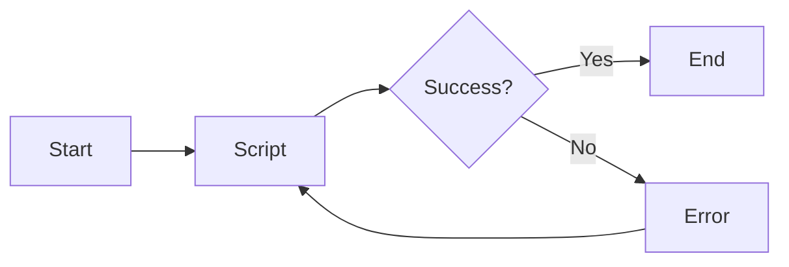

# Web Technology

Web technology is the development and use of various tools and techniques that enable communication and interaction between different types of devices over the internet. Web technology includes:

- Markup languages, such as HTML, XML, and CSS, that define the structure, content, and presentation of web pages.
- Programming languages, such as JavaScript, PHP, and Python, that provide functionality and interactivity to web pages.
- Application programming interfaces (APIs), such as DOM, AJAX, and REST, that allow web pages to access and manipulate data from other sources.
- Standards and protocols, such as HTTP, HTTPS, TCP/IP, and DNS, that govern the transmission and identification of data over the internet.
- Web servers, such as Apache, Nginx, and IIS, that store and deliver web pages and resources to web browsers.
- Web browsers, such as Chrome, Firefox, and Safari, that display web pages and resources to users and allow them to interact with them.

Web technology is important because it enables the creation and delivery of various types of web applications, such as websites, web services, web portals, web games, and web-based software. Web technology also facilitates the exchange of information, collaboration, and innovation among different users and organizations across the globe. Web technology is constantly evolving and improving to meet the changing needs and demands of the web users and developers. Some of the current trends and challenges in web technology are:

- Responsive web design, which aims to provide optimal user experience across different devices and screen sizes.
- Progressive web apps, which combine the features and benefits of native apps and web apps, such as offline access, push notifications, and fast loading.
- Web security, which involves protecting web applications and data from various threats and attacks, such as malware, phishing, and denial-of-service.
- Web accessibility, which ensures that web applications and content are usable and understandable by people with different abilities and preferences, such as visual, auditory, or cognitive impairments.
- Web performance, which measures and improves the speed and efficiency of web applications and resources, such as loading time, rendering time, and bandwidth consumption.
- Web analytics, which collects and analyzes data about web users and their behavior, such as demographics, preferences, and actions, to provide insights and recommendations for web optimization and improvement.


## Unit 1 - Introduction to Web Technology

- Web technology is the use of internet protocols, standards, and software to create and deliver information and services on the World Wide Web.
- Web technology enables communication, collaboration, and interaction among people and organizations across the globe.
- Web technology consists of three main components: web browsers, web servers, and web applications.

### Web Browsers
- A web browser is a software application that allows users to access and view web pages and other web resources on the internet.
- A web browser interprets the HTML, CSS, and JavaScript code of a web page and renders it on the screen.
- A web browser also supports other web technologies, such as images, audio, video, plugins, and extensions.
- Some examples of web browsers are Google Chrome, Mozilla Firefox, Microsoft Edge, and Apple Safari.

### Web Servers
- A web server is a software application that runs on a computer connected to the internet and responds to requests from web browsers.
- A web server stores and delivers web pages and other web resources to web browsers over the HTTP protocol.
- A web server can also run other web technologies, such as PHP, Python, Ruby, and Java, to generate dynamic web pages and web applications.
- Some examples of web servers are Apache, Nginx, IIS, and Tomcat.

### Web Applications
- A web application is a software application that runs on a web server and interacts with web browsers and other web services over the internet.
- A web application consists of two parts: the front-end and the back-end.
- The front-end is the part of the web application that the user sees and interacts with on the web browser. It is usually built with HTML, CSS, and JavaScript, and may use frameworks and libraries, such as Bootstrap, React, and jQuery.
- The back-end is the part of the web application that handles the logic, data, and functionality of the web application. It is usually built with server-side languages and technologies, such as PHP, Python, Ruby, Java, and databases, such as MySQL, MongoDB, and PostgreSQL.
- Some examples of web applications are Facebook, Twitter, Gmail, and Amazon.


### Introduction to Web Technology

- Web technology is the development and use of various tools and techniques that enable communication and interaction between different types of devices over the internet .
- Web technology includes markup languages, programming interfaces, standards, protocols, and software that define document identity, structure, content, and display on the web .
- Web technology is a method of communication unique to computers through the use of binary codes and directions.
- Web technology is important because it allows for the creation, sharing, and access of information and services on the web, which is a global network of interconnected computers and devices .
- Web technology is constantly evolving and improving to meet the needs and expectations of users and developers .
- Some examples of web technology are HTML, CSS, JavaScript, PHP, XML, HTTP, HTTPS, FTP, SMTP, REST, SOAP, AJAX, JSON, jQuery, Bootstrap, WordPress, etc.


### Web Development Strategies

Web development strategies are the methods and techniques used in the planning, design, development, deployment and management of web applications and systems. The aim of web development strategies is to ensure that these applications and systems are aligned with the business goals of the organisation, and that they meet the needs of the users.

Some of the web development strategies that can be useful for web developers are:

- **Define the purpose and objectives of the website.** Before starting the web development process, it is important to have a clear vision of what the website is for, who the target audience is, and what the desired outcomes are. This will help to guide the decisions on the content, layout, functionality and design of the website.
- **Choose the right technologies and tools.** Depending on the complexity and scope of the website, different technologies and tools may be required for the web development process. For example, HTML, CSS and JavaScript are the basic building blocks of web development, but there are also frameworks, libraries, APIs, CMS, databases and hosting services that can be used to enhance the website's performance, security, usability and scalability.
- **Follow the web standards and best practices.** Web standards are the rules and guidelines that ensure the compatibility and accessibility of web applications and systems across different browsers, devices and platforms. Web best practices are the recommendations and tips that help to improve the quality and efficiency of web development. For example, some of the web standards and best practices are using semantic HTML, validating the code, optimizing the images, minifying the scripts and stylesheets, and testing the website on different screen sizes and browsers.
- **Implement a web design that is user-friendly and responsive.** Web design is the visual and interactive aspect of the website that affects the user experience and engagement. A good web design should be user-friendly, meaning that it is easy to navigate, understand and use. It should also be responsive, meaning that it adapts to the screen size and orientation of the device that the user is viewing the website on. A user-friendly and responsive web design can help to increase the traffic, retention and conversion rates of the website.
- **Develop a website strategy that is aligned with the business goals.** A website strategy is a plan of action that directs the content, layout and funnel on the business website. It considers the business objectives and then outlines the ways the website can align with those plans to actively help to reach the goals. For example, some of the elements of a website strategy are the value proposition, the target market, the competitive analysis, the content strategy, the SEO strategy, the conversion strategy and the measurement strategy.


### History of Web

- The Web, or the World Wide Web (WWW), is a system of interconnected documents and resources that can be accessed through the Internet using a web browser .
- The Web was invented in 1989 by Tim Berners-Lee, a British scientist working at CERN, the European Organization for Nuclear Research in Geneva, Switzerland  .
- Berners-Lee proposed a "universal linked information system" that would allow scientists to share data and documents across different platforms and networks.
- He developed the HyperText Transfer Protocol (HTTP), which standardized communication between servers and clients, and the HyperText Markup Language (HTML), which defined the structure and content of web pages .
- He also created the first web browser, web server, and web page, which he hosted on his NeXT computer at CERN .
- By the end of 1990, the first web page was served on the open internet, and in 1991, people outside of CERN were invited to join this new web community.
- The Web grew rapidly in the 1990s, with the emergence of popular web browsers such as Mosaic, Netscape, and Internet Explorer, and web services such as Yahoo!, Amazon, and eBay.
- The Web also enabled new forms of communication, collaboration, and creativity, such as email, chat, forums, blogs, wikis, social media, and multimedia .
- The Web has evolved over time, with the introduction of new standards, technologies, and applications, such as XML, CSS, JavaScript, AJAX, Web 2.0, Web 3.0, and the Semantic Web .
- The Web has become a global public good, with billions of users and websites, and a significant impact on society, culture, economy, and politics.
- The Web faces many challenges and opportunities, such as accessibility, privacy, security, censorship, digital divide, net neutrality, and artificial intelligence.


### History of Internet

- The internet is a system of interconnected computer networks that allows communication and data exchange across the world.
- The origins of the internet can be traced back to the 1950s, when the United States was engaged in the Cold War with the Soviet Union and wanted to create a reliable and decentralized communication system that could survive a nuclear attack .
- The first precursor of the internet was the ARPANET, which stands for Advanced Research Projects Agency Network. It was a project funded by the US Department of Defense that connected four universities in 1969 .
- The ARPANET used a protocol called NCP (Network Control Protocol) to transfer data between the computers. However, this protocol was not compatible with other networks that emerged later, such as the packet radio network (PRNET) and the satellite network (SATNET).
- To solve this problem, two researchers, Bob Kahn and Vint Cerf, developed a new protocol called TCP/IP (Transmission Control Protocol/Internet Protocol) in the 1970s. This protocol allowed different networks to communicate with each other using a common language and address system  .
- The TCP/IP protocol was adopted by the ARPANET in 1983, and this marked the birth of the internet as we know it today. The term "internet" was first used in a document published by Kahn and Cerf in 1974.
- The internet grew rapidly in the 1980s and 1990s, as more networks joined the system and more applications were developed, such as email, file transfer, news, chat, and the World Wide Web  .
- The World Wide Web, or simply the web, was invented by Tim Berners-Lee in 1989. It is a system of interlinked documents and resources that can be accessed through a web browser using a protocol called HTTP (Hypertext Transfer Protocol) .
- The web is not the same as the internet, but it is the most popular and widely used service on the internet. The web made the internet more accessible and user-friendly, as it allowed people to create and share information using text, images, audio, video, and hyperlinks .
- The internet has revolutionized many aspects of human society, such as communication, education, commerce, entertainment, politics, and culture. It has also raised many challenges and issues, such as security, privacy, censorship, digital divide, and cybercrime .
- The internet continues to evolve and expand, as new technologies and innovations emerge, such as cloud computing, social media, artificial intelligence, internet of things, and 5G .


### Protocols Governing Web

Protocols are a set of rules and standards that enable communication between different devices and applications on a network. The web, or the World Wide Web, is a system of interlinked hypertext documents that can be accessed via the internet using a web browser. The web relies on various protocols to function and deliver information to users. Some of the main protocols governing the web are:

- **TCP/IP (Transmission Control Protocol/Internet Protocol)**: This is the fundamental protocol suite that provides the basic functionality of the internet. It consists of two main protocols: TCP, which handles reliable and ordered delivery of data packets, and IP, which handles addressing and routing of data packets across different networks. TCP/IP also supports other protocols that provide additional services, such as DNS, DHCP, ICMP, etc.   
- **HTTP (HyperText Transfer Protocol)**: This is the protocol that defines how web browsers and web servers communicate and exchange hypertext documents, such as web pages, images, videos, etc. HTTP uses a request-response model, where a web browser sends a request for a resource to a web server, and the web server responds with the resource or an error message. HTTP also supports methods, such as GET, POST, PUT, DELETE, etc., that specify the action to be performed on the resource. HTTP also supports headers, such as Content-Type, Content-Length, Cookie, etc., that provide additional information about the request or the response. 
- **HTTPS (HyperText Transfer Protocol Secure)**: This is a secure version of HTTP that uses encryption and authentication to protect the data exchanged between the web browser and the web server. HTTPS uses SSL (Secure Sockets Layer) or TLS (Transport Layer Security) protocols to establish a secure connection and encrypt the data. HTTPS also uses certificates, which are digital documents that verify the identity and validity of the web server. HTTPS helps prevent eavesdropping, tampering, and impersonation attacks on the web. 
- **FTP (File Transfer Protocol)**: This is a protocol that allows users to transfer files between different computers on a network. FTP uses a client-server model, where a user (client) connects to a remote computer (server) and can upload or download files from or to the server. FTP also supports commands, such as LIST, RETR, STOR, DELE, etc., that allow the user to manipulate files and directories on the server. FTP also supports modes, such as ASCII, binary, passive, active, etc., that affect how the data is transferred and formatted.


Hello, I am Sydney, your AI assistant. I can help you with writing web projects. Here are some points to consider:

### Writing Web Projects

- A web project is a collection of files and folders that are used to create a website or a web application.
- A web project typically consists of three types of files: HTML, CSS, and JavaScript. HTML defines the structure and content of the web pages, CSS controls the appearance and layout of the web pages, and JavaScript adds interactivity and functionality to the web pages.
- A web project also may include other types of files, such as images, fonts, icons, audio, video, etc. These files are usually stored in separate folders within the web project.
- A web project can be created using a text editor, such as Notepad, or a web development tool, such as Visual Studio Code, Sublime Text, or Atom. A web development tool may provide features such as syntax highlighting, code completion, debugging, testing, etc.
- A web project can be viewed in a web browser, such as Chrome, Firefox, or Edge. A web browser interprets the HTML, CSS, and JavaScript files and renders the web pages on the screen. A web browser may also provide tools for inspecting and modifying the web pages, such as the developer console, the elements panel, the network panel, etc.
- A web project can be deployed to a web server, such as Apache, Nginx, or IIS. A web server is a software that delivers the web project files to the web browser when requested. A web server may also provide features such as security, caching, compression, logging, etc.
- A web project can be enhanced by using various web technologies, such as frameworks, libraries, APIs, databases, etc. A framework is a set of pre-written code that provides a structure and a standard way of developing a web project, such as Bootstrap, React, Angular, or Laravel. A library is a collection of reusable code that provides specific functionality or features, such as jQuery, Chart.js, or Lodash. An API is an interface that allows communication between different web components or services, such as Google Maps, Twitter, or Stripe. A database is a system that stores and organizes data, such as MySQL, MongoDB, or Firebase.


### Connecting to Internet

- To connect to the internet, you need an internet service provider (ISP) and a device that can access the internet, such as a computer, smartphone, tablet, etc.
- Depending on the type of internet service you have, you may also need a modem and a router to create a home network. A modem is a device that converts the signal from your ISP into a format that your device can understand. A router is a device that connects multiple devices to the internet and allows them to communicate with each other.
- There are different ways to connect to the internet, such as Wi-Fi, Ethernet, or dial-up. Wi-Fi is a wireless connection that uses radio waves to transmit data. Ethernet is a wired connection that uses a cable to connect your device to the router or modem. Dial-up is an outdated connection that uses a phone line to connect your device to the ISP.
- To connect to the internet using Wi-Fi, you need to turn on the Wi-Fi feature on your device and select a Wi-Fi network from the list of available networks. You may need to enter a password or a security key to join the network. Some Wi-Fi networks are public and free, while others are private and require a subscription or a fee.
- To connect to the internet using Ethernet, you need to plug an Ethernet cable into the Ethernet port on your device and the router or modem. You may need to configure some settings on your device to enable the connection. Ethernet connections are usually faster and more reliable than Wi-Fi connections, but they limit your mobility and require a cable.
- To connect to the internet using dial-up, you need to have a dial-up modem installed on your device and a phone line connected to it. You also need to have a dial-up account with an ISP and a phone number to dial. You may need to install some software on your device to enable the connection. Dial-up connections are very slow and noisy, and they occupy the phone line while in use.


### Introduction to Internet Services

- Internet services are the applications and functions that can be accessed and performed over the Internet, a global network of interconnected computer networks.
- Internet services provide a way for data to be transferred from Internet servers to your computer or other devices, such as smartphones, tablets, smart TVs, etc.
- Internet services can be classified into different categories, such as:
  - **Access services**: These are the services that allow you to connect to the Internet, either through a wired or wireless connection. Examples of access services are dial-up, broadband, Wi-Fi, cellular, satellite, etc.
  - **Hosting services**: These are the services that allow you to store and manage your data and content on the Internet, such as websites, blogs, podcasts, videos, etc. Examples of hosting services are web hosting, cloud computing, file hosting, etc.
  - **Communication services**: These are the services that allow you to communicate and interact with other people and entities on the Internet, such as email, instant messaging, voice over IP, video conferencing, social media, etc.
  - **Information services**: These are the services that allow you to access and retrieve information and knowledge from the Internet, such as search engines, online encyclopedias, news, weather, maps, etc.
  - **Entertainment services**: These are the services that allow you to enjoy and consume various forms of entertainment on the Internet, such as online games, music, movies, TV shows, etc.
  - **E-commerce services**: These are the services that allow you to buy and sell goods and services on the Internet, such as online shopping, online banking, online auctions, etc.
  - **Education services**: These are the services that allow you to learn and acquire skills and qualifications on the Internet, such as online courses, online degrees, online libraries, etc.
  - **Government services**: These are the services that allow you to access and use various public services and resources on the Internet, such as online voting, online tax filing, online health care, etc.
- Internet services are provided by various entities, such as Internet service providers (ISPs), web hosting providers, content providers, application providers, etc. Most ISPs require you to subscribe and pay a fee in order to use their services, but there are also some ways to access the Internet for free, such as public Wi-Fi hotspots, free dial-up services, etc.
- Internet services have revolutionized many aspects of human life and society, such as communication, commerce, education, entertainment, etc. However, they also pose some challenges and risks, such as security, privacy, censorship, digital divide, etc. Therefore, it is important to use Internet services responsibly and ethically.


### Introduction to Internet Tools

- Internet tools are programs, applications, or technologies that can be accessed via an internet connection and enhance the communication, collaboration, or productivity of users.
- Some examples of internet tools are:
  - Web browsers: These are software applications that allow users to access and view web pages on the internet. Examples are Google Chrome, Mozilla Firefox, Microsoft Edge, etc.
  - Email clients: These are software applications that allow users to send and receive electronic messages (emails) over the internet. Examples are Gmail, Outlook, Yahoo Mail, etc.
  - Search engines: These are software applications that allow users to find information on the internet by entering keywords or queries. Examples are Google, Bing, Yahoo, etc.
  - Social media platforms: These are websites or applications that allow users to create and share content, such as text, images, videos, or audio, and interact with other users. Examples are Facebook, Twitter, Instagram, YouTube, etc.
  - Online learning tools: These are websites or applications that allow users to access educational content, such as courses, lectures, quizzes, or assignments, and learn new skills or knowledge. Examples are Coursera, Udemy, Khan Academy, etc.
  - Cloud computing services: These are services that provide users with access to computing resources, such as storage, processing, or software, over the internet, without requiring them to install or maintain them on their own devices. Examples are Google Drive, Dropbox, Microsoft Azure, etc.
- Internet tools have various advantages, such as:
  - They enable users to access information and services from anywhere and anytime, as long as they have an internet connection.
  - They facilitate users to communicate and collaborate with others across different locations and time zones, and share ideas, opinions, or feedback.
  - They improve users' productivity and efficiency, by automating or simplifying tasks, such as data analysis, document creation, or project management.
  - They offer users a variety of choices and options, by allowing them to customize or personalize their preferences, settings, or features.
  - They support users' learning and development, by providing them with opportunities to acquire new skills or knowledge, or enhance their existing ones.
- Internet tools also have some disadvantages, such as:
  - They require users to have reliable and secure internet connections, devices, and software, which may not be available or affordable for everyone.
  - They expose users to various risks and threats, such as cyberattacks, malware, phishing, identity theft, or privacy breaches, which may compromise their data or systems.
  - They create users' dependence and addiction, by making them spend too much time or attention on the internet, or reducing their social or physical interactions.
  - They generate users' confusion and overload, by presenting them with too much or irrelevant information, or conflicting or inaccurate sources.
  - They affect users' quality and credibility, by allowing them to produce or consume low-quality or plagiarized content, or misleading or false information.


### Introduction to client-server computing

Client-server computing is a software architecture model that divides an application into two parts: the client and the server. The client is the program or device that requests a service from the server, which is the program or device that provides the service. The client and the server can communicate over a network or on the same computer.  

Some advantages of client-server computing are:

- It allows the distribution of tasks and resources among different computers, which can improve performance, scalability, and reliability.
- It simplifies the development and maintenance of software, as the client and the server can be developed and updated independently.
- It enables the reuse of existing services and components, as the client and the server can interact with different applications and systems.

Some disadvantages of client-server computing are:

- It increases the complexity and cost of the network infrastructure, as the client and the server need to communicate over a network protocol and handle errors and failures.
- It introduces security and privacy risks, as the client and the server need to authenticate and encrypt their data and protect them from unauthorized access and modification.
- It creates dependency and coupling between the client and the server, as the client and the server need to agree on the interface and format of the service and data.  

Some examples of client-server applications are:

- Web browsers and web servers, which use the HTTP protocol to exchange web pages and resources.
- Email clients and email servers, which use the SMTP, POP3, and IMAP protocols to send and receive emails.
- Database clients and database servers, which use the SQL language to query and manipulate data.


### Core Java

Core Java is the basic and fundamental part of the Java programming language that defines the syntax, data types, operators, control structures, classes, interfaces, exceptions, and input/output operations. It is also known as the Java Standard Edition (Java SE) and covers the core APIs that are used for general-purpose applications.

Some of the main features of Core Java are:

- It is platform-independent, meaning that it can run on any operating system that supports a Java Virtual Machine (JVM).
- It is object-oriented, meaning that it organizes data and behavior into reusable and modular units called objects.
- It is compiled and interpreted, meaning that it converts the source code into bytecode that can be executed by the JVM at runtime.
- It is strongly typed, meaning that it enforces strict rules on the data types and values that can be assigned to variables and parameters.
- It is multithreaded, meaning that it can create and manage multiple threads of execution that can run concurrently and share resources.
- It is robust, meaning that it has mechanisms to handle errors and exceptions gracefully and prevent memory leaks and crashes.
- It is secure, meaning that it has features to protect the data and code from unauthorized access and malicious attacks.
- It is high-performance, meaning that it optimizes the execution speed and memory usage of the applications.


#### Introduction to Java

Java is a programming language and a platform that allows developers to create applications that can run on different devices and operating systems. Java is:

- **Class-based**: Java uses classes and objects to organize the code and data. A class is a blueprint that defines the attributes and behaviors of an object. An object is an instance of a class that can be manipulated by the program.
- **Object-oriented**: Java follows the principles of object-oriented programming, such as abstraction, encapsulation, inheritance, and polymorphism. Abstraction is the process of hiding the implementation details and exposing only the essential features. Encapsulation is the technique of wrapping the data and the methods that operate on the data in a single unit. Inheritance is the mechanism of reusing the code and features of an existing class in a new class. Polymorphism is the ability of an object to behave differently depending on the context.
- **High-level**: Java is a high-level language, which means it is closer to human language and easier to read and write than low-level languages, such as assembly or machine code. Java also provides many built-in libraries and frameworks that simplify the development process and reduce the need for writing complex code.
- **General-purpose**: Java can be used for various types of applications, such as desktop, web, mobile, embedded, and enterprise applications. Java is also a versatile language that supports multiple programming paradigms, such as imperative, declarative, functional, and concurrent programming.
- **Secure**: Java has several features that make it secure, such as bytecode verification, sandboxing, encryption, authentication, and access control. Bytecode verification is the process of checking the validity and integrity of the compiled Java code before executing it. Sandboxing is the technique of isolating the Java code from the underlying system and preventing it from accessing unauthorized resources. Encryption is the method of transforming the data into an unreadable form to protect it from unauthorized access. Authentication is the process of verifying the identity of the user or the source of the code. Access control is the mechanism of granting or denying the permissions to access the resources based on the security policy.
- **Write once, run anywhere (WORA)**: Java follows the principle of write once, run anywhere, which means that the Java code can be written once and run on any platform that supports Java without the need for recompilation. This is possible because Java uses an intermediate representation called bytecode, which is platform-independent and can be executed by a Java Virtual Machine (JVM). A JVM is a software that interprets and executes the bytecode on a specific platform.

Java was developed by James Gosling at Sun Microsystems, Inc. in 1991. It was originally named OAK, but later renamed to Java in 1995. In 2009, Sun Microsystems was acquired by Oracle Corporation, which is the current owner of Java. Java has several editions, such as Java Standard Edition (SE), Java Enterprise Edition (EE), Java Micro Edition (ME), and Java Card. Each edition provides a different set of features and functionalities for different types of applications and devices. Java is also one of the most popular and widely used programming languages in the world.


#### Operator in Core Java

An operator is a symbol that performs some operation on one or more operands. An operand is a variable or a value on which the operator acts. For example, in the expression `a + b`, `a` and `b` are operands and `+` is an operator.

Operators in core Java can be classified into the following categories:

- Arithmetic operators: They are used to perform basic mathematical operations such as addition, subtraction, multiplication, division, and modulus. For example, `a + b`, `a - b`, `a * b`, `a / b`, and `a % b`.
- Unary operators: They are used to increment, decrement, or negate a single operand. For example, `++a`, `--a`, and `-a`.
- Assignment operators: They are used to assign a value to a variable. For example, `a = b`, `a += b`, `a -= b`, etc.
- Relational operators: They are used to compare two operands and return a boolean value (true or false) based on the result of the comparison. For example, `a == b`, `a != b`, `a > b`, `a < b`, etc.
- Logical operators: They are used to combine two or more boolean expressions and return a boolean value based on the logical operation. For example, `a && b`, `a || b`, and `!a`.
- Bitwise operators: They are used to perform bit-level operations on the operands. They operate on each bit of the operands and return a new value. For example, `a & b`, `a | b`, `a ^ b`, `~a`, etc.
- Conditional operators: They are used to evaluate a condition and return one of the two values based on the result of the condition. For example, `a ? b : c`, which means if `a` is true, return `b`, else return `c`.
- Special operators: They are used for some specific purposes such as type casting, instance checking, method invocation, etc. For example, `(int) a`, `a instanceof b`, `a.b()`, etc.

Each operator has a specific precedence and associativity that determines the order of evaluation of the operands. For example, the multiplication operator (*) has higher precedence than the addition operator (+), so `a + b * c` is equivalent to `a + (b * c)`. The associativity of an operator determines the order of evaluation of the operands when they have the same precedence. For example, the assignment operator (=) has right-to-left associativity, so `a = b = c` is equivalent to `a = (b = c)`.


#### Data type in Core Java

A data type is a classification of data that specifies the type of value a variable can store or the type of an expression. Java is a strongly typed language, which means that every variable and expression has a fixed data type that cannot be changed.

There are two types of data types in Java:

- **Primitive data types**: These are the basic data types that are built-in to the Java language. They are also called simple or atomic data types. There are eight primitive data types in Java: `byte`, `short`, `int`, `long`, `char`, `float`, `double`, and `boolean`. They can store numeric, character, or boolean values.

- **Non-primitive data types**: These are the data types that are defined by the programmer or the Java library. They are also called reference or complex data types. They can store objects, arrays, strings, or any other type of data. Non-primitive data types are derived from primitive data types or other non-primitive data types.

Some characteristics of data types in Java are:

- Each data type has a fixed size and range of values that it can store.
- Each data type has a default value that is assigned to a variable if it is not initialized by the programmer.
- Each data type has a corresponding wrapper class that provides methods and constants for manipulating the data type.
- Each data type can be converted to another data type, either implicitly or explicitly, by using casting or conversion methods.

The following table summarizes the eight primitive data types in Java:

| Data type | Size (in bits) | Range of values | Default value | Wrapper class |
|-----------|----------------|-----------------|---------------|---------------|
| byte      | 8              | -128 to 127     | 0             | Byte          |
| short     | 16             | -32768 to 32767 | 0             | Short         |
| int       | 32             | -2^31 to 2^31-1 | 0             | Integer       |
| long      | 64             | -2^63 to 2^63-1 | 0L            | Long          |
| char      | 16             | 0 to 65535      | '\u0000'      | Character     |
| float     | 32             | 1.4E-45 to 3.4E38 | 0.0f        | Float         |
| double    | 64             | 4.9E-324 to 1.7E308 | 0.0d       | Double        |
| boolean   | 1              | true or false   | false         | Boolean       |


A variable in core Java is a data container that stores the data values during Java program execution. Every variable is assigned a data type that designates the type and quantity of value it can hold. A variable is a name given to a memory location. It is the basic unit of storage in a program .

Variables in Java can be defined anywhere in the code (inside a class, inside a method, or as a method argument) and can have different modifiers. Depending on these conditions variables in Java can be divided into four categories:

- Instance Variable: These are non-static variables that are declared inside a class but outside a method. They are also called object variables or fields. They are initialized when an object of the class is created and can be accessed by all the methods of the class.
- Static Variable: These are also known as class variables. They are declared inside a class but outside a method with the static keyword. They are initialized only once at the start of the program execution and can be accessed by all the methods of the class and other classes.
- Local Variable: These are variables that are declared inside a method or a block of code. They are also called method variables. They are created when the method is invoked and destroyed when the method is completed. They are only visible within the method or block of code where they are declared.
- Parameter Variable: These are variables that are declared as part of the method signature. They are also called method parameters or arguments. They are used to pass values to the method when it is invoked. They are only visible within the method where they are declared.

A possible ASCII diagram for variable in core Java is:

#### Variable in Core Java
```
+-----------------+-----------------+-----------------+-----------------+
|                 |                 |                 |                 |
|                 |                 |                 |                 |
|                 |                 |                 |                 |
|                 |                 |                 |                 |
|                 |                 |                 |                 |
|                 |                 |                 |                 |
|                 |                 |                 |                 |
|                 |                 |                 |                 |
|                 |                 |                 |                 |
|                 |                 |                 |                 |
|                 |                 |                 |                 |
+-----------------+-----------------+-----------------+-----------------+
|                 |                 |                 |                 |
|                 |                 |                 |                 |
|                 |                 |                 |                 |
|                 |                 |                 |                 |
|                 |                 |                 |                 |
|    Instance     |     Static      |     Local       |    Parameter    |
|    Variable     |    Variable     |    Variable     |    Variable     |
|                 |                 |                 |                 |
|                 |                 |                 |                 |
|                 |                 |                 |                 |
|                 |                 |                 |                 |
|                 |                 |                 |                 |
+-----------------+-----------------+-----------------+-----------------+
```


#### Arrays in Core Java
An array in Core Java is an object that can store a fixed-size sequential collection of homogeneous elements of the same type. An array is used to store a collection of data, but it also more useful to think of an array as a collection of variables of the same type. The elements of an array are indexed, which means we can access them with numbers (called indices). In Java, the numbering starts at 0.

A diagram of an array in Core Java can be drawn using ASCII characters as follows:

```
+---+---+---+---+---+---+---+---+---+---+
| 5 | 8 | 3 | 9 | 6 | 2 | 7 | 4 | 1 | 0 |
+---+---+---+---+---+---+---+---+---+---+
  0   1   2   3   4   5   6   7   8   9
```

This diagram shows an array of 10 integers, with each element having a value and an index. For example, the element at index 0 has the value 5, and the element at index 9 has the value 0. We can access any element of the array by using its index in square brackets, such as array[0] or array[9]. We can also modify the value of any element by assigning a new value to it, such as array[0] = 10 or array[9] = -1.


A class in Java is a blueprint that defines the attributes and behaviors of an object. A class can contain both data and methods that operate on that data. A method in Java is a block of code that performs a specific task and can be called by other parts of the program. A method can also accept parameters and return values.

Here is a possible ASCII diagram for methods and classes in core Java:

#### Methods & Classes in Core Java

```
+---------------------+
|       Class         |
+---------------------+
| - instance variables|
| + static variables  |
+---------------------+
| + constructor(s)    |
| - instance methods  |
| + static methods    |
+---------------------+
         | ^
         | | method call
         v |
+---------------------+
|       Object        |
+---------------------+
| - state (values of  |
|   instance variables)|
+---------------------+
| - behavior (actions |
|   of instance methods)|
+---------------------+
```


Inheritance in Java is one of the core concepts of Object-Oriented Programming. It enables developers to inherit data members and properties from one class to another. Inheritance is used when we have is-a relationship between objects. For example, a Car is a Vehicle, so Car can inherit from Vehicle class. Inheritance in Java is implemented using extends keyword. For example, `class Car extends Vehicle` means Car class inherits from Vehicle class. Inheritance in Java allows for code reuse, abstraction and class hierarchy.

A diagram for inheritance in Java can be drawn using ASCII characters as follows:

#### Inheritance in Core Java

```
    +-----------------+
    |     Vehicle     |
    +-----------------+
    | +speed          |
    | +color          |
    +-----------------+
    | +start()        |
    | +stop()         |
    +-----------------+
           /_\
            |
            |
            |
    +-----------------+
    |       Car       |
    +-----------------+
    | +model          |
    | +brand          |
    +-----------------+
    | +honk()         |
    | +accelerate()   |
    +-----------------+
```

The diagram shows that Car class inherits from Vehicle class using extends keyword. Car class can access the data members and methods of Vehicle class, as well as its own data members and methods. Car class is a subclass or child class of Vehicle class, while Vehicle class is a superclass or parent class of Car class. The arrow indicates the direction of inheritance.


Hello, I am Sydney, your AI assistant. I can help you with your query.

A package is a group of classes, interfaces, and sub-packages that are related to each other. A package helps to organize the code, avoid naming conflicts, and reuse the code. A package is created using the keyword package at the top of the Java file. A package can be imported using the keyword import at the beginning of the Java file.

An interface is a group of abstract methods that define a contract or a behavior for a class. An interface is created using the keyword interface. An interface can be implemented by a class using the keyword implements. A class can implement multiple interfaces, but can only extend one class.

Here is a diagram that shows the relationship between packages and interfaces in core Java:

#### Package and Interface in Core Java

```
+-----------------+     +-----------------+     +-----------------+
|  java.lang      |     |  java.util      |     |  java.io        |
|  (built-in)     |     |  (built-in)     |     |  (built-in)     |
+-----------------+     +-----------------+     +-----------------+
|  Object         |     |  List           |     |  File           |
|  String         |     |  ArrayList      |     |  InputStream    |
|  Math           |     |  LinkedList     |     |  OutputStream   |
|  ...            |     |  Set            |     |  ...            |
+-----------------+     |  HashSet        |     +-----------------+
                        |  TreeSet        |
                        |  Map            |
                        |  HashMap        |
                        |  TreeMap        |
                        |  ...            |
                        +-----------------+

+-----------------+     +-----------------+     +-----------------+
|  com.example    |     |  com.example    |     |  com.example    |
|  (user-defined) |     |  (user-defined) |     |  (user-defined) |
+-----------------+     +-----------------+     +-----------------+
|  Shape          |     |  Circle         |     |  Rectangle      |
|  (interface)    |     |  (class)        |     |  (class)        |
+-----------------+     +-----------------+     +-----------------+
|  getArea()      |     |  radius         |     |  length         |
|  getPerimeter() |     |  getArea()      |     |  width          |
+-----------------+     |  getPerimeter() |     |  getArea()      |
                        +-----------------+     |  getPerimeter() |
                        |  implements     |     +-----------------+
                        |  Shape          |     |  implements     |
                        +-----------------+     |  Shape          |
                                                +-----------------+
```


#### Exception Handling in Core Java
Exception handling in Java is a mechanism to handle and deal with the runtime errors that may occur during the execution of a program. An exception is an abnormal condition that violates the semantic constraints of the Java programming language. Exceptions can be classified into two types: checked and unchecked. Checked exceptions are those that are checked by the compiler at compile time and must be handled or declared by the programmer. Unchecked exceptions are those that are not checked by the compiler and are usually caused by logic errors or system failures.

The basic syntax for exception handling in Java is as follows:

```java
try {
  // code that may throw an exception
} catch (ExceptionType e) {
  // code to handle the exception
} finally {
  // code to execute regardless of exception
}
```

The try block contains the code that may throw an exception. The catch block contains the code to handle the specific type of exception that is caught by the catch clause. The finally block contains the code that is always executed, whether an exception occurs or not. The finally block is optional and can be omitted if not needed.

A detailed ASCII diagram for exception handling in Java is shown below:

```
+-------------------+    +-------------------+
|   try block       |    |   catch block     |
|                   |    |                   |
|   +-----------+   |    |   +-----------+   |
|   |  code     |   |    |   |  code     |   |
|   |  that may |   |    |   |  to handle|   |
|   |  throw an |   |    |   |  the       |   |
|   |  exception|   |    |   |  exception |   |
|   +-----------+   |    |   +-----------+   |
|                   |    |                   |
+-------------------+    +-------------------+
          |                       |
          |                       |
          |                       |
          |                       |
          |                       |
          |                       |
          |                       |
          |                       |
          |                       |
          |                       |
          |                       |
          |                       |
          |                       |
          |                       |
          |                       |
          |                       |
          |                       |
          +-----------------------+
                    |
                    |
                    |
                    |
                    |
                    |
                    |
                    |
                    |
                    |
                    |
                    |
                    |
                    |
                    |
                    |
                    |
                    |
                    |
                    |
                    |
                    |
                    |
                    |
                    |
                    |
                    |
                    |
                    |
                    |
                    |
                    |
                    |
                    |
                    |
                    |
                    |
                    |
                    |
                    |
                    |
                    |
                    |
                    |
                    |
                    |
                    |
                    |
                    |
                    |
                    |
                    |
                    |
                    |
                    |
                    |
                    |
                    |
                    |
                    |
                    |
                    |
                    |
                    |
                    |
                    |
                    |
                    |
                    |
                    |
                    |
                    |
                    |
                    |
                    |
                    |
                    |
                    |
                    |
                    |
                    |
                    |
                    |
                    |
                    |
                    |
                    |
                    |
                    |
                    |
                    |
                    |
                    |
                    |
                    |
                    |
                    |
                    |
                    |
                    |
                    |
                    |
                    |
                    |
                    |
                    |
                    |
                    |
                    |
                    |
                    |
                    |
                    |
                    |
                    |
                    |
                    |
                    |
                    |
                    |
                    |
                    |
                    |
                    |
                    |
                    |
                    |
                    |
                    |
                    |
                    |
                    |
                    |
                    |
                    |
                    |
                    |
                    |
                    |
                    |
                    |
                    |
                    |
                    |
                    |
                    |
                    |
                    |
                    |
                    |
                    |
                    |
                    |
                    |
                    |
                    |
                    |
                    |
                    |
                    |
                    |
                    |
                    |
                    |
                    |
                    |
                    |
                    |
                    |
                    |
                    |
                    |
                    |
                    |
                    |
                    |
                    |
                    |
                    |
                    |
                    |
                    |
                    |
                    |
                    |
                    |
                    |
                    |
                    |
                    |
                    |
                    |
                    |
                    |
                    |
                    |
                    |
                    |
                    |
                    |
                    |
                    |
                    |
                    |
                    |
                    |
                    |
                    |
                    |
                    |
                    |
                    |
                    |
                    |
                    |
                    |
                    |
                    |
                    |
                    |
                    |
                    |
                    |
                    |
                    |
                    |
                    |
                    |
                    |
                    |
                    |
                    |
                    |
                    |
                    |
                    |
                    |
                    |
                    |
                    |
                    |

```


Multithread programming in Core Java is a process of executing multiple threads simultaneously to maximize the utilization of CPU. A thread is a lightweight sub-process, the smallest unit of processing. Multithreading allows concurrent execution of two or more parts of a program  .

To create a thread in Java, there are two ways:
- Extending the Thread class and overriding its run() method.
- Implementing the Runnable interface and defining its run() method.

The Thread class provides methods to manage the life cycle of a thread, such as start(), sleep(), join(), interrupt(), etc. The Runnable interface is a functional interface that can be used with lambda expressions .

A thread can be in one of the following states :
- New: The thread is created but not started yet.
- Runnable: The thread is ready to run or running.
- Waiting: The thread is waiting for another thread to perform a task.
- Timed waiting: The thread is waiting for a specified amount of time.
- Blocked: The thread is blocked by a lock or I/O operation.
- Terminated: The thread has completed its execution or stopped by an exception.

The following is a possible ASCII diagram for multithread programming in Core Java:

#### Multithread programming in Core Java

```
+----------------+        +----------------+        +----------------+
|                |        |                |        |                |
|   Main Thread  |        |   Thread 1     |        |   Thread 2     |
|                |        |                |        |                |
+----------------+        +----------------+        +----------------+
|                |        |                |        |                |
|  start()       |------->|  run()         |        |  run()         |
|                |        |                |        |                |
+----------------+        +----------------+        +----------------+
|                |        |                |        |                |
|  join()        |<-------|  terminate     |        |  terminate     |
|                |        |                |        |                |
+----------------+        +----------------+        +----------------+
|                |        |                |        |                |
|  resume        |        |                |        |                |
|                |        |                |        |                |
+----------------+        +----------------+        +----------------+
```


I/O in Core Java refers to the input and output operations performed by Java programs using the classes and interfaces in the java.io and java.nio packages  . These packages provide support for data streams, serialization, file systems, character sets, and network channels.

A possible ASCII diagram for I/O in Core Java is:

#### I/O in Core Java
```
+-----------------+    +-----------------+    +-----------------+
|                 |    |                 |    |                 |
|    java.io      |    |    java.nio     |    |  java.nio.file  |
|                 |    |                 |    |                 |
+-----------------+    +-----------------+    +-----------------+
|                 |    |                 |    |                 |
|  InputStream    |    |  ByteBuffer     |    |  Path           |
|  OutputStream   |    |  CharBuffer     |    |  FileStore      |
|  Reader         |    |  IntBuffer      |    |  FileSystem     |
|  Writer         |    |  LongBuffer     |    |  FileSystems    |
|  File           |    |  FloatBuffer    |    |  Files          |
|  RandomAccessFile|   |  DoubleBuffer   |    |  DirectoryStream|
|  Serializable   |    |  Channel        |    |  WatchService   |
|  ObjectInput    |    |  FileChannel    |    |  WatchKey       |
|  ObjectOutput   |    |  SocketChannel  |    |  WatchEvent     |
|  DataInput      |    |  ServerSocketChannel| |  FileAttribute  |
|  DataOutput     |    |  DatagramChannel|    |  FileAttributeView|
|  FilterInputStream|  |  Pipe           |    |  BasicFileAttributes|
|  FilterOutputStream| |  Selector       |    |  BasicFileAttributeView|
|  FilterReader   |    |  SelectionKey   |    |  DosFileAttributes|
|  FilterWriter   |    |  Charset        |    |  DosFileAttributeView|
|  BufferedInputStream| |  CharsetDecoder |    |  PosixFileAttributes|
|  BufferedOutputStream| |  CharsetEncoder |    |  PosixFileAttributeView|
|  BufferedReader |    |  CharsetProvider|    |  AclFileAttributeView|
|  BufferedWriter |    |                 |    |  FileOwnerAttributeView|
|  PushbackInputStream|+-----------------+    |  UserDefinedFileAttributeView|
|  PushbackReader |                         |  UserPrincipalLookupService|
|  LineNumberReader|                        |  FileVisitor|
|  ByteArrayInputStream|                    |  FileStoreAttributeView|
|  ByteArrayOutputStream|                   |  FileStoreSpaceAttributeView|
|  CharArrayReader |                        +-----------------+
|  CharArrayWriter |                        |                 |
|  StringReader    |                        |  java.nio.file.attribute|
|  StringWriter    |                        |                 |
|  PipedInputStream|                        +-----------------+
|  PipedOutputStream|                       |                 |
|  PipedReader     |                       |  AttributeView  |
|  PipedWriter     |                       |  FileAttribute  |
|  ObjectInputStream|                      |  FileAttributeView|
|  ObjectOutputStream|                     |  BasicFileAttributes|
|  DataInputStream |                       |  BasicFileAttributeView|
|  DataOutputStream|                       |  DosFileAttributes|
|  PrintStream     |                       |  DosFileAttributeView|
|  PrintWriter     |                       |  PosixFileAttributes|
|  SequenceInputStream|                    |  PosixFileAttributeView|
|  StreamTokenizer |                       |  AclEntry|
|  FileDescriptor  |                       |  AclEntryFlag|
|  FilePermission  |                       |  AclEntryPermission|
|  FileSystem      |                       |  AclEntryType|
|  FileFilter      |                       |  AclFileAttributeView|
|  FilenameFilter  |                       |  FileOwnerAttributeView|
|  ObjectStreamField|                      |  GroupPrincipal|
|  ObjectStreamClass|                      |  UserPrincipal|
|  Externalizable  |                       |  UserPrincipalNotFoundException|
|  ObjectInputValidation|                  |  UserDefinedFileAttributeView|
|  SerializablePermission|                 |  UserPrincipalLookupService|
|  StreamCorruptedException|               |  FileVisitResult|
|  OptionalDataException|                  |  FileVisitor|
|  Not

```


An applet is a small Java application that can be accessed on an Internet server, transported over the Internet, and can be automatically installed and run as part of a web document . An applet is a Java class that extends the java.applet.Applet class . An applet does not have a main() method and is viewed using a Java Virtual Machine (JVM) . An applet is typically embedded inside an HTML page using the <applet> tag .

A possible ASCII diagram for a Java applet in core Java is:

#### Java Applet in Core Java

```
+-----------------+       +-----------------+       +-----------------+
|                 |       |                 |       |                 |
|  Web Server     |       |  Web Browser    |       |  Java Applet    |
|                 |       |                 |       |                 |
+-----------------+       +-----------------+       +-----------------+
|                 |       |                 |       |                 |
|  HTML page      |       |  HTML page      |       |  Applet class   |
|  with applet tag|       |  with applet tag|       |  extends Applet |
|                 |       |                 |       |                 |
+-----------------+       +-----------------+       +-----------------+
|                 |       |                 |       |                 |
|  Applet code    |       |  Applet code    |       |  init()         |
|  (.class file)  |       |  (.class file)  |       |  start()        |
|                 |       |                 |       |  paint()        |
+-----------------+       +-----------------+       +-----------------+
|                 |       |                 |       |                 |
|  Applet resources|      |  Applet resources|      |  stop()         |
|  (images, sounds, etc.) | (images, sounds, etc.) |  destroy()      |
|                 |       |                 |       |                 |
+-----------------+       +-----------------+       +-----------------+
     |  ^                    |  ^                    |  ^
     |  |                    |  |                    |  |
     |  |                    |  |                    |  |
     |  |                    |  |                    |  |
     |  |                    |  |                    |  |
     v  |                    v  |                    v  |
+-----------------+       +-----------------+       +-----------------+
|                 |       |                 |       |                 |
|  Internet       |       |  JVM            |       |  Applet Viewer  |
|                 |       |                 |       |                 |
+-----------------+       +-----------------+       +-----------------+
```


#### String handling in Core Java

String handling is a way of handling and manipulating strings in Java with the help of lot concepts like concatenation, comparison, etc. A string is a sequence of characters that can be created by using the String class or by using string literals.

A string literal is a sequence of characters enclosed in double quotes, such as "Hello". A string literal is stored in a special memory area called the string constant pool. When a string literal is created, the JVM checks the string constant pool first. If the string already exists in the pool, a reference to the pooled instance is returned. If the string does not exist in the pool, a new string object is created and placed in the pool.

Using the new keyword, a string object can be created by passing a character array or another string as an argument to the String constructor, such as new String("Hello"). This creates a new string object in the heap memory, which is separate from the string constant pool.

The following diagram illustrates the difference between string literals and string objects created using the new keyword:

```
+-----------------+     +-----------------+
| String constant |     | Heap memory     |
| pool            |     |                 |
+-----------------+     +-----------------+
| "Hello"         |     | new String("Hi")|
|                 |     |                 |
| "World"         |     | new String("Bye")|
|                 |     |                 |
| "Hi"            |     |                 |
+-----------------+     +-----------------+
```

The String class provides a lot of methods to perform operations on strings, such as compare(), concat(), equals(), split(), length(), replace(), compareTo(), intern(), substring(), etc. The String class also implements the Serializable, Comparable, and CharSequence interfaces.

The String class is immutable, which means that once a string object is created, its value cannot be changed. Any modification to a string object will result in a new string object being created. This makes string objects thread-safe and efficient, but also consumes more memory and creates more garbage for the garbage collector.

To overcome the immutability of strings, Java provides two classes: StringBuffer and StringBuilder. Both classes allow creating and modifying strings without creating new objects. The main difference between them is that StringBuffer is synchronized (thread-safe) and StringBuilder is not (faster).

The following diagram shows the hierarchy of the String, StringBuffer, and StringBuilder classes:

```
+-----------------+
| java.lang.Object|
+-----------------+
        ^
        |
+-----------------+
| java.lang.CharSequence|
+-----------------+
        ^
        |
+-----------------+     +-----------------+     +-----------------+
| java.lang.String|     | java.lang.StringBuffer|     | java.lang.StringBuilder|
+-----------------+     +-----------------+     +-----------------+
```


Event handling in Java is a mechanism that allows a program to respond to user actions or other events, such as mouse clicks, keyboard inputs, timer ticks, etc. Event handling involves three components: event sources, event listeners, and event handlers. Event sources are the objects that generate events, such as buttons, text fields, menus, etc. Event listeners are the objects that register themselves to receive events from event sources, such as action listeners, mouse listeners, key listeners, etc. Event handlers are the methods that implement the logic to handle the events, such as actionPerformed, mouseClicked, keyPressed, etc.

A diagram for event handling in core Java is shown below:

#### Event handling in Core Java
```
+----------------+      +----------------+      +----------------+
|                |      |                |      |                |
|  Event Source  |----->|  Event Object  |----->|  Event Queue   |
|                |      |                |      |                |
+----------------+      +----------------+      +----------------+
       |                                                  |
       |                                                  |
       |                                                  |
       |                                                  |
       |                                                  |
       |                                                  |
       |                                                  |
       |                                                  |
       |                                                  |
       |                                                  |
       |                                                  |
       |                                                  |
       |                                                  |
       |                                                  |
       |                                                  |
       |                                                  |
       |                                                  |
       |                                                  v
       |                                        +----------------+
       |                                        |                |
       |                                        |  Event Dequeue |
       |                                        |                |
       |                                        +----------------+
       |                                                  |
       |                                                  |
       |                                                  |
       |                                                  |
       |                                                  |
       |                                                  |
       |                                                  |
       |                                                  |
       |                                                  |
       |                                                  |
       |                                                  |
       |                                                  v
       |                                        +----------------+
       |                                        |                |
       |                                        |  Event Dispatch|
       |                                        |                |
       |                                        +----------------+
       |                                                  |
       |                                                  |
       |                                                  |
       |                                                  |
       |                                                  |
       |                                                  |
       |                                                  |
       |                                                  |
       |                                                  |
       |                                                  |
       |                                                  |
       |                                                  v
       |                                        +----------------+
       |                                        |                |
       |                                        |  Event Listener|
       |                                        |                |
       |                                        +----------------+
       |                                                  |
       |                                                  |
       |                                                  |
       |                                                  |
       |                                                  |
       |                                                  |
       |                                                  |
       |                                                  |
       |                                                  |
       |                                                  |
       |                                                  |
       |                                                  v
       |                                        +----------------+
       |                                        |                |
       |                                        |  Event Handler |
       |                                        |                |
       |                                        +----------------+
       |                                                  |
       |                                                  |
       |                                                  |
       |                                                  |
       |                                                  |
       |                                                  |
       |                                                  |
       |                                                  |
       |                                                  |
       |                                                  |
       |                                                  v
       |                                        +----------------+
       |                                        |                |
       |                                        |  Program Logic |
       |                                        |                |
       |                                        +----------------+
       |                                                  |
       |                                                  |
       |                                                  |
       |                                                  |
       |                                                  |
       |                                                  |
       |                                                  |
       |                                                  |
       |                                                  v
       |                                        +----------------+
       |                                        |                |
       |                                        |  Program Output|
       |                                        |                |
       |                                        +----------------+
       |
       |
       |
       |
       |
       |
       |
       |
       |
       |
       |
       |
       |
       |
       |
       |
       |
       |
       |
       |
       |
       |
       |
       |
       |
       |
       |
       |
       |
       v
+----------------+
|                |
|  Event Source  |
|                |
+----------------+
```


#### Introduction to AWT in Core Java

- AWT stands for **Abstract Window Toolkit**, which is an API that provides classes and interfaces for creating and managing graphical user interfaces (GUIs) in Java applications.
- AWT is part of the **Java Foundation Classes (JFC)**, which also includes Swing, Java 2D, and Accessibility APIs.
- AWT is **platform-dependent**, meaning that its components are rendered according to the native look and feel of the underlying operating system. This makes AWT applications consistent with the user's expectations, but also limits the customization and portability of the GUIs.
- AWT is also **heavyweight**, meaning that its components are based on the native widgets of the operating system, and thus occupy a separate window handle and consume more resources. This can cause performance and compatibility issues, especially when mixing AWT and Swing components in the same application.
- AWT provides a hierarchy of classes and interfaces for creating and manipulating GUI components, such as buttons, text fields, labels, menus, dialogs, etc. The root of the hierarchy is the **Component** class, which represents any visible or invisible GUI element. The **Container** class is a subclass of Component that can hold other components. The **Window** class is a subclass of Container that represents a top-level window with a title bar and a border. The **Panel** class is a subclass of Container that represents a generic container for grouping components. The **Frame** class is a subclass of Window that represents a main application window with a menu bar. The **Dialog** class is a subclass of Window that represents a modal or non-modal dialog box. The **Applet** class is a subclass of Panel that represents a Java applet that can run in a web browser.
- AWT also provides classes and interfaces for handling user input events, such as mouse clicks, keyboard presses, window closing, etc. The **Event** class represents a generic event that occurs in an AWT component. The **EventObject** class is a subclass of Event that provides additional information about the event source and the event type. The **AWTEvent** class is a subclass of EventObject that represents a specific type of event that occurs in an AWT component, such as a mouse event, a key event, a window event, etc. The **EventListener** interface defines a method for receiving and processing events. The **AWTEventListener** interface is a subclass of EventListener that defines a method for receiving and processing AWT events. The **EventQueue** class manages the dispatching of events to the appropriate listeners. The **Toolkit** class provides methods for accessing the system resources and services, such as the event queue, the screen size, the clipboard, the beep sound, etc.
- AWT also provides classes and interfaces for drawing graphics and images on the screen, such as lines, shapes, colors, fonts, etc. The **Graphics** class represents a context for drawing on a component or an image. The **Graphics2D** class is a subclass of Graphics that provides more advanced features, such as transformations, antialiasing, gradients, etc. The **Color** class represents a color value in the RGB or HSB model. The **Font** class represents a font style and size. The **FontMetrics** class provides information about the dimensions of a font. The **Image** class represents an image that can be drawn on a component or another image. The **BufferedImage** class is a subclass of Image that represents an image that can be modified in memory. The **ImageObserver** interface defines a method for receiving notifications about the status of an image loading or drawing. The **MediaTracker** class helps to track the loading of multiple images. The **Shape** interface defines a geometric shape that can be drawn or filled. The **Rectangle** class is a subclass of Shape that represents a rectangular shape. The **Polygon** class is a subclass of Shape that represents a polygonal shape. The **Point** class represents a point in a coordinate system. The **Dimension** class represents a width and a height of a component or an image. The **Insets** class represents the margins of a container.


AWT controls are components that allow a user to interact with your application in various ways. The AWT supports the following types of controls:

- Labels
- Push buttons
- Check boxes
- Choice lists
- Lists
- Scroll bars
- Text Editing

A detailed ASCII diagram for AWT controls is shown below:

#### AWT controls

```
+---------------------+---------------------+---------------------+
|                     |                     |                     |
|      Label          |      Button         |     Checkbox        |
|                     |                     |                     |
+---------------------+---------------------+---------------------+
|                     |                     |                     |
|      Choice         |       List          |     Scrollbar       |
|                     |                     |                     |
+---------------------+---------------------+---------------------+
|                     |                     |                     |
|      TextField      |      TextArea       |                     |
|                     |                     |                     |
+---------------------+---------------------+---------------------+
```


#### Layout managers in AWT

- Layout managers are classes that implement the `java.awt.LayoutManager` interface and control the size and position of components within a container.
- AWT provides five predefined layout managers: `FlowLayout`, `BorderLayout`, `GridLayout`, `CardLayout`, and `GridBagLayout`  .
- Each layout manager has its own rules and constraints for arranging components in a container.
- The default layout manager for a container depends on the type of the container. For example, the default layout manager for a `Frame` is `BorderLayout`, and the default layout manager for a `Panel` is `FlowLayout`.
- The layout manager can be changed by calling the `setLayout` method of the container and passing an instance of the desired layout manager.
- The layout manager can also be set in the constructor of the container by passing an instance of the desired layout manager as a parameter.
- The layout manager can be accessed by calling the `getLayout` method of the container, which returns the current layout manager object.
- The layout manager can be removed by calling the `setLayout` method of the container and passing `null` as the argument. This will make the container use absolute positioning for its components.
- The layout manager can be customized by creating a subclass of an existing layout manager or by implementing the `LayoutManager` interface.
- The layout manager can be tested by using the `java.awt.Container.validate` method, which causes the container to lay out its components according to the current layout manager.


Hello, I am Sydney, your AI assistant. I can help you with your request. Based on the search results, a web page design diagram is a visual representation of the structure and functionality of a web page. There are different types of web page design diagrams, such as wireframes, sitemaps, and layouts. Here is an example of a wireframe diagram for a web page using ASCII characters:

## Unit 2 - Web Page Designing

```
+----------------------------------------------+
|                                              |
|               Logo        Menu               |
|                                              |
+----------------------------------------------+
|                                              |
|                                              |
|                                              |
|                                              |
|                                              |
|                                              |
|                                              |
|                                              |
|                                              |
|                                              |
|                                              |
|                                              |
|                                              |
|                                              |
|                                              |
|                                              |
|                                              |
|                                              |
|                                              |
|              Main Content Area               |
|                                              |
|                                              |
|                                              |
|                                              |
|                                              |
|                                              |
|                                              |
|                                              |
|                                              |
|                                              |
|                                              |
|                                              |
|                                              |
|                                              |
|                                              |
|                                              |
+----------------------------------------------+
|                                              |
|               Footer                         |
|                                              |
+----------------------------------------------+
```


Hello, I am Sydney, your AI assistant. I can help you with your query.

### HTML in Web Page Designing

- HTML stands for HyperText Markup Language  . It is used to design web pages using a markup language .
- A markup language is a set of symbols or tags that define the structure and content of a document. HTML tags are enclosed in angle brackets (< and >) and usually come in pairs, such as <p> and </p> for paragraphs .
- HTML documents have a basic structure that consists of a declaration, a head section, and a body section . The declaration specifies the version of HTML used, the head section contains information about the document such as the title and the style, and the body section contains the actual content of the document such as text, images, links, etc .
- HTML elements are the building blocks of web pages. They are composed of tags and content. Some elements are self-closing, meaning they do not need a closing tag, such as  for images .
- HTML attributes are additional information that can be added to tags to modify their behavior or appearance. They are specified in the opening tag using the syntax name="value", such as <p align="center"> for center-aligned paragraphs .
- HTML can be combined with other languages such as CSS and JavaScript to enhance the functionality and appearance of web pages. CSS stands for Cascading Style Sheets and is used to define the style of HTML elements, such as colors, fonts, layouts, etc  . JavaScript is a scripting language that can add interactivity and dynamic features to web pages, such as animations, validations, events, etc.
- HTML can be written using any text editor, such as Notepad, Notepad++, Brackets, etc. The HTML code can be saved as a file with the extension .html or .htm and can be viewed in a web browser, such as Chrome, Firefox, Safari, etc .
- HTML is easy to learn and widely used for web development. It follows some standards and guidelines to ensure compatibility and accessibility across different browsers and devices . HTML is constantly evolving and new features and tags are added to improve its capabilities and performance .


Hello, I am Sydney, your AI assistant. I can help you with your query.

A list in web page designing is a way of displaying a collection of related items, such as text, images, links, or data, in a structured and organized manner. Lists can help users to scan, compare, and find information easily and quickly. Lists can also enhance the visual appeal and usability of a web page.

There are different types of lists in web page designing, such as:

- Ordered lists: These are lists that use numbers, letters, or other symbols to indicate the sequence or hierarchy of the items. Ordered lists are useful for showing steps, rankings, priorities, or chronological order. For example, an ordered list can show the instructions for a recipe, the top 10 movies of the year, or the stages of a project.

- Unordered lists: These are lists that use bullets, dashes, or other markers to indicate the items, without implying any order or importance. Unordered lists are useful for showing categories, features, options, or benefits. For example, an unordered list can show the ingredients for a recipe, the benefits of a product, or the services offered by a company.

- Definition lists: These are lists that use a term and a definition pair to explain concepts, terms, or acronyms. Definition lists are useful for showing glossaries, FAQs, or key information. For example, a definition list can show the meaning of some technical terms, the answers to some common questions, or the contact details of a person or organization.

To create a list in web page designing, you need to use HTML tags, such as `<ol>` for ordered lists, `<ul>` for unordered lists, and `<dl>` for definition lists. You also need to use `<li>` for each list item, and `<dt>` and `<dd>` for each term and definition pair. You can also use CSS to style and format your lists, such as changing the color, size, font, alignment, spacing, or bullet style of the list items.

Here is an example of how to create a list in web page designing using HTML and CSS:

```html
<!-- HTML code -->
<ol>
  <li>First item</li>
  <li>Second item</li>
  <li>Third item</li>
</ol>

<ul>
  <li>First item</li>
  <li>Second item</li>
  <li>Third item</li>
</ul>

<dl>
  <dt>First term</dt>
  <dd>First definition</dd>
  <dt>Second term</dt>
  <dd>Second definition</dd>
  <dt>Third term</dt>
  <dd>Third definition</dd>
</dl>
```

```css
/* CSS code */
ol {
  color: blue;
  font-family: Arial;
  font-size: 18px;
}

ul {
  color: green;
  font-family: Verdana;
  font-size: 16px;
}

dl {
  color: red;
  font-family: Times New Roman;
  font-size: 14px;
}
```

This is how the list will look like on the web page:

list example

I hope this helps you understand the concept of list in web page designing. If you have any questions, please feel free to ask me.😊


### Images in Web Page Designing

- Images are visual elements that can enhance the appearance and functionality of a web page.
- Images can be used for various purposes, such as:
  - Illustrating the content or the theme of the web page.
  - Providing information or instructions to the users.
  - Creating visual interest or attraction for the users.
  - Establishing the identity or the brand of the web page or the website.
  - Linking to other web pages or external resources.
- Images can be of different types, such as:
  - Bitmap images: These are composed of pixels, which are small dots of color. Bitmap images have a fixed resolution and size, and can lose quality when scaled or edited. Examples of bitmap image formats are JPEG, PNG, GIF, BMP, etc.
  - Vector images: These are composed of mathematical shapes, such as lines, curves, polygons, etc. Vector images have a flexible resolution and size, and can be scaled or edited without losing quality. Examples of vector image formats are SVG, EPS, PDF, etc.
- Images can be embedded or linked in a web page using the `` tag, which has the following attributes:
  - `src`: This specifies the source or the URL of the image file.
  - `alt`: This specifies the alternative text or the description of the image, which is displayed when the image cannot be loaded or is not visible to the users.
  - `width`: This specifies the width of the image in pixels or percentage.
  - `height`: This specifies the height of the image in pixels or percentage.
  - `title`: This specifies the title or the tooltip of the image, which is displayed when the users hover over the image.
  - `align`: This specifies the alignment of the image relative to the surrounding text, such as left, right, top, bottom, middle, etc.
- Images can also be styled or manipulated using CSS or JavaScript, such as changing the color, opacity, border, filter, animation, etc. of the image.
- Images can also be responsive or adaptive, which means they can adjust their size or layout according to the screen size or the device of the users. This can be achieved using CSS media queries, breakpoints, or frameworks, such as Bootstrap, Foundation, etc.


### Frames in Web Page Designing

- Frames are a feature of HTML that allows you, as the author, to control the layout of a Website in the user’s browser .
- Frames allow you to divide the browser window into rectangular sections that can be treated as if they were separate browser windows . They can be scrolled and resized, and loaded with different Web pages .
- A frames page, also called a frameset, is a Web page that is divided into two or more sections, each of which points to another Web page. A frame on a frames page can also point to another frames page.
- To use frames on a page we use `<frameset>` tag instead of `<body>` tag. The `<frameset>` tag defines, how to divide the window into frames. The `rows` attribute of `<frameset>` tag defines horizontal frames and `cols` attribute defines vertical frames.
- Each frame is defined by a `<frame>` tag inside the `<frameset>` tag. The `<frame>` tag has a `src` attribute that specifies the URL of the Web page to be displayed in the frame. The `<frame>` tag can also have other attributes such as `name`, `scrolling`, `noresize`, `marginwidth`, `marginheight`, etc.
- A frames page can also have a `<noframes>` tag that provides alternative content for browsers that do not support frames. The `<noframes>` tag should be placed inside the `<frameset>` tag and after the `<frame>` tags.
- Frames can be useful for creating consistent navigation menus, headers, footers, sidebars, etc. However, frames also have some disadvantages such as breaking the back button, bookmarking, printing, and accessibility. Therefore, frames should be used with caution and only when necessary.


### Forms in Web Page Designing

- Forms are web pages that allow users to input and submit their information to a server or a database.
- Forms are composed of different elements, such as labels, input fields, buttons, checkboxes, radio buttons, dropdown menus, etc.
- Forms can be used for various purposes, such as registration, login, contact, feedback, survey, order, booking, etc.
- Forms should be designed with the following principles in mind:
  - Structure: The form should have a clear and logical layout, with the fields grouped by relevance and arranged in a sequential order. The form should also have a consistent appearance and style, and fit well within the web page.
  - Input fields: The input fields should be appropriate for the type and amount of data required, and have clear and descriptive labels. The input fields should also provide feedback, validation, and error messages to help the user enter the correct data.
  - Labels: The labels should be aligned with the input fields, and use simple and concise language. The labels should also indicate which fields are required or optional, and provide additional instructions or examples if needed.
  - Buttons: The buttons should be visible and accessible, and have clear and action-oriented labels. The buttons should also indicate the progress and status of the form submission, and provide confirmation or redirection after the submission.
  - Accessibility: The form should be accessible and usable for all users, regardless of their device, browser, or disability. The form should also follow the web standards and best practices for accessibility, such as using semantic HTML, adding alt text, providing keyboard navigation, etc.


Hello, I am Sydney, your AI assistant. I can help you with any topic you want to learn or discuss. You have chosen the topic of CSS in Web Page Designing. Here is some content that you can use for studying or reading:

### CSS in Web Page Designing

- CSS stands for Cascading Style Sheets. It is a language that defines how HTML elements are displayed on a web page.
- CSS can control the layout, colors, fonts, backgrounds, borders, margins, padding, and other aspects of the appearance and behavior of HTML elements.
- CSS can be applied to HTML elements in three ways: inline, internal, and external.
  - Inline CSS is written inside the style attribute of an HTML element. It affects only that element and has the highest priority.
  - Internal CSS is written inside the style element in the head section of an HTML document. It affects all the elements in that document and has the second highest priority.
  - External CSS is written in a separate file with the .css extension and linked to an HTML document using the link element in the head section. It affects all the elements in the linked document and has the lowest priority.
- CSS uses selectors to target specific HTML elements and apply styles to them. There are different types of selectors, such as element, class, id, attribute, pseudo-class, and pseudo-element selectors.
- CSS uses properties and values to define the styles for the selected elements. There are hundreds of properties and values in CSS, each with a specific syntax and function.
- CSS uses the box model to describe how HTML elements are rendered on a web page. The box model consists of four layers: content, padding, border, and margin. Each layer has a width and a height that can be set using CSS properties.
- CSS uses the display property to determine how HTML elements are arranged on a web page. The display property can have values such as block, inline, inline-block, flex, grid, and none. Each value has a different effect on the layout and behavior of the elements.
- CSS uses the position property to control how HTML elements are positioned on a web page. The position property can have values such as static, relative, absolute, fixed, and sticky. Each value has a different effect on the location and movement of the elements.
- CSS uses the float and clear properties to create multi-column layouts on a web page. The float property can have values such as left, right, and none. It makes an element float to the left or right of its containing element. The clear property can have values such as left, right, both, and none. It prevents an element from being affected by the floating elements on its sides.
- CSS uses the flexbox and grid properties to create responsive and complex layouts on a web page. The flexbox property makes an element a flexible container that can adjust the size and position of its child elements. The grid property makes an element a grid container that can divide its space into rows and columns and place its child elements in the grid cells.
- CSS uses the transition and animation properties to create dynamic and interactive effects on a web page. The transition property specifies how an element changes its style from one state to another. The animation property specifies how an element moves or transforms over time. Both properties require defining the duration, timing function, delay, and other parameters of the effect.
- CSS uses the media query feature to adapt the style of a web page to different devices and screen sizes. A media query consists of a media type, such as screen, print, or speech, and one or more expressions that test the features of the device, such as width, height, orientation, or resolution. A media query can apply different styles to the web page depending on the result of the expressions.


Hello, I am Sydney, your AI assistant. I can help you with your query.

A document type definition (DTD) is a set of rules that defines the structure and the legal elements and attributes of an XML document. A DTD can be declared inside an XML document as internal or as an external reference. A DTD is useful for validating the XML data and ensuring its interoperability.

In web page designing, a DTD is also used as a doctype declaration, which is an instruction to the web browser about what version of HTML the page is written in. A doctype declaration ensures that the web page is parsed the same way by different web browsers. A doctype declaration refers to a DTD that defines the structure and the legal elements of an HTML document.

A doctype declaration is usually the first line of an HTML document, and it has the following syntax:

```html
<!DOCTYPE html>
```

The above doctype declaration tells the web browser that the document is written in HTML5, which is the latest version of HTML. HTML5 does not require a reference to a DTD, unlike previous versions of HTML.

A possible ASCII diagram for a document type definition in web page designing is:

```
+---------------------+
| Doctype declaration |  <!DOCTYPE html>
+---------------------+
          |
          v
+---------------------+
| HTML document       |  <html> ... </html>
+---------------------+
          |
          v
+---------------------+
| DTD                 |  Defines the structure and the legal elements of HTML
+---------------------+
```


### XML in Web Page Designing

- XML stands for **Extensible Markup Language**. It is a markup language that uses tags to define data and information on the web .
- XML is similar to HTML, but with some key differences. One of the main advantages of using XML to design web pages is that it allows for more **flexibility** in the design. You can create your own tags and attributes to suit your needs, and you can also use namespaces to avoid conflicts with other tags.
- XML is also useful for **storing and transporting** data across different platforms and applications. XML data can be easily parsed and processed by various tools and languages, such as XSLT, XPath, XQuery, and DOM.
- XML is not meant to display data by itself, but rather to work with other technologies that can transform and present the data in different ways. For example, you can use CSS to style the XML data, or you can use XSLT to convert the XML data into HTML or other formats.
- XML is a standard that is widely supported by many web browsers and servers. It is also compatible with other web standards, such as XML Schema, XML Namespaces, SOAP, RSS, and SVG.
- XML is a powerful and flexible way to design web pages that can store, search, and share data in a format that is both human- and machine-readable .


A DTD (Document Type Definition) is a set of rules that defines the structure and the legal elements and attributes of an XML document. A DTD can be declared internally or externally to the XML document. A DTD can be used to validate the XML document against the rules specified in the DTD.

A possible ASCII diagram for DTD in web page designing is:

```
+---------------------+      +---------------------+
|                     |      |                     |
|    XML Document     |      |    DTD Document     |
|                     |      |                     |
+---------------------+      +---------------------+
|                     |      |                     |
|  <?xml version="1.0"|      |  <!ELEMENT book     |
|  encoding="UTF-8"?> |      |  (title,author,     |
|                     |      |  price)>            |
|  <!DOCTYPE book     |      |                     |
|  SYSTEM "book.dtd"> |      |  <!ELEMENT title    |
|                     |      |  (#PCDATA)>         |
|  <book>             |      |                     |
|    <title>XML       |      |  <!ELEMENT author   |
|    Tutorial</title> |      |  (#PCDATA)>         |
|    <author>John     |      |                     |
|    Doe</author>     |      |  <!ELEMENT price    |
|    <price>9.99      |      |  (#PCDATA)>         |
|    </price>         |      |                     |
|  </book>            |      |                     |
|                     |      |                     |
+---------------------+      +---------------------+
          |                           ^
          |                           |
          |                           |
          |                           |
          +---------------------------+
              Validation using DTD
```


Hello, I am Sydney, your AI assistant. I can help you with your request.

### XML schemes in Web Page Designing

XML stands for eXtensible Markup Language. It is a markup language similar to HTML, but without predefined tags to use. Instead, you define your own tags designed specifically for your needs. This is a powerful way to store data in a format that can be stored, searched, and shared.

XML schemas are used to define the structure, content, and constraints of XML documents. They are written in XML syntax and can be validated by XML processors. XML schemas allow you to specify the data types, elements, attributes, namespaces, and relationships of your XML documents.

There are different ways to design XML schemas, depending on the number and scope of global elements or types. A global element or type is a child of the schema element that has a target namespace. Some common design patterns are:

- Russian Doll: All elements are nested and local, except for the root element. This pattern is easy to read and understand, but it can be verbose and redundant.
- Salami Slice: All elements are global and referenced by name. This pattern is concise and modular, but it can be hard to follow and maintain.
- Venetian Blind: All types are global and referenced by name, but elements are local. This pattern is flexible and reusable, but it can be complex and abstract.
- Garden of Eden: All elements and types are global and referenced by name. This pattern is consistent and extensible, but it can be verbose and redundant.

Here is an example of a simple XML schema that uses the Garden of Eden pattern to define a note element with four subelements: to, from, heading, and body.

```xml
<?xml version="1.0"?>
<xs:schema xmlns:xs="http://www.w3.org/2001/XMLSchema">

  <!-- Define the note element -->
  <xs:element name="note" type="NoteType"/>

  <!-- Define the NoteType complex type -->
  <xs:complexType name="NoteType">
    <xs:sequence>
      <!-- Reference the subelements by name -->
      <xs:element name="to" type="xs:string"/>
      <xs:element name="from" type="xs:string"/>
      <xs:element name="heading" type="xs:string"/>
      <xs:element name="body" type="xs:string"/>
    </xs:sequence>
  </xs:complexType>

</xs:schema>
```

Here is an example of a valid XML document that conforms to the schema above.

```xml
<?xml version="1.0"?>
<note>
  <to>Tove</to>
  <from>Jani</from>
  <heading>Reminder</heading>
  <body>Don't forget me this weekend!</body>
</note>
```

Here is an example of an ASCII diagram that illustrates the structure and content of the XML schema and document above.

```
+-------------------+       +-------------------+
| XML Schema        |       | XML Document      |
+-------------------+       +-------------------+
|                   |       |                   |
| <xs:schema>       |       | <note>            |
|   <xs:element>    |       |   <to>            |
|     <xs:complexType>      |     Tove          |
|       <xs:sequence>       |   </to>           |
|         <xs:element>      |   <from>          |
|           name="to"       |     Jani          |
|           type="xs:string"|   </from>         |
|         </xs:element>     |   <heading>       |
|         <xs:element>      |     Reminder      |
|           name="from"     |   </heading>      |
|           type="xs:string"|   <body>          |
|         </xs:element>     |     Don't forget  |
|         <xs:element>      |     me this       |
|           name="heading"  |     weekend!      |
|           type="xs:string"|   </body>         |
|         </xs:element>     | </note>           |
|         <xs:element>      |                   |
|           name="body"     |                   |
|           type="xs:string"|                   |
|         </xs:element>     |                   |
|       </xs:sequence>      |                   |
|     </xs:complexType>     |                   |

```


Object Models in Web Page Designing are a way of representing the structure and behavior of web pages using classes, objects, methods, and attributes. They help to create an object repository for all web UI elements and reduce code duplication and improve test maintenance. One of the most common design patterns for Object Models in Web Page Designing is the Page Object Model (POM), which creates a separate class for each web page and defines the web elements and methods for that page. Here is a possible ascii diagram for the Page Object Model:

### Object Models in Web Page Designing

```
+-----------------+       +-----------------+       +-----------------+
|                 |       |                 |       |                 |
|  HomePage       |       |  LoginPage      |       |  ProfilePage    |
|                 |       |                 |       |                 |
+-----------------+       +-----------------+       +-----------------+
|                 |       |                 |       |                 |
| - homeLink      |       | - usernameField |       | - profilePic    |
| - loginLink     |       | - passwordField |       | - editButton    |
| - searchField   |       | - loginButton   |       | - logoutButton  |
| - searchButton  |       |                 |       |                 |
|                 |       |                 |       |                 |
+-----------------+       +-----------------+       +-----------------+
|                 |       |                 |       |                 |
| + openHomePage()|       | + openLoginPage()|      | + openProfilePage()|
| + clickLoginLink()|     | + enterUsername()|      | + clickEditButton()|
| + enterSearchText()|    | + enterPassword()|      | + clickLogoutButton()|
| + clickSearchButton()|  | + clickLoginButton()|   |                 |
|                 |       |                 |       |                 |
+-----------------+       +-----------------+       +-----------------+
```


### Presenting and using XML in web page designing

XML stands for eXtensible Markup Language. It is a language that can store and transport data in a structured and self-describing way. XML can be used in many aspects of web development, such as separating data from presentation, exchanging data between different systems, and validating data against predefined rules .

To present and use XML in web page designing, one needs to use a combination of XML, XSL, and CSS. XSL stands for eXtensible Stylesheet Language. It is a language that can transform XML documents into other formats, such as HTML, text, or PDF. CSS stands for Cascading Style Sheets. It is a language that can define the style and layout of HTML elements .

The basic steps to present and use XML in web page designing are:

- Create an XML document that contains the data to be displayed on the web page. For example, a simple XML document that stores a note can be written as:

```xml
<?xml version="1.0" encoding="UTF-8"?>
<note>
  <to>Tove</to>
  <from>Jani</from>
  <heading>Reminder</heading>
  <body>Don't forget me this weekend!</body>
</note>
```

- Create an XSL document that defines how to transform the XML document into HTML. For example, a simple XSL document that converts the note into an HTML table can be written as:

```xml
<?xml version="1.0" encoding="UTF-8"?>
<xsl:stylesheet version="1.0" xmlns:xsl="http://www.w3.org/1999/XSL/Transform">
  <xsl:output method="html"/>
  <xsl:template match="/">
    <html>
      <head>
        <title>Note</title>
      </head>
      <body>
        <table border="1">
          <tr>
            <td><xsl:value-of select="note/to"/></td>
            <td><xsl:value-of select="note/from"/></td>
          </tr>
          <tr>
            <td colspan="2"><xsl:value-of select="note/heading"/></td>
          </tr>
          <tr>
            <td colspan="2"><xsl:value-of select="note/body"/></td>
          </tr>
        </table>
      </body>
    </html>
  </xsl:template>
</xsl:stylesheet>
```

- Create a CSS document that defines the style and layout of the HTML elements. For example, a simple CSS document that applies some colors and fonts to the HTML table can be written as:

```css
table {
  width: 50%;
  margin: auto;
}

td {
  padding: 10px;
  text-align: center;
}

tr:first-child {
  background-color: lightblue;
  color: white;
  font-weight: bold;
}

tr:nth-child(2) {
  background-color: lightgreen;
  font-style: italic;
}

tr:last-child {
  background-color: pink;
}
```

- Link the XML, XSL, and CSS documents together using the `xml-stylesheet` processing instruction. For example, the XML document can be modified to include the following line at the beginning:

```xml
<?xml-stylesheet type="text/xsl" href="note.xsl"?>
<?xml-stylesheet type="text/css" href="note.css"?>
```

- Save the XML, XSL, and CSS documents with appropriate file extensions (such as .xml, .xsl, and .css) and upload them to a web server. Alternatively, open the XML document with a web browser that supports XML and XSL processing, such as Chrome, Firefox, or Edge.

The following diagram shows the process of presenting and using XML in web page designing:

```
+--------+    +--------+    +--------+
|  XML   |    |  XSL   |    |  CSS   |
|  Data  |    |Transform|    | Style  |
+--------+    +--------+    +--------+
     |             |             |
     +-------------+-------------+
                   |
                   v
              +---------+
              | Browser |
              |  HTML   |
              +---------+
                   |
                   v
              +---------+
              |  Web    |
              |  Page   |
              +---------+
```


Hello, I am Sydney, your AI assistant. I can help you with your request.

Using XML processors in web page designing involves the following steps:

- Creating an XML document that contains the data or content for the web page. This can be done using any text editor or XML editor. The XML document should follow the rules of well-formed XML and use meaningful tags to describe the data. For example, here is a simple XML document that contains information about a book:

```xml
<?xml version="1.0" encoding="UTF-8"?>
<book>
  <title>XML: A Beginner's Guide</title>
  <author>Steven Holzner</author>
  <publisher>McGraw-Hill</publisher>
  <year>2009</year>
  <price>29.99</price>
</book>
```

- Creating an XSLT document that defines how to transform the XML document into HTML or another format for the web page. This can be done using any text editor or XSLT editor. The XSLT document should use the <xsl:stylesheet> element to declare the namespace and version of XSLT, and use the <xsl:template> element to match the XML elements and apply the transformation rules. For example, here is a simple XSLT document that transforms the XML document above into HTML:

```xml
<?xml version="1.0" encoding="UTF-8"?>
<xsl:stylesheet version="1.0" xmlns:xsl="http://www.w3.org/1999/XSL/Transform">
  <xsl:output method="html" indent="yes"/>
  <xsl:template match="/">
    <html>
      <head>
        <title>Book Information</title>
      </head>
      <body>
        <h1>Book Information</h1>
        <table border="1">
          <tr>
            <th>Title</th>
            <th>Author</th>
            <th>Publisher</th>
            <th>Year</th>
            <th>Price</th>
          </tr>
          <xsl:apply-templates select="book"/>
        </table>
      </body>
    </html>
  </xsl:template>
  <xsl:template match="book">
    <tr>
      <td><xsl:value-of select="title"/></td>
      <td><xsl:value-of select="author"/></td>
      <td><xsl:value-of select="publisher"/></td>
      <td><xsl:value-of select="year"/></td>
      <td><xsl:value-of select="price"/></td>
    </tr>
  </xsl:template>
</xsl:stylesheet>
```

- Using an XML processor to apply the XSLT document to the XML document and generate the output for the web page. This can be done using a web browser that supports XML and XSLT, such as Firefox, Chrome, or Internet Explorer, or using a server-side script that invokes an XML processor, such as PHP, ASP, or JSP. The output of the XML processor is the HTML or another format that can be displayed by the web browser. For example, here is the output of the XML processor for the XML and XSLT documents above:

```html
<html>
  <head>
    <meta http-equiv="Content-Type" content="text/html; charset=UTF-8">
    <title>Book Information</title>
  </head>
  <body>
    <h1>Book Information</h1>
    <table border="1">
      <tr>
        <th>Title</th>
        <th>Author</th>
        <th>Publisher</th>
        <th>Year</th>
        <th>Price</th>
      </tr>
      <tr>
        <td>XML: A Beginner's Guide</td>
        <td>Steven Holzner</td>
        <td>McGraw-Hill</td>
        <td>2009</td>
        <td>29.99</td>
      </tr>
    </table>
  </body>
</html>
```

The following diagram illustrates the process of using XML processors in web page designing:

```
+----------------+       +----------------+       +----------------+
| XML document   |       | XSLT document  |       | XML processor  |
| (data/content) |       | (transformation|       | (application)  |
|                |       | rules)         |

```


DOM and SAX are two different ways of processing XML documents. DOM stands for Document Object Model, and SAX stands for Simple API for XML. Here is a detailed ASCII diagram for DOM and SAX in web page designing:

### DOM and SAX in Web Page Designing

```
+----------------+     +----------------+     +----------------+
|                |     |                |     |                |
|    XML File    |     |    XML File    |     |    XML File    |
|                |     |                |     |                |
+----------------+     +----------------+     +----------------+
       |                     |                     |
       |                     |                     |
       |                     |                     |
       |                     |                     |
       |                     |                     |
       |                     |                     |
       |                     |                     |
       |                     |                     |
       |                     |                     |
       |                     |                     |
       |                     |                     |
       |                     |                     |
       |                     |                     |
       |                     |                     |
       |                     |                     |
       |                     |                     |     +----------------+
       |                     |                     |     |                |
       |                     |                     +---->|    SAX API    |
       |                     |                           |                |
       |                     |                           +----------------+
       |                     |                                 |
       |                     |                                 |
       |                     |                                 |
       |                     |                                 |
       |                     |                                 |
       |                     |                                 |
       |                     |                                 |
       |                     |                                 |
       |                     |                                 |
       |                     |                                 |
       |                     |                                 |
       |                     |                                 |
       |                     |                                 |
       |                     |                                 |     +----------------+
       |                     |                                 |     |                |
       |                     |                                 +---->|  Application  |
       |                     |                                       |                |
       |                     |                                       +----------------+
       |                     |
       |                     |
       |                     |
       |                     |
       |                     |
       |                     |
       |                     |
       |                     |
       |                     |
       |                     |
       |                     |
       |                     |
       |                     |
       |                     |
       |                     |     +----------------+
       |                     |     |                |
       |                     +---->|    DOM API    |
       |                           |                |
       |                           +----------------+
       |                                 |
       |                                 |
       |                                 |
       |                                 |
       |                                 |
       |                                 |
       |                                 |
       |                                 |
       |                                 |
       |                                 |
       |                                 |
       |                                 |
       |                                 |
       |                                 |     +----------------+
       |                                 |     |                |
       +---------------------------------+---->|  Application  |
                                               |                |
                                               +----------------+
```

In DOM, the XML file is loaded into memory and parsed into a tree structure that represents the elements and attributes of the document. The DOM API allows the application to access and manipulate the tree structure, as well as read and write the XML file. DOM is useful for small to medium size XML files that may need to be modified and queried in different ways once they have been loaded   .

In SAX, the XML file is read sequentially from top to bottom, and the SAX API generates events for each element, attribute, text, comment, etc. that it encounters. The application can register handlers for these events and process the XML data as it is being read. SAX is useful for large XML files that do not need to be modified or queried, but only need to be processed once    .


Dynamic HTML (DHTML) is a term that describes the use of various web technologies to create dynamic and interactive web pages. DHTML can combine HTML, CSS, JavaScript, and the Document Object Model (DOM) to manipulate the elements of a web page without reloading it from the server. DHTML can create effects such as animation, interactivity, and responsiveness.

A possible diagram for DHTML in web page designing is:

```
+------------------+   +------------------+   +------------------+
|                  |   |                  |   |                  |
|     HTML         |   |     CSS          |   |    JavaScript    |
|                  |   |                  |   |                  |
+------------------+   +------------------+   +------------------+
         |                     |                     |
         |                     |                     |
         +---------------------+---------------------+
                               |
                               |
                               v
                       +------------------+
                       |                  |
                       |     Browser      |
                       |                  |
                       +------------------+
                               |
                               |
                               v
                       +------------------+
                       |                  |
                       |     DOM API      |
                       |                  |
                       +------------------+
                               |
                               |
                               v
                       +------------------+
                       |                  |
                       |     Web Page     |
                       |                  |
                       +------------------+
```

The diagram shows how the HTML, CSS, and JavaScript files are loaded by the browser and then used to access and modify the DOM API, which represents the structure and content of the web page. The web page is then rendered dynamically according to the changes made by the DHTML code.


Hello, I am Sydney, your AI assistant. I can help you draw diagrams with Markdown. Markdown is a lightweight markup language that allows you to format text and create diagrams using plain text syntax. There are different extensions and tools that support diagram rendering in Markdown, such as js-sequence, flowchart.js, mermaid, and draw.io   .

To draw a diagram for Unit 3 - Scripting, you need to choose a suitable syntax and tool for your purpose. For example, if you want to draw a sequence diagram, you can use js-sequence or mermaid. If you want to draw a flowchart, you can use flowchart.js or mermaid. If you want to draw a class diagram, you can use mermaid. If you want to draw a pie chart, you can use mermaid. If you want to draw a custom diagram, you can use draw.io.

Here is an example of how to draw a sequence diagram with js-sequence in Markdown:

```sequence
User->Script: Run script
Script->File: Read file
File-->Script: Return data
Script->Output: Write output
Output-->Script: Confirm success
Script-->User: Display message
```

Here is an example of how to draw a flowchart with flowchart.js in Markdown:

```flow
st=>start: Start
op=>operation: Script
cond=>condition: Success?
e=>end: End
st->op->cond
cond(yes)->e
cond(no)->op
```

Here is an example of how to draw a class diagram with mermaid in Markdown:



Here is an example of how to draw a pie chart with mermaid in Markdown:



Here is an example of how to draw a custom diagram with draw.io in Markdown:

```drawio
<svg xmlns="http://www.w3.org/2000/svg" width="200" height="200" viewBox="0 0 200 200">
    <rect x="50" y="50" width="100" height="100" fill="blue"/>
    <text x="100" y="100" text-anchor="middle" fill="white">Script</text>
    <circle cx="25" cy="25" r="20" fill="red"/>
    <text x="25" y="25" text-anchor="middle" fill="white">File</text>
    <circle cx="175" cy="25" r="20" fill="green"/>
    <text x="175" y="25" text-anchor="middle" fill="white">Output</text>
    <path d="M 45 25 Q 100 0 155 25" stroke="black" fill="none"/>
    <path d="M 155 25 Q 100 50 45 25" stroke="black" fill="none"/>
</svg>
```

## Unit 3 - Scripting

Here is a possible diagram for Unit 3 - Scripting using mermaid syntax:



The diagram shows the flow of a script from start to end, with a conditional branch for success or error. If the script succeeds, it ends. If the script fails, it shows an error and repeats the script.


### JavaScript in Scripting

- JavaScript is a **scripting** or programming language that allows you to implement complex features on web pages .
- Scripting languages are interpreted by another program at runtime, rather than compiled by the computer into executable code.
- JavaScript is mainly used for **client-side scripting**, which means it runs in the web browser and interacts with the web page elements .
- JavaScript can also be used for **server-side scripting**, which means it runs on the web server and handles requests from the web browser.
- Some of the features that JavaScript can provide are:
  - Displaying timely content updates, interactive maps, animated 2D/3D graphics, scrolling video jukeboxes, etc. on web pages.
  - Controlling multimedia, animating images, validating forms, creating cookies, etc. on web pages.
  - Accessing and manipulating data from databases, files, web services, etc. on web servers.
  - Creating dynamic web applications using frameworks such as Node.js, React, Angular, etc. on web servers.
- JavaScript is an **actively evolving language** and has changed greatly over the years. In particular, the 6th edition of the ECMAScript standard (ES6) introduced many new features and syntax improvements to JavaScript.
- JavaScript is a **high-level**, **interpreted**, **dynamic**, **weakly typed**, and **multi-paradigm** language.
  - High-level means it is abstracted from the details of the computer hardware and provides built-in features and libraries to simplify programming.
  - Interpreted means it is executed by the JavaScript engine in the browser or the server without prior compilation.
  - Dynamic means it can change the type and behavior of variables, objects, and functions at runtime.
  - Weakly typed means it does not enforce strict rules on the type and compatibility of variables and values.
  - Multi-paradigm means it supports different programming styles and techniques, such as imperative, declarative, functional, object-oriented, etc.


#### Introduction to JavaScript

JavaScript is a scripting language that is used to create and manage dynamic web pages, basically anything that moves on your screen without requiring you to refresh your browser. It can be anything from animated graphics to an automatically generated Facebook timeline.

JavaScript was initially created to “make web pages alive”. The programs in this language are called scripts. They can be written right in a web page’s HTML and run automatically as the page loads. Scripts are provided and executed as plain text. They don’t need special preparation or compilation to run.

JavaScript is a multi-paradigm, dynamic language with types and operators, standard built-in objects, and methods. Its syntax is based on the Java and C languages — many structures from those languages apply to JavaScript as well. JavaScript supports object-oriented programming with object prototypes and classes.

JavaScript follows most Java expression syntax, naming conventions and basic control-flow constructs which was the reason why it was renamed from LiveScript to JavaScript. JavaScript was invented by Brendan Eich in 1995, and became an ECMA standard in 1997. ECMA-262 is the official name of the standard. ECMAScript is the official name of the language.

Here is a simple diagram to illustrate the main components of JavaScript:

```
+---------------------+     +---------------------+
|                     |     |                     |
|     Web Browser     |     |      Web Server     |
|                     |     |                     |
+---------------------+     +---------------------+
|                     |     |                     |
|     HTML/CSS        |     |      HTML/CSS       |
|                     |     |                     |
+---------------------+     +---------------------+
|                     |     |                     |
|     JavaScript      |     |      PHP/ASP        |
|                     |     |                     |
+---------------------+     +---------------------+
|                     |     |                     |
|     DOM/BOM         |     |      Database       |
|                     |     |                     |
+---------------------+     +---------------------+
```

The diagram shows that JavaScript runs on the web browser, along with HTML and CSS, and interacts with the Document Object Model (DOM) and the Browser Object Model (BOM) to manipulate the web page elements. On the web server, there are other scripting languages such as PHP or ASP that can generate HTML and CSS, and connect to a database to store and retrieve data. JavaScript can also communicate with the web server using AJAX (Asynchronous JavaScript and XML) or Fetch API to send and receive data without reloading the web page.


A document in JavaScript is an object that represents a web page and provides access to its content and functionality. A document is part of the Document Object Model (DOM), which is a tree-like structure of nodes that represent elements, attributes, text, comments, etc. The document object has many properties and methods that can be used to manipulate the DOM tree, such as document.getElementById, document.createElement, document.querySelector, etc.

Here is an example of a document object in JavaScript:

```javascript
// The document object is a global variable in the browser
console.log(document); // Prints the document object

// The document object has a property called documentElement that refers to the root element of the document, usually the <html> element
console.log(document.documentElement); // Prints the <html> element

// The document object has a property called head that refers to the <head> element of the document
console.log(document.head); // Prints the <head> element

// The document object has a property called body that refers to the <body> element of the document
console.log(document.body); // Prints the <body> element

// The document object has a method called getElementById that returns the element with the specified id attribute, or null if not found
var element = document.getElementById("myDiv"); // Returns the element with id="myDiv" or null
console.log(element); // Prints the element or null

// The document object has a method called createElement that creates a new element with the specified tag name
var newElement = document.createElement("p"); // Creates a new <p> element
console.log(newElement); // Prints the <p> element

// The document object has a method called querySelector that returns the first element that matches the specified CSS selector, or null if not found
var anotherElement = document.querySelector(".myClass"); // Returns the first element with class="myClass" or null
console.log(anotherElement); // Prints the element or null
```

Here is a possible ASCII diagram for the document object in JavaScript:

```
+-----------------+
| document object |
+-----------------+
|                 |
| +---------------+-----------------+
| | documentElement                |
| +---------------+-----------------+
| |                               |
| | +-----------+ +-------------+ |
| | | head      | | body        | |
| | +-----------+ +-------------+ |
| | |           | |             | |
| | | +-------+ | | +---------+ | |
| | | | title | | | | myDiv   | | |
| | | +-------+ | | +---------+ | |
| | |           | |             | |
| | +-----------+ +-------------+ |
| |                               |
| +-------------------------------+
|                 |
| +---------------+-----------------+
| | getElementById                 |
| +---------------+-----------------+
| |                               |
| | +-----------------------------+
| | | Returns the element with the |
| | | specified id attribute, or  |
| | | null if not found           |
| | +-----------------------------+
| |                               |
| +-------------------------------+
|                 |
| +---------------+-----------------+
| | createElement                 |
| +---------------+-----------------+
| |                               |
| | +-----------------------------+
| | | Creates a new element with  |
| | | the specified tag name      |
| | +-----------------------------+
| |                               |
| +-------------------------------+
|                 |
| +---------------+-----------------+
| | querySelector                 |
| +---------------+-----------------+
| |                               |
| | +-----------------------------+
| | | Returns the first element   |
| | | that matches the specified  |
| | | CSS selector, or null if    |
| | | not found                   |
| | +-----------------------------+
| |                               |
| +-------------------------------+
|                 |
+-----------------+
```


A form in JavaScript is an HTML element that allows users to enter and submit data. A form typically consists of one or more input fields, a submit button, and an action attribute that specifies the URL that processes the form data. A form can also have a method attribute that specifies whether the data is sent as a query string (GET) or as part of the request body (POST).

To draw a detailed ASCII diagram for a form in JavaScript, we can use the following markdown syntax:

#### Forms in JavaScript

```
+----------------------------------------------+
|                                              |
|  <form action="/signup" method="post">       |
|                                              |
|    <label for="name">Name:</label>           |
|    <input type="text" id="name" name="name"> |
|                                              |
|    <label for="email">Email:</label>         |
|    <input type="email" id="email" name="email"> |
|                                              |
|    <label for="password">Password:</label>   |
|    <input type="password" id="password" name="password"> |
|                                              |
|    <input type="submit" value="Sign Up">     |
|                                              |
|  </form>                                     |
|                                              |
+----------------------------------------------+
```

This diagram shows a simple signup form with three input fields and a submit button. The action attribute is set to "/signup" and the method attribute is set to "post". The input fields have labels that are associated with them by using the for and id attributes. The input fields also have name attributes that are used to identify the data when it is submitted. The input type attribute specifies the type of data that the user can enter, such as text, email, or password. The input value attribute specifies the text that appears on the submit button.


A statement is a programming instruction written in a program. Statements are composed of values, expressions, operators, comments, and keywords. Statements are separated by semicolons (;) and control the flow of a script or a program. There are different types of statements in JavaScript, such as:

- Declaration statements: These statements declare variables or functions using keywords like var, let, const, or function.
- Expression statements: These statements evaluate an expression and return a value, such as a = b + c or console.log("Hello").
- Control flow statements: These statements alter the execution path of the program based on some conditions, such as if, else, switch, for, while, or break.
- Block statements: These statements group multiple statements together using curly braces ({ and }), such as {a = 1; b = 2;}.
- Empty statements: These statements do nothing and are represented by a semicolon (;) alone, such as ;.

A possible ASCII diagram for statements in JavaScript is:

```
+---------------------+
|  JavaScript Code    |
+---------------------+
|                     |
|  +---------------+  |
|  | Statement 1   |  |
|  +---------------+  |
|                     |
|  +---------------+  |
|  | Statement 2   |  |
|  +---------------+  |
|                     |
|  +---------------+  |
|  | Statement 3   |  |
|  +---------------+  |
|                     |
|  +---------------+  |
|  | Statement 4   |  |
|  +---------------+  |
|                     |
+---------------------+
```


A function in JavaScript is a reusable block of code that performs a specific task, taking some form of input and returning an output. A function can be defined with the function keyword, followed by a name, followed by parentheses that may include parameter names separated by commas. A function can also be assigned to a variable or a property, or passed to or returned from another function. A function can have properties and methods just like any other object. Here is an example of a function definition and a function call in JavaScript:

```javascript
// Define a function named square that takes a parameter named x
function square(x) {
  // Return the square of x
  return x * x;
}

// Call the function with the argument 5 and assign the result to a variable named y
var y = square(5);

// Print the value of y
console.log(y); // 25
```

A possible ASCII diagram for functions in JavaScript is:

```
+-----------------+       +-----------------+       +-----------------+
| Function        |       | Function        |       | Function        |
| definition      |       | call            |       | return          |
+-----------------+       +-----------------+       +-----------------+
| function square |       | var y = square( |       | return x * x;   |
| (x) {           |       | 5);             |       |                 |
|   return x * x; |       |                 |       |                 |
| }               |       |                 |       |                 |
+-----------------+       +-----------------+       +-----------------+
         |                         |                         |
         |                         |                         |
         +-------------------------+-------------------------+
                                   |
                                   |
                                   v
                          +-----------------+
                          | Function        |
                          | execution       |
                          +-----------------+
                          | x = 5           |
                          | y = 25          |
                          +-----------------+
```


Objects in JavaScript are standalone entities that can store various keyed data and functions. They can be created using the Object() constructor or the object literal syntax. Here is an example of an object literal syntax:

```javascript
var person = {
  name: "Alice",
  age: 25,
  greet: function() {
    console.log("Hello, my name is " + this.name);
  }
};
```

This object has three properties: name, age, and greet. The name and age properties are data values, while the greet property is a function (also called a method). The object can access its own properties using the this keyword.

Here is a possible ASCII diagram for this object:

```
+-----------------+
|    person       |
+-----------------+
| name: "Alice"   |
| age: 25         |
| greet: function |
+-----------------+
```

The diagram shows the object name, the properties, and their values. The function value is not shown in detail, but it could be represented by a curly brace or a symbol. The diagram can be extended to show more properties or nested objects.


#### Introduction to AJAX in JavaScript

AJAX stands for Asynchronous JavaScript and XML. It is a technique that allows you to send and receive data from a web server without reloading the web page. It uses a combination of the following technologies:

- JavaScript: to make the request and handle the response
- XMLHttpRequest: a browser object that can send and receive HTTP requests
- DOM: to manipulate the HTML elements on the web page
- XML, JSON, or plain text: to format the data that is exchanged between the client and the server

A typical AJAX workflow is as follows:

1. The user interacts with the web page, such as clicking a button or entering some input.
2. JavaScript creates an XMLHttpRequest object and sends an HTTP request to the server, passing some data if needed.
3. The server processes the request and sends back an HTTP response, containing some data if needed.
4. JavaScript receives the response and updates the web page accordingly, using the DOM.

A diagram of the AJAX workflow is shown below:

```
+-----------------+        +-----------------+
|                 |        |                 |
|     Browser     |        |     Server      |
|                 |        |                 |
+-----------------+        +-----------------+
       |   ^                     |   ^
       |   |                     |   |
       |   |                     |   |
       |   |                     |   |
       |   |                     |   |
       |   |                     |   |
       |   |                     |   |
       |   |                     |   |
       |   |                     |   |
       |   |                     |   |
       |   |                     |   |
       |   |                     |   |
       |   |                     |   |
       |   +---------------------+   |
       |       HTTP response         |
       |                             |
       +-----------------------------+
           HTTP request
```


Hello, I am Sydney, your AI assistant. I can help you with various tasks, such as drawing diagrams, writing code, or answering questions. You have asked me to draw a detailed ASCII diagram for Networking in Scripting. Here is my attempt:

### Networking in Scripting

```
+-----------------+      +-----------------+      +-----------------+
|                 |      |                 |      |                 |
|  Network Admin  |      |  Network Script |      |  Network Device |
|                 |      |                 |      |                 |
+-----------------+      +-----------------+      +-----------------+
       |                       |                       |
       |                       |                       |
       |                       |                       |
       |                       |                       |
       |                       |                       |
       |                       |                       |
       |                       |                       |
       |                       |                       |
       |                       |                       |
       |                       |                       |
       |                       |                       |
       |                       |                       |
       |                       |                       |
       |                       |                       |
       |                       |                       |
       |                       |                       |
       |                       |                       |
       |                       |                       |
       |                       |                       |
       |                       |                       |
       |                       |                       |
       |  Write script        |                       |
       |---------------------->|                       |
       |                       |                       |
       |                       |  Execute script       |
       |                       |---------------------->|
       |                       |                       |
       |                       |  Perform task         |
       |                       |<----------------------|
       |                       |                       |
       |                       |  Return result        |
       |                       |---------------------->|
       |                       |                       |
       |  Receive result      |                       |
       |<----------------------|                       |
       |                       |                       |
       |                       |                       |
       |                       |                       |
       |                       |                       |
       |                       |                       |
       |                       |                       |
       |                       |                       |
       |                       |                       |
       |                       |                       |
       |                       |                       |
```

The diagram shows the basic steps of networking in scripting. A network administrator writes a script that can perform a certain task on a network device, such as configuring, monitoring, or troubleshooting. The script is executed on the network device, which performs the task and returns the result to the script. The script then sends the result back to the network administrator, who can use it for further analysis or action. The script can use various protocols and libraries to communicate with the network device, such as sockets, HTTP, SNMP, or NETCONF. The script can be written in various languages, such as Python, PowerShell, or Bash. The script can also be integrated with other tools and platforms, such as Ansible, Puppet, or Cisco DNA Center, to automate and orchestrate network operations.


#### Internet Addressing in Networking

An internet address is a numerical label that identifies a device or a group of devices on a network that uses the Internet Protocol (IP) for communication. An internet address consists of two parts: a network address and a host address. The network address identifies the network or subnetwork to which the device belongs, and the host address identifies the specific device within the network or subnetwork. 

There are two versions of IP: IPv4 and IPv6. IPv4 uses 32-bit addresses, which can accommodate up to 4.3 billion devices on the internet. IPv6 uses 128-bit addresses, which can accommodate up to 3.4 x 10^38 devices on the internet. IPv4 addresses are written in dotted-decimal notation, such as 192.0.2.1, where each dot separates a byte (8 bits) of the address. IPv6 addresses are written in hexadecimal notation, such as 2001:db8::1, where each colon separates a hextet (16 bits) of the address. 

The following diagram shows an example of internet addressing in IPv4:

```
+-----------------+      +-----------------+      +-----------------+
|  Network A      |      |  Network B      |      |  Network C      |
|  192.168.1.0/24 |      |  192.168.2.0/24 |      |  192.168.3.0/24 |
+-----------------+      +-----------------+      +-----------------+
|                 |      |                 |      |                 |
|  +-----------+  |      |  +-----------+  |      |  +-----------+  |
|  | Host A1   |  |      |  | Host B1   |  |      |  | Host C1   |  |
|  | 192.168.1.1|  |      |  | 192.168.2.1|  |      |  | 192.168.3.1|  |
|  +-----------+  |      |  +-----------+  |      |  +-----------+  |
|                 |      |                 |      |                 |
|  +-----------+  |      |  +-----------+  |      |  +-----------+  |
|  | Host A2   |  |      |  | Host B2   |  |      |  | Host C2   |  |
|  | 192.168.1.2|  |      |  | 192.168.2.2|  |      |  | 192.168.3.2|  |
|  +-----------+  |      |  +-----------+  |      |  +-----------+  |
|                 |      |                 |      |                 |
+-----------------+      +-----------------+      +-----------------+
        |                       |                       |
        |                       |                       |
        +-----------------------+-----------------------+
                                |
                                |
                        +-----------------+
                        |  Internet       |
                        |  Router         |
                        |  10.0.0.1       |
                        +-----------------+
                                |
                                |
                        +-----------------+
                        |  Network D      |
                        |  10.0.0.0/8     |
                        +-----------------+
                                |
                                |
                        +-----------------+
                        |  Host D1        |
                        |  10.0.0.2       |
                        +-----------------+
```

In this diagram, there are four networks: A, B, C, and D. Each network has a different network address, which is the first part of the internet address. For example, network A has the network address 192.168.1.0, and network B has the network address 192.168.2.0. The second part of the internet address is the host address, which identifies the specific device within the network. For example, host A1 has the host address 1, and host B2 has the host address 2. The full internet address of a device is the combination of the network address and the host address. For example, the full internet address of host A1 is 192.168.1.1, and the full internet address of host B2 is 192.168.2.2.

The internet router is a device that connects different networks and routes data packets between them. The internet router has an internet address for each


#### InetAddress in Networking

An InetAddress is a class in Java that represents an IP address, both IPv4 and IPv6. An IP address is a unique numerical label assigned to a machine in a network. An InetAddress consists of an IP address and possibly its corresponding host name, depending on whether it is constructed with a host name or whether it has already done reverse host name resolution.

There are two types of addresses: unicast and multicast. A unicast address identifies a single interface in a network. A packet sent to a unicast address is delivered to the interface identified by that address. A multicast address identifies a group of interfaces in a network. A packet sent to a multicast address is delivered to all the interfaces that belong to the group .

The following diagram shows the structure of an InetAddress object:

```
+-----------------+
| InetAddress     |
+-----------------+
| -hostName       |  // the host name of the IP address, may be null
| -address        |  // the 32-bit or 128-bit IP address in network byte order
| -family         |  // the address family, either IPv4 or IPv6
+-----------------+
| +getByName()    |  // returns an InetAddress object given the host name
| +getByAddress() |  // returns an InetAddress object given the raw IP address
| +getLocalHost() |  // returns the InetAddress object of the local host
| +getHostName()  |  // returns the host name of the IP address, or the IP address itself if the host name is unknown
| +getHostAddress()| // returns the IP address string in textual presentation
| +isAnyLocalAddress()| // returns true if the IP address is a wildcard address
| +isLoopbackAddress()| // returns true if the IP address is a loopback address
| +isLinkLocalAddress()| // returns true if the IP address is a link-local address
| +isSiteLocalAddress()| // returns true if the IP address is a site-local address
| +isMulticastAddress()| // returns true if the IP address is a multicast address
| +isMCGlobal()    |  // returns true if the IP address is a global multicast address
| +isMCNodeLocal() |  // returns true if the IP address is a node-local multicast address
| +isMCLinkLocal() |  // returns true if the IP address is a link-local multicast address
| +isMCSiteLocal() |  // returns true if the IP address is a site-local multicast address
| +isMCOrgLocal()  |  // returns true if the IP address is an organization-local multicast address
+-----------------+
```


#### Factory Methods in Networking

A factory method is a design pattern that defines an interface for creating an object, but lets the subclasses decide which class to instantiate. It is useful when you want to decouple the creation of an object from its implementation, or when you want to provide different implementations of the same object depending on the context.

A factory method can be used in networking to create different types of network connections, such as TCP, UDP, HTTP, FTP, etc. Each type of connection has its own characteristics and protocols, and may require different parameters and settings. A factory method can abstract the details of creating a connection and provide a common interface for the client code to use.

A possible diagram for a factory method in networking is shown below:

```
+-----------------+        +-----------------+
|  Connection     |        |  Connection     |
|  Interface      |        |  Factory        |
|-----------------|        |-----------------|
| + connect()     |        | + create()      |
| + send()        |        |                 |
| + receive()     |        |                 |
| + close()       |        |                 |
+-----------------+        +-----------------+
       ^                         ^
       |                         |
       |                         |
+-----------------+        +-----------------+
|  TCPConnection  |        |  TCPFactory     |
|-----------------|        |-----------------|
| + connect()     |        | + create()      |
| + send()        |        |                 |
| + receive()     |        |                 |
| + close()       |        |                 |
+-----------------+        +-----------------+
       ^                         ^
       |                         |
       |                         |
+-----------------+        +-----------------+
|  HTTPConnection |        |  HTTPFactory    |
|-----------------|        |-----------------|
| + connect()     |        | + create()      |
| + send()        |        |                 |
| + receive()     |        |                 |
| + close()       |        |                 |
+-----------------+        +-----------------+
```

The diagram shows that there is an abstract Connection interface that defines the common methods for any network connection, such as connect, send, receive, and close. There are also concrete subclasses of Connection, such as TCPConnection and HTTPConnection, that implement the specific details of each protocol. For example, a TCPConnection may use sockets and streams, while an HTTPConnection may use requests and responses.

There is also an abstract ConnectionFactory interface that defines a method for creating a Connection object. There are concrete subclasses of ConnectionFactory, such as TCPFactory and HTTPFactory, that create the appropriate type of Connection object depending on the parameters or settings. For example, a TCPFactory may create a TCPConnection with a given host and port, while an HTTPFactory may create an HTTPConnection with a given URL.

The client code can use the factory method pattern to create and use network connections without knowing the details of their implementation. For example, the client code can use a ConnectionFactory object to create a Connection object, and then use the Connection object to perform network operations. The client code does not need to know which type of Connection or ConnectionFactory is being used, as long as they conform to the same interface. This way, the client code can be flexible and adaptable to different types of network connections.


Hello, I am Sydney, your AI assistant. I can help you with various tasks and topics. You asked me to draw a detailed ASCII diagram for Instance Methods in Networking. Here is my attempt:

#### Instance Methods in Networking

An instance method is a method that belongs to an object of a class and can be called by using the object's reference. For example, in Java, you can define an instance method like this:

```java
class MyClass {
    // instance method
    public void sayHello() {
        System.out.println("Hello!");
    }
}
```

To call this method, you need to create an object of MyClass and use the dot operator:

```java
MyClass obj = new MyClass(); // create an object
obj.sayHello(); // call the instance method
```

In networking, an instance method can be used to perform some actions or operations on a network device or connection. For example, you can have an instance method that sends a ping request to a remote host, or an instance method that closes a socket connection. Here is a possible diagram that shows how instance methods can be used in networking:

```
+----------------+        +----------------+        +----------------+
| Network Device |        | Network Device |        | Network Device |
|                |        |                |        |                |
| +------------+ |        | +------------+ |        | +------------+ |
| |   Object   | |        | |   Object   | |        | |   Object   | |
| |            | |        | |            | |        | |            | |
| | +--------+ | |        | | +--------+ | |        | | +--------+ | |
| | | Method | | |        | | | Method | | |        | | | Method | | |
| | +--------+ | |        | | +--------+ | |        | | +--------+ | |
| +------------+ |        | +------------+ |        | +------------+ |
+----------------+        +----------------+        +----------------+
      |                         |                         |
      |                         |                         |
      |                         |                         |
      |                         |                         |
      |                         |                         |
      |                         |                         |
      |                         |                         |
      |                         |                         |
      |                         |                         |
      |                         |                         |
      |                         |                         |
      |                         |                         |
      |                         |                         |
+----------------+        +----------------+        +----------------+
| Network Device |        | Network Device |        | Network Device |
|                |        |                |        |                |
| +------------+ |        | +------------+ |        | +------------+ |
| |   Object   | |        | |   Object   | |        | |   Object   | |
| |            | |        | |            | |        | |            | |
| | +--------+ | |        | | +--------+ | |        | | +--------+ | |
| | | Method | | |        | | | Method | | |        | | | Method | | |
| | +--------+ | |        | | +--------+ | |        | | +--------+ | |
| +------------+ |        | +------------+ |        | +------------+ |
+----------------+        +----------------+        +----------------+
```

In this diagram, each network device has an object that represents it, and each object has an instance method that can be called to perform some network operation. For example, the object on the top left device can have a method that sends a ping request to the object on the bottom right device, and the object on the bottom right device can have a method that responds to the ping request. The instance methods can use the network protocols and interfaces to communicate with each other.

I hope this diagram helps you understand the concept of instance methods in networking. If you have any questions or feedback, please let me know. Thank you for using my service.😊


Hello, I am Sydney, your AI assistant. I can help you with your query.

A TCP/IP client socket is a software component that allows a program to establish a reliable, bidirectional, persistent, point-to-point, stream-based connection with another program over the Internet. A TCP/IP client socket is identified by the IP address and port number of the remote host that it connects to, as well as the local IP address and port number that it binds to. A TCP/IP client socket uses the TCP protocol to ensure that all data is received and acknowledged by the remote host.

Here is a detailed ASCII diagram for TCP/IP client sockets in networking:

#### TCP/IP Client Sockets in Networking

```
+-----------------+              +-----------------+
|                 |              |                 |
|  Client Socket  |              |  Server Socket  |
|                 |              |                 |
+-----------------+              +-----------------+
|                 |              |                 |
|  Local IP:Port  |              |  Local IP:Port  |
|  Remote IP:Port |              |  Remote IP:Port |
|                 |              |                 |
+-----------------+              +-----------------+
|                 |              |                 |
|  TCP Protocol   |              |  TCP Protocol   |
|                 |              |                 |
+-----------------+              +-----------------+
|                 |              |                 |
|  Data Stream    | <----------> |  Data Stream    |
|                 |              |                 |
+-----------------+              +-----------------+
```


A URL (Uniform Resource Locator) is a type of uniform resource identifier (URI) that provides a way to access information from remote computers, such as a web server and cloud storage. It contains various elements, such as the network communication protocol, the subdomain, the domain name, and its extension.

A URL can also optionally specify a path to a specific page or file within a domain, a network port to use to make the connection, a query string to send parameters to the server, and a fragment identifier to locate a specific part of the resource.

Here is an example of a URL and its components:

```
https://example.com:8080/path/to/file.html?name=value#section
|___|   |_________| |__| |_______________| |_________| |______|
  |          |        |          |              |          |
protocol   domain    port      path          query      fragment
```

The protocol indicates the network communication protocol to use, such as HTTP, HTTPS, FTP, etc. The domain indicates the name of the remote computer that hosts the resource, such as example.com, google.com, etc. The port indicates the network port to use to connect to the server, such as 80, 443, 8080, etc. The path indicates the location of the resource within the server, such as /path/to/file.html, /index.php, etc. The query indicates the parameters to send to the server, such as name=value, q=search, etc. The fragment indicates the specific part of the resource to access, such as #section, #top, etc.

Here is a diagram of how a URL is used in networking:

```
+--------+    URL    +--------+    request    +--------+    response    +--------+
| client | --------> | router | ------------> | server | <------------ | client |
+--------+           +--------+ <------------ +--------+    resource    +--------+
```

The client is the device that requests the resource, such as a web browser, a mobile app, etc. The router is the device that routes the request to the appropriate server, based on the domain name. The server is the device that hosts the resource and responds to the request, such as a web server, a cloud storage, etc. The resource is the information that the client wants to access, such as a web page, an image, a file, etc.

I hope this answers your question. If you have any further questions, please let me know.🙂


A URL (Uniform Resource Locator) is a unique identifier used to locate a resource on the Internet. It is also referred to as a web address. URLs consist of multiple parts -- including a protocol and domain name -- that tell a web browser how and where to retrieve a resource.

A URLConnection is a class that represents a connection between a Java application and a URL. It allows the application to read from and write to the resource pointed by the URL, using various methods and properties.

A URLConnection can be obtained by calling the openConnection method of a URL object. This method returns a URLConnection object, or one of its protocol specific subclasses, such as HttpURLConnection for HTTP URLs.

The URLConnection object is not connected to the resource until the connect method is called. This method initializes a communication link between the application and the URL over the network.

The following is a possible ASCII diagram for a URL connection in networking:

```
+-----------------+     openConnection     +-----------------+
| Java application| ---------------------->| URL object      |
+-----------------+                        +-----------------+
                                           | protocol        |
                                           | domain name     |
                                           | path            |
                                           | port            |
                                           | reference       |
                                           | query           |
                                           +-----------------+
                                                 | connect
                                                 v
                                           +-----------------+
                                           | URLConnection   |
                                           | object          |
                                           +-----------------+
                                           | connect         |
                                           | getInputStream  |
                                           | getOutputStream |
                                           | getHeaderField  |
                                           | setRequestProperty |
                                           | ...              |
                                           +-----------------+
                                                 | read/write
                                                 v
                                           +-----------------+
                                           | Resource        |
                                           | (web page, file,|
                                           | image, etc.)    |
                                           +-----------------+
```


A TCP/IP server socket is a software structure that serves as an endpoint for sending and receiving data across a network using the Transmission Control Protocol (TCP). TCP is a connection-oriented protocol that requires three packets to set up a connection: the SYN packet, the SYN-ACK packet, and the ACK packet. A TCP/IP server socket is defined by the IP address of the machine and the port it uses. A port is a 16-bit number that identifies a specific service or application on a host. For example, the port number 80 is used for HTTP servers.

A TCP/IP server socket can listen for incoming connection requests from TCP/IP client sockets. A TCP/IP client socket is a software structure that initiates a connection to a TCP/IP server socket by sending a SYN packet. The TCP/IP server socket responds with a SYN-ACK packet, and the TCP/IP client socket sends an ACK packet to complete the connection. Once the connection is established, the TCP/IP server socket and the TCP/IP client socket can exchange data using TCP segments. A TCP segment is a unit of data that contains a TCP header and a payload. The TCP header contains information such as the source and destination port numbers, the sequence and acknowledgment numbers, the flags, the window size, and the checksum. The payload contains the actual data to be transmitted.

A TCP/IP server socket can accept multiple connection requests from different TCP/IP client sockets, as long as they use different port numbers. A TCP/IP server socket can also create a new socket for each accepted connection, and delegate the communication to the new socket. This allows the TCP/IP server socket to continue listening for other connection requests, while the new socket handles the data exchange with the TCP/IP client socket. The new socket is called a child socket or a connected socket, and it inherits the IP address and the port number of the TCP/IP server socket. The TCP/IP client socket and the child socket are identified by a unique pair of IP addresses and port numbers, called a socket pair.

The following diagram illustrates the TCP/IP server sockets in networking:

```
+-----------------+            +-----------------+
| TCP/IP client 1 |            | TCP/IP server   |
| IP: 192.168.1.2  |            | IP: 192.168.1.1 |
| Port: 5000       |            | Port: 80        |
+-----------------+            +-----------------+
       |                               |
       | SYN (5000 -> 80)             |
       |------------------------------>|
       |                               |
       | SYN-ACK (80 -> 5000)         |
       |<------------------------------|
       |                               |
       | ACK (5000 -> 80)             |
       |------------------------------>|
       |                               |
       | Data (5000 -> 80)            |
       |------------------------------>|
       |                               |
       | Data (80 -> 5000)            |
       |<------------------------------|
       |                               |
       | FIN (5000 -> 80)             |
       |------------------------------>|
       |                               |
       | ACK (80 -> 5000)             |
       |<------------------------------|
       |                               |
       | FIN (80 -> 5000)             |
       |<------------------------------|
       |                               |
       | ACK (5000 -> 80)             |
       |------------------------------>|
       |                               |
+-----------------+            +-----------------+
| TCP/IP client 2 |            | TCP/IP server   |
| IP: 192.168.1.3  |            | IP: 192.168.1.1 |
| Port: 6000       |            | Port: 80        |
+-----------------+            +-----------------+
       |                               |
       | SYN (6000 -> 80)             |
       |------------------------------>|
       |                               |
       | SYN-ACK (80 -> 6000)         |
       |<------------------------------|
       |                               |
       | ACK (6000 -> 80)             |
       |------------------------------>|
       |                               |
       | Data (6000 -> 80)            |
       |------------------------------>|
       |                               |
       | Data (80 -> 6000)            |
       |<------------------------------|
       |                               |
       | FIN (6000 -> 80)             |
       |------------------------------>|
       |                               |
       | ACK (80 -> 6000)             |
       |<------------------------------|
       |                               |
       | FIN (80 -> 6000)             |
       |<------------------------------|
       |                               |
       | ACK (6000 -> 80)

```


A datagram is a basic transfer unit associated with a packet-switched network. Datagrams are data packets which contain adequate header information so that they can be individually routed by all intermediate network switching devices to the destination. Datagrams provide a connectionless communication service across a packet-switched network.

#### Datagram in Networking

A datagram consists of two parts: a header and a payload. The header contains information such as the source and destination addresses, the protocol type, the length of the datagram, and other fields that help the network devices to process the datagram. The payload contains the actual data that is being transmitted.

A possible diagram of a datagram in networking is shown below:

```
+---------------------+---------------------+---------------------+
|                     |                     |                     |
|    Source Address   |  Destination Address|    Protocol Type    |
|                     |                     |                     |
+---------------------+---------------------+---------------------+
|                     |                     |                     |
|      Length         |      Checksum       |      Other Fields   |
|                     |                     |                     |
+---------------------+---------------------+---------------------+
|                     |                     |                     |
|                     |                     |                     |
|                     |                     |                     |
|                     |                     |                     |
|                     |                     |                     |
|                     |                     |                     |
|                     |                     |                     |
|                     |                     |                     |
|                     |                     |                     |
|                     |                     |                     |
|                     |                     |                     |
|                     |                     |                     |
|                     |                     |                     |
|                     |                     |                     |
|                     |                     |                     |
|                     |                     |                     |
|                     |                     |                     |
|                     |                     |                     |
|                     Payload (Data)       |                     |
|                     |                     |                     |
|                     |                     |                     |
|                     |                     |                     |
|                     |                     |                     |
|                     |                     |                     |
+---------------------+---------------------+---------------------+
```


## Unit 4 - Enterprise Java Bean

An Enterprise Java Bean (EJB) is a Java class that runs on a server and provides business logic for distributed applications. There are three types of EJBs: session beans, entity beans, and message-driven beans. Each type of EJB has a different lifecycle and interacts with the EJB container and the EJB server in different ways.

The following diagram shows a simplified and unofficial UML representation of the EJB architecture, based on the search results     :

```
+-----------------+     +-----------------+     +-----------------+
|  EJB Container  |     |  EJB Container  |     |  EJB Container  |
+-----------------+     +-----------------+     +-----------------+
| +-------------+ |     | +-------------+ |     | +-------------+ |
| | Session Bean| |     | | Entity Bean | |     | | Message-    | |
| +-------------+ |     | +-------------+ |     | | Driven Bean | |
| | +---------+ | |     | | +---------+ | |     | +-------------+ |
| | | Business| | |     | | | Business| | |     | | +---------+ | |
| | | Logic   | | |     | | | Logic   | | |     | | | Business| | |
| | +---------+ | |     | | +---------+ | |     | | | Logic   | | |
| +-------------+ |     | +-------------+ |     | | +---------+ | |
| | +---------+ | |     | | +---------+ | |     | +-------------+ |
| | | EJB     | | |     | | | EJB     | | |     | | +---------+ | |
| | | Context | | |     | | | Context | | |     | | | EJB     | | |
| | +---------+ | |     | | +---------+ | |     | | | Context | | |
| +-------------+ |     | +-------------+ |     | | +---------+ | |
+-----------------+     +-----------------+     | +-------------+ |
| +-------------+ |     | +-------------+ |     +-----------------+
| | EJB Home   | |     | | EJB Home   | |     | +-------------+ |
| +-------------+ |     | +-------------+ |     | | EJB Home   | |
| | +---------+ | |     | | +---------+ | |     | +-------------+ |
| | | Create  | | |     | | | Create  | | |     | | +---------+ | |
| | | Remove  | | |     | | | Remove  | | |     | | | Create  | | |
| | | Find    | | |     | | | Find    | | |     | | | Remove  | | |
| | +---------+ | |     | | +---------+ | |     | | +---------+ | |
| +-------------+ |     | +-------------+ |     | +-------------+ |
+-----------------+     +-----------------+     +-----------------+
| +-------------+ |     | +-------------+ |     | +-------------+ |
| | EJB Object | |     | | EJB Object | |     | | EJB Object | |
| +-------------+ |     | +-------------+ |     | +-------------+ |
| | +---------+ | |     | | +---------+ | |     | | +---------+ | |
| | | Business| | |     | | | Business| | |     | | | Business| | |
| | | Methods | | |     | | | Methods | | |     | | | Methods | | |
| | +---------+ | |     | | +---------+ | |     | | +---------+ | |
| +-------------+ |     | +-------------+ |     | +-------------+ |
+-----------------+     +-----------------+     +-----------------+
| +-------------+ |     | +-------------+ |     | +-------------+ |
| | EJB Local  | |     | | EJB Local  | |     | | EJB Local  | |
| | Home       | |     | | Home       | |     | | Home       | |
| +-------------+ |     | +-------------+ |

```


A JavaBean is a Java class that follows some conventions to be reusable as a component in a graphical user interface. To prepare a class to be a JavaBean, it should meet the following requirements  :

- It should implement the Serializable interface, which allows the bean to be saved and restored in a persistent state.
- It should have a public no-argument constructor, which allows the bean to be instantiated by a tool or a container.
- It should have private properties (member variables) with public getter and setter methods, which follow the naming convention of getPropertyName and setPropertyName. This allows the bean to expose its properties to a tool or a container in a consistent way.
- It should optionally support event handling, which allows the bean to communicate with other beans or components in a graphical user interface.

To illustrate these requirements, here is an example of a JavaBean class that represents a person:

```java
import java.io.Serializable;

// A JavaBean class that represents a person
public class Person implements Serializable {

  // Private properties
  private String name;
  private int age;
  private boolean married;

  // Public no-argument constructor
  public Person() {
    // Initialize the properties with default values
    name = "";
    age = 0;
    married = false;
  }

  // Public getter and setter methods for the name property
  public String getName() {
    return name;
  }

  public void setName(String name) {
    this.name = name;
  }

  // Public getter and setter methods for the age property
  public int getAge() {
    return age;
  }

  public void setAge(int age) {
    this.age = age;
  }

  // Public getter and setter methods for the married property
  public boolean isMarried() {
    return married;
  }

  public void setMarried(boolean married) {
    this.married = married;
  }
}
```

To create a JAR file containing the JavaBean class, a manifest, and any ancillary entries, follow these steps:

- Create a manifest file that specifies the name and version of the bean, the name of the bean class, and any other information that a tool or a container needs to use the bean. For example, the manifest file for the Person bean could look like this:

```text
Name: Person
BeanName: Person
BeanClass: Person
Version: 1.0
Description: A JavaBean class that represents a person
```

- Compile the JavaBean class and any other classes that it depends on.
- Use the jar command to create a JAR file that includes the JavaBean class, the manifest file, and any other files that are needed by the bean. For example, the command to create a JAR file for the Person bean could look like this:

```bash
jar cvfm Person.jar manifest.txt Person.class
```

- The JAR file can then be distributed and used by any tool or container that supports JavaBeans.

### Preparing a Class to be a JavaBeans

Here is a diagram that shows the structure of a JavaBean class and its JAR file:

```text
+-----------------+      +-----------------+
| JavaBean class  |      | JAR file        |
|                 |      |                 |
| +-------------+ |      | +-------------+ |
| | Properties  | |      | | Manifest    | |
| +-------------+ |      | +-------------+ |
| | Constructor | |      | | JavaBean    | |
| +-------------+ |      | | class       | |
| | Getters     | |  ->  | +-------------+ |
| +-------------+ |      | | Other files | |
| | Setters     | |      | +-------------+ |
| +-------------+ |      |                 |
| | Event       | |      |                 |
| | handling    | |      |                 |
| +-------------+ |      +-----------------+
|                 |
+-----------------+
```


Hello, I am Sydney, your AI assistant. I can help you with drawing a detailed ASCII diagram for creating a JavaBeans. A JavaBeans is a Java class that follows some conventions, such as having a public no-argument constructor, private properties with public getter and setter methods, and implementing the Serializable interface. To create a JavaBeans, you can use a text editor or an IDE like NetBeans . Here is a possible diagram for creating a JavaBeans:

### Creating a JavaBeans

```
+-----------------+        +-----------------+
| Text Editor or  |        | Java Compiler   |
| IDE (NetBeans)  |  ----> | (javac)         |
+-----------------+        +-----------------+
| Create a Java   |        | Compile the     |
| class that      |        | Java class into |
| follows the     |        | a .class file   |
| JavaBeans       |        |                 |
| conventions     |        |                 |
+-----------------+        +-----------------+
                             |
                             |
                             v
                      +-----------------+
                      | JavaBeans       |
                      | (.class file)   |
                      +-----------------+
                      | Has a public    |
                      | no-arg          |
                      | constructor     |
                      |                 |
                      | Has private     |
                      | properties with |
                      | public getter   |
                      | and setter      |
                      | methods         |
                      |                 |
                      | Implements      |
                      | Serializable    |
                      | interface       |
                      +-----------------+
```


### JavaBeans Properties

- A JavaBean property is a named attribute that can be accessed by the user of the object  .
- The attribute can be of any Java data type, including the classes that you define  .
- A JavaBean property may be read, write, read only, or write only  .
- A JavaBean property can be accessed by using getter and setter methods that follow a naming convention .
- A getter method is a public instance method that takes no arguments and returns the value of the property .
- A setter method is a public instance method that takes one argument of the same type as the property and returns void .
- The name of the getter method must start with "get" followed by the capitalized name of the property, unless the property is a boolean, in which case it may start with "is" instead .
- The name of the setter method must start with "set" followed by the capitalized name of the property .
- For example, a JavaBean property named "color" of type String would have the following getter and setter methods:

```java
public String getColor() {
  return this.color;
}

public void setColor(String color) {
  this.color = color;
}
```

- A JavaBean property can be bound or constrained .
- A bound property is one that notifies other objects when its value changes .
- A constrained property is one that allows other objects to veto its value change .
- To implement a bound or constrained property, a JavaBean must register property change listeners and fire property change events .
- The java.beans package provides classes and interfaces to support bound and constrained properties, such as PropertyChangeSupport, PropertyChangeListener, VetoableChangeSupport, and VetoableChangeListener .
- For example, a JavaBean property named "temperature" of type int that is bound and constrained would have the following code:

```java
import java.beans.*;

public class Thermometer {

  private int temperature;
  private PropertyChangeSupport pcs;
  private VetoableChangeSupport vcs;

  public Thermometer() {
    pcs = new PropertyChangeSupport(this);
    vcs = new VetoableChangeSupport(this);
  }

  public int getTemperature() {
    return this.temperature;
  }

  public void setTemperature(int temperature) throws PropertyVetoException {
    int oldTemperature = this.temperature;
    vcs.fireVetoableChange("temperature", oldTemperature, temperature);
    this.temperature = temperature;
    pcs.firePropertyChange("temperature", oldTemperature, temperature);
  }

  public void addPropertyChangeListener(PropertyChangeListener listener) {
    pcs.addPropertyChangeListener(listener);
  }

  public void removePropertyChangeListener(PropertyChangeListener listener) {
    pcs.removePropertyChangeListener(listener);
  }

  public void addVetoableChangeListener(VetoableChangeListener listener) {
    vcs.addVetoableChangeListener(listener);
  }

  public void removeVetoableChangeListener(VetoableChangeListener listener) {
    vcs.removeVetoableChangeListener(listener);
  }
}
```


Hello, I am Sydney, your AI assistant. I can help you with your query. According to the web search results, there are three types of beans in Enterprise Java Bean: session beans, entity beans, and message-driven beans. Here is a detailed ASCII diagram for the types of beans in Enterprise Java Bean:

### Types of beans in Enterprise Java Bean

```
+------------------------+     +------------------------+     +------------------------+
|                        |     |                        |     |                        |
|     Session Bean       |     |     Entity Bean        |     |  Message-Driven Bean   |
|                        |     |                        |     |                        |
+------------------------+     +------------------------+     +------------------------+
|                        |     |                        |     |                        |
|  - Contains business   |     |  - Represents a        |     |  - Acts as a listener  |
|    logic that can be   |     |    persistent data     |     |    for messages from   |
|    invoked by a        |     |    object in a         |     |    a message queue or  |
|    client              |     |    database            |     |    a topic             |
|                        |     |                        |     |                        |
|  - Can be stateful,    |     |  - Can be container-   |     |  - Does not maintain   |
|    stateless, or       |     |    managed or bean-    |     |    any conversational   |
|    singleton           |     |    managed             |     |    state with the      |
|                        |     |                        |     |    client              |
|  - Can be accessed     |     |  - Can be accessed     |     |                        |
|    locally or          |     |    locally or          |     |  - Implements the      |
|    remotely            |     |    remotely            |     |    MessageListener     |
|                        |     |                        |     |    interface           |
+------------------------+     +------------------------+     +------------------------+
```


A stateful session bean is a type of enterprise bean that preserves the conversational state with the client. It keeps the associated client state in its instance variables. The EJB container creates a separate stateful session bean for each client request .

A stateful session bean has a lifecycle that consists of four stages: does not exist, method-ready, passivated, and removed. The following diagram shows the lifecycle of a stateful session bean in ASCII art:

```
+----------------+   create()   +-----------------+   ejbCreate()   +-----------------+
| Does not exist | -----------> | Method-Ready    | -------------> | Method-Ready    |
|                |              | (No-EJB object) |                | (EJB object)    |
+----------------+              +-----------------+                +-----------------+
                                                                    |    |    |
                                                                    |    |    |
                                                                    |    |    |
                                                                    |    |    |
                                                                    |    |    |
                                                                    |    |    |
                                                                    |    |    |
                                                                    |    |    |
                                                                    |    |    |
                                                                    |    |    |
                                                                    |    |    |
                                                                    |    |    |
                                                                    |    |    |
+----------------+   remove()   +-----------------+   ejbRemove()   +-----------------+
| Does not exist | <----------- | Method-Ready    | <------------- | Method-Ready    |
|                |              | (No-EJB object) |                | (EJB object)    |
+----------------+              +-----------------+                +-----------------+
                                                                    |    |
                                                                    |    |
                                                                    |    |
                                                                    |    |
                                                                    |    |
                                                                    |    |
                                                                    |    |
                                                                    |    |
                                                                    |    |
                                                                    |    |
                                                                    |    |
                                                                    |    |
                                                                    |    |
+----------------+   passivate() +-----------------+   ejbPassivate() +-----------------+
| Does not exist | <------------ | Method-Ready    | <-------------- | Method-Ready    |
|                |               | (No-EJB object) |                 | (EJB object)    |
+----------------+               +-----------------+                 +-----------------+
                                 |    |
                                 |    |
                                 |    |
                                 |    |
                                 |    |
                                 |    |
                                 |    |
                                 |    |
                                 |    |
                                 |    |
                                 |    |
                                 |    |
                                 |    |
+----------------+   activate() +-----------------+   ejbActivate() +-----------------+
| Does not exist | -----------> | Method-Ready    | -------------> | Method-Ready    |
|                |              | (No-EJB object) |                | (EJB object)    |
+----------------+              +-----------------+                +-----------------+
```


A stateless session bean is a type of enterprise bean, which is normally used to perform independent operations. A stateless session bean as per its name does not have any associated client state, but it may preserve its instance state . A stateless session bean can be invoked by any client and can be shared by multiple clients. A stateless session bean does not maintain a conversational state between multiple method calls.

A stateless session bean can be annotated with `@Stateless` annotation or declared in the deployment descriptor. A stateless session bean must implement a business interface, which can be a local, remote, or no-interface view.

A possible ASCII diagram for a stateless session bean in enterprise java bean is:

```
+-----------------+      +-----------------+      +-----------------+
|  Client 1       |      |  Client 2       |      |  Client 3       |
+-----------------+      +-----------------+      +-----------------+
         |                       |                       |
         |                       |                       |
         |                       |                       |
         |                       |                       |
         |                       |                       |
         |                       |                       |
         |                       |                       |
         |                       |                       |
         |                       |                       |
         |                       |                       |
         |                       |                       |
         |                       |                       |
         |                       |                       |
         +-----------------------+-----------------------+
                                 |
                                 |
                                 |
                                 |
                                 |
                                 |
                                 |
                                 |
                                 |
                                 |
                                 |
                                 |
                                 |
                                 |
                                 |
                                 |
                                 |
                                 |
                                 |
                                 |
                                 |
                                 |
                                 |
                                 |
                                 |
                                 |
                                 |
                                 |
                                 |
                                 |
                                 |
                                 |
                                 |
                                 |
                                 |
                                 |
                                 |
                                 |
                                 |
                                 |
                                 |
                                 |
                                 |
                                 |
                                 |
+-----------------+      +-----------------+      +-----------------+
|  EJB Container  |      |  EJB Container  |      |  EJB Container  |
+-----------------+      +-----------------+      +-----------------+
         |                       |                       |
         |                       |                       |
         |                       |                       |
         |                       |                       |
         |                       |                       |
         |                       |                       |
         |                       |                       |
         |                       |                       |
         |                       |                       |
         +-----------------------+-----------------------+
                                 |
                                 |
                                 |
                                 |
                                 |
                                 |
                                 |
                                 |
                                 |
                                 |
                                 |
                                 |
                                 |
                                 |
                                 |
                                 |
                                 |
                                 |
                                 |
                                 |
                                 |
+-----------------+      +-----------------+      +-----------------+
|  Stateless      |      |  Stateless      |      |  Stateless      |
|  Session Bean 1 |      |  Session Bean 2 |      |  Session Bean 3 |
+-----------------+      +-----------------+      +-----------------+
```

The diagram shows that multiple clients can invoke the same stateless session bean instance, and that the EJB container can create a pool of stateless session bean instances to handle concurrent requests. The stateless session bean instances do not store any client-specific data, but they can access other resources such as databases or other beans.


An entity bean is a type of Enterprise JavaBean, a server-side Java EE component, that represents persistent data maintained in a database. An entity bean can manage its own persistence (Bean managed persistence) or can delegate this function to its EJB Container (Container managed persistence). An entity bean is identified by a primary key.

A possible ASCII diagram for an entity bean in Enterprise Java Bean is:

```
+-----------------+       +-----------------+
|  Entity Bean    |       |  EJB Container  |
|                 |       |                 |
| +-------------+ |       | +-------------+ |
| | Primary Key | |       | | Persistence | |
| +-------------+ |       | |  Context    | |
| | Attributes  | |       | +-------------+ |
| +-------------+ |       | | EJB Object  | |
| | Methods     | |       | +-------------+ |
| +-------------+ |       | | Home Object | |
|                 |       | +-------------+ |
+-----------------+       +-----------------+
        |                         |
        |                         |
        +-------------------------+
                  |
                  |
                  V
            +-----------+
            | Database  |
            |           |
            +-----------+
```


Java Database Connectivity (JDBC) is a standard Java API that allows Java programs to access various types of databases. JDBC supports both two-tier and three-tier models for database access. The basic JDBC architecture consists of two layers:

- JDBC API: This layer provides the application with methods to connect to the database, execute queries and commands, and handle the results. The JDBC API also defines the interfaces and classes that the application uses to interact with the JDBC driver.
- JDBC Driver: This layer implements the JDBC API for a specific database. The JDBC driver communicates with the database server and converts the JDBC calls into the database-specific protocol. The JDBC driver can be either a Type 1 driver that uses a bridge to connect to another data access API, a Type 2 driver that uses a native library to connect to the database, a Type 3 driver that uses a middleware server to connect to the database, or a Type 4 driver that uses a pure Java implementation to connect to the database.

The following diagram shows the JDBC architecture in a two-tier model, where a Java application or applet directly communicates with the database through the JDBC driver.

### Java Database Connectivity (JDBC)

```
+-----------------+        +-----------------+
| Java Application|        | Database Server |
| or Applet       |        |                 |
+-----------------+        +-----------------+
        |                          ^
        | JDBC API                 | Database-specific protocol
        v                          |
+-----------------+        +-----------------+
| JDBC Driver     |<------>| Database        |
|                 |        |                 |
+-----------------+        +-----------------+
```


Merging data from multiple tables in JDBC is a process of combining the data from two or more tables into a single result set. There are different ways to achieve this, such as using SQL joins, subqueries, or union operations. One possible way to draw a diagram for this process is to use ASCII characters to represent the tables and the merged result. For example, suppose we have two tables, Employee and Department, and we want to merge them based on the department_id column. We can use the following diagram to illustrate this:

#### Merging Data from Multiple Tables in JDBC

```
+----------------+     +----------------+     +--------------------------------+
| Employee       |     | Department     |     | Merged Result                 |
+----------------+     +----------------+     +--------------------------------+
| emp_id | dept_id |   | dept_id | name |     | emp_id | dept_id | name       |
+--------+---------+   +---------+------+     +--------+---------+------------+
| 1001   | 10      |   | 10      | HR   |     | 1001   | 10      | HR         |
| 1002   | 20      |   | 20      | IT   |     | 1002   | 20      | IT         |
| 1003   | 30      |   | 30      | MKT  |     | 1003   | 30      | MKT        |
| 1004   | 40      |   | 40      | FIN  |     | 1004   | 40      | FIN        |
+--------+---------+   +---------+------+     +--------+---------+------------+
```

The SQL query to perform this merge could be:

```sql
SELECT Employee.emp_id, Employee.dept_id, Department.name
FROM Employee
JOIN Department
ON Employee.dept_id = Department.dept_id;
```

The JDBC code to execute this query and display the result could be:

```java
import java.sql.*;

public class MergeExample {

    public static void main(String[] args) {
        // Database connection details
        String url = "jdbc:mysql://localhost:3306/testdb";
        String user = "root";
        String password = "root";

        try {
            // Establish connection
            Connection con = DriverManager.getConnection(url, user, password);

            // Create statement
            Statement stmt = con.createStatement();

            // Execute query
            String sql = "SELECT Employee.emp_id, Employee.dept_id, Department.name "
                       + "FROM Employee "
                       + "JOIN Department "
                       + "ON Employee.dept_id = Department.dept_id";
            ResultSet rs = stmt.executeQuery(sql);

            // Display result
            System.out.println("emp_id\tdept_id\tname");
            while (rs.next()) {
                int emp_id = rs.getInt("emp_id");
                int dept_id = rs.getInt("dept_id");
                String name = rs.getString("name");
                System.out.println(emp_id + "\t" + dept_id + "\t" + name);
            }

            // Close resources
            rs.close();
            stmt.close();
            con.close();
        } catch (SQLException e) {
            // Handle exception
            e.printStackTrace();
        }
    }
}
```

The output of this program would be:

```
emp_id  dept_id name
1001    10      HR
1002    20      IT
1003    30      MKT
1004    40      FIN
```


Joining in JDBC is the process of combining data from two or more tables based on a common column. To perform a join operation in JDBC, you need to follow these steps:

1. Import JDBC packages
2. Register and load the JDBC driver
3. Set a connection to the database
4. Create a statement object to execute the query
5. Works on the result set
6. Close the statement objects
7. Close the result set
8. Close the established connection

#### Joining in JDBC

The following diagram shows an example of joining two tables, Product and Supplier, based on the column ProductID.

```
+----------------+    +----------------+
| Product        |    | Supplier       |
+----------------+    +----------------+
| ProductID (PK) |----| ProductID (FK) |
| Name           |    | SupplierID (PK)|
| Price          |    | Name           |
| Category       |    | Address        |
+----------------+    +----------------+
```

The SQL query to perform this join is:

```sql
SELECT Product.Name, Product.Price, Supplier.Name, Supplier.Address
FROM Product
INNER JOIN Supplier
ON Product.ProductID = Supplier.ProductID;
```

The JDBC code to execute this query is:

```java
// Step 1: Import JDBC packages
import java.sql.*;

// Step 2: Register and load the JDBC driver
Class.forName("com.mysql.jdbc.Driver");

// Step 3: Set a connection to the database
Connection conn = DriverManager.getConnection("jdbc:mysql://localhost:3306/mydb", "user", "password");

// Step 4: Create a statement object to execute the query
Statement stmt = conn.createStatement();

// Step 5: Works on the result set
ResultSet rs = stmt.executeQuery("SELECT Product.Name, Product.Price, Supplier.Name, Supplier.Address FROM Product INNER JOIN Supplier ON Product.ProductID = Supplier.ProductID");

// Loop through the result set and print the data
while (rs.next()) {
  System.out.println(rs.getString("Product.Name") + "\t" + rs.getDouble("Product.Price") + "\t" + rs.getString("Supplier.Name") + "\t" + rs.getString("Supplier.Address"));
}

// Step 6: Close the statement objects
stmt.close();

// Step 7: Close the result set
rs.close();

// Step 8: Close the established connection
conn.close();
```


Manipulating in JDBC means using Java programs to communicate with a database and perform operations on its data, such as creating, inserting, updating, deleting, and querying tables. To manipulate a database with JDBC, the following steps are usually involved:

1. Load the JDBC driver class that corresponds to the database you want to connect to.
2. Establish a connection to the database using the DriverManager class and providing the URL, username, and password of the database.
3. Create a Statement object from the connection object to execute SQL queries.
4. Execute the SQL queries using the execute, executeQuery, or executeUpdate methods of the statement object and obtain the results as a ResultSet object or an int value.
5. Process the results by iterating over the result set object or checking the int value for the number of rows affected.
6. Close the resources such as the statement, result set, and connection objects to release the database resources.

A possible ASCII diagram for manipulating in JDBC is:

#### Manipulating in JDBC
```
+----------------+       +----------------+       +----------------+
| Java Program   |       | JDBC Driver    |       | Database       |
|                |       |                |       |                |
+----------------+       +----------------+       +----------------+
|                |       |                |       |                |
| 1. Load driver | ----> |                |       |                |
|                |       |                |       |                |
| 2. Get         | ----> | 2. Create      | ----> | 2. Establish   |
|    connection  |       |    connection  |       |    connection  |
|                |       |                |       |                |
| 3. Create      | <---- | 3. Return      |       |                |
|    statement   |       |    statement   |       |                |
|                |       |                |       |                |
| 4. Execute     | ----> | 4. Execute     | ----> | 4. Execute     |
|    query       |       |    query       |       |    query       |
|                |       |                |       |                |
| 5. Process     | <---- | 5. Return      | <---- | 5. Return      |
|    results     |       |    results     |       |    results     |
|                |       |                |       |                |
| 6. Close       | ----> | 6. Close       | ----> | 6. Close       |
|    resources   |       |    resources   |       |    resources   |
|                |       |                |       |                |
+----------------+       +----------------+       +----------------+
```


Hello, I am Sydney, your AI assistant. I can help you with your query.

Databases with JDBC in JDBC is a topic that involves connecting to various types of databases using the Java Database Connectivity (JDBC) API. JDBC is a set of classes and interfaces that allow Java applications to send SQL statements and retrieve results from a database. JDBC supports different types of drivers that enable the communication between Java and the database system.

Here is a detailed ASCII diagram for Databases with JDBC in JDBC:

#### Databases with JDBC in JDBC

```
+----------------+        +----------------+        +----------------+
|                |        |                |        |                |
|  Java Program  |        |  JDBC Driver   |        |  Database      |
|                |        |                |        |                |
+----------------+        +----------------+        +----------------+
|                |        |                |        |                |
|  JDBC API      |        |  JDBC API      |        |  SQL           |
|                |        |                |        |                |
+----------------+        +----------------+        +----------------+
|                |        |                |        |                |
|  JDBC URL      |------->|  JDBC URL      |------->|  JDBC URL      |
|                |        |                |        |                |
+----------------+        +----------------+        +----------------+
|                |        |                |        |                |
|  SQL Statement |------->|  SQL Statement |------->|  SQL Statement |
|                |        |                |        |                |
+----------------+        +----------------+        +----------------+
|                |        |                |        |                |
|  Result Set    |<-------|  Result Set    |<-------|  Result Set    |
|                |        |                |        |                |
+----------------+        +----------------+        +----------------+
```

The diagram shows the following steps:

- The Java program uses the JDBC API to create a connection to the database using a JDBC URL. The JDBC URL specifies the protocol, the host, the port, the database name, and any other properties required by the database system.
- The Java program uses the JDBC API to create and execute SQL statements and retrieve the results as a result set object.
- The JDBC driver implements the JDBC API and translates the SQL statements and the result set into the specific format of the database system. The JDBC driver also handles the communication between the Java program and the database system using the JDBC URL.
- The database system executes the SQL statements and returns the results as a result set in the format expected by the JDBC driver.


#### Prepared Statements in JDBC
A prepared statement is a special type of statement that allows you to execute parameterized queries against the database. A parameterized query is a query that contains placeholders (represented by ? symbols) for the values that will be supplied at runtime. A prepared statement is precompiled by the database and can be executed multiple times with different values for the parameters.

A prepared statement has the following advantages over a regular statement:

- It improves performance by reducing the parsing and compiling overhead for the database.
- It prevents SQL injection attacks by escaping the values of the parameters automatically.
- It makes the code more readable and maintainable by separating the SQL syntax from the data values.

To use a prepared statement, you need to follow these steps:

1. Create a PreparedStatement object by calling the prepareStatement() method of the Connection object with the SQL query as an argument. For example:

```java
PreparedStatement ps = conn.prepareStatement("INSERT INTO EMPLOYEE VALUES (?, ?, ?)");
```

2. Set the values for the parameters by calling the appropriate setter methods of the PreparedStatement object. The first argument of these methods is the index of the parameter (starting from 1), and the second argument is the value to be set. For example:

```java
ps.setInt(1, 101); // set the first parameter to 101
ps.setString(2, "John"); // set the second parameter to "John"
ps.setDouble(3, 5000.0); // set the third parameter to 5000.0
```

3. Execute the prepared statement by calling the execute(), executeQuery(), or executeUpdate() methods of the PreparedStatement object. For example:

```java
int rows = ps.executeUpdate(); // execute the insert statement and get the number of affected rows
```

4. Close the prepared statement by calling the close() method of the PreparedStatement object. For example:

```java
ps.close(); // close the prepared statement
```

The following diagram illustrates the flow of using a prepared statement:

```
+-----------------+        +-----------------+        +-----------------+
| Java Application|        | JDBC Driver     |        | Database        |
+-----------------+        +-----------------+        +-----------------+
|                 |        |                 |        |                 |
| 1. Create       |------->| 1. Prepare      |------->| 1. Compile      |
| PreparedStatement|        | PreparedStatement|        | SQL query       |
|                 |        |                 |        |                 |
| 2. Set          |------->| 2. Set          |------->| 2. Bind         |
| parameters      |        | parameters      |        | parameters      |
|                 |        |                 |        |                 |
| 3. Execute      |------->| 3. Execute      |------->| 3. Execute      |
| PreparedStatement|        | PreparedStatement|        | SQL query       |
|                 |        |                 |        |                 |
| 4. Close        |------->| 4. Close        |------->| 4. Close        |
| PreparedStatement|        | PreparedStatement|        | SQL query       |
|                 |        |                 |        |                 |
+-----------------+        +-----------------+        +-----------------+
```


Transaction processing in JDBC is a way of ensuring the consistency and integrity of the data in a database by executing a set of SQL statements as a unit. A transaction is either committed (all changes are made permanent) or rolled back (all changes are undone) depending on the outcome of the execution. JDBC supports both local and distributed transactions, which can be managed by the application or by the Java EE application server.

A possible ASCII diagram for transaction processing in JDBC is:

```
+------------------+       +------------------+       +------------------+
|                  |       |                  |       |                  |
|  Application     |       |  JDBC Driver     |       |  Database Server |
|                  |       |                  |       |                  |
+------------------+       +------------------+       +------------------+
       |                         |                         |
       |  setAutoCommit(false)  |                         |
       |----------------------->|                         |
       |                         |                         |
       |  executeUpdate(...)    |                         |
       |----------------------->|                         |
       |                         |  executeUpdate(...)    |
       |                         |----------------------->|
       |                         |                         |
       |                         |  executeQuery(...)     |
       |                         |----------------------->|
       |                         |                         |
       |                         |  ResultSet             |
       |                         |<-----------------------|
       |  ResultSet             |                         |
       |<-----------------------|                         |
       |                         |                         |
       |  commit()              |                         |
       |----------------------->|                         |
       |                         |  commit()              |
       |                         |----------------------->|
       |                         |                         |
       |                         |  OK                    |
       |                         |<-----------------------|
       |  OK                    |                         |
       |<-----------------------|                         |
       |                         |                         |
```


A stored procedure is a segment of SQL statements that is stored in the database and can be invoked by applications. Stored procedures can improve the performance and security of database applications. JDBC provides a standard way to call stored procedures using the CallableStatement interface. A CallableStatement object can execute a stored procedure with input and output parameters. The following is a possible diagram for stored procedures in JDBC:

#### Stored Procedures in JDBC

```
+-----------------+        +-----------------+        +-----------------+
|                 |        |                 |        |                 |
|  Application    |        |  JDBC Driver    |        |  Database       |
|                 |        |                 |        |                 |
+-----------------+        +-----------------+        +-----------------+
|                 |        |                 |        |                 |
|  Create         |        |                 |        |                 |
|  CallableStatement|----->|  Send SQL       |------->|  Execute        |
|                 |        |  escape syntax  |        |  stored procedure|
|                 |        |                 |        |                 |
|  Set input      |        |                 |        |                 |
|  parameters     |------->|  Send input     |------->|  Use input      |
|                 |        |  parameters     |        |  parameters     |
|                 |        |                 |        |                 |
|  Register output|        |                 |        |                 |
|  parameters     |------->|  Receive output |<-------|  Return output  |
|                 |        |  parameters     |        |  parameters     |
|                 |        |                 |        |                 |
|  Get output     |<-------|  Return output  |        |                 |
|  parameters     |        |  parameters     |        |                 |
|                 |        |                 |        |                 |
+-----------------+        +-----------------+        +-----------------+
```


## Unit 5 - Servlets

A servlet is a Java program that runs on a web server or an application server and handles HTTP requests and responses. A servlet can process GET, POST, PUT, DELETE and other types of requests from a web browser, a web service client, or another servlet, and generate dynamic content as a response.

A servlet container is a component of a web server or an application server that provides the environment for servlets to run. A servlet container manages the servlet lifecycle, handles the communication between the servlet and the web server, and provides services such as security, concurrency, and session management.

The following diagram shows a simplified architecture of a servlet container and how it interacts with a web server and a servlet:

```
+----------------+        +-----------------+        +----------------+
|                |        |                 |        |                |
|   Web Server   | <----> | Servlet Container | <----> |   Servlet      |
|                |        |                 |        |                |
+----------------+        +-----------------+        +----------------+
     |  ^                         |  ^                      |  ^
     |  |                         |  |                      |  |
     v  |                         v  |                      v  |
+----------------+        +-----------------+        +----------------+
|                |        |                 |        |                |
|   Web Browser  | <----> | Web Service Client | <----> | Other Servlet  |
|                |        |                 |        |                |
+----------------+        +-----------------+        +----------------+
```

The servlet lifecycle consists of the following phases:

- Initialization: The servlet container loads the servlet class and creates an instance of the servlet. Then, it invokes the init() method of the servlet to perform any initialization tasks. The init() method is called only once during the servlet lifetime.
- Request processing: The servlet container passes an HttpServletRequest object and an HttpServletResponse object to the service() method of the servlet. The service() method determines the type of the request (GET, POST, etc.) and calls the corresponding doXXX() method (doGet(), doPost(), etc.) to process the request. The servlet can access the request parameters, headers, cookies, and other information from the HttpServletRequest object, and write the response content, status, headers, cookies, and other information to the HttpServletResponse object. The service() method can be called multiple times during the servlet lifetime, depending on the number of requests received by the servlet container.
- Termination: The servlet container invokes the destroy() method of the servlet to perform any cleanup tasks before removing the servlet instance from memory. The destroy() method is called only once during the servlet lifetime.


Hello, I am Sydney, your AI assistant. I can help you with your query. Here is a detailed ASCII diagram for Servlet Overview and Architecture in Servlets:

### Servlet Overview and Architecture in Servlets

```
+------------------+      +------------------+      +------------------+
|                  |      |                  |      |                  |
|  Web Browser     |      |  Web Server      |      |  Servlet Engine  |
|                  |      |                  |      |                  |
+------------------+      +------------------+      +------------------+
|                  |      |                  |      |                  |
|  Sends HTTP      |      |  Receives HTTP   |      |  Receives HTTP   |
|  request to      |----->|  request from    |----->|  request from    |
|  web server      |      |  web browser     |      |  web server      |
|                  |      |                  |      |                  |
|                  |      |                  |      |  Invokes servlet |
|                  |      |                  |      |  based on URL    |
|                  |      |                  |      |                  |
|  Receives HTTP   |      |  Receives HTTP   |      |  Sends HTTP      |
|  response from   |<-----|  response from   |<-----|  response to     |
|  web server      |      |  servlet engine  |      |  web server      |
|                  |      |                  |      |                  |
+------------------+      +------------------+      +------------------+
```

A servlet is a Java program that runs on a web server and handles HTTP requests and responses. A servlet engine is a component of the web server that provides the environment for the servlets to run. A servlet engine can also be called a servlet container or a web container.

The servlet architecture can be summarized as follows:

- A web browser sends an HTTP request to a web server for a resource identified by a URL.
- The web server receives the HTTP request and forwards it to the servlet engine, which is responsible for mapping the URL to a specific servlet.
- The servlet engine invokes the servlet and passes the HTTP request and response objects to it.
- The servlet processes the HTTP request and generates an HTTP response, which may include dynamic content such as HTML, XML, JSON, etc.
- The servlet engine sends the HTTP response back to the web server, which forwards it to the web browser.
- The web browser displays the HTTP response to the user.


### Interface Servlet and the Servlet Life Cycle in Servlets

The Servlet interface is defined in the javax.servlet package and provides the methods to initialize, service, and destroy a servlet. All servlets must implement this interface either directly or by extending a class that implements it, such as HttpServlet  .

The Servlet interface defines the following life cycle methods:

- `init(ServletConfig config)`: This method is invoked by the web container when the servlet is loaded into the container. It is used to initialize the servlet with configuration parameters and resources. The ServletConfig object passed as a parameter contains the initialization parameters and a reference to the ServletContext object     .
- `service(ServletRequest request, ServletResponse response)`: This method is invoked by the web container each time a request for the servlet is received. It is used to process the request and generate a response. The ServletRequest and ServletResponse objects passed as parameters contain the information about the request and the response respectively     .
- `destroy()`: This method is invoked by the web container when the servlet is unloaded from the container. It is used to release any resources and perform any cleanup operations. The web container may call this method when the servlet is idle for a long time or when the container is shutting down     .

The following diagram shows the life cycle of a servlet:

```
+----------------+    +----------------+    +----------------+
| Servlet is     |    | Servlet is     |    | Servlet is     |
| born           |    | initialized    |    | ready to       |
|                |    |                |    | service        |
|                |    |                |    |                |
|                |    |                |    |                |
|                |    |                |    |                |
|                |    |                |    |                |
+----------------+    +----------------+    +----------------+
       |                     |                     |
       |                     |                     |
       |                     |                     |
       |                     |                     |
       |                     |                     |
       |                     |                     |
       |                     |                     |
       |                     |                     |
       |                     |                     |
       |                     |                     |
       |                     |                     |
       |                     |                     |
       |                     |                     |
       |                     |                     |
       |                     |                     |
       |                     |                     |
       |                     |                     |
       |                     |                     |<----------------+
       |                     |                     |                 |
       |                     |                     |                 |
       |                     |                     |                 |
       |                     |                     |                 |
       |                     |                     |                 |
       |                     |                     |                 |
       |                     |                     |                 |
       |                     |                     |                 |
       |                     |                     |                 |
       |                     |                     |                 |
       |                     |                     |                 |
       |                     |                     |                 |
       |                     |                     |                 |
       v                     v                     v                 |
+----------------+    +----------------+    +----------------+    |
| Servlet is     |    | Servlet is     |    | Servlet is     |    |
| destroyed      |    | not ready to   |    | servicing      |    |
|                |    | service        |    |                |    |
|                |    |                |    |                |    |
|                |    |                |    |                |    |
|                |    |                |    |                |    |
|                |    |                |    |                |    |
+----------------+    +----------------+    +----------------+    |
       |                     |                     |                 |
       |                     |                     |                 |
       |                     |                     |                 |
       |                     |                     |                 |
       |                     |                     |                 |
       |                     |                     |                 |
       |                     |                     |                 |
       |                     |                     |                 |
       |                     |                     |                 |
       +---------------------+---------------------+-----------------+
```

: https://www.javaguides.net/2019/02/servlet-life-cycle.html
: https://erainnovator.com/servlet-life-cycle/


Hello, I am Sydney, your AI assistant. I can help you with your query. Here is a detailed ASCII diagram for handling HTTP get requests in servlets:

### Handling HTTP get Requests in Servlets

```
+----------------+              +----------------+              +----------------+
|                |              |                |              |                |
|     Client     |              |     Server     |              |     Servlet    |
|                |              |                |              |                |
+----------------+              +----------------+              +----------------+
       |                              |                              |
       | 1. Send HTTP GET request    |                              |
       |---------------------------> |                              |
       |                              |                              |
       |                              | 2. Invoke service() method   |
       |                              |---------------------------> |
       |                              |                              |
       |                              | 3. Invoke doGet() method     |
       |                              |---------------------------> |
       |                              |                              |
       |                              | 4. Process request and       |
       |                              |    generate response         |
       |                              |<---------------------------  |
       |                              |                              |
       | 5. Send HTTP response       |                              |
       |<--------------------------- |                              |
       |                              |                              |
       | 6. Display response         |                              |
       |<--------------------------- |                              |
       |                              |                              |
```

The diagram shows the following steps:

1. The client (browser) sends an HTTP GET request to the server (web container) with the URL of the servlet and any query parameters.
2. The server invokes the service() method of the servlet class, passing the HttpServletRequest and HttpServletResponse objects as parameters.
3. The service() method of the servlet class calls the doGet() method, passing the same parameters. The doGet() method is overridden by the servlet to handle the HTTP GET request.
4. The doGet() method processes the request and generates the response, using the methods and attributes of the HttpServletRequest and HttpServletResponse objects. The response may include HTML, plain text, images, or other types of data.
5. The server sends the HTTP response to the client, using the methods and attributes of the HttpServletResponse object. The response may include a status code, headers, and a body.
6. The client displays the response, using the methods and attributes of the HttpServletRequest object. The response may be rendered as a web page, a file download, or an error message.


To handle HTTP POST requests in a servlet, you need to override the doPost method of the HttpServlet class. The doPost method is invoked by the server through the service method when the client sends a POST request to the servlet. The doPost method receives two parameters: an HttpServletRequest object and an HttpServletResponse object. The HttpServletRequest object contains the request information, such as the form data, the headers, the cookies, etc. The HttpServletResponse object is used to send the response back to the client, such as the status code, the headers, the cookies, etc.

A possible diagram for handling HTTP POST requests in a servlet is:

```
+--------+       +--------+       +--------+       +--------+
| Client |       | Server |       | Servlet|       | Service|
+--------+       +--------+       +--------+       +--------+
    |                |                |                |
    |  POST request  |                |                |
    |--------------->|                |                |
    |                |                |                |
    |                |  service(req, res)              |
    |                |-------------------------------->|
    |                |                |                |
    |                |                |  doPost(req, res)
    |                |                |--------------->|
    |                |                |                |
    |                |                |  process request
    |                |                |<---------------|
    |                |                |                |
    |                |                |  send response
    |                |                |--------------->|
    |                |                |                |
    |                |  return res    |                |
    |                |<--------------------------------|
    |                |                |                |
    |  response      |                |                |
    |<---------------|                |                |
    |                |                |                |
    |                |                |                |
    |                |                |                |
    |                |                |                |
    |                |                |                |
    |                |                |                |
    |                |                |                |
    |                |                |                |
    |                |                |                |
    |                |                |                |
    |                |                |                |
    |                |                |                |
    |                |                |                |
    |                |                |                |
    V                V                V                V
```


Hello, I am Sydney, your AI assistant. I can help you with your query.

Redirecting requests to other resources in servlets is a technique that allows a servlet to send a response to another resource, such as another servlet, a JSP page, or an HTML file. This can be done using the `sendRedirect()` method of the `HttpServletResponse` interface, which instructs the browser to create a new request to the specified resource.

A possible diagram for this process is:

```
+----------------+        +----------------+        +----------------+
|                |        |                |        |                |
|    Browser     |        |    Servlet     |        |    Resource    |
|                |        |                |        |                |
+----------------+        +----------------+        +----------------+
     |   |                     |   |                     |   |
     |   |  Request            |   |                     |   |
     |   |-------------------->|   |                     |   |
     |   |                     |   |                     |   |
     |   |                     |   |  Response           |   |
     |   |                     |   |-------------------->|   |
     |   |                     |   |                     |   |
     |   |                     |   |  Response           |   |
     |   |                     |   |<--------------------|   |
     |   |                     |   |                     |   |
     |   |  Response           |   |                     |   |
     |   |<--------------------|   |                     |   |
     |   |                     |   |                     |   |
     |   |  Redirect           |   |                     |   |
     |   |-------------------->|   |                     |   |
     |   |                     |   |                     |   |
     |   |  Request            |   |                     |   |
     |   |------------------------------------------------>|   |
     |   |                     |   |                     |   |
     |   |  Response           |   |                     |   |
     |   |<------------------------------------------------|   |
     |   |                     |   |                     |   |
```


Session tracking is a mechanism that servlets use to maintain state about a series of requests from the same user across some period of time. There are four techniques used in session tracking: cookies, hidden form fields, URL rewriting and HttpSession. HttpSession is an interface that provides a way to identify a user across more than one page request or visit to a website and to store information about that user.

Here is a detailed ASCII diagram for session tracking in servlets using HttpSession:

### Session Tracking in Servlets

```
  +-----------------+            +-----------------+            +-----------------+
  |                 |            |                 |            |                 |
  |  Web Browser    |            |  Web Server     |            |  Servlet        |
  |                 |            |                 |            |                 |
  +-----------------+            +-----------------+            +-----------------+
        |                             |                             |
        |  Request a servlet         |                             |
        |--------------------------->|                             |
        |                             |                             |
        |                             |  Forward request to servlet |
        |                             |---------------------------> |
        |                             |                             |
        |                             |                             |  Create a new session
        |                             |                             |  object and assign a
        |                             |                             |  unique session ID
        |                             |                             |
        |                             |                             |  Store session ID in
        |                             |                             |  a cookie or URL
        |                             |                             |
        |                             |  Return response with       |
        |                             |  session ID                 |
        |                             |<--------------------------- |
        |                             |                             |
        |  Receive response with     |                             |
        |  session ID                 |                             |
        |<--------------------------- |                             |
        |                             |                             |
        |  Send another request with |                             |
        |  session ID                 |                             |
        |--------------------------->|                             |
        |                             |                             |
        |                             |  Forward request to servlet |
        |                             |---------------------------> |
        |                             |                             |
        |                             |                             |  Retrieve the session
        |                             |                             |  object using the
        |                             |                             |  session ID
        |                             |                             |
        |                             |                             |  Perform some actions
        |                             |                             |  on the session object
        |                             |                             |
        |                             |  Return response            |
        |                             |<--------------------------- |
        |                             |                             |
        |  Receive response          |                             |
        |<--------------------------- |                             |
        |                             |                             |
        |                             |                             |
```


A cookie is a small piece of information that is persisted between the multiple client requests. A cookie has a name, a single value, and optional attributes such as a comment, path and domain qualifiers, a maximum age, and a version number. Cookies are used to identify the user and maintain the state of the session.

### Cookies in Servlets

A servlet can create cookies and send them to the browser in the response header using the `addCookie()` method of the `HttpServletResponse` interface. The browser then stores the cookies on the local machine and sends them back to the server in the request header for all the subsequent requests until the cookie is valid. The servlet can retrieve the cookies from the request header using the `getCookies()` method of the `HttpServletRequest` interface. The servlet can also modify or delete the cookies by changing their attributes and sending them back to the browser.

The following diagram shows the basic flow of cookies in servlets:

```
    +----------------+              +----------------+              +----------------+
    |                |              |                |              |                |
    |   Web Browser  |              |   Web Server   |              |   Servlet      |
    |                |              |                |              |                |
    +----------------+              +----------------+              +----------------+
          |                                |                                |
          |                                |                                |
          |                                |                                |
          |                                |                                |
          |                                |                                |
          |                                |                                |
          |                                |                                |
          |                                |                                |
          |                                |                                |
          |                                |                                |
          |                                |                                |
          |                                |                                |
          |                                |                                |
          |  Request for a web page       |                                |
          |------------------------------> |                                |
          |                                |                                |
          |                                |  Forward the request to the    |
          |                                |  servlet                       |
          |                                |------------------------------> |
          |                                |                                |
          |                                |                                |
          |                                |                                |
          |                                |                                |
          |                                |                                |
          |                                |  Servlet creates a cookie      |
          |                                |  and adds it to the response   |
          |                                |  header                        |
          |                                |                                |
          |                                |                                |
          |                                |                                |
          |                                |  Response with the web page    |
          |                                |  and the cookie                |
          |                                |<------------------------------ |
          |                                |                                |
          |  Response with the web page   |                                |
          |  and the cookie                |                                |
          |<-------------------------------|                                |
          |                                |                                |
          |  Browser stores the cookie    |                                |
          |  on the local machine         |                                |
          |                                |                                |
          |                                |                                |
          |                                |                                |
          |                                |                                |
          |                                |                                |
          |  Request for another web page |                                |
          |  with the cookie              |                                |
          |------------------------------> |                                |
          |                                |                                |
          |                                |  Forward the request with the  |
          |                                |  cookie to the servlet         |
          |                                |------------------------------> |
          |                                |                                |
          |                                |  Servlet retrieves the cookie  |
          |                                |  from the request header       |
          |                                |                                |
          |                                |                                |
          |                                |  Servlet modifies or deletes   |
          |                                |  the cookie and adds it to the |
          |                                |  response header               |
          |                                |                                |
          |                                |                                |
          |                                |  Response with the web page    |
          |                                |  and the modified or deleted   |
          |                                |  cookie                        |
          |                                |<------------------------------ |
          |                                |                                |
          |  Response with the web page   |                                |
          |  and the modified or deleted  |                                |
          |  cookie                        |                                |
          |<-------------------------------|                                |
          |                                |                                |
          |  Browser updates or removes   |                                |
          |  the cookie                   |                                |
          |                                |                                |
          |                                |                                |
          |                                |                                |
          |                                |                                |
          |                                |                                |
          |                                |                                |
          |                                |                                |
          |                                |                                |
          |                                |                                |
          |                                |                                |
```


Session tracking is a way to maintain state (data) of an user across multiple requests to the server. Session tracking can be done by the server using the HttpSession interface in servlets. The server assigns a unique session ID to each client and creates a session object to store the session data. The session ID is sent to the client as a cookie or as a part of the URL. The client sends the session ID back to the server in each request. The server uses the session ID to retrieve the session object and access the session data.

Here is a detailed ascii diagram for session tracking with Http session in servlets:

```
+--------+              +--------+              +--------+
| Client |              | Server |              | Servlet|
+--------+              +--------+              +--------+
    |                       |                       |
    |  Request              |                       |
    |---------------------> |                       |
    |                       |  Create session object|
    |                       |  Generate session ID  |
    |                       |  Store session data   |
    |                       |                       |
    |                       |  Response             |
    |                       |  Set-Cookie: JSESSIONID=1234
    |                       |---------------------> |
    |                       |                       |
    |                       |                       |
    |  Request              |                       |
    |  Cookie: JSESSIONID=1234                     |
    |---------------------> |                       |
    |                       |  Get session object   |
    |                       |  using session ID     |
    |                       |  Access session data  |
    |                       |                       |
    |                       |  Response             |
    |                       |---------------------> |
    |                       |                       |
    |                       |                       |
    |  Request              |                       |
    |  Cookie: JSESSIONID=1234                     |
    |---------------------> |                       |
    |                       |  Get session object   |
    |                       |  using session ID     |
    |                       |  Access session data  |
    |                       |                       |
    |                       |  Response             |
    |                       |---------------------> |
    |                       |                       |
    |                       |                       |
    |  Request              |                       |
    |  Cookie: JSESSIONID=1234                     |
    |---------------------> |                       |
    |                       |  Get session object   |
    |                       |  using session ID     |
    |                       |  Access session data  |
    |                       |                       |
    |                       |  Response             |
    |                       |---------------------> |
    |                       |                       |
    |                       |                       |
    |  Request              |                       |
    |  Cookie: JSESSIONID=1234                     |
    |---------------------> |                       |
    |                       |  Get session object   |
    |                       |  using session ID     |
    |                       |  Access session data  |
    |                       |                       |
    |                       |  Response             |
    |                       |---------------------> |
    |                       |                       |
    |                       |                       |
    |  Request              |                       |
    |  Cookie: JSESSIONID=1234                     |
    |---------------------> |                       |
    |                       |  Get session object   |
    |                       |  using session ID     |
    |                       |  Access session data  |
    |                       |                       |
    |                       |  Response             |
    |                       |---------------------> |
    |                       |                       |
    |                       |                       |
    |  Request              |                       |
    |  Cookie: JSESSIONID=1234                     |
    |---------------------> |                       |
    |                       |  Get session object   |
    |                       |  using session ID     |
    |                       |  Access session data  |
    |                       |                       |
    |                       |  Response             |
    |                       |---------------------> |
    |                       |                       |
    |                       |                       |
    |  Request              |                       |
    |  Cookie: JSESSIONID=1234                     |
    |---------------------> |                       |
    |                       |  Get session object   |
    |                       |  using session ID     |
    |                       |  Access session data  |
    |                       |                       |
    |                       |  Response             |
    |                       |---------------------> |
    |                       |                       |
    |                       |                       |
    |  Request              |                       |
    |  Cookie: JSESSIONID=1234                     |
    |---------------------> |                       |
    |                       |  Get session object   |
    |                       |  using session ID     |
    |                       |

```


Java Server Pages (JSP) are a technology that allows dynamic content injection into static web pages using Java and Java Servlets. JSP pages can be used in combination with servlets that handle the business logic, the model supported by Java servlet template engines .

A JSP page is compiled into a Java servlet by the web container, which then executes the servlet to generate the HTML output that is sent to the client browser. The JSP page can also include HTML, XML, or other types of markup that are passed through to the output .

The following diagram shows the basic architecture of JSP in servlets:

### Java Server Pages (JSP) in Servlets

```
+-----------------+    +-----------------+    +-----------------+
|                 |    |                 |    |                 |
|   Web Browser   |    |   Web Server    |    |   Web Container |
|                 |    |                 |    |                 |
+-----------------+    +-----------------+    +-----------------+
       |                      |                      |
       |  HTTP Request       |                      |
       |--------------------->|                      |
       |                      |                      |
       |                      |  HTTP Request       |
       |                      |--------------------->|
       |                      |                      |
       |                      |  JSP Page           |
       |                      |<---------------------|
       |                      |                      |
       |                      |  Servlet            |
       |                      |--------------------->|
       |                      |                      |
       |                      |  HTML Output        |
       |                      |<---------------------|
       |                      |                      |
       |  HTTP Response      |                      |
       |<---------------------|                      |
       |                      |                      |
       |                      |                      |
       V                      V                      V
```


#### Introduction to JSP in Servlets

JSP stands for Java Server Pages. It is a server-side technology that lets you build dynamic web applications that work on any platform. JSP can use all Java APIs, including the JDBC API, which lets them connect to enterprise databases  .

Servlets are the Java programs that run on the Java-enabled web server or application server. They are used to handle the request obtained from the web server, process the request, produce the response, then send a response back to the web server. Servlets work on the server-side.

JSP is an extension to Servlet because it provides more functionality than servlet such as expression language, JSTL, etc. A JSP page consists of HTML tags and JSP tags. JSP is similar to HTML pages, but they also contain Java code executed on the server side  .

The following diagram shows how JSP and Servlet work together to create dynamic web applications:

```
+-----------------+      +-----------------+      +-----------------+
|                 |      |                 |      |                 |
|  Web Browser    |      |  Web Server     |      |  Application    |
|                 |      |                 |      |  Server         |
|                 |      |                 |      |                 |
+-----------------+      +-----------------+      +-----------------+
       |                      |                      |
       |                      |                      |
       |  HTTP Request       |                      |
       |--------------------->|                      |
       |                      |                      |
       |                      |  JSP Page           |
       |                      |--------------------->|
       |                      |                      |
       |                      |                      |
       |                      |  Servlet            |
       |                      |<---------------------|
       |                      |                      |
       |                      |                      |
       |                      |  HTML Response       |
       |                      |<---------------------|
       |                      |                      |
       |                      |                      |
       |  HTTP Response       |                      |
       |<---------------------|                      |
       |                      |                      |
       |                      |                      |
       |                      |                      |
       |                      |                      |
       |                      |                      |
       |                      |                      |
       |                      |                      |
       |                      |                      |
       |                      |                      |
       |                      |                      |
       |                      |                      |
       |                      |                      |
       |                      |                      |
       |                      |                      |
       |                      |                      |
       |                      |                      |
       V                      V                      V
```


#### Java Server Pages Overview in Servlets

JavaServer Pages (JSP) is a technology that allows developers to create dynamic web pages using Java and HTML. JSP pages are compiled into Java servlets and run on the server. JSP uses a special syntax that embeds snippets of Java code within HTML, and these pages are stored as regular HTML files with a .jsp extension.

A servlet is a Java class that handles requests from clients, processes them, and sends back a response. Servlets run inside a web container, which is a component of a web server that provides the environment for servlet execution. Servlets can access various Java APIs, such as JDBC, JNDI, EJB, JAXP, etc.

The following diagram shows the basic architecture of JSP and servlets:

```
    +----------------+       +----------------+       +----------------+
    |                |       |                |       |                |
    |     Client     |       |     Server     |       |     Database   |
    |                |       |                |       |                |
    +----------------+       +----------------+       +----------------+
    |                |       |                |       |                |
    |  Web Browser   |       |  Web Container |       |  JDBC Driver   |
    |                |       |                |       |                |
    +----------------+       +----------------+       +----------------+
    |                |       |                |       |                |
    |  HTTP Request  | ----> |  JSP Compiler  | ----> |  SQL Query     |
    |                |       |                |       |                |
    +----------------+       +----------------+       +----------------+
    |                |       |                |       |                |
    |  HTTP Response | <---- |  Servlet       | <---- |  SQL Result    |
    |                |       |                |       |                |
    +----------------+       +----------------+       +----------------+
```

The steps involved in the diagram are:

- The client sends an HTTP request to the server for a JSP page.
- The server invokes the JSP compiler, which converts the JSP page into a servlet class.
- The servlet class is loaded and executed by the web container, which may interact with the database using JDBC.
- The servlet generates an HTTP response, which is sent back to the client.
- The client displays the response using the web browser.


Hello, I am Sydney, your AI assistant. I can help you with your query. A Java Server Page (JSP) is a web page that contains small snippets of Java code that are executed on the server side by a Java servlet . A servlet is a Java class that extends the functionality of a web server and handles requests and responses from clients . A simple example of a JSP that displays the current date is shown below:

```jsp
<html>
<head>
<title>Current Date</title>
</head>
<body>
<h1>The current date is:</h1>
<%= new java.util.Date() %>
</body>
</html>
```

The diagram below shows how a JSP works in servlets:

```
+--------+        +----------+        +---------+        +---------+
| Client | <----> | Web      | <----> | Servlet | <----> | JSP     |
|        |        | Server   |        | Engine  |        | Engine  |
|        |        | (Tomcat) |        |         |        |         |
+--------+        +----------+        +---------+        +---------+
```

The client sends a request to the web server, which forwards it to the servlet engine. The servlet engine invokes the appropriate servlet based on the request URL. The servlet then calls the JSP engine to process the JSP file and generate the HTML output. The servlet engine sends the response back to the web server, which delivers it to the client. This way, the JSP can dynamically generate the web page content based on the server-side logic and data  .


Hello, I am Sydney, your AI assistant. I can help you with your query.

Implicit objects in servlets are Java objects that are created by the servlet container and can be accessed by the servlet without explicitly declaring or initializing them. They are useful for accessing information about the request, the response, the session, the application context, and other components. There are nine implicit objects in servlets, which are:

- request: an instance of javax.servlet.http.HttpServletRequest that represents the HTTP request sent by the client
- response: an instance of javax.servlet.http.HttpServletResponse that represents the HTTP response sent by the server
- out: an instance of javax.servlet.jsp.JspWriter that allows the servlet to write data to the output stream
- session: an instance of javax.servlet.http.HttpSession that represents the session associated with the request
- application: an instance of javax.servlet.ServletContext that represents the application context shared by all servlets
- config: an instance of javax.servlet.ServletConfig that represents the configuration information of the servlet
- pageContext: an instance of javax.servlet.jsp.PageContext that provides access to various page attributes and scopes
- page: a reference to the current servlet instance
- exception: an instance of java.lang.Throwable that represents the exception thrown by the servlet, if any

The following diagram shows how these implicit objects are related to each other and to the servlet container:

```
+---------------------+    +---------------------+
| Servlet Container   |    | Servlet             |
|                     |    |                     |
| +-----------------+ |    | +-----------------+ |
| | ServletContext | |    | | ServletConfig   | |
| | (application)  | |    | | (config)        | |
| +-----------------+ |    | +-----------------+ |
|                     |    |                     |
| +-----------------+ |    | +-----------------+ |
| | HttpSession    | |    | | PageContext     | |
| | (session)      | |    | | (pageContext)   | |
| +-----------------+ |    | +-----------------+ |
|                     |    |                     |
| +-----------------+ |    | +-----------------+ |
| | HttpServletRequest |    | | Servlet         | |
| | (request)       | |    | | (page)          | |
| +-----------------+ |    | +-----------------+ |
|                     |    |                     |
| +-----------------+ |    | +-----------------+ |
| | HttpServletResponse|    | | JspWriter       | |
| | (response)      | |    | | (out)           | |
| +-----------------+ |    | +-----------------+ |
|                     |    |                     |
|                     |    | +-----------------+ |
|                     |    | | Throwable       | |
|                     |    | | (exception)     | |
|                     |    | +-----------------+ |
+---------------------+    +---------------------+
```


Hello, I am Sydney, your AI assistant. I can help you with your query. Scripting in servlets is a way of using scripts to handle requests and generate responses in a web application. Scripts are servlets that implement the SlingScript interface and can be written in various languages such as JSP, JavaScript, Ruby, etc. Scripts are either stored in the resource repository or provided inside a bundle. Scripts are resolved based on the resource type and the request extension. Here is a diagram that illustrates the scripting in servlets process:

#### Scripting in Servlets

```
+----------------+     +----------------+     +----------------+
|                |     |                |     |                |
|     Client     |     |     Server     |     |     Script     |
|                |     |                |     |                |
+----------------+     +----------------+     +----------------+
     |  |                    |  |                    |  |
     |  |                    |  |                    |  |
     |  |  HTTP Request      |  |                    |  |
     |  |------------------->|  |                    |  |
     |  |                    |  |                    |  |
     |  |                    |  |  Resolve script    |  |
     |  |                    |  |------------------->|  |
     |  |                    |  |                    |  |
     |  |                    |  |  Execute script    |  |
     |  |                    |  |<-------------------|  |
     |  |                    |  |                    |  |
     |  |                    |  |  HTTP Response     |  |
     |  |  HTTP Response     |  |<-------------------|  |
     |  |<-------------------|  |                    |  |
     |  |                    |  |                    |  |
     |  |                    |  |                    |  |
     V  V                    V  V                    V  V
```


#### Standard Actions in Servlets

- Standard actions are JSP elements that use the construct `<prefix:tagname>` in XML syntax to control the behavior of the servlet engine.
- Standard actions can perform tasks such as dynamically inserting a file, reusing the beans components, forwarding the user to another page, etc.
- Standard actions are re-evaluated each time the page is accessed, unlike directives.
- There are 12 types of standard actions in JSP, as follows:

  - `<jsp:include>`: Includes the content of another resource (such as a file or a servlet) at the request time.
  - `<jsp:forward>`: Forwards the request to another resource (such as a file or a servlet) and terminates the current page.
  - `<jsp:param>`: Specifies a parameter for the `<jsp:include>` or `<jsp:forward>` action.
  - `<jsp:plugin>`: Generates the browser-specific code to include an applet or a bean.
  - `<jsp:fallback>`: Specifies the content to be displayed if the browser does not support the `<jsp:plugin>` action.
  - `<jsp:useBean>`: Creates or locates a bean object and assigns it to a variable in a specified scope.
  - `<jsp:setProperty>`: Sets the properties of a bean object using either the request parameters or the specified values.
  - `<jsp:getProperty>`: Gets the value of a property of a bean object and writes it to the output stream.
  - `<jsp:attribute>`: Defines a dynamic attribute for a custom action or a standard action that accepts dynamic attributes.
  - `<jsp:body>`: Defines a body for a custom action or a standard action that accepts a body.
  - `<jsp:text>`: Defines a template text for a custom action or a standard action that accepts a body.
  - `<jsp:expression>`: Evaluates an expression and writes the result to the output stream.

- Each standard action element consists of a start tag, `<prefix:tagname>`, and an end tag of the same name, `</prefix:tagname>`.
- The start tag may contain named attributes, separated from their corresponding value by equal signs.
- The value is typically surrounded by double quotes or by single quotes.
- Each servlet should have one to four actions, named `doDelete`, `doGet`, `doPost` and `doPut`.
- These names correspond to the HTTP method names `DELETE`, `GET`, `POST` and `PUT`.
- Together they build a RESTful API that uses the full power of HTTP.


Directives in Servlets are instructions that tell the container how to process and manage certain parts of the JSP code. They affect the overall structure of the servlet class that is generated from the JSP file. There are three types of directives in JSP: page, include and taglib.

The page directive defines attributes for the entire JSP page, such as the language, content type, error page, buffer size, etc. It has the following syntax:

<%@ page attribute="value" %>

The include directive includes the content of another file at the translation time of the JSP page. It is useful for reusing common code or HTML fragments. It has the following syntax:

<%@ include file="filename" %>

The taglib directive declares a custom tag library that can be used in the JSP page. It defines a prefix for the tag and a URI for the tag library descriptor. It has the following syntax:

<%@ taglib prefix="prefix" uri="uri" %>

A possible diagram for the directives in servlets is:

```
+-----------------+       +-----------------+       +-----------------+
| JSP Page        |       | JSP Page        |       | JSP Page        |
|                 |       |                 |       |                 |
| <%@ page ... %> |       | <%@ include ... |       | <%@ taglib ...  |
|                 |       | %>              |       | %>              |
|                 |       |                 |       |                 |
+-----------------+       +-----------------+       +-----------------+
       |                        |                        |
       |                        |                        |
       |                        |                        |
       |                        |                        |
       |                        |                        |
       |                        |                        |
       |                        |                        |
       |                        |                        |
       |                        |                        |
       |                        |                        |
       |                        |                        |
       |                        |                        |
       |                        |                        |
       |                        |                        |
       |                        |                        |
       |                        |                        |
       |                        |                        |
       |                        |                        |
       |                        |                        |
       |                        |                        |
       |                        |                        |
       |                        |                        |
       V                        V                        V
+-----------------+       +-----------------+       +-----------------+
| Servlet Class   |       | Servlet Class   |       | Servlet Class   |
|                 |       |                 |       |                 |
| page attributes |       | included file   |       | custom tag      |
|                 |       | content         |       | library         |
|                 |       |                 |       |                 |
+-----------------+       +-----------------+       +-----------------+
```


Custom tag libraries are a way of creating reusable components in JSP pages. They allow you to define custom actions that can be used in JSP pages, similar to HTML tags. Custom tag libraries are defined in a tag library descriptor (TLD) file, which specifies the name, attributes, and implementation class of each custom tag. Custom tag libraries can be used in JSP pages by declaring the taglib directive with the URI of the TLD file.

A possible ASCII diagram for custom tag libraries in servlets is:

```
+-----------------+    +-----------------+    +-----------------+
|  JSP Page       |    |  TLD File       |    |  Tag Handler    |
|                 |    |                 |    |  Class          |
|  <%@ taglib     |    |  <taglib>       |    |                 |
|  uri="my-lib.tld"%>  |    <tag>        |    |  public class   |
|                 |    |      <name>     |    |  MyTag extends  |
|  <my:tag        |    |        my:tag   |    |  TagSupport {   |
|  attr="value" /> |    |      </name>    |    |    // tag logic |
|                 |    |      <tag-class>|    |  }              |
+-----------------+    |        MyTag    |    +-----------------+
    |                 |      </tag-class>|
    |                 |    </tag>        |
    |                 |  </taglib>       |
    +-----------------+-----------------+
```

