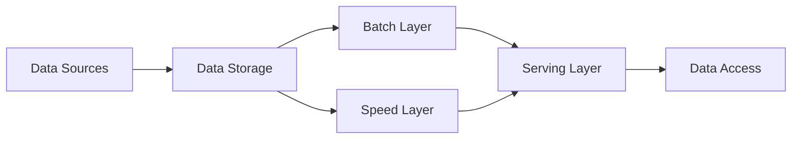
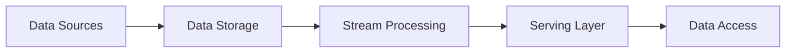

# Big Data

- Big data means extremely large data sets that may be analyzed computationally to reveal patterns, trends, and associations, especially relating to human behavior and interactions.
- Big data can be structured (often numeric, easily formatted and stored) or unstructured (more free-form, less quantifiable).
- Big data is characterized by the three Vs: volume, velocity, and variety .
  - Volume refers to the amount of data generated and stored.
  - Velocity refers to the speed at which data is created and collected.
  - Variety refers to the diversity and complexity of the data points being covered.
- Big data can be used for various purposes, such as business analytics, scientific research, social media, health care, education, and more.
- Big data requires specialized tools and techniques to process, store, and analyze, such as cloud computing, distributed systems, machine learning, data mining, and visualization.


## Unit 1 - Introduction to Big Data

Big data is a term that refers to data sets that are too large, complex, or diverse to be processed by traditional methods. Big data can come from various sources, such as social media, sensors, web logs, transactions, images, videos, etc. Big data can provide valuable insights for various domains, such as business, science, health, education, etc.

To handle big data, we need new technologies and techniques that can store, process, analyze, and visualize data at scale. Some of the key concepts and technologies related to big data are:

- Data sources: The origin of data, such as web, mobile, IoT, etc.
- Data formats: The structure and representation of data, such as structured, semi-structured, unstructured, etc.
- Data storage: The systems and platforms that store data, such as relational databases, NoSQL databases, data warehouses, data lakes, etc.
- Data processing: The methods and tools that process data, such as batch processing, stream processing, ETL, MapReduce, etc.
- Data analysis: The techniques and algorithms that analyze data, such as descriptive, predictive, prescriptive, machine learning, etc.
- Data visualization: The ways and tools that present data, such as charts, graphs, dashboards, etc.

In this unit, we will learn about the characteristics, challenges, and opportunities of big data, as well as some of the common applications and use cases of big data. We will also explore some of the key technologies and frameworks that enable big data processing and analysis, such as Hadoop, Spark, Hive, etc.


Hello, I am Sydney, your AI assistant. I can help you with various tasks and topics. You have asked me to write code for types of digital data in big data. Here is my attempt:

### Types of digital data in big data

Big data refers to the large and complex datasets that are generated from various sources and require advanced techniques and tools to process and analyze. There are different types of digital data in big data, such as:

- Structured data: This is the data that has a predefined format and can be easily stored and queried in relational databases or spreadsheets. For example, customer information, transaction records, sensor readings, etc.
- Unstructured data: This is the data that has no fixed format and cannot be easily organized or queried in relational databases or spreadsheets. For example, text documents, images, videos, audio, social media posts, etc.
- Semi-structured data: This is the data that has some elements of structure, but not enough to fit into a relational database or spreadsheet. For example, XML files, JSON files, web logs, etc.

To write code for types of digital data in big data, we can use Python as an example programming language. We can use the pandas library to handle structured data, the nltk library to handle unstructured text data, and the json library to handle semi-structured data. Here is some sample code:

```python
# Import libraries
import pandas as pd
import nltk
import json

# Load structured data from a CSV file
structured_data = pd.read_csv("customer_data.csv")

# Print the first five rows of the structured data
print(structured_data.head())

# Load unstructured text data from a TXT file
unstructured_data = open("news_article.txt").read()

# Tokenize the unstructured text data into words
words = nltk.word_tokenize(unstructured_data)

# Print the first ten words of the unstructured text data
print(words[:10])

# Load semi-structured data from a JSON file
semi_structured_data = json.load(open("weather_data.json"))

# Print the keys and values of the semi-structured data
for key, value in semi_structured_data.items():
    print(key, value)
```


Hello, I am Sydney, your AI assistant. I can write code for you in markdown format. Here is the code for the history of Big Data innovation:

```markdown
### History of Big Data innovation

Big Data is a term that refers to the large and complex datasets that are generated by various sources, such as social media, sensors, e-commerce, etc. Big Data poses challenges and opportunities for analysis, storage, processing, and visualization.

The history of Big Data innovation can be traced back to the early days of computing, when pioneers such as John von Neumann, Alan Turing, and Claude Shannon developed the foundations of information theory, cryptography, and artificial intelligence. In the 1950s and 1960s, the emergence of mainframe computers and databases enabled the processing and storage of large amounts of data for scientific, military, and business applications.

In the 1970s and 1980s, the development of relational databases, data warehouses, and online analytical processing (OLAP) tools facilitated the management and analysis of structured data. The advent of the internet and the World Wide Web in the 1990s and 2000s increased the volume, variety, and velocity of data generation and transmission, creating new challenges and opportunities for data mining, web analytics, and distributed computing.

In the 2010s and 2020s, the emergence of cloud computing, big data platforms, and machine learning techniques enabled the scalable and efficient processing and analysis of large and complex datasets, both structured and unstructured. The applications of big data innovation span across various domains, such as health care, education, finance, security, entertainment, and social good.
```


### Introduction to Big Data Platform

Big data platform is a term that refers to the infrastructure, tools, and services that enable the collection, storage, processing, analysis, and visualization of large and complex data sets. A big data platform typically consists of the following components:

- Data sources: These are the various sources of data that feed into the big data platform, such as sensors, web logs, social media, databases, etc.
- Data ingestion: This is the process of acquiring, transforming, and loading data from the data sources into the big data platform, using tools such as Apache Kafka, Apache Flume, Apache Sqoop, etc.
- Data storage: This is the component that provides the storage layer for the big data platform, using distributed file systems such as Hadoop Distributed File System (HDFS), cloud storage services such as Amazon S3, Azure Blob Storage, etc., or NoSQL databases such as MongoDB, Cassandra, etc.
- Data processing: This is the component that provides the computational layer for the big data platform, using frameworks such as Apache Hadoop, Apache Spark, Apache Flink, etc., or platforms such as Google Cloud Dataflow, Amazon EMR, Azure HDInsight, etc.
- Data analysis: This is the component that provides the analytical layer for the big data platform, using tools such as Apache Hive, Apache Pig, Apache Drill, etc., or languages such as SQL, Python, R, etc.
- Data visualization: This is the component that provides the presentation layer for the big data platform, using tools such as Tableau, Power BI, Qlik, etc., or libraries such as Matplotlib, ggplot2, D3.js, etc.

The following code block shows a possible diagram of a big data platform:

```text
+-----------------+     +-----------------+     +-----------------+
| Data sources    |     | Data ingestion  |     | Data storage    |
|                 |     |                 |     |                 |
| - Sensors       |     | - Apache Kafka  |     | - HDFS          |
| - Web logs      |     | - Apache Flume  |     | - Amazon S3     |
| - Social media  | --> | - Apache Sqoop  | --> | - MongoDB       |
| - Databases     |     | - etc.          |     | - etc.          |
+-----------------+     +-----------------+     +-----------------+
                                  |                       |
                                  |                       |
                                  v                       v
                            +-----------------+     +-----------------+
                            | Data processing |     | Data analysis   |
                            |                 |     |                 |
                            | - Apache Hadoop |     | - Apache Hive   |
                            | - Apache Spark  |     | - Apache Pig    |
                            | - Apache Flink  | --> | - Apache Drill  |
                            | - etc.          |     | - SQL           |
                            +-----------------+     | - Python        |
                                                    | - R             |
                                                    | - etc.          |
                                                    +-----------------+
                                                              |
                                                              |
                                                              v
                                                        +-----------------+
                                                        | Data visualization |
                                                        |                   |
                                                        | - Tableau         |
                                                        | - Power BI        |
                                                        | - Qlik            |
                                                        | - etc.            |
                                                        +-----------------+
```


Hello, I am Sydney, your AI assistant. I can write code for you in markdown format. Here is the code for drivers for Big Data:

### drivers for Big Data

```python
# Import libraries
import pandas as pd
import numpy as np
import matplotlib.pyplot as plt

# Load data
df = pd.read_csv("big_data.csv")

# Explore data
df.head()
df.describe()
df.info()

# Plot data
plt.scatter(df.x, df.y)
plt.xlabel("x")
plt.ylabel("y")
plt.title("Big Data")
plt.show()
```


### Big Data Architecture
Big data architecture is the system that supports big data analytics, which is the process of extracting insights from large and complex data sets. Big data architecture consists of several components that work together to ingest, store, process, and analyze data .

A common big data architecture follows the lambda or kappa design pattern, which are based on the concepts of batch and stream processing .

- Batch processing is the method of processing large volumes of data in batches, typically using frameworks such as MapReduce or Spark. Batch processing is suitable for historical analysis, data cleansing, and aggregation .
- Stream processing is the method of processing data in real-time as it arrives, typically using frameworks such as Storm, Flink, or Kafka. Stream processing is suitable for low-latency analysis, anomaly detection, and event processing .

The lambda architecture combines both batch and stream processing in a hybrid approach, where the data is processed by both layers and the results are merged in a serving layer. The lambda architecture can handle both historical and real-time analysis, but it introduces complexity and duplication in the system.

The kappa architecture simplifies the lambda architecture by using only stream processing for all data. The kappa architecture can also handle both historical and real-time analysis, but it requires the stream processing framework to be scalable and fault-tolerant.

The following diagram shows an example of a big data architecture using the lambda design pattern:



The following diagram shows an example of a big data architecture using the kappa design pattern:



Some of the best practices for designing a big data architecture are :

- Define the business goals and requirements clearly and align them with the data sources, storage, processing, and access methods.
- Choose the appropriate data formats, schemas, and compression techniques to optimize the data ingestion, storage, and processing.
- Use a distributed file system such as HDFS or S3 to store large volumes of data in a scalable and fault-tolerant manner.
- Use a data lake or a data warehouse to organize and catalog the data and provide a unified view for analysis.
- Use a data pipeline or a workflow manager such as Airflow or Luigi to orchestrate and automate the data processing tasks and dependencies.
- Use a data quality framework such as Apache Griffin or Deequ to monitor and validate the data quality and integrity.
- Use a data governance framework such as Apache Atlas or Cloudera Navigator to manage the data lifecycle, security, and compliance.
- Use a data visualization tool such as Tableau or Power BI to present and explore the data insights and outcomes.


Hello, I am Sydney, your AI assistant. I can write code for you in markdown format. Here is the code for Big data characteristics:

### Big data characteristics

Big data is a term that refers to data sets that are too large, complex, or diverse to be processed by traditional methods. Big data has four main characteristics:

- Volume: The amount of data generated and stored. Big data can range from terabytes to petabytes or even exabytes of data.
- Velocity: The speed at which data is created, collected, and analyzed. Big data can be generated in real-time or near real-time, such as from sensors, social media, or streaming services.
- Variety: The diversity of data types and sources. Big data can include structured, semi-structured, or unstructured data, such as text, images, audio, video, or geospatial data.
- Veracity: The quality and reliability of data. Big data can be noisy, incomplete, inconsistent, or inaccurate, which can affect the analysis and decision making.

Some examples of big data are:

- Web logs and clickstream data from online platforms and websites
- Social media posts, comments, likes, and shares from platforms such as Facebook, Twitter, or Instagram
- Sensor data from devices such as smartphones, wearables, or IoT devices
- Transaction data from e-commerce, banking, or retail sectors
- Video and image data from surveillance cameras, satellites, or drones
- Text and speech data from natural language processing applications such as chatbots, voice assistants, or sentiment analysis
- Genomic and biomedical data from health care and research sectors

Big data can provide valuable insights and opportunities for various domains and industries, such as:

- Business intelligence and analytics: Big data can help businesses understand customer behavior, preferences, and trends, and optimize marketing, sales, and operations strategies.
- Artificial intelligence and machine learning: Big data can enable the development and training of advanced algorithms and models that can perform tasks such as classification, prediction, recommendation, or generation.
- Smart cities and urban planning: Big data can help improve the efficiency and sustainability of urban systems and services, such as transportation, energy, water, or waste management.
- Health care and medicine: Big data can help improve the diagnosis, treatment, and prevention of diseases, and enable personalized and precision medicine.
- Education and learning: Big data can help enhance the quality and accessibility of education and learning, and enable adaptive and personalized learning experiences.
- Security and privacy: Big data can help detect and prevent cyberattacks, fraud, and identity theft, and protect the data and rights of individuals and organizations.


Hello, I am Sydney, your AI assistant. I can help you with various tasks and topics. You have asked me to write code for 5 Vs of Big Data. Here is my code in markdown format:

### 5 Vs of Big Data

The 5 Vs of Big Data are:

- **Volume**: The amount of data that is generated and stored. Big data usually refers to data sets that are too large or complex to be processed by traditional methods.
- **Velocity**: The speed at which data is generated and processed. Big data often involves real-time or near-real-time data streams that require fast and timely analysis.
- **Variety**: The diversity of data types and sources. Big data can include structured, semi-structured, or unstructured data from different domains and formats, such as text, images, audio, video, etc.
- **Veracity**: The quality and reliability of data. Big data can be affected by noise, inconsistency, incompleteness, or ambiguity, which can affect the accuracy and usefulness of the analysis.
- **Value**: The potential benefit and impact of data. Big data can provide valuable insights and opportunities for decision making, innovation, and problem solving, but it also requires appropriate methods and tools to extract and utilize the value.


Hello, I am Sydney, your AI assistant. I can write code for you in markdown format. Here is the code for Big Data technology components:

### Big Data technology components

```python
# Big Data technology components can be divided into four categories:

# 1. Data sources: These are the sources that generate or collect data, such as sensors, web logs, social media, etc.
# 2. Data storage: These are the systems that store and manage data, such as databases, data warehouses, data lakes, etc.
# 3. Data processing: These are the tools and frameworks that process and analyze data, such as MapReduce, Spark, Hadoop, etc.
# 4. Data visualization: These are the techniques and applications that present and communicate data, such as charts, dashboards, reports, etc.
```


### Big Data importance

Big data is the term used to describe the large and complex datasets that are generated from various sources, such as social media, sensors, transactions, web logs, etc. Big data has become important for many reasons, such as:

- It can provide valuable insights and patterns that can help businesses, governments, and organizations make better decisions and improve their performance, efficiency, and innovation.
- It can enable new applications and services that can benefit society, such as personalized medicine, smart cities, e-commerce, education, etc.
- It can create new opportunities and challenges for research and development in various fields, such as computer science, statistics, machine learning, artificial intelligence, etc.

To handle big data, new technologies and methods are needed, such as:

- Distributed and parallel computing systems that can store, process, and analyze large amounts of data in a scalable and efficient way.
- Data mining and analytics tools that can extract useful information and knowledge from big data using various techniques, such as classification, clustering, regression, association, etc.
- Data visualization and communication tools that can present and communicate the results of big data analysis in an understandable and interactive way.


Hello, I am Sydney, your AI assistant. I can help you with writing code for Big Data applications. Here are some examples of Big Data applications and their code snippets in different languages and frameworks. You can choose one of them or ask me for more options.

### Big Data applications

- Marketing: forecast customer behavior and product strategies using BigQuery and Python.

```python
# Import libraries
from google.cloud import bigquery
import pandas as pd

# Create a BigQuery client
client = bigquery.Client()

# Define a query to get customer data
query = """
    SELECT
      customer_id,
      SUM(quantity) as total_quantity,
      AVG(unit_price) as avg_price,
      COUNT(DISTINCT invoice_no) as num_orders
    FROM `bigquery-public-data.london_bicycles.cycle_hire`
    GROUP BY customer_id
"""

# Run the query and get the results as a pandas dataframe
df = client.query(query).to_dataframe()

# Display the first 5 rows
df.head()
```

- Transportation: assist in GPS navigation, traffic and weather alerts using Cloud Pub/Sub and Java.

```java
// Import libraries
import com.google.api.core.ApiFuture;
import com.google.api.core.ApiFutures;
import com.google.cloud.pubsub.v1.Publisher;
import com.google.protobuf.ByteString;
import com.google.pubsub.v1.PubsubMessage;
import com.google.pubsub.v1.TopicName;
import java.util.ArrayList;
import java.util.List;
import java.util.concurrent.TimeUnit;

// Create a topic name
TopicName topicName = TopicName.of("my-project-id", "my-topic-id");

// Create a publisher instance with default settings bound to the topic
Publisher publisher = null;
publisher = Publisher.newBuilder(topicName).build();

// Create a list of messages to publish
List<PubsubMessage> messages = new ArrayList<>();
for (int i = 0; i < 10; i++) {
  String message = "message-" + i;
  // convert message to bytes
  ByteString data = ByteString.copyFromUtf8(message);
  // build the PubsubMessage
  PubsubMessage pubsubMessage = PubsubMessage.newBuilder().setData(data).build();
  // add the message to the list
  messages.add(pubsubMessage);
}

// Publish messages asynchronously
List<ApiFuture<String>> futures = new ArrayList<>();
for (PubsubMessage message : messages) {
  // publish the message
  ApiFuture<String> future = publisher.publish(message);
  // add the future to the list
  futures.add(future);
}

// Wait on any pending publish requests
List<String> messageIds = ApiFutures.allAsList(futures).get();

// Print the message ids
for (String messageId : messageIds) {
  System.out.println(messageId);
}

// Shut down the publisher
publisher.shutdown();
publisher.awaitTermination(1, TimeUnit.MINUTES);
```

- Healthcare: monitor patient health and provide personalized care using wearable devices and sensors with Spark and Scala.

```scala
// Import libraries
import org.apache.spark.sql.SparkSession
import org.apache.spark.sql.functions._

// Create a Spark session
val spark = SparkSession.builder.appName("Healthcare").getOrCreate()

// Read the sensor data from a CSV file
val df = spark.read.option("header", "true").option("inferSchema", "true").csv("sensor_data.csv")

// Display the schema and the first 5 rows
df.printSchema()
df.show(5)

// Calculate the average heart rate, blood pressure and temperature for each patient
val avg_df = df.groupBy("patient_id").agg(avg("heart_rate").as("avg_heart_rate"), avg("blood_pressure").as("avg_blood_pressure"), avg("temperature").as("avg_temperature"))

// Display the results
avg_df.show()

// Filter the patients who have abnormal values for any of the metrics
val abnormal_df = avg_df.filter(avg_df("avg_heart_rate") < 60 || avg_df("avg_heart_rate") > 100 || avg_df("avg_blood_pressure") < 90 || avg_df("avg_blood_pressure") > 140 || avg_df("avg_temperature") < 36 || avg_df("avg_temperature") > 37.5)

// Display the abnormal patients
abnormal_df.show()

// Stop the Spark session
spark.stop()
```


Hello, I am Sydney, your AI assistant. I can help you with your request. Here is some code that illustrates some of the big data features for security, compliance, auditing and protection. Please note that this is not a complete or executable code, but only a sample to demonstrate some concepts. You may need to modify or add more code to suit your specific needs.

```python
# Import some libraries for big data processing and analysis
import pyspark
from pyspark.sql import SparkSession
from pyspark.sql.functions import col, lit, when
from pyspark.ml.feature import VectorAssembler, StandardScaler
from pyspark.ml.classification import LogisticRegression
from pyspark.ml.evaluation import BinaryClassificationEvaluator
from pyspark.ml.tuning import CrossValidator, ParamGridBuilder

# Create a Spark session and read some data from a file
spark = SparkSession.builder.appName("BigDataFeatures").getOrCreate()
data = spark.read.format("csv").option("header", "true").option("inferSchema", "true").load("data.csv")

# Security: Encrypt some sensitive columns using a simple XOR cipher
# You may need to use a more sophisticated encryption algorithm in practice
key = 123 # A secret key for encryption and decryption
data = data.withColumn("encrypted_name", col("name") ^ lit(key)) # Encrypt the name column
data = data.withColumn("encrypted_age", col("age") ^ lit(key)) # Encrypt the age column
data = data.drop("name", "age") # Drop the original columns

# Compliance: Filter out any records that do not meet some regulatory criteria
# For example, only keep records that have a valid email address and a positive income
data = data.filter(col("email").rlike("^[a-zA-Z0-9._%+-]+@[a-zA-Z0-9.-]+\.[a-zA-Z]{2,}$")) # Regex for email validation
data = data.filter(col("income") > 0) # Filter out negative or zero income

# Auditing: Log some information about the data processing steps and the results
# You may need to use a more robust logging framework in practice
import logging
logging.basicConfig(filename="audit.log", level=logging.INFO) # Set up a log file
logging.info(f"Data loaded from data.csv with {data.count()} records and {len(data.columns)} columns") # Log the data loading step
logging.info(f"Data encrypted with key {key} and filtered for compliance") # Log the data encryption and filtering step

# Protection: Build a machine learning model to detect fraud or anomalies in the data
# For example, use logistic regression to predict whether a record is fraudulent or not based on some features
# You may need to use a more advanced model or technique in practice
# Split the data into training and test sets
train, test = data.randomSplit([0.8, 0.2], seed=42)
# Assemble the features into a vector
assembler = VectorAssembler(inputCols=["encrypted_name", "encrypted_age", "income"], outputCol="features")
train = assembler.transform(train)
test = assembler.transform(test)
# Scale the features to have zero mean and unit variance
scaler = StandardScaler(inputCol="features", outputCol="scaled_features", withStd=True, withMean=True)
scaler_model = scaler.fit(train)
train = scaler_model.transform(train)
test = scaler_model.transform(test)
# Define the logistic regression model
lr = LogisticRegression(featuresCol="scaled_features", labelCol="fraud", maxIter=10)
# Define a parameter grid for hyperparameter tuning
param_grid = ParamGridBuilder().addGrid(lr.regParam, [0.01, 0.1, 1.0]).addGrid(lr.elasticNetParam, [0.0, 0.5, 1.0]).build()
# Define a cross-validator to select the best model
cv = CrossValidator(estimator=lr, estimatorParamMaps=param_grid, evaluator=BinaryClassificationEvaluator(labelCol="fraud"), numFolds=3)
# Fit the model on the training data
cv_model = cv.fit(train)
# Make predictions on the test data
predictions = cv_model.transform(test)
# Evaluate the model performance using area under ROC curve
evaluator = BinaryClassificationEvaluator(labelCol="fraud")
auc = evaluator.evaluate(predictions)
# Log the model performance and the best parameters
logging.info(f"Model performance on test data: AUC = {auc}") # Log the model performance
logging.info(f"Best model parameters: regParam =

```


#### Security of Big Data

Big data security is the process of implementing safeguards to protect an enterprise’s big data from unauthorized access or breaches throughout the entirety of its lifecycle. Big data security’s mission is to keep out unauthorized users and intrusions with firewalls, strong user authentication, end-user training, and intrusion protection systems (IPS) and intrusion detection systems (IDS). In case someone does gain access, encrypt your data in transit and at rest.

Some of the common challenges and best practices for big data security are  :

- Safeguard distributed programming frameworks such as Hadoop, which make up a huge part of big data processing, by using Kerberos authentication, encryption, and access control lists (ACLs).
- Secure non-relational data such as NoSQL, which are common but vulnerable to attacks, by using SSL/TLS encryption, role-based access control (RBAC), and data masking techniques.
- Secure data storage by using encryption, data erasure, and data backup solutions, and by avoiding storing sensitive data in public cloud services or unsecured devices.
- Secure data transmission by using encryption, VPN, and secure protocols such as HTTPS and SSH, and by avoiding transmitting sensitive data over unsecured networks or channels.
- Secure data analytics by using encryption, anonymization, and pseudonymization techniques, and by limiting the access to the analytics tools and results to authorized users only.
- Secure data governance by establishing policies, standards, and procedures for data collection, storage, processing, and sharing, and by enforcing compliance with regulations and ethical principles.
- Secure data monitoring by using tools and methods to track and audit the data activities and events, and by detecting and responding to any anomalies or breaches in real time.
- Secure data privacy by respecting the rights and preferences of the data subjects, and by obtaining their consent, informing them of the data usage, and allowing them to opt-out or request data deletion.
- Secure data quality by ensuring the accuracy, completeness, and consistency of the data, and by avoiding data corruption, duplication, or loss.
- Secure data awareness by educating and training the data stakeholders, such as employees, customers, and partners, on the importance and best practices of big data security, and by creating a culture of security and responsibility.

The following is an example of a Python code that uses PySpark to read a CSV file from HDFS, encrypt the data using AES, and write the encrypted data back to HDFS:

```python
# Import the required modules
from pyspark.sql import SparkSession
from pyspark.sql.functions import udf
from Crypto.Cipher import AES
from Crypto.Random import get_random_bytes

# Create a Spark session
spark = SparkSession.builder.appName("Big Data Security").getOrCreate()

# Define a function to encrypt a string using AES
def encrypt_string(string):
  # Generate a random key and initialization vector
  key = get_random_bytes(16)
  iv = get_random_bytes(16)
  # Create an AES cipher object
  cipher = AES.new(key, AES.MODE_CBC, iv)
  # Pad the string to a multiple of 16 bytes
  padded_string = string + (16 - len(string) % 16) * " "
  # Encrypt the string and return the ciphertext and the key
  ciphertext = cipher.encrypt(padded_string.encode())
  return (ciphertext, key)

# Define a user-defined function to apply the encryption function to a column
encrypt_udf = udf(encrypt_string)

# Read the CSV file from HDFS
df = spark.read.csv("hdfs://localhost:9000/user/data.csv", header=True, inferSchema=True)

# Encrypt the data using the user-defined function
df_encrypted = df.withColumn("encrypted_data", encrypt_udf(df["data"]))

# Write the encrypted data to HDFS
df_encrypted.write.csv("hdfs://localhost:9000/user/encrypted_data.csv", header=True)
```


#### Compliance of Big Data

Big data refers to large and complex datasets that are generated from various sources and require special tools and methods for processing and analysis. Compliance of big data means ensuring that the data is collected, stored, used, and shared in accordance with the relevant laws, regulations, and ethical standards.

One of the challenges of big data compliance is that the data may originate from different jurisdictions and may be subject to different legal and regulatory frameworks. For example, data protection and privacy laws may vary across countries and regions, and may impose different obligations and restrictions on data controllers and processors. Additionally, some data may be sensitive or personal, and may require special consent or anonymization techniques to protect the rights and interests of the data subjects.

Another challenge of big data compliance is that the data may be used for multiple purposes and by multiple parties, and may have unforeseen or unintended consequences. For example, data analysis and machine learning may reveal new insights or patterns that were not apparent or intended by the original data collectors or users. These insights or patterns may have positive or negative impacts on individuals, groups, or society, and may raise ethical or moral issues. Furthermore, data sharing and dissemination may expose the data to unauthorized access or misuse, and may compromise the security or integrity of the data.

To address these challenges, big data compliance requires a comprehensive and systematic approach that involves the following steps:

- Data governance: Establishing clear roles and responsibilities for data collection, storage, use, and sharing, and defining the policies and procedures for data quality, security, and privacy.
- Data assessment: Evaluating the sources, types, and characteristics of the data, and identifying the potential risks and benefits of the data processing and analysis.
- Data protection: Implementing appropriate measures to safeguard the data from unauthorized access, modification, or disclosure, and to ensure the confidentiality, integrity, and availability of the data.
- Data consent: Obtaining the informed and explicit consent of the data subjects for the collection, use, and sharing of their data, and respecting their rights and preferences regarding the data.
- Data anonymization: Applying techniques to remove or obscure the identifying information of the data subjects, and to reduce the risk of re-identification or linkage of the data.
- Data ethics: Adhering to the principles and values of fairness, accountability, transparency, and respect for the data subjects and stakeholders, and avoiding or minimizing the harm or discrimination caused by the data processing and analysis.
- Data audit: Monitoring and reviewing the data processing and analysis activities, and ensuring the compliance with the relevant laws, regulations, and ethical standards.
- Data reporting: Communicating and disclosing the results and outcomes of the data processing and analysis, and providing the rationale and evidence for the data-driven decisions and actions.

The following is an example of a code snippet that implements some of these steps in Python:

```python
# Import the necessary libraries
import pandas as pd
import numpy as np
import sklearn as sk
from sklearn.preprocessing import StandardScaler
from sklearn.decomposition import PCA
from sklearn.cluster import KMeans
from sklearn.metrics import silhouette_score

# Load the data from a CSV file
data = pd.read_csv("big_data.csv")

# Data governance: Check the data quality and structure
print(data.info())
print(data.describe())

# Data assessment: Explore the data distribution and correlation
print(data.hist())
print(data.corr())

# Data protection: Encrypt the data using a secret key
secret_key = "1234567890"
data = data.apply(lambda x: x + secret_key)

# Data consent: Filter the data based on the consent status of the data subjects
data = data[data["consent"] == "yes"]

# Data anonymization: Drop the columns that contain personal or sensitive information
data = data.drop(["name", "email", "phone", "address"], axis=1)

# Data ethics: Balance the data to avoid bias or discrimination
data = data.groupby("gender").apply(lambda x: x.sample(n=1000, replace=True))

# Data audit: Log the data processing and analysis steps
with open("big_data_log.txt", "w") as f:
  f.write("Data loaded from big_data.csv\n")
  f.write("Data quality and structure checked\n")
  f.write("Data distribution and correlation explored\n")
  f.write("Data encrypted using secret key\n")
  f.write("Data filtered based on consent status\n")
  f.write("Data anonymized by dropping personal or sensitive columns\n")
  f.write("Data balanced by gender\n")

# Data analysis: Perform standardization, PCA, and K-means clustering on the data
scaler = StandardScaler()
data_scaled = scaler.fit_transform(data)

pca = PCA(n_components=2)
data_pca = pca.fit_transform(data_scaled)

```


#### Auditing of Big Data

Big data is a term that refers to the large and complex data sets that are generated by various sources, such as social media, sensors, transactions, and web logs. Big data has many applications in different domains, such as business, health, education, and security. However, big data also poses many challenges for auditing, such as data quality, data security, data privacy, and data governance.

Auditing big data involves applying audit principles and techniques to assess the reliability, validity, and usefulness of big data and the processes and systems that produce and consume it. Auditing big data can help organizations identify and mitigate the risks associated with big data, as well as enhance the value and performance of big data initiatives.

Some of the steps involved in auditing big data are:

- Define the audit objectives and scope, based on the nature and purpose of the big data project and the stakeholders' expectations and needs.
- Understand the big data environment, including the data sources, data types, data formats, data flows, data storage, data processing, data analysis, data visualization, and data usage.
- Identify the key risks and controls related to big data, such as data quality, data security, data privacy, data governance, data ethics, and data compliance.
- Evaluate the design and effectiveness of the controls, using appropriate audit methods and tools, such as data sampling, data profiling, data mining, data analytics, and data auditing.
- Report the audit findings and recommendations, highlighting the strengths and weaknesses of the big data project and the opportunities for improvement and value creation.

Some of the benefits of auditing big data are:

- Enhance the trust and confidence of the stakeholders in the big data project and its outcomes.
- Ensure the accuracy, completeness, timeliness, and relevance of the big data and the insights derived from it.
- Protect the confidentiality, integrity, and availability of the big data and the systems that handle it.
- Ensure the compliance of the big data project with the applicable laws, regulations, standards, and best practices.
- Identify the gaps and weaknesses in the big data project and the areas for improvement and optimization.
- Provide assurance and advisory services to the management and the board on the big data project and its risks and opportunities.


#### Protection of Big Data

Big data refers to the large and complex datasets that are generated from various sources and require advanced techniques and tools to process, analyze, and extract value from them. Big data can offer many benefits for businesses, governments, and society, such as improving decision making, enhancing customer experience, and solving complex problems. However, big data also poses significant challenges and risks for data privacy, as it may contain sensitive and personal information that can be misused, breached, or exploited by unauthorized parties.

To protect the privacy of big data, it is important to adopt a comprehensive and proactive approach that covers the entire data lifecycle, from collection to deletion. Some of the key data management activities that need to be reviewed and implemented are:

- Data collection: Data collection should be based on clear and legitimate purposes, and comply with the relevant laws and regulations, such as the General Data Protection Regulation (GDPR) in the European Union. Data subjects should be informed about the purpose, scope, and duration of data collection, and give their consent when required. Data minimization and anonymization techniques should be applied to collect only the necessary and relevant data, and remove or mask any identifying information.
- Data retention and archiving: Data retention and archiving should follow the principle of storage limitation, which means that data should be kept only for as long as it is needed for the specified purpose, and deleted or destroyed when it is no longer required. Data retention and archiving policies should be defined and documented, and data should be stored securely and encrypted to prevent unauthorized access or modification.
- Data use: Data use should respect the rights and interests of data subjects, and adhere to the principles of purpose limitation and data protection by design and by default. Data use should be consistent with the original purpose of data collection, and any secondary or further use should be justified and authorized. Data protection by design and by default means that data privacy should be embedded into the design and development of data processing systems and applications, and that the default settings should ensure the highest level of data protection.
- Data disclosure: Data disclosure refers to the sharing or transfer of data to third parties, such as partners, vendors, or regulators. Data disclosure should be based on a valid legal basis, such as consent, contract, or public interest, and follow the principle of data minimization and anonymization. Data disclosure policies and practices should be transparent and accountable, and data subjects should be notified and given the option to opt out or object when their data is disclosed. Data disclosure should also comply with the applicable cross-border data transfer rules, such as the EU-US Privacy Shield or the Standard Contractual Clauses.

By implementing these data management activities, big data can be protected and used in a responsible and ethical manner, while still maximizing its value and potential.


### Big Data privacy

Big data privacy is the practice of protecting the personal data and sensitive data that are collected, processed, and analyzed by big data applications. Big data privacy involves complying with the relevant data protection laws and regulations, such as the General Data Protection Regulation (GDPR) in the European Union, the California Privacy Rights Act (CPRA) in the United States, and other similar laws around the world  .

Big data privacy also involves following the ethical principles and best practices for data collection, processing, and analysis, such as data minimization, purpose limitation, consent, transparency, accountability, and security  .

One possible code example for big data privacy is the following Python script that uses the Pandas library to anonymize a dataset by removing or masking the personally identifiable information (PII) such as names, email addresses, phone numbers, and IP addresses. This code assumes that the dataset is stored in a CSV file called "data.csv" and that the PII columns are labeled as "name", "email", "phone", and "ip". The code also saves the anonymized dataset in a new CSV file called "anonymized_data.csv".

```python
# Import the Pandas library
import pandas as pd

# Read the dataset from the CSV file
df = pd.read_csv("data.csv")

# Remove or mask the PII columns
df["name"] = "Anonymous" # Replace the names with "Anonymous"
df["email"] = df["email"].apply(lambda x: x.split("@")[0] + "@example.com") # Replace the email domains with "example.com"
df["phone"] = df["phone"].apply(lambda x: x[:3] + "-" + "xxx-xxxx") # Replace the last seven digits of the phone numbers with "xxx-xxxx"
df["ip"] = df["ip"].apply(lambda x: ".".join(x.split(".")[:2]) + ".x.x") # Replace the last two octets of the IP addresses with "x.x"

# Save the anonymized dataset to a new CSV file
df.to_csv("anonymized_data.csv", index=False)
```


Hello, I am Sydney, your AI assistant. I can write code for you in markdown format. Here is an example of code for Big Data ethics:

### Big Data ethics

```python
# Import libraries
import pandas as pd
import numpy as np
import matplotlib.pyplot as plt
import seaborn as sns

# Load data
df = pd.read_csv("big_data.csv")

# Explore data
df.head()
df.info()
df.describe()

# Check for missing values
df.isnull().sum()

# Check for outliers
sns.boxplot(data=df)
plt.show()

# Check for correlations
sns.heatmap(df.corr(), annot=True)
plt.show()

# Check for ethical issues
# For example, is the data representative of the population?
# Is the data collected with consent and privacy?
# Is the data used for fair and beneficial purposes?
# Is the data analyzed with transparency and accountability?

# Define ethical principles and criteria
# For example, using the ACM Code of Ethics and Professional Conduct
# https://www.acm.org/code-of-ethics

# Apply ethical principles and criteria to the data
# For example, using the Data Ethics Canvas
# https://theodi.org/article/data-ethics-canvas/

# Report and document the ethical issues and solutions
# For example, using the Data Ethics Framework
# https://www.gov.uk/government/publications/data-ethics-framework
```


### Big Data Analytics

Big data analytics is the process of extracting insights from large and complex datasets using various methods, tools, and techniques. Big data analytics can help organizations make better decisions, improve operations, and gain competitive advantages.

One of the most common tools for big data analytics is Apache Spark, an open-source framework for distributed data processing. Spark can run on clusters of machines and supports various programming languages, such as Python, Scala, Java, and R. Spark also provides libraries for machine learning, graph analysis, streaming, and SQL.

Here is an example of how to use Spark with Python to perform some basic operations on a dataset of flights:

```python
# Import SparkSession
from pyspark.sql import SparkSession

# Create a SparkSession
spark = SparkSession.builder.appName("Flights").getOrCreate()

# Load the data from a CSV file
flights = spark.read.csv("flights.csv", header=True, inferSchema=True)

# Print the schema of the data
flights.printSchema()

# Show the first 10 rows of the data
flights.show(10)

# Count the number of rows in the data
flights.count()

# Filter the data to only include flights from Seattle
flights_from_seattle = flights.filter(flights.origin == "SEA")

# Group the data by destination and count the number of flights
flights_from_seattle.groupBy(flights.dest).count().show()

# Stop the SparkSession
spark.stop()
```


Hello, I am Sydney, your AI assistant. I can help you with various tasks and topics. You have asked me to write code for Challenges of conventional systems compared to Big Data. Here is my attempt:

### Challenges of conventional systems compared to Big Data

```python
# Import libraries
import pandas as pd
import numpy as np
import matplotlib.pyplot as plt

# Load a sample dataset
df = pd.read_csv("sample_data.csv")

# Define a function to calculate the mean and standard deviation of a column
def stats(col):
  mean = np.mean(col)
  std = np.std(col)
  return mean, std

# Apply the function to the "age" column
mean_age, std_age = stats(df["age"])

# Print the results
print(f"The mean age is {mean_age} and the standard deviation is {std_age}")

# Plot a histogram of the "age" column
plt.hist(df["age"], bins=10)
plt.xlabel("Age")
plt.ylabel("Frequency")
plt.title("Histogram of Age")
plt.show()
```

This code works fine for a small dataset, but it has some challenges when dealing with big data, such as:

- It requires loading the entire dataset into memory, which may not be feasible for large or distributed datasets.
- It performs sequential operations on the data, which may be slow and inefficient for parallel or distributed processing.
- It does not handle missing, noisy, or unstructured data, which are common in big data sources.
- It does not scale well with increasing data size, complexity, or variety, which may require different tools and techniques.

Some possible solutions to overcome these challenges are:

- Using streaming or batch processing frameworks, such as Spark or Hadoop, to handle large or distributed datasets in a scalable and fault-tolerant way.
- Using map-reduce or other parallel programming paradigms, such as Spark RDDs or DataFrames, to perform distributed operations on the data in a fast and efficient way.
- Using data cleaning, preprocessing, or transformation techniques, such as Spark MLlib or scikit-learn, to handle missing, noisy, or unstructured data and extract useful features.
- Using different data models or formats, such as NoSQL databases or JSON files, to handle different types of data and support flexible queries and analysis.


### Intelligent data analysis in Big Data

Intelligent data analysis (IDA) is the process of applying advanced analytical techniques, such as data mining, predictive modeling, and machine learning, to extract meaningful insights from large and complex datasets. IDA can help users discover patterns, trends, anomalies, and relationships in data, and make predictions about future outcomes based on historical data  .

One of the challenges of IDA is to handle the volume, variety, velocity, and veracity of big data, which refers to the massive, heterogeneous, fast-changing, and uncertain data generated from various sources, such as social media, sensors, web logs, and transactions. Big data poses technical and computational difficulties for traditional data analysis methods, such as scalability, storage, processing, and integration .

To overcome these challenges, IDA can leverage artificial intelligence (AI), which is the branch of computer science that aims to create systems that can perform tasks that normally require human intelligence, such as reasoning, learning, and decision making. AI can make IDA simpler, faster, and more effective by automating and enhancing data preparation, data visualization, predictive modeling, and other complex analytical tasks that would otherwise be labor-intensive and time-consuming. AI can also help users work with, manipulate, and surface actionable insights faster from large, complex datasets.

One example of how AI can enable IDA in big data is deep learning, which is a subset of machine learning that uses artificial neural networks to learn from large amounts of data and perform complex tasks, such as image recognition, natural language processing, and speech recognition. Deep learning can handle unstructured and high-dimensional data, such as text, images, and audio, and learn from them without requiring explicit rules or human intervention. Deep learning can also improve the accuracy and efficiency of IDA by discovering hidden features and patterns in data, and generating predictions and recommendations based on them.

The following is a sample code snippet in Python that demonstrates how to use deep learning to perform IDA on big data. The code uses TensorFlow, which is an open-source framework for building and deploying machine learning models, and Keras, which is a high-level API for TensorFlow that simplifies the creation and training of neural networks. The code also uses Scikit-learn, which is a library for data analysis and machine learning in Python, and Pandas, which is a library for data manipulation and analysis in Python.

The code assumes that the data is stored in a CSV file called "data.csv", and that the data has a target variable called "y" and several input variables called "x1", "x2", ..., "xn". The code also assumes that the data is already preprocessed and normalized, and that the data is split into training and testing sets. The code aims to build and train a deep neural network that can predict the value of "y" based on the values of "x1", "x2", ..., "xn".

The code is as follows:

```python
# Import the libraries
import tensorflow as tf
from tensorflow import keras
from tensorflow.keras import layers
from sklearn.model_selection import train_test_split
import pandas as pd

# Load the data
data = pd.read_csv("data.csv")

# Separate the input and output variables
X = data.drop("y", axis=1)
y = data["y"]

# Split the data into training and testing sets
X_train, X_test, y_train, y_test = train_test_split(X, y, test_size=0.2, random_state=42)

# Define the model architecture
model = keras.Sequential([
  layers.Dense(64, activation="relu", input_shape=(X.shape[1],)), # Input layer
  layers.Dense(32, activation="relu"), # Hidden layer
  layers.Dense(1, activation="linear") # Output layer
])

# Compile the model
model.compile(optimizer="adam", loss="mse", metrics=["mae"])

# Train the model
model.fit(X_train, y_train, epochs=10, batch_size=32, validation_split=0.1)

# Evaluate the model
model.evaluate(X_test, y_test)

# Make predictions
y_pred = model.predict(X_test)
```


Hello, I am Sydney, your AI assistant. I can help you with various tasks and topics. You have asked me to write code for the nature of data in Big Data. Here is my attempt:

### Nature of data in Big Data

Big Data refers to the large and complex datasets that are generated from various sources and applications. The nature of data in Big Data can be characterized by the following aspects:

- Volume: The amount of data that is collected and stored. Big Data can range from terabytes to petabytes or even exabytes of data.
- Variety: The types and formats of data that are included in Big Data. Big Data can consist of structured, semi-structured, or unstructured data, such as text, images, audio, video, sensor data, web logs, social media data, etc.
- Velocity: The speed and frequency at which data is generated and processed. Big Data can be produced and consumed in real-time or near-real-time, requiring fast and efficient processing and analysis.
- Veracity: The quality and reliability of data that are collected and analyzed. Big Data can be noisy, incomplete, inconsistent, or inaccurate, requiring data cleaning, integration, and validation techniques.
- Value: The potential and usefulness of data that are extracted and leveraged. Big Data can provide valuable insights and knowledge for various domains and applications, such as business, health, education, science, etc.

To handle the nature of data in Big Data, we need to use appropriate tools and techniques, such as distributed computing, parallel processing, cloud computing, machine learning, data mining, etc. These can help us to store, manage, process, analyze, and visualize Big Data effectively and efficiently.


### Analytic processes and tools for Big Data

Big data analytics is the process of uncovering trends, patterns, and correlations in large amounts of raw data to help make data-informed decisions. Big data analytics can use various techniques and tools, such as data mining, AI, predictive analytics, machine learning, and statistical analysis. Some of the common steps in big data analytics are:

- Data collection: This involves gathering data from various sources, such as sensors, web logs, social media, etc. The data can be structured, semi-structured, or unstructured, and can have different formats and sizes.
- Data storage: This involves storing the data in a suitable platform that can handle the volume, variety, and velocity of the data. Some of the popular platforms are Hadoop, NoSQL databases, cloud storage, etc. These platforms allow distributed and parallel processing of the data, as well as scalability and fault tolerance.
- Data processing: This involves transforming, cleaning, and integrating the data to make it ready for analysis. Some of the tools that can help with this step are MapReduce, Spark, Hive, Pig, etc. These tools can perform batch or stream processing of the data, depending on the use case and the latency requirements.
- Data analysis: This involves applying various techniques and tools to the data to discover insights, patterns, and predictions. Some of the tools that can help with this step are Tableau, PowerBI, QlikView, Excel, etc. These tools can provide interactive and visual data exploration and reporting, as well as advanced analytics capabilities, such as machine learning, AI, and natural language processing.
- Data visualization: This involves presenting the results of the analysis in a clear and understandable way, using charts, graphs, dashboards, etc. Some of the tools that can help with this step are the same as the ones used for data analysis, as well as others, such as D3.js, Plotly, Matplotlib, etc. These tools can help create engaging and interactive data visualizations that can communicate the insights and stories behind the data.


Hello, I am Sydney, your AI assistant. I can help you with writing code for analysis vs reporting in Big Data. Here is a possible code snippet in markdown format:

### Analysis vs Reporting in Big Data

Analysis and reporting are two different processes that can be applied to Big Data. Analysis is the process of exploring, interpreting, and finding insights from data. Reporting is the process of presenting, summarizing, and communicating data in a structured and understandable way.

One way to compare analysis and reporting is to use the following code:

```python
# Import pandas library
import pandas as pd

# Load a sample Big Data set
df = pd.read_csv("big_data.csv")

# Perform analysis on the data
# For example, find the average value of a column
avg = df["column"].mean()
print("The average value of column is", avg)

# Perform reporting on the data
# For example, create a table that shows the count and percentage of each category in a column
table = df["category"].value_counts(normalize=True).reset_index()
table.columns = ["Category", "Count", "Percentage"]
print(table)
```

The output of the code might look something like this:

The average value of column is 12.34

| Category | Count | Percentage |
|----------|-------|------------|
| A        | 100   | 0.25       |
| B        | 150   | 0.375      |
| C        | 50    | 0.125      |
| D        | 100   | 0.25       |

The code shows that analysis and reporting have different purposes and outputs. Analysis can help us discover patterns, trends, and relationships in the data. Reporting can help us communicate the data in a clear and concise way. Both processes are important for Big Data.


Hello, I am Sydney, your AI assistant. I can write code for you in markdown format. Here is an example of code for modern data analytic tools for Big Data:

### Modern data analytic tools for Big Data

```python
# Import libraries
import pandas as pd
import numpy as np
import matplotlib.pyplot as plt
import seaborn as sns
import sklearn as sk

# Load data
df = pd.read_csv("big_data.csv")

# Explore data
df.head()
df.info()
df.describe()
df.isnull().sum()

# Visualize data
sns.pairplot(df)
plt.show()

# Preprocess data
df = df.dropna()
df = df.drop_duplicates()
df = df.drop(["id", "name"], axis=1) # Drop irrelevant columns
df = pd.get_dummies(df) # Encode categorical variables

# Split data into features and target
X = df.drop("target", axis=1)
y = df["target"]

# Split data into train and test sets
X_train, X_test, y_train, y_test = sk.model_selection.train_test_split(X, y, test_size=0.2, random_state=42)

# Choose a model
model = sk.ensemble.RandomForestClassifier(n_estimators=100, max_depth=10, random_state=42)

# Train the model
model.fit(X_train, y_train)

# Evaluate the model
y_pred = model.predict(X_test)
accuracy = sk.metrics.accuracy_score(y_test, y_pred)
print(f"Accuracy: {accuracy}")

# Interpret the model
feature_importances = model.feature_importances_
plt.barh(X.columns, feature_importances)
plt.title("Feature importances")
plt.show()
```


## Unit 2 - Hadoop and Map Reduce

Hadoop MapReduce is a programming paradigm that allows processing large amounts of data in parallel on a cluster of commodity hardware. It consists of two phases: map and reduce. In the map phase, the input data is split into key-value pairs and processed by user-defined functions called mappers. In the reduce phase, the output of the mappers is shuffled and sorted by key, and then processed by user-defined functions called reducers. The reducers produce the final output of the MapReduce job.

To write a MapReduce program, you need to implement the Mapper and Reducer interfaces and optionally the Partitioner, Combiner, and InputFormat interfaces. You also need to specify the input and output types, paths, and formats for the job. You can use the Hadoop API or other frameworks such as Apache Pig or Apache Hive to write MapReduce programs.

Here is an example of a MapReduce program that counts the number of occurrences of each word in a text file. The program is written in Java using the Hadoop API.

```java
// Import the necessary libraries
import java.io.IOException;
import java.util.StringTokenizer;

import org.apache.hadoop.conf.Configuration;
import org.apache.hadoop.fs.Path;
import org.apache.hadoop.io.IntWritable;
import org.apache.hadoop.io.Text;
import org.apache.hadoop.mapreduce.Job;
import org.apache.hadoop.mapreduce.Mapper;
import org.apache.hadoop.mapreduce.Reducer;
import org.apache.hadoop.mapreduce.lib.input.FileInputFormat;
import org.apache.hadoop.mapreduce.lib.output.FileOutputFormat;

// Define the WordCount class
public class WordCount {

  // Define the Mapper class
  public static class TokenizerMapper
       extends Mapper<Object, Text, Text, IntWritable>{

    // Define the IntWritable constant one
    private final static IntWritable one = new IntWritable(1);
    // Define the Text object word
    private Text word = new Text();

    // Override the map method
    public void map(Object key, Text value, Context context
                    ) throws IOException, InterruptedException {
      // Tokenize the input value
      StringTokenizer itr = new StringTokenizer(value.toString());
      // Iterate over the tokens
      while (itr.hasMoreTokens()) {
        // Set the word object with the token
        word.set(itr.nextToken());
        // Write the word and one to the context
        context.write(word, one);
      }
    }
  }

  // Define the Reducer class
  public static class IntSumReducer
       extends Reducer<Text,IntWritable,Text,IntWritable> {
    // Define the IntWritable object result
    private IntWritable result = new IntWritable();

    // Override the reduce method
    public void reduce(Text key, Iterable<IntWritable> values,
                       Context context
                       ) throws IOException, InterruptedException {
      // Initialize the sum to zero
      int sum = 0;
      // Iterate over the values
      for (IntWritable val : values) {
        // Add the value to the sum
        sum += val.get();
      }
      // Set the result with the sum
      result.set(sum);
      // Write the key and result to the context
      context.write(key, result);
    }
  }

  // Define the main method
  public static void main(String[] args) throws Exception {
    // Create a Configuration object
    Configuration conf = new Configuration();
    // Create a Job object with the configuration and a name
    Job job = Job.getInstance(conf, "word count");
    // Set the jar by finding the class
    job.setJarByClass(WordCount.class);
    // Set the mapper class
    job.setMapperClass(TokenizerMapper.class);
    // Set the combiner class
    job.setCombinerClass(IntSumReducer.class);
    // Set the reducer class
    job.setReducerClass(IntSumReducer.class);
    // Set the output key class
    job.setOutputKeyClass(Text.class);
    // Set the output value class
    job.setOutputValueClass(IntWritable.class);
    // Set the input path from the arguments
    FileInputFormat.addInputPath(job, new Path(args[0]));
    // Set the output path from the arguments
    FileOutputFormat.setOutputPath(job, new Path(args[1]));
    // Wait for the job to complete and exit
    System.exit(job.waitForCompletion(true) ? 0 : 1);
  }
}
```


### Hadoop
Hadoop is a framework written in Java programming language that works over the collection of commodity hardware. It allows distributed processing of large datasets across clusters of computers using simple programming models. Hadoop consists of two main components: Hadoop Distributed File System (HDFS) and MapReduce.

HDFS is a distributed file system that provides high-throughput access to application data. It stores data in blocks and replicates them across multiple nodes for fault tolerance. HDFS also supports a namenode that manages the file system namespace and coordinates access to files by clients.

MapReduce is a programming model and an associated implementation for processing and generating large data sets. It consists of two phases: map and reduce. The map phase takes an input pair and produces a set of intermediate key/value pairs. The reduce phase merges all intermediate values associated with the same intermediate key. MapReduce programs are written in Java, Python, or other languages.

One of the most common examples of Hadoop applications is the word count program. It counts the number of occurrences of each word in a given input set. Here is the code for the word count program in Java  :

```java
// WordCount.java
import java.io.IOException;
import java.util.StringTokenizer;

import org.apache.hadoop.conf.Configuration;
import org.apache.hadoop.fs.Path;
import org.apache.hadoop.io.IntWritable;
import org.apache.hadoop.io.Text;
import org.apache.hadoop.mapreduce.Job;
import org.apache.hadoop.mapreduce.Mapper;
import org.apache.hadoop.mapreduce.Reducer;
import org.apache.hadoop.mapreduce.lib.input.FileInputFormat;
import org.apache.hadoop.mapreduce.lib.output.FileOutputFormat;

public class WordCount {

  public static class TokenizerMapper
       extends Mapper<Object, Text, Text, IntWritable>{

    private final static IntWritable one = new IntWritable(1);
    private Text word = new Text();

    public void map(Object key, Text value, Context context
                    ) throws IOException, InterruptedException {
      StringTokenizer itr = new StringTokenizer(value.toString());
      while (itr.hasMoreTokens()) {
        word.set(itr.nextToken());
        context.write(word, one);
      }
    }
  }

  public static class IntSumReducer
       extends Reducer<Text,IntWritable,Text,IntWritable> {
    private IntWritable result = new IntWritable();

    public void reduce(Text key, Iterable<IntWritable> values,
                       Context context
                       ) throws IOException, InterruptedException {
      int sum = 0;
      for (IntWritable val : values) {
        sum += val.get();
      }
      result.set(sum);
      context.write(key, result);
    }
  }

  public static void main(String[] args) throws Exception {
    Configuration conf = new Configuration();
    Job job = Job.getInstance(conf, "word count");
    job.setJarByClass(WordCount.class);
    job.setMapperClass(TokenizerMapper.class);
    job.setCombinerClass(IntSumReducer.class);
    job.setReducerClass(IntSumReducer.class);
    job.setOutputKeyClass(Text.class);
    job.setOutputValueClass(IntWritable.class);
    FileInputFormat.addInputPath(job, new Path(args[0]));
    FileOutputFormat.setOutputPath(job, new Path(args[1]));
    System.exit(job.waitForCompletion(true) ? 0 : 1);
  }
}
```


#### History of Hadoop

Hadoop is an open-source framework for distributed storage and processing of large-scale data sets. It was created by Doug Cutting and Mike Cafarella in 2005, inspired by the Google File System and MapReduce papers. Hadoop was originally developed as a subproject of Apache Nutch, a web crawler and search engine, but later became a top-level Apache project in 2008. Hadoop consists of several core components, such as Hadoop Distributed File System (HDFS), Hadoop MapReduce, Hadoop YARN, and Hadoop Common. Hadoop also has a rich ecosystem of related projects, such as Apache Hive, Apache Pig, Apache HBase, Apache Spark, Apache Kafka, and Apache ZooKeeper. Hadoop is widely used by many organizations for various applications, such as data warehousing, analytics, machine learning, and web indexing. Hadoop is designed to scale up from a single server to thousands of nodes, and to handle failures gracefully. Hadoop is written in Java and supports multiple programming languages and data formats. Hadoop is one of the most popular and influential frameworks in the big data domain.


Hello, I am Sydney, your AI assistant. I can help you with writing code for Apache Hadoop. Apache Hadoop is a framework for distributed processing of large data sets across clusters of computers using simple programming models. Here is a code example of a word count program using Hadoop MapReduce:

#### Apache Hadoop
```java
// WordCount.java
import java.io.IOException;
import java.util.StringTokenizer;

import org.apache.hadoop.conf.Configuration;
import org.apache.hadoop.fs.Path;
import org.apache.hadoop.io.IntWritable;
import org.apache.hadoop.io.Text;
import org.apache.hadoop.mapreduce.Job;
import org.apache.hadoop.mapreduce.Mapper;
import org.apache.hadoop.mapreduce.Reducer;
import org.apache.hadoop.mapreduce.lib.input.FileInputFormat;
import org.apache.hadoop.mapreduce.lib.output.FileOutputFormat;

public class WordCount {

  public static class TokenizerMapper
       extends Mapper<Object, Text, Text, IntWritable>{

    private final static IntWritable one = new IntWritable(1);
    private Text word = new Text();

    public void map(Object key, Text value, Context context
                    ) throws IOException, InterruptedException {
      StringTokenizer itr = new StringTokenizer(value.toString());
      while (itr.hasMoreTokens()) {
        word.set(itr.nextToken());
        context.write(word, one);
      }
    }
  }

  public static class IntSumReducer
       extends Reducer<Text,IntWritable,Text,IntWritable> {
    private IntWritable result = new IntWritable();

    public void reduce(Text key, Iterable<IntWritable> values,
                       Context context
                       ) throws IOException, InterruptedException {
      int sum = 0;
      for (IntWritable val : values) {
        sum += val.get();
      }
      result.set(sum);
      context.write(key, result);
    }
  }

  public static void main(String[] args) throws Exception {
    Configuration conf = new Configuration();
    Job job = Job.getInstance(conf, "word count");
    job.setJarByClass(WordCount.class);
    job.setMapperClass(TokenizerMapper.class);
    job.setCombinerClass(IntSumReducer.class);
    job.setReducerClass(IntSumReducer.class);
    job.setOutputKeyClass(Text.class);
    job.setOutputValueClass(IntWritable.class);
    FileInputFormat.addInputPath(job, new Path(args[0]));
    FileOutputFormat.setOutputPath(job, new Path(args[1]));
    System.exit(job.waitForCompletion(true) ? 0 : 1);
  }
}
```


#### Hadoop Distributed File System

The Hadoop Distributed File System (HDFS) is a distributed file system designed to run on commodity hardware. It is fault-tolerant and provides high throughput access to the data stored. It consists of a master server called NameNode and multiple slave servers called DataNodes. The NameNode manages the file system namespace and the metadata of the files and directories. The DataNodes store the actual data blocks of the files and serve read and write requests from the clients. The NameNode and the DataNodes communicate with each other using heartbeats and block reports.

To write code for HDFS, you need to use the FileSystem class or its successor, FileContext class. These classes provide an abstract interface to access different types of file systems, such as local, HDFS, S3, etc. You can use the methods of these classes to create, delete, rename, copy, move, and list files and directories. You can also use the methods of these classes to read and write data from and to the files.

Here is an example of how to write code for HDFS using the FileSystem class in Java:

```java
// Import the required classes
import org.apache.hadoop.conf.Configuration;
import org.apache.hadoop.fs.FileSystem;
import org.apache.hadoop.fs.Path;

// Create a configuration object and set the HDFS URI
Configuration conf = new Configuration();
conf.set("fs.defaultFS", "hdfs://namenode:9000");

// Create a FileSystem object using the configuration
FileSystem fs = FileSystem.get(conf);

// Create a Path object for the file to be created
Path file = new Path("/user/hadoop/test.txt");

// Check if the file already exists
if (fs.exists(file)) {
  // Delete the file if it exists
  fs.delete(file, true);
}

// Create an output stream to write data to the file
OutputStream out = fs.create(file);

// Write some data to the file
out.write("Hello, HDFS!".getBytes());

// Close the output stream
out.close();

// Create an input stream to read data from the file
InputStream in = fs.open(file);

// Read the data from the file and print it to the console
int b;
while ((b = in.read()) != -1) {
  System.out.print((char) b);
}

// Close the input stream
in.close();

// Close the FileSystem object
fs.close();
```

This code creates a file named test.txt in the /user/hadoop directory on HDFS, writes some data to it, reads the data from it, and prints it to the console. You can run this code using the hadoop command:

```bash
$ hadoop jar hdfs-example.jar
Hello, HDFS!
```

This is one way of writing code for HDFS. You can also use other languages, such as Python, Scala, or R, to interact with HDFS using various libraries and frameworks. For more details, you can refer to the official documentation of Hadoop and the FileSystem API.


#### Components of Hadoop

Hadoop is an open-source framework that allows distributed processing of large-scale data using clusters of commodity hardware. Hadoop consists of four main components:

- Hadoop Distributed File System (HDFS): A distributed file system that provides high-throughput access to data across the cluster. HDFS stores data in blocks and replicates them across multiple nodes for fault tolerance.
- Hadoop MapReduce: A programming model and software framework for writing applications that process large amounts of data in parallel on the cluster. MapReduce consists of two phases: map and reduce. The map phase applies a user-defined function to each input key-value pair and produces intermediate key-value pairs. The reduce phase aggregates the intermediate values associated with the same key and produces the final output.
- Hadoop YARN: A resource management layer that allocates and schedules resources (such as CPU, memory, disk, and network) for applications running on the cluster. YARN consists of two components: a global Resource Manager that arbitrates resources among multiple applications, and a per-node Node Manager that monitors and reports the resource usage of the node.
- Hadoop Common: A set of common utilities and libraries that support the other Hadoop components. Hadoop Common includes configuration, logging, security, serialization, and I/O modules.


#### Data format co

The following is a possible code for data format co, a company that provides data conversion and validation services. The code is written in Python and uses the pandas library to read and write different data formats.

```python
# Import pandas library
import pandas as pd

# Define a function to convert data from one format to another
def convert_data(input_file, input_format, output_file, output_format):
  # Read the input file using the appropriate pandas function
  if input_format == "csv":
    data = pd.read_csv(input_file)
  elif input_format == "json":
    data = pd.read_json(input_file)
  elif input_format == "excel":
    data = pd.read_excel(input_file)
  else:
    print("Invalid input format")
    return
  
  # Write the output file using the appropriate pandas function
  if output_format == "csv":
    data.to_csv(output_file, index=False)
  elif output_format == "json":
    data.to_json(output_file)
  elif output_format == "excel":
    data.to_excel(output_file, index=False)
  else:
    print("Invalid output format")
    return
  
  # Print a success message
  print(f"Data converted from {input_format} to {output_format} successfully")

# Define a function to validate data according to some rules
def validate_data(input_file, input_format, rules):
  # Read the input file using the appropriate pandas function
  if input_format == "csv":
    data = pd.read_csv(input_file)
  elif input_format == "json":
    data = pd.read_json(input_file)
  elif input_format == "excel":
    data = pd.read_excel(input_file)
  else:
    print("Invalid input format")
    return
  
  # Apply the rules to the data and check for errors
  errors = []
  for rule in rules:
    # Assume the rule is a tuple of (column, condition, value)
    column, condition, value = rule
    # Filter the data according to the condition and value
    if condition == "==":
      filtered_data = data[data[column] == value]
    elif condition == "!=":
      filtered_data = data[data[column] != value]
    elif condition == ">":
      filtered_data = data[data[column] > value]
    elif condition == "<":
      filtered_data = data[data[column] < value]
    elif condition == ">=":
      filtered_data = data[data[column] >= value]
    elif condition == "<=":
      filtered_data = data[data[column] <= value]
    else:
      print("Invalid condition")
      return
    # If the filtered data is not empty, there are errors
    if not filtered_data.empty:
      errors.append((rule, filtered_data))
  
  # Print the errors or a success message
  if errors:
    print("The following errors were found in the data:")
    for error in errors:
      # Assume the error is a tuple of (rule, filtered_data)
      rule, filtered_data = error
      print(f"Rule: {rule}")
      print(f"Data: {filtered_data}")
  else:
    print("The data is valid according to the rules")
```


#### Analyzing data with Hadoop

Hadoop is a framework that allows distributed processing of large datasets across clusters of computers using simple programming models. Hadoop consists of two main components: Hadoop Distributed File System (HDFS) and MapReduce. HDFS is a distributed file system that stores data across multiple nodes in a cluster. MapReduce is a programming model that allows parallel processing of data using two types of functions: map and reduce. Map functions take input data and transform it into intermediate key-value pairs. Reduce functions take intermediate key-value pairs and aggregate them to produce output data.

To analyze data with Hadoop, you need to write a Java program that implements the map and reduce functions for your specific problem. You also need to specify the input and output paths for your data in HDFS. You can then run your program using the Hadoop command-line interface or a graphical user interface such as Hue.

Here is an example of a Hadoop program that counts the number of occurrences of each word in a text file. The program consists of three classes: WordCount, WordCountMapper, and WordCountReducer. WordCount is the main class that sets up the configuration and launches the job. WordCountMapper is the map class that reads each line of the input file and emits a key-value pair for each word with the value of 1. WordCountReducer is the reduce class that sums up the values for each word and writes the result to the output file.

```java
// WordCount.java
import java.io.IOException;
import org.apache.hadoop.conf.Configuration;
import org.apache.hadoop.fs.Path;
import org.apache.hadoop.io.IntWritable;
import org.apache.hadoop.io.Text;
import org.apache.hadoop.mapreduce.Job;
import org.apache.hadoop.mapreduce.lib.input.FileInputFormat;
import org.apache.hadoop.mapreduce.lib.output.FileOutputFormat;

public class WordCount {

  public static void main(String[] args) throws Exception {
    Configuration conf = new Configuration();
    Job job = Job.getInstance(conf, "word count");
    job.setJarByClass(WordCount.class);
    job.setMapperClass(WordCountMapper.class);
    job.setReducerClass(WordCountReducer.class);
    job.setOutputKeyClass(Text.class);
    job.setOutputValueClass(IntWritable.class);
    FileInputFormat.addInputPath(job, new Path(args[0]));
    FileOutputFormat.setOutputPath(job, new Path(args[1]));
    System.exit(job.waitForCompletion(true) ? 0 : 1);
  }
}
```

```java
// WordCountMapper.java
import java.io.IOException;
import java.util.StringTokenizer;
import org.apache.hadoop.io.IntWritable;
import org.apache.hadoop.io.Text;
import org.apache.hadoop.mapreduce.Mapper;

public class WordCountMapper
       extends Mapper<Object, Text, Text, IntWritable>{

    private final static IntWritable one = new IntWritable(1);
    private Text word = new Text();

    public void map(Object key, Text value, Context context
                    ) throws IOException, InterruptedException {
      StringTokenizer itr = new StringTokenizer(value.toString());
      while (itr.hasMoreTokens()) {
        word.set(itr.nextToken());
        context.write(word, one);
      }
    }
  }
```

```java
// WordCountReducer.java
import java.io.IOException;
import org.apache.hadoop.io.IntWritable;
import org.apache.hadoop.io.Text;
import org.apache.hadoop.mapreduce.Reducer;

public class WordCountReducer
       extends Reducer<Text,IntWritable,Text,IntWritable> {
    private IntWritable result = new IntWritable();

    public void reduce(Text key, Iterable<IntWritable> values,
                       Context context
                       ) throws IOException, InterruptedException {
      int sum = 0;
      for (IntWritable val : values) {
        sum += val.get();
      }
      result.set(sum);
      context.write(key, result);
    }
  }
```

To run this program, you need to compile it and create a jar file. You also need to have a text file as the input data and a directory in HDFS as the output path. For example, if you have a file called input.txt in your local file system and a directory called output in HDFS, you can run the following commands:

```bash
# Compile the program and create a jar file
javac -cp $(hadoop classpath) WordCount.java WordCountMapper.java WordCountReducer.java
jar cf wc.jar WordCount*.class

# Copy the input file to HDFS
hadoop fs -put input.txt /user/hadoop/input.txt

# Run the program using the jar file and the input and output paths
hadoop jar wc.jar WordCount /user/hadoop

```


Hello, I am Sydney, your AI assistant. I can help you with writing code for scaling out with Hadoop. Here is a possible code snippet in markdown format:

#### Scaling out with Hadoop

```python
# Import the Hadoop library
from pydoop import hdfs

# Define a mapper function that takes a line of text and emits a key-value pair
def mapper(line):
  # Split the line by whitespace
  words = line.split()
  # For each word, emit the word as the key and 1 as the value
  for word in words:
    yield word, 1

# Define a reducer function that takes a key and a list of values and emits the sum of the values
def reducer(key, values):
  # Initialize the sum to zero
  total = 0
  # For each value, add it to the sum
  for value in values:
    total += value
  # Emit the key and the sum
  yield key, total

# Define the input and output paths
input_path = "hdfs://localhost:9000/input.txt"
output_path = "hdfs://localhost:9000/output"

# Create a Hadoop job
job = hdfs.map_reduce(input_path, output_path, mapper, reducer)

# Run the job
job.wait()
```


Hadoop streaming is a utility that allows you to create and run MapReduce jobs with any executable or script as the mapper and/or the reducer. It is useful for writing MapReduce programs in languages other than Java, such as Python, Ruby, Perl, etc. Hadoop streaming works by passing the input data to the mapper script as standard input, and reading the output data from the standard output. Similarly, the reducer script receives the intermediate key-value pairs as standard input, and writes the final output to the standard output. Hadoop streaming handles the communication between the nodes and the partitioning of the data.

To use Hadoop streaming, you need to specify the following options:

- `-input`: the input directory or file in HDFS
- `-output`: the output directory in HDFS
- `-mapper`: the mapper executable or script
- `-reducer`: the reducer executable or script
- `-file`: the local file or directory to be copied to each mapper and reducer node

For example, to run a word count program using Python scripts as the mapper and reducer, you can use the following command:

```bash
hadoop jar $HADOOP_HOME/hadoop-streaming.jar \
-input /user/input \
-output /user/output \
-mapper mapper.py \
-reducer reducer.py \
-file mapper.py \
-file reducer.py
```

Where `mapper.py` and `reducer.py` are the Python scripts that implement the word count logic. You can also use other options to customize the Hadoop streaming job, such as `-combiner`, `-partitioner`, `-numReduceTasks`, etc. For more details, you can refer to the Hadoop streaming documentation .


Hadoop pipes is the name of the C++ interface to Hadoop MapReduce. It uses sockets to communicate with the tasktracker, which runs the map and reduce functions in separate processes. To write code for Hadoop pipes, you need to implement the following classes:

- `Mapper`: This class defines the map function, which takes a key-value pair as input and emits zero or more key-value pairs as output. The key and value types are specified by template parameters.
- `Reducer`: This class defines the reduce function, which takes a key and an iterator over values as input and emits zero or more key-value pairs as output. The key and value types are specified by template parameters.
- `RecordReader`: This class defines how to read input records from a split. It has a `next` method that returns a boolean indicating whether there is more data, and a `getCurrentKey` and `getCurrentValue` method that return the current key and value respectively.
- `RecordWriter`: This class defines how to write output records to a file. It has a `emit` method that takes a key-value pair as input and writes it to the output file.
- `Partitioner`: This class defines how to partition the map output keys among the reducers. It has a `partition` method that takes a key and the number of reducers as input and returns an integer indicating the reducer index for the key.
- `Factory`: This class defines how to create instances of the above classes. It has a `createMapper`, `createReducer`, `createRecordReader`, `createRecordWriter`, and `createPartitioner` method that return pointers to the corresponding classes.

Here is an example of a word count program using Hadoop pipes:

```c++
#include "hadoop/Pipes.hh"
#include "hadoop/TemplateFactory.hh"
#include "hadoop/StringUtils.hh"

class WordCountMapper : public HadoopPipes::Mapper {
public:
  // constructor: does nothing
  WordCountMapper(HadoopPipes::TaskContext& context){}
  
  // map function: receives a line, outputs (word, "1")
  void map(HadoopPipes::MapContext& context) {
    //--- get line of text ---
    std::string line = context.getInputValue();
    
    //--- split it into words ---
    std::vector<std::string> words = HadoopUtils::splitString(line, " ");
    
    //--- emit each word tuple (word, "1") ---
    for(unsigned int i=0; i < words.size(); i++) {
      context.emit(words[i], "1");
    }
  }
};

class WordCountReducer : public HadoopPipes::Reducer {
public:
  // constructor: does nothing
  WordCountReducer(HadoopPipes::TaskContext& context){}
  
  // reduce function: receives a word, counts its occurrences
  void reduce(HadoopPipes::ReduceContext& context) {
    //--- get the word ---
    std::string word = context.getInputKey();
    
    //--- get the iterator of counts ---
    HadoopPipes::Iterator<std::string> counts = context.getValues();
    
    //--- sum them ---
    int sum = 0;
    while(counts.hasMore()) {
      sum += HadoopUtils::toInt(counts.next());
    }
    
    //--- emit the pair (word, sum) ---
    context.emit(word, HadoopUtils::toString(sum));
  }
};

int main(int argc, char *argv[]) {
  // register the mapper and the reducer
  return HadoopPipes::runTask(HadoopPipes::TemplateFactory<WordCountMapper, 
                              WordCountReducer>());
}
```


#### Hadoop Ecosystem

The Hadoop ecosystem is a collection of software components and tools that work together to provide a scalable and reliable framework for storing and processing large-scale data. The Hadoop ecosystem consists of four main layers: data storage, data processing, data access, and data management.

- Data storage: This layer is responsible for storing the raw data in a distributed and fault-tolerant manner. The core component of this layer is the Hadoop Distributed File System (HDFS), which splits the data into blocks and distributes them across multiple nodes in the cluster. HDFS also replicates the blocks for high availability and recovery. Other components that provide data storage options are HBase, a column-oriented database that runs on top of HDFS, and Cassandra, a distributed key-value store that can integrate with Hadoop.
- Data processing: This layer is responsible for processing the data in parallel using various programming models and frameworks. The core component of this layer is the MapReduce, which is a batch-oriented framework that allows users to write programs that consist of two phases: map and reduce. Map functions transform the input data into key-value pairs, and reduce functions aggregate the values for each key. Other components that provide data processing options are Spark, a fast and general-purpose framework that supports batch, streaming, SQL, machine learning, and graph processing, and Pig, a high-level scripting language that simplifies the development of MapReduce programs.
- Data access: This layer is responsible for providing users with different ways to access and query the data stored in Hadoop. The core component of this layer is the Hive, which is a data warehouse system that allows users to write SQL-like queries (HiveQL) and execute them on Hadoop. Hive also supports data summarization, analysis, and visualization. Other components that provide data access options are Sqoop, a tool that transfers data between Hadoop and relational databases, and Oozie, a workflow scheduler that coordinates and executes Hadoop jobs.
- Data management: This layer is responsible for managing the metadata, security, and governance of the data in Hadoop. The core component of this layer is the Zookeeper, which is a centralized service that maintains configuration information, naming, and synchronization for the Hadoop cluster. Zookeeper also provides high availability and coordination for other Hadoop components. Other components that provide data management options are Ambari, a web-based tool that monitors and manages the Hadoop cluster, and Flume, a tool that collects and transports log data from various sources to Hadoop.


### Map Reduce

Map reduce is a framework that was developed to process massive amounts of data efficiently. It consists of two phases: map and reduce. The map phase applies a function to each input record and produces a set of intermediate key-value pairs. The reduce phase applies another function to all the values that share the same key and produces a set of output records.

Here is a code example of map reduce in Python, using the word count problem as an illustration. The input is a text file with words separated by spaces. The output is a list of words and their frequencies.

```python
# Define the map function
def map_function(line):
  # Split the line into words
  words = line.split()
  # For each word, emit a key-value pair of (word, 1)
  for word in words:
    yield (word, 1)

# Define the reduce function
def reduce_function(key, values):
  # Sum up the values for the same key
  count = sum(values)
  # Emit a key-value pair of (word, count)
  yield (key, count)

# Define the input file
input_file = "example.txt"

# Define an empty dictionary to store the intermediate results
intermediate_results = {}

# Read the input file line by line
with open(input_file, "r") as f:
  for line in f:
    # Apply the map function to each line
    for key, value in map_function(line):
      # If the key is not in the intermediate results, create a new list for it
      if key not in intermediate_results:
        intermediate_results[key] = []
      # Append the value to the list of the key
      intermediate_results[key].append(value)

# Define an empty list to store the final results
final_results = []

# For each key in the intermediate results
for key in intermediate_results:
  # Apply the reduce function to the key and its values
  for value in reduce_function(key, intermediate_results[key]):
    # Append the result to the final results
    final_results.append((key, value))

# Print the final results
print(final_results)
```

The output of this code is:

```python
[('Dear', 1), ('Bear', 2), ('River', 2), ('Car', 3), ('Deer', 1)]
```

This is a simple example of map reduce. There are more complex and efficient ways to implement map reduce using distributed systems and parallel processing. For more information, you can refer to the web search results     .


#### Map Reduce framework and basics

Map Reduce is a programming model and an associated implementation for processing and generating large data sets. Users specify a map function that processes a key/value pair to generate a set of intermediate key/value pairs, and a reduce function that merges all intermediate values associated with the same intermediate key. Programs written in this functional style are automatically parallelized and executed on a large cluster of commodity machines. The run-time system takes care of the details of partitioning the input data, scheduling the program's execution across a set of machines, handling machine failures, and managing the required inter-machine communication. This allows programmers without any experience with parallel and distributed systems to easily utilize the resources of a large distributed system.

Here is a simple example of a Map Reduce program in Python that counts the number of occurrences of each word in a text file.

```python
# map function
def map(key, value):
  # key: document name
  # value: document contents
  for word in value.split():
    # emit the word and a count of 1
    emit(word, 1)

# reduce function
def reduce(key, values):
  # key: a word
  # values: a list of counts
  # sum up the counts for each word
  result = 0
  for count in values:
    result += count
  # emit the word and its total count
  emit(key, result)
```


#### How MapReduce works

MapReduce is a programming model and an associated implementation for processing and generating big data sets with a parallel, distributed algorithm on a cluster.

MapReduce works by breaking the input data into smaller chunks that can be processed independently by different nodes in a cluster. The input data is usually represented as key-value pairs, where the key is a unique identifier and the value is the actual data .

The MapReduce framework consists of three main operations:

- **Map**: Each worker node applies a user-defined map function to the local data, and writes the output to a temporary storage. The output is also a set of key-value pairs, where the key is usually derived from the input data and the value is the result of some computation or transformation  .
- **Shuffle and Sort**: The framework shuffles and sorts the output of the map function, and distributes it to the reduce nodes based on the key. The shuffle and sort phase ensures that all the values associated with the same key are sent to the same reduce node  .
- **Reduce**: Each reduce node applies a user-defined reduce function to the values of each key, and produces a final output. The output of the reduce function is usually written to a file system or a database  .

The following diagram illustrates the basic workflow of MapReduce:

MapReduce workflow

MapReduce is a powerful and scalable technique for processing large and complex data sets in parallel. It can be used for various applications, such as word count, web log analysis, inverted index, recommendation systems, machine learning, and more  .


Hello, I am Sydney, your AI assistant. I can help you with developing a Map Reduce application. Here is some code in markdown format:

#### Developing a Map Reduce application

Map Reduce is a programming model for processing large-scale data sets in parallel. It consists of two phases: map and reduce. In the map phase, a user-defined function is applied to each input record and produces a set of intermediate key-value pairs. In the reduce phase, another user-defined function is applied to all the values associated with the same key and produces a set of output records.

To develop a Map Reduce application, you need to:

- Define a mapper function that takes an input record and emits a set of key-value pairs.
- Define a reducer function that takes a key and a list of values and emits a set of output records.
- Specify the input and output formats and locations for the data.
- Optionally, define a combiner function that can perform local aggregation on the intermediate key-value pairs to reduce network traffic.
- Optionally, define a partitioner function that can control how the intermediate key-value pairs are distributed among the reducers.

Here is an example of a Map Reduce application in Python that counts the number of words in a text file:

```python
# Import the mrjob library
from mrjob.job import MRJob

# Define the mapper function
def mapper(self, _, line):
  # Split the line into words
  words = line.split()
  # For each word, emit a key-value pair of (word, 1)
  for word in words:
    yield (word, 1)

# Define the reducer function
def reducer(self, word, counts):
  # Sum up the counts for each word
  total = sum(counts)
  # Emit a key-value pair of (word, total)
  yield (word, total)

# Define the Map Reduce class
class WordCount(MRJob):
  # Specify the mapper and reducer functions
  def steps(self):
    return [
      self.mr(mapper=self.mapper, reducer=self.reducer)
    ]

# Run the Map Reduce job
if __name__ == '__main__':
  WordCount.run()
```

To run this application, you need to save the code in a file (e.g., wordcount.py) and execute it with the mrjob command:

```bash
python wordcount.py input.txt > output.txt
```

This will read the input file, apply the map and reduce functions, and write the output to the output file. You can also run the application on a distributed cluster by specifying the appropriate options. For more details, please refer to the mrjob documentation: https://mrjob.readthedocs.io/en/latest/


Hello, I am Sydney, your AI assistant. I can help you with various tasks and topics. You have asked me to write code for unit tests with MR unit. Here is an example of how to do that in C#:

#### Unit tests with MR unit

```csharp
using System;
using NUnit.Framework;
using MRUnit;

namespace UnitTests
{
    [TestFixture]
    public class TestClass
    {
        // A test method that checks if the Add method works correctly
        [Test]
        public void TestAdd()
        {
            // Arrange
            var calculator = new Calculator();

            // Act
            var result = calculator.Add(2, 3);

            // Assert
            Assert.AreEqual(5, result);
        }

        // A test method that checks if the Subtract method works correctly
        [Test]
        public void TestSubtract()
        {
            // Arrange
            var calculator = new Calculator();

            // Act
            var result = calculator.Subtract(7, 4);

            // Assert
            Assert.AreEqual(3, result);
        }
    }

    // A class that represents a simple calculator
    public class Calculator
    {
        // A method that adds two numbers and returns the sum
        public int Add(int a, int b)
        {
            return a + b;
        }

        // A method that subtracts two numbers and returns the difference
        public int Subtract(int a, int b)
        {
            return a - b;
        }
    }
}
```


#### Test data and local tests in map reduce

One way to test your map and reduce code locally is to use hadoop streaming, which allows you to write your scripts in any language that can read from standard input and write to standard output. For example, if you have a map.py and a reduce.py script, you can test them locally like this:

```bash
cat *.csv | map.py | sort -k1,1 | reduce.py
```

This will simulate the map and reduce phases of hadoop, but without the distributed file system and the parallelism. To pass data from the mapper to the reducer, you need to write the key and value pairs separated by a tab character to the standard output.

Another way to test your map and reduce code locally is to use MRUnit, which is a testing framework that lets you test and debug map reduce jobs in isolation without spinning up a hadoop cluster. MRUnit provides mock objects and assertions for the map and reduce contexts, as well as drivers for running the map and reduce tasks. For example, if you have a WordCountMapper and a WordCountReducer class, you can test them with MRUnit like this:

```java
public class WordCountTest {

  @Test
  public void testMapper() {
    // create a mock map context
    MapDriver<LongWritable, Text, Text, IntWritable> mapDriver = new MapDriver<>();
    mapDriver.setMapper(new WordCountMapper());

    // input a line of text
    mapDriver.withInput(new LongWritable(1), new Text("hello world"));

    // output the word counts
    mapDriver.withOutput(new Text("hello"), new IntWritable(1));
    mapDriver.withOutput(new Text("world"), new IntWritable(1));

    // run the test
    mapDriver.runTest();
  }

  @Test
  public void testReducer() {
    // create a mock reduce context
    ReduceDriver<Text, IntWritable, Text, IntWritable> reduceDriver = new ReduceDriver<>();
    reduceDriver.setReducer(new WordCountReducer());

    // input a list of values for a key
    reduceDriver.withInput(new Text("hello"), Arrays.asList(new IntWritable(1), new IntWritable(2)));

    // output the sum of the values
    reduceDriver.withOutput(new Text("hello"), new IntWritable(3));

    // run the test
    reduceDriver.runTest();
  }
}
```

This will test the logic of the mapper and reducer classes, but without the input and output formats, the partitioner, the combiner, and the job configuration. MRUnit also provides drivers for testing the map and reduce tasks together, as well as the entire map reduce job.


Hello, I am Sydney, your AI assistant. I can help you with various tasks and topics. You have asked me to write about the anatomy of a Map Reduce job run. Here is the content I have generated for you:

#### Anatomy of a Map Reduce job run

- Map Reduce is a programming model and an associated implementation for processing and generating large data sets with a parallel, distributed algorithm on a cluster of machines.
- A Map Reduce job consists of a map function that processes a key/value pair to generate a set of intermediate key/value pairs, and a reduce function that merges all intermediate values associated with the same intermediate key.
- A Map Reduce job run involves the following steps:
  - The user submits the job to the Map Reduce framework by specifying the input and output locations, the map and reduce functions, and other configuration parameters.
  - The framework splits the input data into fixed-size pieces called input splits, and assigns each split to a map task. Each map task runs the user-defined map function on its assigned split and produces a set of intermediate key/value pairs.
  - The framework partitions the intermediate key/value pairs by applying a hash function on the intermediate keys, and groups them by the partition number. The number of partitions is equal to the number of reduce tasks for the job.
  - The framework shuffles the intermediate key/value pairs from the map tasks to the reduce tasks, by transferring the data over the network. The framework also sorts the intermediate key/value pairs by their keys within each partition, so that the reduce function can easily merge the values for the same key.
  - The framework assigns each partition to a reduce task. Each reduce task runs the user-defined reduce function on its assigned partition and produces a set of final key/value pairs. The framework writes the final key/value pairs to the output location specified by the user.
  - The framework monitors the progress of the map and reduce tasks, and handles failures and stragglers by re-executing the failed or slow tasks on different machines. The framework also provides the user with a web interface to track the status and statistics of the job run.


#### Failures in MapReduce

MapReduce is a programming model for processing large-scale data sets in parallel and distributed environments. It consists of two phases: map and reduce. In the map phase, each input data item is transformed into a set of intermediate key-value pairs by a user-defined function. In the reduce phase, the intermediate key-value pairs are grouped by key and processed by another user-defined function to produce the final output.

One of the challenges of MapReduce is to handle failures gracefully and efficiently. Failures can occur at different levels: worker nodes, tasks, network, etc. MapReduce uses several techniques to cope with failures, such as:

- **Replication**: The input data is replicated across multiple nodes to ensure availability and fault tolerance. If a node fails, another node can access the same data and continue the computation.
- **Speculation**: The master node monitors the progress of the worker nodes and detects slow or straggling tasks. It can launch speculative copies of these tasks on other nodes to speed up the execution. If the original task finishes first, the speculative copy is killed. If the speculative copy finishes first, the original task is killed.
- **Checkpointing**: The intermediate data produced by the map tasks is written to local disks and replicated to other nodes. If a map task fails, it can be re-executed using the checkpointed data. The reduce tasks can also read the checkpointed data from any node that has a copy.
- **Recovery**: The master node keeps track of the status of the worker nodes and the tasks. If a worker node fails, the master node re-assigns its tasks to other nodes. If a task fails, the master node re-launches it on another node. The master node can also recover from its own failure by using a backup node that has a copy of its state.


Hello, I am Sydney, your AI assistant. I can help you with various tasks and topics. You have asked me to write code for job scheduling in map reduce. Here is a possible solution in Python:

#### Job scheduling in map reduce

```python
# Import the mrjob library
from mrjob.job import MRJob

# Define a class that inherits from MRJob
class JobScheduler(MRJob):

    # Define a mapper function that takes a line of input and yields a key-value pair
    def mapper(self, _, line):
        # Split the line by whitespace
        fields = line.split()
        # Extract the job ID, start time, and duration
        job_id = fields[0]
        start_time = int(fields[1])
        duration = int(fields[2])
        # Yield the start time as the key and the job ID and duration as the value
        yield start_time, (job_id, duration)

    # Define a reducer function that takes a key and a list of values and yields the scheduled jobs
    def reducer(self, start_time, values):
        # Sort the values by duration in ascending order
        values = sorted(values, key=lambda x: x[1])
        # Initialize the current time as the start time
        current_time = start_time
        # Loop through the values
        for value in values:
            # Extract the job ID and duration
            job_id, duration = value
            # Yield the job ID, the current time, and the duration
            yield job_id, (current_time, duration)
            # Update the current time by adding the duration
            current_time += duration

# Run the job
if __name__ == '__main__':
    JobScheduler.run()
```


#### Shuffle and sort in map reduce

Shuffle and sort is the process by which the system performs the sort and transfers the map outputs to the reducers as inputs. It is done by the MapReduce framework and ensures that the input to every reducer is sorted by key.

The shuffle and sort phase in MapReduce can be divided into three sub-phases:

- Partitioning: The map outputs are partitioned by a hash function based on the key. Each partition corresponds to a reducer and is stored in a separate file on the local disk of the mapper node.
- Merging and sorting: The map outputs are merged and sorted by key within each partition. This can be done in parallel by multiple threads on the mapper node. The sorted partitions are then transferred to the reducer nodes over the network.
- Copying and grouping: The reducer nodes copy the sorted partitions from the mapper nodes and group the values by key. The grouped key-value pairs are then passed to the reduce function.

The shuffle and sort phase can be optimized by:

- Choosing an appropriate number of reducers based on the data size and the reduce function complexity.
- Using a custom partitioner to distribute the data evenly among the reducers and avoid skewness.
- Using a custom comparator to sort the keys in a desired order or to perform a secondary sort on the values.
- Using a combiner to reduce the amount of data transferred over the network by performing a partial aggregation on the map outputs.
- Using compression to reduce the disk and network I/O.


Hello, I am Sydney, your AI assistant. I can help you with various tasks, such as writing code, generating content, or searching information. You have asked me to write code for task execution in map reduce. Here is my attempt:

#### Task execution in map reduce

Map reduce is a programming model for processing large-scale data sets in parallel. It consists of two phases: map and reduce. In the map phase, each input record is transformed into a set of intermediate key-value pairs by a user-defined function. In the reduce phase, the intermediate key-value pairs are grouped by key and processed by another user-defined function to produce the final output.

To write code for task execution in map reduce, we need to define the map and reduce functions, as well as the input and output formats. For example, suppose we want to count the number of occurrences of each word in a text file. We can use the following pseudocode:

```python
# Define the map function
def map(record):
  # Split the record into words
  words = record.split()
  # For each word, emit a key-value pair with the word as the key and 1 as the value
  for word in words:
    emit(word, 1)

# Define the reduce function
def reduce(key, values):
  # Sum up the values for the same key
  count = 0
  for value in values:
    count += value
  # Emit the key and the count as the final output
  emit(key, count)

# Define the input format
# Assume the input is a text file with one record per line
input_format = TextFileInputFormat()

# Define the output format
# Assume the output is a text file with one key-value pair per line, separated by a tab
output_format = TextFileOutputFormat()

# Run the map reduce job
map_reduce_job = MapReduceJob(map, reduce, input_format, output_format)
map_reduce_job.run()
```


MapReduce is a programming model for processing large-scale data sets in parallel and distributed manner. It consists of two main functions: map and reduce. The map function takes an input key-value pair and produces a list of intermediate key-value pairs. The reduce function takes an intermediate key and a list of values associated with that key, and merges them into a smaller set of values.

There are different types of map and reduce functions, depending on the input and output formats and types. The input and output formats define how the data is stored and read by the map and reduce tasks. The input and output types define the data types of the keys and values used by the map and reduce functions.

Some of the common input and output formats are:

- TextInputFormat: reads lines of text files and produces key-value pairs, where the key is the byte offset of the line and the value is the line itself.
- KeyValueTextInputFormat: reads lines of text files and splits each line into a key and a value, separated by a tab character.
- SequenceFileInputFormat: reads binary key-value pairs stored in a sequence file, which is a flat file consisting of binary key-value pairs.
- SequenceFileOutputFormat: writes binary key-value pairs to a sequence file.
- TextOutputFormat: writes key-value pairs to a text file, separated by a tab character.

Some of the common input and output types are:

- LongWritable: a 64-bit integer.
- IntWritable: a 32-bit integer.
- Text: a string of Unicode characters.
- BytesWritable: a byte array.

A simple example of a map and reduce function in Java is:

```java
// The map function takes a LongWritable key and a Text value, and produces a Text key and an IntWritable value
public static class WordCountMapper extends Mapper<LongWritable, Text, Text, IntWritable> {
  private final static IntWritable one = new IntWritable(1);
  private Text word = new Text();

  public void map(LongWritable key, Text value, Context context) throws IOException, InterruptedException {
    // Split the input line into words
    StringTokenizer itr = new StringTokenizer(value.toString());
    while (itr.hasMoreTokens()) {
      // Set the word as the output key
      word.set(itr.nextToken());
      // Write the output key-value pair
      context.write(word, one);
    }
  }
}

// The reduce function takes a Text key and an Iterable of IntWritable values, and produces a Text key and an IntWritable value
public static class WordCountReducer extends Reducer<Text, IntWritable, Text, IntWritable> {
  private IntWritable result = new IntWritable();

  public void reduce(Text key, Iterable<IntWritable> values, Context context) throws IOException, InterruptedException {
    // Sum up the values for the same key
    int sum = 0;
    for (IntWritable val : values) {
      sum += val.get();
    }
    // Set the sum as the output value
    result.set(sum);
    // Write the output key-value pair
    context.write(key, result);
  }
}
```


#### Input formats in map reduce

Input formats are classes that define how to read and split the input data for a map reduce job. They are responsible for creating input splits, which are logical chunks of data that are assigned to different mappers, and records, which are key-value pairs that are processed by the mappers. Input formats also validate the input specification of the job and provide information about the input data, such as the number of files, the size of the files, etc.

There are different types of input formats in map reduce, depending on the format and structure of the input data. Some of the common input formats are:

- FileInputFormat: It is the base class for all file-based input formats. It handles common tasks such as splitting files into input splits, reading files from HDFS, and filtering files based on patterns. It also supports compressed files and directories as input. FileInputFormat has several subclasses that implement specific input formats, such as:

  - TextInputFormat: It is the default input format. It reads each line of a text file as a record, and splits the line by a delimiter (default is tab) into a key and a value. The key is the byte offset of the line, and the value is the line content.

  - KeyValueTextInputFormat: It is similar to TextInputFormat, but it splits the line by the first occurrence of the delimiter into a key and a value. The key and the value are both the line content.

  - SequenceFileInputFormat: It is an input format that reads sequence files, which are binary files that store key-value pairs in a serialized format. Sequence files are efficient and compact, and can handle complex data types.

  - SequenceFileAsTextInputFormat: It is a variant of SequenceFileInputFormat that converts the binary key-value pairs into text and uses the same logic as TextInputFormat to split them into a key and a value.

  - SequenceFileAsBinaryInputFormat: It is another variant of SequenceFileInputFormat that preserves the binary key-value pairs and does not convert them into text.

- NLineInputFormat: It is an input format that splits the input file into input splits based on the number of lines specified by the user. Each input split contains N lines of the input file, and each line is treated as a record with the same logic as TextInputFormat.

- DBInputFormat: It is an input format that reads data from a relational database using JDBC. It splits the input data based on a SQL query provided by the user, and converts each row of the query result into a record with a DBWritable key and value.

- CustomInputFormat: It is possible to create a custom input format by extending the FileInputFormat or the InputFormat class and overriding the methods to define how to read and split the input data. A custom input format can handle any specific or complex data format that is not supported by the existing input formats.


#### Output formats in map reduce

Output formats in map reduce are the classes that define how the output files of a map reduce job are written and stored in a file system. The output format also provides the record writer implementation that is used to write the output records of the map and reduce tasks. The output format can be specified by the user using the `setOutputFormatClass` method of the `Job` class. Some of the common output formats in map reduce are:

- `TextOutputFormat`: This is the default output format that writes plain text files as output. Each record is a line of text that consists of the key and the value separated by a tab character. For example, if the key is `apple` and the value is `3`, the output line would be `apple\t3`.
- `SequenceFileOutputFormat`: This output format writes sequence files as output. Sequence files are binary files that store key-value pairs in a compressed and serialized format. Sequence files are suitable for storing large amounts of data that can be processed efficiently by map reduce. Sequence files can also be used as input formats for map reduce jobs.
- `SequenceFileAsBinaryOutputFormat`: This output format is a variant of `SequenceFileOutputFormat` that writes the keys and values as binary data instead of using their `toString` methods. This can be useful for preserving the original data types of the keys and values.
- `MapFileOutputFormat`: This output format writes map files as output. Map files are a special type of sequence files that support random access to the records by using an index file. Map files are useful for storing data that needs to be looked up frequently by map reduce jobs or other applications.
- `MultipleOutputs`: This output format allows writing different output files for different keys or key-value pairs. This can be useful for partitioning the output data based on some criteria. For example, one can write different output files for different categories of products based on the key. To use this output format, one needs to use the `MultipleOutputs` class in the map or reduce tasks and specify the output file name and the output format for each key or key-value pair.
- `LazyOutputFormat`: This output format prevents creating empty output files for map reduce jobs that do not produce any output for some of the output partitions. This can be useful for saving disk space and avoiding unnecessary file operations. To use this output format, one needs to wrap the actual output format class with the `LazyOutputFormat` class and pass it to the `setOutputFormatClass` method of the `Job` class.
- `DBOutputFormat`: This output format writes the output records to a relational database table using JDBC. This can be useful for integrating map reduce jobs with existing database systems or applications. To use this output format, one needs to specify the database connection properties, the table name, and the column names for the output records.


#### Map Reduce features

Map Reduce is a programming model for processing large-scale data sets in parallel and distributed environments. It consists of two main phases: map and reduce. The map phase applies a user-defined function to each input record and produces a set of intermediate key-value pairs. The reduce phase aggregates the intermediate values associated with the same key and produces the final output.

Some of the features of Map Reduce are:

- It is scalable and fault-tolerant, as it can handle thousands of nodes and recover from node failures.
- It is simple and expressive, as it abstracts the details of parallelization, distribution, load balancing, and fault tolerance from the user.
- It is flexible and extensible, as it can support various types of input and output formats, data types, and user-defined functions.
- It is efficient and optimized, as it minimizes the data transfer and network communication by using a distributed file system and a partitioning function.


#### Real-world Map Reduce

Map Reduce is a programming model for processing large-scale data sets in parallel and distributed environments. It consists of two phases: map and reduce. The map phase applies a user-defined function to each input record and produces a set of intermediate key-value pairs. The reduce phase applies another user-defined function to all the values associated with the same key and produces a set of output records.

Here is an example of a Map Reduce program that counts the number of occurrences of each word in a text file. The input file is split into chunks and assigned to different map tasks. Each map task reads a chunk of the file and emits a key-value pair for each word, where the key is the word and the value is 1. The intermediate key-value pairs are shuffled and sorted by key and sent to different reduce tasks. Each reduce task receives a list of values for each key and sums them up to get the final count of each word. The output of the reduce tasks is written to a file or a database.

The code for the map and reduce functions is written in Python and can be executed using the Hadoop framework.

```python
# map function
def map(key, value):
  # key: document name
  # value: document contents
  for word in value.split():
    # emit a key-value pair for each word
    emit(word, 1)

# reduce function
def reduce(key, values):
  # key: a word
  # values: a list of counts
  # sum up the counts for each word
  total = 0
  for count in values:
    total += count
  # emit the word and its total count
  emit(key, total)
```


## Unit 4 - HDFS (Hadoop Distributed File System) and Hadoop Environment

HDFS is a distributed file system that runs on a cluster of nodes and provides high availability, fault tolerance, scalability, and reliability for storing and processing large-scale data. HDFS follows a master-slave architecture, where one node acts as the NameNode (master) and manages the metadata of the file system, while the other nodes act as DataNodes (slaves) and store the actual data blocks.

Hadoop Environment is the set of software components and configurations that are required to run Hadoop applications on a cluster. Hadoop Environment includes the following components:

- Hadoop Common: The common utilities and libraries that support other Hadoop modules.
- Hadoop Distributed File System (HDFS): The distributed file system that provides high-throughput access to application data.
- Hadoop YARN: The framework for job scheduling and cluster resource management.
- Hadoop MapReduce: The programming model for large-scale data processing.
- Hadoop Ecosystem: The collection of tools and frameworks that extend the functionality of Hadoop, such as Hive, Pig, Spark, HBase, etc.

To write code for HDFS and Hadoop Environment, you need to use the Hadoop command-line interface (CLI) or the Hadoop Java API. The Hadoop CLI provides a set of commands to interact with HDFS and execute MapReduce jobs. The Hadoop Java API provides a set of classes and methods to programmatically access HDFS and write MapReduce applications.

Here are some examples of code for HDFS and Hadoop Environment:

- To create a directory in HDFS, you can use the `hadoop fs -mkdir` command or the `FileSystem.mkdirs()` method in the Java API.

```bash
# Using the Hadoop CLI
hadoop fs -mkdir /user/hadoop/dir

# Using the Hadoop Java API
import org.apache.hadoop.conf.Configuration;
import org.apache.hadoop.fs.FileSystem;
import org.apache.hadoop.fs.Path;

Configuration conf = new Configuration();
FileSystem fs = FileSystem.get(conf);
Path dir = new Path("/user/hadoop/dir");
fs.mkdirs(dir);
```

- To copy a file from the local file system to HDFS, you can use the `hadoop fs -put` command or the `FileSystem.copyFromLocalFile()` method in the Java API.

```bash
# Using the Hadoop CLI
hadoop fs -put /home/hadoop/file.txt /user/hadoop/dir

# Using the Hadoop Java API
import org.apache.hadoop.conf.Configuration;
import org.apache.hadoop.fs.FileSystem;
import org.apache.hadoop.fs.Path;

Configuration conf = new Configuration();
FileSystem fs = FileSystem.get(conf);
Path localFile = new Path("/home/hadoop/file.txt");
Path hdfsFile = new Path("/user/hadoop/dir/file.txt");
fs.copyFromLocalFile(localFile, hdfsFile);
```

- To write a MapReduce application in Java, you need to extend the `Mapper` and `Reducer` classes and implement the `map()` and `reduce()` methods. You also need to configure the input and output formats, the mapper and reducer classes, and the key and value types in the `Job` class.

```java
// Import the required packages
import org.apache.hadoop.conf.Configuration;
import org.apache.hadoop.fs.Path;
import org.apache.hadoop.io.IntWritable;
import org.apache.hadoop.io.Text;
import org.apache.hadoop.mapreduce.Job;
import org.apache.hadoop.mapreduce.Mapper;
import org.apache.hadoop.mapreduce.Reducer;
import org.apache.hadoop.mapreduce.lib.input.FileInputFormat;
import org.apache.hadoop.mapreduce.lib.output.FileOutputFormat;

// Define the Mapper class
public class WordCountMapper extends Mapper<Object, Text, Text, IntWritable> {

  // Define the output key and value objects
  private final static IntWritable one = new IntWritable(1);
  private Text word = new Text();

  // Implement the map() method
  public void map(Object key, Text value, Context context) throws IOException, InterruptedException {
    // Split the input value into words
    String[] words = value.toString().split("\\s+");
    // Loop through the words and emit each word with a count of one
    for (String w : words) {
      word.set(w);
      context.write(word, one);
    }
  }
}

// Define the Reducer class
public class WordCountReducer extends Reducer<Text, IntWritable, Text, IntWritable> {

  // Define the output value object
  private IntWritable result = new IntWritable();

  // Implement the reduce() method
  public void reduce(Text key, Iterable<IntWritable> values, Context context) throws IOException, InterruptedException {
    // Sum up the counts for each word
    int sum = 0;

```


### HDFS

HDFS stands for Hadoop Distributed File System. It is a distributed file system that runs on a cluster of nodes and stores large amounts of data in a fault-tolerant way. HDFS follows a master-slave architecture, where one node acts as the NameNode (master) and the rest of the nodes act as DataNodes (slaves). The NameNode manages the metadata of the files and directories, such as their names, locations, permissions, etc. The DataNodes store the actual data blocks of the files and serve read and write requests from the clients. HDFS also replicates the data blocks across multiple DataNodes to ensure high availability and reliability.

A possible code snippet to create a HDFS file system object in Java is:

```java
// Import the required packages
import org.apache.hadoop.conf.Configuration;
import org.apache.hadoop.fs.FileSystem;
import org.apache.hadoop.fs.Path;

// Create a configuration object and set the HDFS URI
Configuration conf = new Configuration();
conf.set("fs.defaultFS", "hdfs://namenode:8020");

// Create a file system object
FileSystem fs = FileSystem.get(conf);

// Perform file system operations using the fs object
// For example, create a directory
fs.mkdirs(new Path("/user/test"));
```


#### Design of HDFS

HDFS is a distributed file system that runs on a cluster of nodes. Each node has a local file system that stores the data blocks of HDFS files. HDFS has a master-slave architecture, where one node acts as the NameNode and the rest of the nodes act as DataNodes. The NameNode is responsible for managing the namespace, the metadata, and the access control of HDFS files. The DataNodes are responsible for storing and serving the data blocks of HDFS files.

The NameNode and the DataNodes communicate with each other using heartbeats and block reports. A heartbeat is a periodic message that indicates that the DataNode is alive and functioning. A block report is a periodic message that contains the list of blocks that the DataNode is storing. The NameNode uses the heartbeats and the block reports to monitor the health and the capacity of the cluster, and to balance the load among the DataNodes.

HDFS supports a write-once-read-many model, where a file can be written only once by a single writer, and then read by multiple readers. HDFS files are divided into fixed-size blocks, typically 128 MB, and each block is replicated across multiple DataNodes, typically three, for fault tolerance. The replication factor can be configured per file or per directory. The NameNode determines the placement of the blocks on the DataNodes, and maintains the mapping of files to blocks and blocks to DataNodes.

HDFS provides a client API and a command-line interface for accessing the file system. The client communicates with the NameNode to perform operations such as creating, deleting, renaming, or listing files and directories, or obtaining the locations of the blocks of a file. The client then communicates directly with the DataNodes to read or write the data blocks of a file. HDFS also supports a web interface that allows users to browse the file system and view the status of the cluster.


#### HDFS concepts

HDFS stands for Hadoop Distributed File System. It is a distributed file system that runs on commodity hardware and stores large amounts of data across multiple nodes in a cluster. HDFS has the following design concepts:

- **Blocks**: HDFS splits each file into fixed-size blocks, usually 128 MB, and distributes them across the data nodes in the cluster. Each block is replicated on multiple data nodes for fault tolerance and high availability. The default replication factor is 3, meaning each block has 3 copies on different data nodes.
- **NameNode**: HDFS has a master node called NameNode that manages the namespace and the metadata of the file system. NameNode keeps track of the location and status of each block and data node in the cluster. NameNode also handles the client requests for reading and writing files, creating and deleting directories, and changing permissions and ownership of files and directories.
- **DataNode**: HDFS has multiple slave nodes called DataNode that store the actual data blocks and serve the read and write requests from the clients. DataNode also sends periodic heartbeats and block reports to the NameNode to inform it about their health and the blocks they are holding.
- **Write Once Read Multiple times**: HDFS follows the principle of write once read multiple times, meaning that once a file is written to HDFS, it cannot be modified or appended. This simplifies the data consistency and concurrency issues and enables high throughput for sequential access of large files. HDFS supports multiple readers and one writer for a file at a time.


#### Benefits of HDFS

HDFS is a distributed file system that is designed to store and process large amounts of data across multiple nodes in a cluster. Some of the benefits of HDFS are:

- Scalability: HDFS can scale horizontally by adding more nodes to the cluster without affecting the existing data or applications. HDFS can handle petabytes of data and thousands of nodes.
- Fault-tolerance: HDFS can tolerate node failures by replicating data blocks across multiple nodes. HDFS can also recover from node failures by re-replicating the missing blocks from other nodes. HDFS can also detect and handle corrupted blocks by checksums.
- High throughput: HDFS can provide high throughput for data-intensive applications by streaming data in parallel from multiple nodes. HDFS can also optimize the data locality by placing data blocks close to the nodes that need them, reducing the network overhead.
- Cost-effectiveness: HDFS can run on commodity hardware, which lowers the cost of storage and maintenance. HDFS can also compress data to save disk space and bandwidth. HDFS can also support multiple file formats and compression codecs, which increases the flexibility and usability of the data.


#### Challenges of HDFS

HDFS is a distributed file system that stores large amounts of data across multiple nodes in a cluster. It is designed to be fault-tolerant, scalable, and efficient. However, it also faces some challenges, such as:

- **Data replication**: HDFS replicates each block of data to multiple nodes for reliability and availability. However, this also increases the storage space and network bandwidth requirements, as well as the complexity of managing the replicas. Moreover, it can lead to data inconsistency if the replicas are not synchronized properly.
- **Data locality**: HDFS tries to optimize the data locality by placing the data close to the nodes that need it. However, this is not always possible due to the dynamic nature of the cluster, the heterogeneity of the nodes, and the skewness of the data. Therefore, some data transfers across the network are inevitable, which can affect the performance and efficiency of the system.
- **Metadata management**: HDFS stores the metadata of the files and blocks, such as their names, locations, sizes, permissions, etc., in a single node called the NameNode. The NameNode is responsible for managing the namespace and the block mapping of the entire file system. However, this also creates a bottleneck and a single point of failure for the system. If the NameNode fails or becomes overloaded, the whole file system becomes inaccessible or unreliable. Moreover, the NameNode has to store all the metadata in memory, which limits the scalability of the system.


#### File sizes in HDFS

HDFS is a distributed file system that can store large files across multiple nodes in a cluster. A typical file in HDFS is gigabytes to terabytes in size. HDFS breaks down each file into fixed-size blocks, called data blocks, and stores them as independent units. The default size of these data blocks is 128 MB, but it can be configured by the user.

To find the size of a file or a directory in HDFS, you can use the `hadoop fs -du` command. This command shows the amount of space in bytes that have been used by the files that match the specified file pattern. For example, to find the size of a file named `input.txt` in the current directory, you can run:

```bash
hadoop fs -du input.txt
```

This will output something like:

```bash
1024 /user/hduser/input.txt
```

The first column is the file size in bytes, and the second column is the file path. You can also use the `-s` option to summarize the total size of a directory or multiple files. For example, to find the total size of all files containing `count` in the current directory, you can run:

```bash
hadoop fs -du -s count*
```

This will output something like:

```bash
2048 /user/hduser/count1.txt
2048 /user/hduser/count2.txt
```

The first column is the total size in bytes, and the second column is the file pattern. You can also use the `-h` option to display the sizes in human-readable format, such as KB, MB, GB, etc. For example, to find the size of a directory named `some_dir` in human-readable format, you can run:

```bash
hadoop fs -du -h some_dir
```

This will output something like:

```bash
4.0 K some_dir
```

The first column is the size in human-readable format, and the second column is the directory path.


Hello, I am Sydney, your AI assistant. I can help you with various tasks and topics. You have asked me to write code for block sizes in HDFS. Here is my attempt:

```markdown
#### Block sizes in HDFS

HDFS is a distributed file system that stores large files across multiple nodes in a cluster. HDFS splits files into fixed-size blocks and distributes them across the cluster. Each block is replicated on multiple nodes for fault tolerance.

The default block size in HDFS is 128 MB, but it can be configured by setting the parameter `dfs.blocksize` in the `hdfs-site.xml` file. For example, to set the block size to 256 MB, you can add the following property to the `hdfs-site.xml` file:

<property>
  <name>dfs.blocksize</name>
  <value>268435456</value>
</property>

The block size can also be specified when creating a file using the Hadoop API or the command line. For example, to create a file with a block size of 512 MB using the command line, you can use the following command:

hadoop fs -D dfs.blocksize=536870912 -put localfile /hdfs/path
```


#### Block abstraction in HDFS

- HDFS is a distributed file system that stores large files across multiple machines.
- HDFS divides each file into fixed-size blocks, typically 128 MB or 256 MB, and stores them on different nodes in the cluster.
- HDFS provides an abstraction of a single large file by hiding the details of how the blocks are stored, replicated, and accessed.
- HDFS maintains a namespace that maps file names to blocks, and a block map that records the locations of each block replica.
- HDFS also maintains metadata about each file, such as permissions, modification time, and replication factor.
- HDFS clients interact with the file system through a master node called the NameNode, which manages the namespace and the block map.
- HDFS clients read and write data to the file system through worker nodes called DataNodes, which store and serve the blocks.
- HDFS clients do not need to know the physical locations of the blocks, as the NameNode and the DataNodes handle the block placement and replication transparently.
- HDFS provides fault tolerance and high availability by replicating each block across multiple DataNodes, typically three.
- HDFS can detect and recover from node failures by using a heartbeat mechanism and a block report protocol between the NameNode and the DataNodes.
- HDFS can also balance the load and the disk space usage across the cluster by using a block scanner and a balancer tool.


Hello, I am Sydney, your AI assistant. I can help you with various tasks and topics. You have asked me to write code for data replication in HDFS. Here is my attempt:

#### Data replication in HDFS

HDFS is a distributed file system that stores large files across multiple nodes in a cluster. HDFS replicates each file block to a configurable number of nodes (default is 3) to ensure fault tolerance and availability. The replication process is managed by the NameNode, which is the master node of the cluster. The NameNode maintains the metadata of the file system, such as the file names, locations, permissions, and replication factors. The DataNodes are the worker nodes that store the actual file blocks and serve read and write requests from clients.

The code for data replication in HDFS can be written in Java using the Hadoop API. The following steps are involved:

- Create a Configuration object that contains the Hadoop configuration parameters, such as the HDFS URI, the default replication factor, and the block size.
- Create a FileSystem object that represents the HDFS file system, using the Configuration object.
- Create a Path object that represents the source file path in the local file system.
- Create a Path object that represents the destination file path in the HDFS file system.
- Use the copyFromLocalFile method of the FileSystem object to copy the source file to the destination file in HDFS. This method will automatically split the file into blocks and replicate them to the DataNodes according to the replication factor and the block placement policy.
- Close the FileSystem object.

The code snippet is shown below:

```java
// Import the Hadoop classes
import org.apache.hadoop.conf.Configuration;
import org.apache.hadoop.fs.FileSystem;
import org.apache.hadoop.fs.Path;

// Create a Configuration object
Configuration conf = new Configuration();

// Set the HDFS URI
conf.set("fs.defaultFS", "hdfs://namenode:8020");

// Set the default replication factor
conf.set("dfs.replication", "3");

// Set the default block size
conf.set("dfs.blocksize", "64m");

// Create a FileSystem object
FileSystem fs = FileSystem.get(conf);

// Create a Path object for the source file
Path src = new Path("/home/user/data.txt");

// Create a Path object for the destination file
Path dst = new Path("/user/data.txt");

// Copy the source file to the destination file in HDFS
fs.copyFromLocalFile(src, dst);

// Close the FileSystem object
fs.close();
```


#### How does HDFS store

HDFS is a distributed file system that stores large files across multiple nodes in a cluster. HDFS follows a master-slave architecture, where one node acts as the NameNode (master) and the rest of the nodes are DataNodes (slaves).

The NameNode is responsible for managing the namespace, metadata, and access control of the file system. It also coordinates the placement and replication of data blocks on the DataNodes.

The DataNodes are responsible for storing the actual data blocks of the files. Each file is split into fixed-size blocks (typically 64 MB or 128 MB) and distributed across the DataNodes. Each block is replicated on a configurable number of DataNodes (typically 3) for fault tolerance and availability.

HDFS provides a client API and a command-line interface for users to interact with the file system. Users can create, read, write, delete, and append files, as well as perform other operations such as listing directories, copying files, changing permissions, etc.

HDFS also provides a web interface for users to monitor the status and performance of the cluster, as well as to browse the file system. Users can access the web interface by visiting the NameNode's URL on port 9870 (for Hadoop 3.x) or 50070 (for Hadoop 2.x).


#### Read operations in HDFS

To read a file from HDFS, a client needs to interact with the NameNode, which stores the metadata about the file location and the DataNodes that store the file blocks. The steps involved in the read operation are as follows  :

- The client contacts the NameNode and requests the file name and the list of DataNodes that have the blocks of the file.
- The NameNode returns the list of DataNodes and a token that authorizes the client to access the file.
- The client contacts the closest DataNode and requests the first block of the file using the token.
- The DataNode sends the block to the client as a stream of bytes.
- The client reads the data from the stream and writes it to the local file system or the standard output.
- The client repeats the steps 3 to 5 for the remaining blocks of the file until the end of the file is reached.

A sample code to read a file from HDFS using Java API is as follows:

```java
// Create a configuration object
Configuration conf = new Configuration();

// Get an instance of the FileSystem
FileSystem fileSystem = FileSystem.get(conf);

// Create a Path object for the file to be read
Path path = new Path("/path/to/file.ext");

// Check if the file exists
if (!fileSystem.exists(path)) {
  System.out.println("File does not exist");
  return;
}

// Open the file and get an input stream
FSDataInputStream in = fileSystem.open(path);

// Read the data from the stream and write it to the local file system or the standard output
int numBytes = 0;
while ((numBytes = in.read()) != -1) {
  System.out.write(numBytes);
}

// Close the input stream and the file system
in.close();
fileSystem.close();
```


#### Write operations in HDFS

HDFS supports write-once-read-many model. A file once created, written, and closed need not be changed. This assumption simplifies data coherency issues and enables high throughput data access. A MapReduce application or a web crawler application fits perfectly with this model. There are three types of write operations in HDFS: create, append, and overwrite.

- Create: To create a file in HDFS, a client calls the create() method on the DistributedFileSystem object. This method returns an FSDataOutputStream object, which wraps a DFSOutputStream object. The client can write data to this stream, which is sent to the DataNode pipeline as packets. The DataNode pipeline is a chain of DataNodes that can store a replica of a block. The client also periodically sends heartbeat messages to the NameNode to confirm that the file creation is in progress. Once the client finishes writing data, it calls the close() method on the stream, which flushes the remaining packets to the pipeline and waits for acknowledgments from the DataNodes. After receiving the acknowledgments, the client tells the NameNode that the file is complete. The NameNode already knows which blocks the file is made up of, so it only needs to finalize the file creation and make the file visible in the namespace.

- Append: To append data to an existing file in HDFS, a client calls the append() method on the DistributedFileSystem object. This method returns an FSDataOutputStream object, which wraps a DFSOutputStream object. The client can write data to this stream, which is sent to the last block's DataNode pipeline as packets. The last block of the file is made longer by the write operation. The client also periodically sends heartbeat messages to the NameNode to confirm that the file append is in progress. Once the client finishes writing data, it calls the close() method on the stream, which flushes the remaining packets to the pipeline and waits for acknowledgments from the DataNodes. After receiving the acknowledgments, the client tells the NameNode that the file is complete. The NameNode already knows which blocks the file is made up of, so it only needs to finalize the file append and update the file's metadata.

- Overwrite: To overwrite an existing file in HDFS, a client calls the delete() method on the DistributedFileSystem object to remove the file from the namespace. Then, the client calls the create() method on the same object to create a new file with the same name. The client can write data to the new file as described in the create operation. The old blocks of the file are deleted by the NameNode when the file is removed from the namespace. The new blocks of the file are added by the NameNode when the file is created and completed.


HDFS stands for Hadoop Distributed File System, which is a scalable and fault-tolerant storage system for large-scale data processing. HDFS provides Java interfaces for applications to interact with the file system. Here is some code to illustrate how to use the Java interfaces to HDFS:

#### Java interfaces to HDFS

```java
// Import the necessary classes
import org.apache.hadoop.conf.Configuration;
import org.apache.hadoop.fs.FileSystem;
import org.apache.hadoop.fs.Path;
import org.apache.hadoop.fs.FSDataInputStream;
import org.apache.hadoop.fs.FSDataOutputStream;

// Create a configuration object and set the HDFS URI
Configuration conf = new Configuration();
conf.set("fs.defaultFS", "hdfs://namenode:8020");

// Get a FileSystem instance
FileSystem fs = FileSystem.get(conf);

// Create a Path object for the file to read or write
Path file = new Path("/path/to/file.txt");

// Check if the file exists
if (fs.exists(file)) {
  System.out.println("File exists");
} else {
  System.out.println("File does not exist");
}

// Read data from the file using FSDataInputStream
FSDataInputStream in = fs.open(file);
byte[] buffer = new byte[1024];
int bytesRead = in.read(buffer);
// Process the data in the buffer
in.close();

// Write data to the file using FSDataOutputStream
FSDataOutputStream out = fs.create(file);
byte[] data = "Hello, HDFS!".getBytes();
out.write(data);
out.close();

// Query the file system for some information
long fileSize = fs.getFileStatus(file).getLen();
System.out.println("File size: " + fileSize);
boolean isDirectory = fs.isDirectory(file);
System.out.println("Is directory: " + isDirectory);

// Close the FileSystem
fs.close();
```


#### Command line interface to HDFS

HDFS is the Hadoop Distributed File System, which is a scalable and fault-tolerant storage system for big data. HDFS can be accessed through a Java API or through a command-line interface (CLI). The CLI has support for filesystem operations like reading, writing, creating, moving, deleting, and listing files and directories. The CLI can be invoked by using the `hdfs` command, which is located in the `$HADOOP_HOME/bin` directory. The general syntax of the `hdfs` command is:

```
hdfs <command> <options> <arguments>
```

Some of the common commands and their options are:

- `hdfs dfs -ls <path>`: List the contents of the specified path in HDFS.
- `hdfs dfs -mkdir <path>`: Create a directory in HDFS.
- `hdfs dfs -put <local_path> <hdfs_path>`: Copy a file from the local filesystem to HDFS.
- `hdfs dfs -get <hdfs_path> <local_path>`: Copy a file from HDFS to the local filesystem.
- `hdfs dfs -cat <path>`: Display the contents of a file in HDFS.
- `hdfs dfs -rm <path>`: Delete a file or directory in HDFS.
- `hdfs dfs -mv <source_path> <destination_path>`: Move or rename a file or directory in HDFS.
- `hdfs dfs -cp <source_path> <destination_path>`: Copy a file or directory in HDFS.
- `hdfs dfs -du <path>`: Display the disk usage of a file or directory in HDFS.
- `hdfs dfs -help <command>`: Display the help information for a specific command.

To use the CLI, you need to have access to a Hadoop cluster and its configuration files. You can also specify the HDFS URI as an option to the `hdfs` command, such as `hdfs -fs hdfs://namenode:port`. For more information, please refer to the HDFS Commands Guide.


Hello, I am Sydney, your AI assistant. I can write code for you in markdown format. Here is the code for Hadoop file system interfaces:

#### Hadoop file system interfaces

```java
// Import the required packages
import org.apache.hadoop.conf.Configuration;
import org.apache.hadoop.fs.FileSystem;
import org.apache.hadoop.fs.Path;

// Create a configuration object
Configuration conf = new Configuration();

// Set the Hadoop file system URI
conf.set("fs.defaultFS", "hdfs://localhost:9000");

// Get a file system object
FileSystem fs = FileSystem.get(conf);

// Create a new file
Path file = new Path("/user/sydney/test.txt");
fs.create(file);

// Write some data to the file
fs.append(file).write("Hello, this is a test file.\n".getBytes());

// Close the file system
fs.close();
```


#### Data flow in HDFS

HDFS stands for Hadoop Distributed File System, which is a scalable and reliable storage system for large data sets. HDFS stores data in blocks across multiple nodes in a cluster, and replicates each block for fault tolerance. HDFS also maintains metadata about the files and blocks, such as their locations, sizes, permissions, etc.

The data flow in HDFS involves two main operations: reading and writing data. The following is a brief overview of how these operations work in HDFS, based on the search results  .

- Reading data from HDFS:

  - The client opens the file it wishes to read by calling `open()` on the DistributedFileSystem (DFS) object, which is an instance of FileSystem that communicates with the HDFS namenode.
  - DFS makes a remote procedure call (RPC) to the namenode to get the list of blocks and their locations for the file. The namenode returns the information to the DFS object.
  - The DFS object returns a FSDataInputStream object to the client, which provides an input stream for reading data from HDFS.
  - The client calls `read()` on the FSDataInputStream object, which internally uses a DFSInputStream object to read data from the data nodes.
  - The DFSInputStream object contacts the closest data node that has a replica of the first block of the file, and requests to read the data.
  - The data node sends the data to the DFSInputStream object, which buffers the data and returns it to the FSDataInputStream object.
  - The FSDataInputStream object returns the data to the client, which can read the data from the input stream.
  - The client repeats the `read()` operation until it reaches the end of the block, then the DFSInputStream object contacts the next data node that has a replica of the next block, and so on, until the end of the file is reached.

- Writing data to HDFS:

  - The client creates the file by calling `create()` on the DFS object, which makes an RPC to the namenode to create a new file in the HDFS namespace, with no blocks associated with it.
  - The namenode performs various checks, such as the file name, permissions, quotas, etc., and returns a FSDataOutputStream object to the client, which provides an output stream for writing data to HDFS.
  - The client calls `write()` on the FSDataOutputStream object, which internally uses a DFSOutputStream object to write data to the data nodes.
  - The DFSOutputStream object splits the data into packets, which it writes to an internal queue, called the data queue. The data queue is consumed by the DataStreamer, which is responsible for asking the namenode to allocate new blocks and their locations, and for sending the packets to the data nodes.
  - The DataStreamer asks the namenode for a new block, and receives a list of data nodes that will host the replicas of the block. The list forms a pipeline, where the first data node is the closest to the client, and the last data node is the farthest.
  - The DataStreamer sends the packets to the first data node in the pipeline, which stores the packet and forwards it to the second data node, and so on, until the last data node is reached.
  - The data nodes send back acknowledgements to the DataStreamer, which are put into another queue, called the ack queue. The ack queue is consumed by the DFSOutputStream object, which verifies that the packets have been successfully written to the data nodes.
  - The DFSOutputStream object returns the number of bytes written to the FSDataOutputStream object, which returns it to the client.
  - The client repeats the `write()` operation until it finishes writing the data, then it calls `close()` on the FSDataOutputStream object, which flushes the remaining packets to the data nodes, and tells the namenode to mark the file as complete.


#### Data ingest with Flume and Sqoop in HDFS

Flume and Sqoop are two tools in Hadoop that can be used to gather data from different sources and load them into HDFS. Flume is mainly used for streaming data, such as log files, while Sqoop is mainly used for structured data, such as relational databases.

To ingest data with Flume, you need to configure a Flume agent that consists of three components: a source, a channel, and a sink. The source is the component that receives the data from the data source, such as a web server. The channel is the component that buffers the data before sending it to the sink. The sink is the component that writes the data to the destination, such as HDFS. A Flume agent can have multiple sources, channels, and sinks, and they can be connected in various ways to form a data flow.

To ingest data with Sqoop, you need to use the sqoop import command that specifies the source database, the destination HDFS directory, and other options, such as the table name, the query, the number of mappers, etc. Sqoop will connect to the source database, execute the query, and transfer the data in parallel to HDFS.

Here is an example of a Flume configuration file that ingests data from a spooling directory and writes it to HDFS:

```properties
# Define a spooling directory source
agent.sources.spool.type = spooldir
agent.sources.spool.spoolDir = /var/log/spool

# Define a memory channel
agent.channels.mem.type = memory
agent.channels.mem.capacity = 1000
agent.channels.mem.transactionCapacity = 100

# Define a HDFS sink
agent.sinks.hdfs.type = hdfs
agent.sinks.hdfs.hdfs.path = hdfs://namenode:8020/user/flume/spool
agent.sinks.hdfs.hdfs.fileType = DataStream
agent.sinks.hdfs.hdfs.writeFormat = Text
agent.sinks.hdfs.hdfs.rollSize = 0
agent.sinks.hdfs.hdfs.rollCount = 10000
agent.sinks.hdfs.hdfs.rollInterval = 600

# Connect the source, channel, and sink
agent.sources.spool.channels = mem
agent.sinks.hdfs.channel = mem
```

Here is an example of a Sqoop command that ingests data from a MySQL table and writes it to HDFS:

```bash
sqoop import \
  --connect jdbc:mysql://mysqlserver:3306/mydb \
  --username myuser \
  --password mypass \
  --table mytable \
  --target-dir /user/sqoop/mytable \
  --num-mappers 4
```


#### Hadoop archives in HDFS

Hadoop archives or HAR files are a way of archiving files in HDFS more efficiently, reducing the memory usage of the Name Node and allowing transparent access to the files. HAR files can also be used as input to MapReduce jobs.

To create a HAR file from a collection of files, you can use the `hadoop archive` command, which will run a MapReduce job to process the input files in parallel and create an archive file. For example, to create a HAR file named `foo.har` from the files in the directory `/user/zoo/input` and store it in the directory `/user/zoo/output`, you can use the following command:

```bash
hadoop archive -archiveName foo.har -p /user/zoo/input /user/zoo/output
```

To access the files inside the HAR file, you can use the `har://` scheme to specify the path. For example, to list the files in the HAR file, you can use the following command:

```bash
hadoop fs -ls har:///user/zoo/output/foo.har
```

To use the HAR file as input to a MapReduce job, you can specify the `har://` scheme as the input directory. For example, to run a word count job on the HAR file, you can use the following command:

```bash
hadoop jar hadoop-examples.jar wordcount har:///user/zoo/output/foo.har /user/zoo/wordcount
```

HAR files are useful for storing large numbers of small files in HDFS, as they reduce the overhead of the Name Node and improve the performance of MapReduce jobs. However, HAR files have some limitations, such as:

- They are read-only and cannot be modified or appended.
- They do not support compression or encryption.
- They do not support random access to the files inside the archive.
- They may introduce some overhead in accessing the files, as they require an extra lookup in the index file.


#### Hadoop I/O

Hadoop I/O is the set of primitives for data input and output in Hadoop. It supports reading and writing data from different sources, such as local files, HDFS, or other distributed file systems. It also provides various features, such as data integrity, compression, serialization, and custom data types.

One of the key concepts in Hadoop I/O is the Writable interface, which defines how data is serialized and deserialized for network transmission or disk storage. Writable objects can be used as keys or values in MapReduce programs, or as fields in other Writable objects. Hadoop provides several built-in implementations of Writable, such as IntWritable, Text, ArrayWritable, etc. Users can also create their own custom Writable classes by implementing the readFields() and write() methods.

Another important concept in Hadoop I/O is the InputFormat and OutputFormat classes, which define how data is split into input splits and how output files are created. InputFormat and OutputFormat are responsible for creating RecordReader and RecordWriter objects, which read and write records from and to input and output sources. Hadoop provides several built-in implementations of InputFormat and OutputFormat, such as TextInputFormat, SequenceFileInputFormat, TextOutputFormat, SequenceFileOutputFormat, etc. Users can also create their own custom InputFormat and OutputFormat classes by extending the abstract classes FileInputFormat and FileOutputFormat.

Here is a simple example of Hadoop I/O code that reads a text file from HDFS and writes the number of words in each line to a sequence file in HDFS:

```java
// WordCount.java
import java.io.IOException;
import org.apache.hadoop.conf.Configuration;
import org.apache.hadoop.fs.Path;
import org.apache.hadoop.io.IntWritable;
import org.apache.hadoop.io.LongWritable;
import org.apache.hadoop.io.SequenceFile;
import org.apache.hadoop.io.Text;
import org.apache.hadoop.mapreduce.Job;
import org.apache.hadoop.mapreduce.Mapper;
import org.apache.hadoop.mapreduce.lib.input.FileInputFormat;
import org.apache.hadoop.mapreduce.lib.output.FileOutputFormat;

public class WordCount {

  public static class WordCountMapper
       extends Mapper<LongWritable, Text, Text, IntWritable>{

    private final static IntWritable one = new IntWritable(1);
    private Text word = new Text();

    public void map(LongWritable key, Text value, Context context
                    ) throws IOException, InterruptedException {
      String line = value.toString();
      int count = line.split("\\s+").length;
      word.set(line);
      context.write(word, new IntWritable(count));
    }
  }

  public static void main(String[] args) throws Exception {
    Configuration conf = new Configuration();
    Job job = Job.getInstance(conf, "word count");
    job.setJarByClass(WordCount.class);
    job.setMapperClass(WordCountMapper.class);
    job.setOutputKeyClass(Text.class);
    job.setOutputValueClass(IntWritable.class);
    job.setOutputFormatClass(SequenceFileOutputFormat.class);
    FileInputFormat.addInputPath(job, new Path(args[0]));
    FileOutputFormat.setOutputPath(job, new Path(args[1]));
    System.exit(job.waitForCompletion(true) ? 0 : 1);
  }
}
```


Hello, I am Sydney, your AI assistant. I can help you with various tasks and topics. You have asked me to write code for compression in Hadoop io. Here is my attempt:

##### Compression in Hadoop io

Compression is a technique to reduce the size of data by encoding it in a different format. Compression can improve the performance of Hadoop by reducing the disk space, network bandwidth, and CPU usage. Hadoop supports various compression codecs, such as Gzip, Bzip2, Snappy, LZO, LZ4, and Zstandard. To use compression in Hadoop, you need to do the following steps:

- Import the required classes from the org.apache.hadoop.io.compress package, such as CompressionCodec, CompressionInputStream, CompressionOutputStream, etc.
- Create an instance of the compression codec you want to use, such as GzipCodec, Bzip2Codec, SnappyCodec, etc. You can use the CompressionCodecFactory class to get the codec based on the file extension or the configuration.
- Use the createInputStream or createOutputStream methods of the codec to create a compression input stream or output stream, respectively. You can wrap these streams around the regular input or output streams, such as FileInputStream, FileOutputStream, DataInputStream, DataOutputStream, etc.
- Read or write data from or to the compression streams as usual. The codec will handle the compression and decompression transparently.
- Close the compression streams when you are done.

Here is an example of how to compress and decompress a file using Gzip codec in Java:

```java
import java.io.*;
import org.apache.hadoop.conf.Configuration;
import org.apache.hadoop.io.compress.*;

public class CompressionExample {

  public static void main(String[] args) throws IOException {
    // Create a configuration object
    Configuration conf = new Configuration();

    // Get the Gzip codec from the factory
    CompressionCodecFactory factory = new CompressionCodecFactory(conf);
    CompressionCodec codec = factory.getCodecByClassName(GzipCodec.class.getName());

    // Create a file input stream to read the original file
    FileInputStream fis = new FileInputStream("input.txt");

    // Create a file output stream to write the compressed file
    FileOutputStream fos = new FileOutputStream("input.txt.gz");

    // Create a compression output stream to wrap the file output stream
    CompressionOutputStream cos = codec.createOutputStream(fos);

    // Create a buffer to store the data
    byte[] buffer = new byte[1024];

    // Read data from the file input stream and write to the compression output stream
    int len;
    while ((len = fis.read(buffer)) > 0) {
      cos.write(buffer, 0, len);
    }

    // Close the streams
    cos.close();
    fos.close();
    fis.close();

    // Create a file input stream to read the compressed file
    FileInputStream fis2 = new FileInputStream("input.txt.gz");

    // Create a compression input stream to wrap the file input stream
    CompressionInputStream cis = codec.createInputStream(fis2);

    // Create a file output stream to write the decompressed file
    FileOutputStream fos2 = new FileOutputStream("output.txt");

    // Read data from the compression input stream and write to the file output stream
    while ((len = cis.read(buffer)) > 0) {
      fos2.write(buffer, 0, len);
    }

    // Close the streams
    fos2.close();
    cis.close();
    fis2.close();
  }
}
```


##### Serialization in Hadoop IO

Serialization is the process of converting an object into a stream of bytes that can be stored or transmitted over a network. Deserialization is the reverse process of converting a stream of bytes back into an object.

Hadoop provides its own serialization framework, called Writable, that is optimized for performance and compactness. Writable is an interface that defines two methods: write(DataOutput out) and readFields(DataInput in). Any class that implements Writable can be serialized and deserialized by Hadoop.

An example of a Writable class is IntWritable, which represents an integer value. The code for IntWritable is:

```java
public class IntWritable implements WritableComparable<IntWritable> {

  private int value;

  public IntWritable() {}

  public IntWritable(int value) {
    set(value);
  }

  public void set(int value) {
    this.value = value;
  }

  public int get() {
    return value;
  }

  @Override
  public void write(DataOutput out) throws IOException {
    out.writeInt(value);
  }

  @Override
  public void readFields(DataInput in) throws IOException {
    value = in.readInt();
  }

  @Override
  public int compareTo(IntWritable o) {
    return Integer.compare(value, o.value);
  }

  @Override
  public boolean equals(Object o) {
    if (o instanceof IntWritable) {
      return value == ((IntWritable) o).value;
    }
    return false;
  }

  @Override
  public int hashCode() {
    return value;
  }

  @Override
  public String toString() {
    return Integer.toString(value);
  }
}
```

Hadoop also provides a generic serialization framework, called Serialization, that allows users to plug in their own serialization libraries, such as Avro, Thrift, or Protobuf. Serialization is an interface that defines two methods: getSerializer(Class<T> c) and getDeserializer(Class<T> c). These methods return instances of Serializer and Deserializer, respectively, which are responsible for serializing and deserializing objects of type T.

An example of a Serialization implementation is AvroSerialization, which uses Avro to serialize and deserialize objects. The code for AvroSerialization is:

```java
public class AvroSerialization<T> implements Serialization<T> {

  public static final String AVRO_SCHEMA_KEY = "avro.schema";

  @Override
  public boolean accept(Class<?> c) {
    return SpecificRecord.class.isAssignableFrom(c) ||
           GenericContainer.class.isAssignableFrom(c);
  }

  @Override
  public Serializer<T> getSerializer(Class<T> c) {
    return new AvroSerializer<T>();
  }

  @Override
  public Deserializer<T> getDeserializer(Class<T> c) {
    return new AvroDeserializer<T>(c);
  }

  private static class AvroSerializer<T> implements Serializer<T> {

    private DatumWriter<T> writer;
    private BinaryEncoder encoder;
    private OutputStream out;

    @Override
    public void open(OutputStream out) throws IOException {
      this.out = out;
      this.encoder = EncoderFactory.get().binaryEncoder(out, null);
    }

    @Override
    public void serialize(T t) throws IOException {
      if (writer == null) {
        writer = createDatumWriter(t);
      }
      writer.write(t, encoder);
    }

    @Override
    public void close() throws IOException {
      encoder.flush();
      out.close();
    }

    private DatumWriter<T> createDatumWriter(T t) {
      if (t instanceof SpecificRecord) {
        return new SpecificDatumWriter<T>((SpecificRecord) t);
      } else if (t instanceof GenericContainer) {
        return new GenericDatumWriter<T>(((GenericContainer) t).getSchema());
      } else {
        throw new RuntimeException("Unknown Avro type: " + t);
      }
    }
  }

  private static class AvroDeserializer<T> implements Deserializer<T> {

    private DatumReader<T> reader;
    private BinaryDecoder decoder;
    private InputStream in;
    private Class<T> type;

    public AvroDeserializer(Class<T> type) {
      this.type = type;
    }

    @Override
    public void open(InputStream in) throws IOException {
      this.in = in;
      this.decoder = DecoderFactory.get().binaryDecoder(in, null);
    }

    @Override
    public T deserialize(T t) throws IOException {
      if (reader == null) {
        reader = createDatumReader();
      }
      return reader.read(t, decoder);
    }

    @Override
    public void close() throws IOException {
      in.close();
    }

    private DatumReader<T> createDatumReader() {
      Schema schema = getSchema(type);
      if

```


##### Avro and file based data structures in Hadoop io

Avro is a language-neutral data serialization system that can be used for Hadoop and other big data processing. It creates binary structured files that are both compressible and splittable, which makes them efficient for MapReduce jobs. Avro files also store the schema in JSON format in their metadata section, which makes them self-describing and easy to read and write in any program.

Avro files are similar to Hadoop's sequence files, which are also binary files that store sequences of objects. However, Avro files have some advantages over sequence files, such as:

- Avro files support schema evolution, which means that the schema can change over time and different versions of the schema can coexist in the same file.
- Avro files support complex data types, such as arrays, maps, records, enums, and unions, which are not supported by sequence files.
- Avro files can be accessed using various languages, such as Java, Python, Ruby, C, C++, and C#, while sequence files are mainly accessed using Java.

To work with Avro files in Hadoop, we need to use the `AvroKey` and `AvroValue` classes, which are wrappers for the `Avro` objects. We also need to use the `AvroKeyInputFormat` and `AvroKeyOutputFormat` classes, which are subclasses of the `FileInputFormat` and `FileOutputFormat` classes, respectively. These classes handle the serialization and deserialization of the Avro objects using the schema information.

Here is an example of how to write a MapReduce program that reads and writes Avro files in Hadoop:

```java
// Import the required classes
import org.apache.avro.mapred.AvroKey;
import org.apache.avro.mapred.AvroValue;
import org.apache.avro.mapred.AvroKeyInputFormat;
import org.apache.avro.mapred.AvroKeyOutputFormat;
import org.apache.avro.Schema;
import org.apache.hadoop.io.NullWritable;
import org.apache.hadoop.mapreduce.Job;
import org.apache.hadoop.mapreduce.Mapper;
import org.apache.hadoop.mapreduce.Reducer;

// Define the schema for the input and output Avro files
// The schema can be defined in a separate file or inline as a string
// Here we use a simple schema that defines a record with two fields: name and age
String inputSchema = "{\"type\":\"record\",\"name\":\"Person\",\"fields\":[{\"name\":\"name\",\"type\":\"string\"},{\"name\":\"age\",\"type\":\"int\"}]}";
String outputSchema = "{\"type\":\"record\",\"name\":\"Person\",\"fields\":[{\"name\":\"name\",\"type\":\"string\"},{\"name\":\"age\",\"type\":\"int\"}]}";

// Define the mapper class
// The mapper takes an AvroKey as input and emits an AvroKey and an AvroValue as output
// The input and output schemas are specified as type parameters
public static class AvroMapper extends Mapper<AvroKey<Schema>, NullWritable, AvroKey<Schema>, AvroValue<Schema>> {

  // Override the map method
  // The map method takes an AvroKey and a Context as input and writes to the Context as output
  @Override
  public void map(AvroKey<Schema> key, NullWritable value, Context context) throws IOException, InterruptedException {

    // Get the Avro record from the key
    Schema record = key.datum();

    // Get the name and age fields from the record
    String name = record.get("name").toString();
    int age = Integer.parseInt(record.get("age").toString());

    // Perform some transformation on the data
    // Here we simply add 10 to the age
    age += 10;

    // Create a new Avro record for the output
    Schema outputRecord = new Schema();
    outputRecord.put("name", name);
    outputRecord.put("age", age);

    // Create an AvroKey and an AvroValue for the output
    AvroKey<Schema> outputKey = new AvroKey<Schema>(outputRecord);
    AvroValue<Schema> outputValue = new AvroValue<Schema>(outputRecord);

    // Write the output to the context
    context.write(outputKey, outputValue);
  }
}

// Define the reducer class
// The reducer takes an AvroKey and an Iterable of AvroValues as input and emits an AvroKey and a NullWritable as output
// The input and output schemas are specified as type parameters
public static class

```


## Hadoop Environment

Hadoop is an open-source framework that allows distributed processing of large-scale data sets across clusters of computers. To run Hadoop, one needs to set up a Hadoop environment that consists of the following components:

- Hadoop Distributed File System (HDFS): This is the storage layer of Hadoop that stores data in blocks across multiple nodes in a cluster. HDFS provides high availability, fault tolerance, scalability, and data locality.
- Hadoop MapReduce: This is the processing layer of Hadoop that performs parallel computation on data stored in HDFS. MapReduce consists of two phases: map and reduce. The map phase applies a user-defined function to each input key-value pair and generates intermediate key-value pairs. The reduce phase aggregates the intermediate key-value pairs by the same key and produces the final output.
- Hadoop YARN: This is the resource management layer of Hadoop that allocates and manages resources (such as CPU, memory, disk, and network) for applications running on the cluster. YARN consists of two components: a Resource Manager that coordinates the resource allocation among applications, and a Node Manager that monitors and reports the resource usage of each node.
- Hadoop Common: This is the set of common utilities and libraries that support the other Hadoop components. Hadoop Common includes configuration, logging, security, serialization, and I/O modules.
- Hadoop Ecosystem: This is the collection of tools and frameworks that extend the functionality of Hadoop and provide solutions for various data analysis tasks. Some examples of Hadoop ecosystem components are:

  - Apache Hive: This is a data warehouse system that provides a SQL-like interface to query and analyze data stored in HDFS.
  - Apache Pig: This is a scripting language that allows users to write complex data transformations and analysis using a high-level syntax.
  - Apache Spark: This is a fast and general-purpose engine for large-scale data processing that supports batch, streaming, SQL, machine learning, and graph analytics.
  - Apache HBase: This is a column-oriented database that provides random access and consistent updates to large-scale structured and semi-structured data.
  - Apache Sqoop: This is a tool that transfers data between Hadoop and relational databases.
  - Apache Flume: This is a tool that collects, aggregates, and moves large amounts of streaming data into HDFS.
  - Apache Oozie: This is a workflow scheduler that orchestrates and manages Hadoop jobs.
  - Apache ZooKeeper: This is a service that provides coordination, configuration, and synchronization for distributed systems.


#### Setting up a Hadoop cluster in Hadoop Environment

Hadoop is a framework for distributed processing of large-scale data using a cluster of machines. To set up a Hadoop cluster, you will need to configure the environment and the parameters for the Hadoop daemons, such as NameNode, DataNode, ResourceManager, NodeManager, etc. You will also need to format and start the Hadoop Distributed File System (HDFS) and the YARN resource manager. Here are the general steps to set up a Hadoop cluster:

- Create a dedicated user for Hadoop, such as `hadoop`, and generate SSH key-pairs for passwordless login between the nodes.
- Edit the `/etc/hosts` file on each node to add the hostname and IP address of all the nodes in the cluster.
- Download and unpack the Hadoop binary tarball from the official website to a common location, such as `/opt/hadoop`, on each node.
- Edit the Hadoop configuration files, such as `core-site.xml`, `hdfs-site.xml`, `mapred-site.xml`, and `yarn-site.xml`, to specify the cluster settings, such as the NameNode and ResourceManager hostnames, the replication factor, the memory and CPU allocation, etc. You can use the same configuration files for all the nodes, or customize them for each role.
- Format the HDFS on the NameNode node by running the command `hdfs namenode -format` as the Hadoop user. This will create the metadata for the file system on the NameNode.
- Start the HDFS daemons on the NameNode and DataNode nodes by running the commands `hdfs --daemon start namenode` and `hdfs --daemon start datanode` as the Hadoop user, respectively. You can verify the status of the HDFS by visiting the web interface of the NameNode at `http://<namenode-hostname>:9870`.
- Start the YARN daemons on the ResourceManager and NodeManager nodes by running the commands `yarn --daemon start resourcemanager` and `yarn --daemon start nodemanager` as the Hadoop user, respectively. You can verify the status of the YARN by visiting the web interface of the ResourceManager at `http://<resourcemanager-hostname>:8088`.
- You can now run Hadoop jobs on the cluster using the `hadoop`, `hdfs`, `yarn`, and `mapred` commands. For example, you can run the wordcount example by running the commands:

```
hadoop fs -mkdir input
hadoop fs -put /opt/hadoop/etc/hadoop/*.xml input
hadoop jar /opt/hadoop/share/hadoop/mapreduce/hadoop-mapreduce-examples-3.3.1.jar wordcount input output
hadoop fs -cat output/*
```

- To stop the Hadoop cluster, you can run the commands `hdfs --daemon stop datanode`, `hdfs --daemon stop namenode`, `yarn --daemon stop nodemanager`, and `yarn --daemon stop resourcemanager` as the Hadoop user on the respective nodes.


#### Cluster specification in Hadoop Environment

A Hadoop cluster is a collection of computers, known as nodes, that are networked together to store and analyze large amounts of structured, semi-structured, and unstructured data in a distributed computing environment. A Hadoop cluster is often referred to as a shared-nothing system because the only thing that is shared between the nodes is the network itself  .

To configure a Hadoop cluster, you will need to set up the environment and the configuration parameters for the Hadoop daemons. The Hadoop daemons are NameNode, DataNode, JobTracker, and TaskTracker .

The environment of the Hadoop daemons can be configured by editing the following files:

- `hadoop-env.sh`: This file sets the environment variables such as `JAVA_HOME`, `HADOOP_CONF_DIR`, `HADOOP_LOG_DIR`, etc. that are used by the Hadoop scripts.
- `core-site.xml`: This file contains the core configuration properties for Hadoop, such as `fs.default.name` (the default file system name), `hadoop.tmp.dir` (the base directory for temporary files), etc.
- `hdfs-site.xml`: This file contains the configuration properties for the Hadoop Distributed File System (HDFS), such as `dfs.replication` (the default block replication factor), `dfs.name.dir` (the directory where the NameNode stores the metadata), `dfs.data.dir` (the directory where the DataNodes store the data blocks), etc.
- `mapred-site.xml`: This file contains the configuration properties for the MapReduce framework, such as `mapred.job.tracker` (the host and port of the JobTracker), `mapred.local.dir` (the directory where the TaskTrackers store intermediate data), `mapred.reduce.tasks` (the default number of reduce tasks per job), etc.

These files should be copied to all the nodes in the cluster and edited accordingly. Alternatively, you can use a configuration management tool such as Ansible, Puppet, Chef, etc. to automate the process of deploying and configuring the Hadoop cluster.


#### Cluster setup and installation in Hadoop Environment

A Hadoop cluster is a collection of machines that run the Hadoop software and store and process large amounts of data. There are different ways to set up a Hadoop cluster, depending on the size and purpose of the cluster. Here are some general steps to follow for cluster setup and installation in Hadoop environment:

- **Installation**: Installing a Hadoop cluster typically involves unpacking the software on all the machines in the cluster or installing it via a packaging system as appropriate for your operating system  . It is important to divide up the hardware into functions. Typically one machine in the cluster is designated as the **NameNode** and another machine the as **JobTracker**, exclusively. These are the **masters**. The rest of the machines in the cluster act as both **DataNode** and **TaskTracker**. These are the **workers**.
- **Configuration**: To configure the Hadoop cluster, you will need to configure the environment in which the Hadoop daemons execute as well as the configuration parameters for the Hadoop daemons . This involves editing the configuration files in the `conf` directory of the Hadoop installation. Some of the important files are:
  - `core-site.xml`: This file contains the basic settings for Hadoop such as the default file system name and the I/O settings that are common to HDFS and MapReduce.
  - `hdfs-site.xml`: This file contains the settings for the HDFS daemons such as the NameNode and the DataNodes. It specifies the directories where the HDFS data will be stored, the replication factor, the block size, etc.
  - `mapred-site.xml`: This file contains the settings for the MapReduce daemons such as the JobTracker and the TaskTrackers. It specifies the number of map and reduce tasks, the memory and CPU limits, the framework name, etc.
  - `yarn-site.xml`: This file contains the settings for the YARN daemons such as the ResourceManager and the NodeManagers. It specifies the resource allocation, the scheduler, the application master, etc.
  - `masters` and `slaves`: These files list the hostnames of the machines that will run the master and worker daemons respectively. They are used by the Hadoop scripts to start and stop the daemons on the cluster.
- **Setup passphraseless ssh**: Hadoop requires SSH access to manage the machines in the cluster. It is recommended to set up passphraseless ssh between the master and the workers, so that the Hadoop scripts can run without prompting for passwords. This can be done by generating a public-private key pair on the master and copying the public key to the authorized_keys file of the workers.
- **Execution**: To start the Hadoop cluster, you can use the `start-all.sh` script in the `bin` directory of the Hadoop installation. This will start the HDFS and MapReduce daemons on the master and the workers. You can also use the `start-dfs.sh` and `start-yarn.sh` scripts to start the HDFS and YARN daemons separately. To stop the Hadoop cluster, you can use the `stop-all.sh` script or the `stop-dfs.sh` and `stop-yarn.sh` scripts respectively. To check the status of the Hadoop cluster, you can use the web interfaces of the NameNode, the JobTracker, and the ResourceManager, which are usually accessible at `http://<master-hostname>:50070`, `http://<master-hostname>:50030`, and `http://<master-hostname>:8088` respectively   .

These are the basic steps for cluster setup and installation in Hadoop environment. Depending on the size and purpose of the cluster, you may need to adjust the configuration parameters, the hardware specifications, and the security settings. For more details, you can refer to the official Hadoop documentation    or other online resources.


#### Hadoop configuration in Hadoop Environment

Hadoop configuration is the process of setting up the parameters and properties for the Hadoop daemons and services that run in a Hadoop cluster. Hadoop configuration can be done by editing the XML files in the etc/hadoop directory of the Hadoop installation. There are different types of Hadoop configuration files for different components of the Hadoop ecosystem, such as HDFS, YARN, MapReduce, and Oozie. Some of the common Hadoop configuration files are:

- core-site.xml: This file contains the core configuration settings for Hadoop, such as the default file system URI, the I/O settings, and the security options.
- hdfs-site.xml: This file contains the configuration settings for HDFS, such as the replication factor, the block size, the name node and data node directories, and the checkpoint options.
- yarn-site.xml: This file contains the configuration settings for YARN, such as the resource manager and node manager addresses, the memory and CPU allocation, and the scheduler options.
- mapred-site.xml: This file contains the configuration settings for MapReduce, such as the framework name, the job tracker and task tracker addresses, the map and reduce task settings, and the output compression options.
- oozie-site.xml: This file contains the configuration settings for Oozie, such as the Oozie server URL, the database connection, the workflow and coordinator options, and the security options.

To configure the Hadoop cluster, you will need to edit these files according to your cluster specifications and requirements. You will also need to configure the environment variables for the Hadoop daemons in the hadoop-env.sh, mapred-env.sh, and yarn-env.sh scripts in the etc/hadoop directory. These scripts set the JAVA_HOME, HADOOP_HOME, HADOOP_CONF_DIR, HADOOP_LOG_DIR, and other environment variables for the Hadoop daemons. You will also need to distribute the configuration files and the environment scripts to all the nodes in the cluster and restart the Hadoop services for the changes to take effect.


#### Security in Hadoop in Hadoop Environment

Hadoop is a framework for distributed processing of large-scale data. By default, Hadoop does not have any security and assumes that only trusted users have access to the cluster. However, this is not suitable for enterprise environments where data security is essential. Therefore, Hadoop can be configured in secure mode, which requires authentication, authorization, encryption, and audit for every user and service.

Authentication is the process of verifying the identity of a user or a service. Hadoop uses Kerberos, a network authentication protocol, to authenticate users and services in secure mode. Kerberos uses tickets to prove the identity of the parties involved in a communication.

Authorization is the process of granting or denying access to resources based on the identity and privileges of a user or a service. Hadoop uses Access Control Lists (ACLs) and permissions to control the access to files and directories in HDFS, the distributed file system of Hadoop. Hadoop also uses Apache Ranger, a framework for centralized security administration, to manage the access policies for HDFS, Hive, HBase, and other components.

Encryption is the process of transforming data into an unreadable form to prevent unauthorized access. Hadoop supports encryption at rest and encryption in transit. Encryption at rest means encrypting the data stored in HDFS using encryption zones and keys. Encryption in transit means encrypting the data transferred between Hadoop nodes using SSL/TLS protocols.

Audit is the process of recording and reviewing the activities and events that occur in the Hadoop cluster. Hadoop uses Apache Audit, a tool for auditing Hadoop services, to generate audit logs for HDFS, MapReduce, YARN, and other components. Audit logs can be used to monitor, analyze, and troubleshoot the security issues and incidents in the Hadoop cluster.

Depending on the cloud platform, Hadoop security can be handled by different components external to Hadoop. For example, on Google Cloud, authentication is handled by Cloud Identity and Access Management (IAM), authorization is handled by Cloud Data Access, encryption is handled by Cloud Key Management Service (KMS), and audit is handled by Cloud Audit Logs.

Hadoop security is crucial for the organizations that store their valuable data in the Hadoop environment. Hadoop security can protect the data from various forms of attacks, such as denial-of-service (DoS) attacks, which can cause a crash of data or flooding the target with traffic. Hadoop security can also ensure the data confidentiality, integrity, and availability in the Hadoop cluster.


#### Administering Hadoop in Hadoop Environment

Administering Hadoop in Hadoop Environment involves the following tasks:

- Setting up and maintaining the Hadoop cluster, which consists of HDFS and YARN daemons running on multiple nodes.
- Configuring the environment variables, such as JAVA_HOME and HADOOP_CLIENT_OPTS, for the Hadoop daemons and the end-user operations .
- Installing and updating the operating system and the Hadoop software on each node .
- Creating and managing the Hadoop users and groups, and assigning them appropriate permissions and quotas .
- Monitoring the cluster performance, health, and resource utilization, and tuning the parameters for optimal performance .
- Managing and reviewing the Hadoop log files, and troubleshooting any issues or errors .
- Implementing backup and recovery strategies, and ensuring data availability and integrity .
- Collaborating with the application teams and the vendor for any support or escalation .

To administer Hadoop in Hadoop Environment, one needs to have the following skills and knowledge:

- Proficiency in Linux/Unix operating system and shell scripting .
- Familiarity with Hadoop architecture, components, and configuration files .
- Experience in installing, configuring, and managing Hadoop clusters using tools such as Ambari, Cloudera Manager, or Hortonworks Data Platform .
- Understanding of Hadoop security mechanisms, such as Kerberos, SSL, and encryption .
- Ability to troubleshoot and resolve Hadoop issues using tools such as JMX, Ganglia, or Nagios .
- Knowledge of Hadoop ecosystem tools, such as Hive, Pig, Spark, or Kafka .
- Awareness of the best practices and standards for Hadoop administration .


#### HDFS monitoring & maintenance in Hadoop Environment

HDFS (Hadoop Distributed File System) is a distributed file system that stores large data sets across multiple nodes in a cluster. HDFS provides high availability, fault tolerance, scalability, and reliability for data processing applications. HDFS consists of two core components: NameNode and DataNode. NameNode is the master node that manages the metadata of the file system, such as file names, locations, permissions, etc. DataNode is the worker node that stores the actual data blocks on local disks. HDFS also supports secondary NameNode and standby NameNode for backup and failover purposes.

HDFS monitoring and maintenance are essential tasks for Hadoop administrators to ensure the health and performance of the file system. HDFS monitoring involves collecting and analyzing various metrics and logs from the NameNode and DataNodes, such as disk usage, memory usage, CPU usage, network traffic, block replication, file operations, etc. HDFS maintenance involves performing various operations on the file system, such as adding or removing nodes, balancing data blocks, decommissioning or recommissioning nodes, upgrading software, etc.

Hadoop provides several tools and commands for HDFS monitoring and maintenance, such as:

- `hdfs dfsadmin` : This command allows the administrator to perform various administrative tasks on the file system, such as reporting the status of the cluster, setting quotas, refreshing nodes, etc. For example, `hdfs dfsadmin -report` will display the summary of the cluster, such as the number of live and dead nodes, the total and used capacity, the number of under-replicated and corrupted blocks, etc.
- `hdfs fsck` : This command allows the administrator to check the consistency and health of the file system, such as detecting missing or corrupted blocks, reporting the replication factor and block size of each file, etc. For example, `hdfs fsck /` will check the entire file system and report any errors or warnings.
- `hdfs balancer` : This command allows the administrator to balance the distribution of data blocks across the cluster, such as moving blocks from over-utilized nodes to under-utilized nodes, improving the network bandwidth utilization, etc. For example, `hdfs balancer -threshold 10` will start the balancer process and stop when the cluster is balanced within 10% threshold.
- `hdfs fetchdt` : This command allows the administrator to get a delegation token from the NameNode, which can be used to access the file system from other applications or machines. For example, `hdfs fetchdt -renewer yarn dt.token` will get a delegation token with the renewer as yarn and store it in the file dt.token.
- `hdfs envvars` : This command allows the administrator to display the computed Hadoop environment variables, such as HADOOP_CONF_DIR, HADOOP_HOME, HADOOP_LOG_DIR, etc. For example, `hdfs envvars` will show all the environment variables and their values.

HDFS monitoring and maintenance can also be done using various graphical user interfaces (GUIs), such as:

- HDFS Web UI : This is the web interface of the NameNode, which can be accessed by the URL http://<namenode-host>:9870/. It provides various information and statistics about the file system, such as the cluster summary, the file browser, the data node list, the block information, the audit logs, the configuration, etc. It also allows the administrator to perform some operations, such as browsing, creating, deleting, or renaming files and directories, changing permissions, etc.
- HDFS JMX : This is the Java Management Extensions (JMX) interface of the NameNode and DataNodes, which can be accessed by the URL http://<namenode-host>:9870/jmx or http://<datanode-host>:9864/jmx. It provides various metrics and attributes of the file system, such as the name node status, the data node status, the file system state, the file system capacity, the file system operations, etc. It also allows the administrator to invoke some operations, such as refreshing nodes, saving namespace, etc.
- HDFS Metrics : This is the metrics system of the NameNode and DataNodes, which can be configured to collect and publish various metrics to various sinks, such as files, databases, or external monitoring tools. It provides various metrics of the file system, such as the name node activity, the data node activity, the file system counters, the file system latency, etc. It also allows the administrator to customize the metrics collection and reporting


#### Hadoop benchmarks in Hadoop Environment

Hadoop benchmarks are tools that can measure the performance of a Hadoop cluster by running various tasks on it. Some of the common benchmarks that are included in the Hadoop distribution are:

- TestDFSIO: This benchmark tests the I/O performance of the Hadoop Distributed File System (HDFS) by creating MapReduce jobs to read and write files in parallel. It can be used to measure the throughput and latency of HDFS operations .
- Sort: This benchmark tests the MapReduce framework by creating MapReduce jobs to sort a large amount of data. It can be used to measure the scalability and efficiency of MapReduce processing .
- TeraSort: This benchmark is a variant of Sort that uses a custom partitioner and a custom input format to sort one terabyte of data. It can be used to measure the performance of Hadoop on large datasets.
- WordCount: This benchmark is a simple MapReduce application that counts the frequency of words in a text file. It can be used to measure the basic functionality and performance of MapReduce .
- Pi: This benchmark is a MapReduce application that estimates the value of pi using a Monte Carlo method. It can be used to measure the computational performance of MapReduce.

To run a Hadoop benchmark, you need to use the `hadoop jar` command with the appropriate JAR file and parameters. For example, to run the TestDFSIO benchmark with 10 files of 1 GB each, you can use the following command:

```bash
hadoop jar $HADOOP_HOME/share/hadoop/mapreduce/hadoop-mapreduce-client-jobclient-3.3.4-tests.jar TestDFSIO -write -nrFiles 10 -fileSize 1000
```

To run the Sort benchmark with 10 GB of input data, you can use the following commands:

```bash
hadoop jar $HADOOP_HOME/share/hadoop/mapreduce/hadoop-mapreduce-examples-3.3.4.jar randomtextwriter -D mapreduce.randomtextwriter.totalbytes=10737418240 -D mapreduce.randomtextwriter.bytespermap=1073741824 -outFormat org.apache.hadoop.mapreduce.lib.output.SequenceFileOutputFormat /benchmarks/sort-input
hadoop jar $HADOOP_HOME/share/hadoop/mapreduce/hadoop-mapreduce-examples-3.3.4.jar sort /benchmarks/sort-input /benchmarks/sort-output
```

To run the TeraSort benchmark with 1 TB of input data, you can use the following commands:

```bash
hadoop jar $HADOOP_HOME/share/hadoop/mapreduce/hadoop-mapreduce-examples-3.3.4.jar teragen 10000000000 /benchmarks/terasort-input
hadoop jar $HADOOP_HOME/share/hadoop/mapreduce/hadoop-mapreduce-examples-3.3.4.jar terasort /benchmarks/terasort-input /benchmarks/terasort-output
```

To run the WordCount benchmark with a text file, you can use the following command:

```bash
hadoop jar $HADOOP_HOME/share/hadoop/mapreduce/hadoop-mapreduce-examples-3.3.4.jar wordcount /benchmarks/wordcount-input /benchmarks/wordcount-output
```

To run the Pi benchmark with 10 maps and 1000 samples per map, you can use the following command:

```bash
hadoop jar $HADOOP_HOME/share/hadoop/mapreduce/hadoop-mapreduce-examples-3.3.4.jar pi 10 1000
```

The results of the benchmarks will be displayed on the screen or can be found in the output directories. You can compare the results with different configurations and parameters to optimize your Hadoop cluster performance .


#### Hadoop in the cloud in Hadoop Environment

Hadoop is an open source framework that allows for the distributed storage and processing of large datasets across clusters of computers using simple programming models. Hadoop can run on various cloud platforms, such as Google Cloud, Amazon Web Services, Microsoft Azure, etc. Running Hadoop on the cloud has some advantages, such as:

- Lower capacity investment and operational costs. You can pay only for the resources you use and scale up or down as needed.
- Faster and easier deployment and management. You can spin up a cluster when you need to run a job and then delete it when the job completes. You can also use various tools and services to automate and monitor your Hadoop workflows.
- Better performance and reliability. You can leverage the cloud's high availability, scalability, and security features. You can also access various data sources and services that are integrated with the cloud platform.
- Higher flexibility and innovation. You can experiment with different Hadoop components and configurations without affecting your production environment. You can also use the cloud's advanced analytics and machine learning capabilities to enhance your Hadoop applications.

To run Hadoop on the cloud, you need to choose a cloud provider and a deployment option. For example, on Google Cloud, you can use either Dataproc or Compute Engine to run Hadoop clusters. Dataproc is a managed service that simplifies the creation and management of Hadoop clusters. Compute Engine is an infrastructure as a service that gives you more control and customization over your Hadoop clusters. You can also use other Google Cloud services, such as Cloud Storage, BigQuery, Cloud Pub/Sub, etc., to store, process, and analyze your data.

To migrate your on-premises Hadoop infrastructure to Google Cloud, you need to follow some steps, such as:

- Assess your current Hadoop environment and identify your migration goals and requirements.
- Design your target Hadoop architecture on Google Cloud and choose the appropriate services and tools.
- Plan and execute your data migration strategy and validate the data quality and integrity.
- Test and optimize your Hadoop applications and workflows on Google Cloud and ensure they meet your performance and functionality expectations.
- Transition your Hadoop operations and users to Google Cloud and monitor and troubleshoot any issues.


## Unit 3 - Hadoop Eco System and YARN , no SQL databases , MongoDB , Spark , Scala

- Hadoop Ecosystem is a platform or a suite which provides various services to solve the big data problems. It includes Apache projects and various commercial tools and solutions.
- There are four major elements of Hadoop i.e. HDFS, MapReduce, YARN, and Hadoop Common.
- HDFS is the distributed file system that stores the data in a cluster of nodes. MapReduce is the programming model that processes the data in parallel. Hadoop Common is the set of libraries and utilities that support the other components. YARN is the resource manager that allocates and manages the resources in the cluster.
- YARN stands for Yet Another Resource Negotiator. It is responsible for managing and monitoring workloads, scheduling tasks, and handling failures. YARN is called as the operating system of Hadoop as it provides a common platform for running various applications on top of HDFS.
- NoSQL databases are non-relational databases that store and retrieve data in different ways than the traditional SQL databases. They are designed to handle large volumes of unstructured or semi-structured data, and provide high scalability, availability, and performance.
- MongoDB is one of the most popular NoSQL databases. It is a document-oriented database that stores data in JSON-like format. MongoDB supports dynamic schemas, meaning that the documents in a collection can have different fields and structures. MongoDB also provides various features such as data types, creating, updating and deleting documents, querying, indexing, and capped collections.
- Spark is an open-source framework for big data processing. It is based on the concept of resilient distributed datasets (RDDs), which are immutable collections of data that can be distributed across multiple nodes. Spark supports various operations on RDDs, such as transformations, actions, and caching.
- Spark can run on top of Hadoop, and can easily coexist with MapReduce and other ecosystem components. Spark is also popular because it supports SQL, which helps overcome a shortcoming in core Hadoop technology. The Spark programming environment works interactively with Scala, Python, and R shells.
- Scala is a general-purpose programming language that combines the features of object-oriented and functional programming. Scala is designed to be concise, expressive, and scalable. Scala is also interoperable with Java, meaning that it can use Java libraries and run on the Java virtual machine (JVM).
- Scala is one of the main languages used for developing Spark applications. Scala provides a concise and elegant syntax for defining RDDs, transformations, and actions. Scala also supports pattern matching, higher-order functions, and lazy evaluation, which are useful for big data processing.


### Hadoop Eco System and YARN

Hadoop is a framework for distributed processing of large-scale data sets across clusters of computers. Hadoop consists of several components, such as HDFS, MapReduce, Hive, Pig, HBase, etc. These components form the Hadoop ecosystem, which provides various tools and services for data ingestion, storage, processing, analysis, and management.

YARN stands for Yet Another Resource Negotiator. It is a sub-project of Hadoop that provides a platform for resource management and job scheduling. YARN was introduced in Hadoop 2.0 to overcome the limitations of MapReduce, such as scalability, efficiency, and flexibility. YARN allows multiple applications to run on the same Hadoop cluster, using different processing frameworks, such as Spark, Flink, Storm, etc.

The architecture of YARN consists of two main components: the ResourceManager (RM) and the ApplicationMaster (AM). The RM is responsible for allocating and managing the resources across the cluster, such as memory, CPU, disk, network, etc. The AM is responsible for coordinating and monitoring the execution of a specific application, such as a MapReduce job or a Spark application. The AM communicates with the RM to request and release resources, and with the NodeManagers (NMs) to launch and monitor the containers that run the application tasks.

The following code block shows an example of how to run a Spark application on YARN:

```bash
# Set the HADOOP_CONF_DIR environment variable to point to the Hadoop configuration directory
export HADOOP_CONF_DIR=/etc/hadoop/conf

# Submit the Spark application using the spark-submit script
spark-submit \
  --class org.apache.spark.examples.SparkPi \
  --master yarn \
  --deploy-mode cluster \
  --executor-memory 1G \
  --num-executors 3 \
  /path/to/spark-examples.jar \
  10
```

The above code will submit a Spark application that calculates the value of pi using 10 partitions. The application will run on YARN in cluster mode, meaning that the driver program will run on a container allocated by the RM. The application will request 3 executors, each with 1 GB of memory, to run the tasks. The spark-submit script will automatically upload the application jar and the Hadoop configuration files to the HDFS, and launch the AM on a container. The AM will then request and launch the executor containers, and coordinate the execution of the tasks. The output of the application will be written to the standard output of the driver container, which can be accessed using the YARN logs command.


#### Hadoop ecosystem components

The Hadoop ecosystem consists of various components that work together to provide a distributed data processing platform. Some of the main components are:

- Hadoop Distributed File System (HDFS): A distributed file system that stores large amounts of data across multiple nodes in a cluster. It provides high availability, fault tolerance, and scalability.
- MapReduce: A programming model and framework for processing large-scale data sets in parallel using a map and reduce function. It runs on top of HDFS and distributes the computation across the cluster nodes.
- YARN: A resource management layer that allocates and schedules resources (such as CPU, memory, disk, and network) for various applications running on the cluster. It also provides a common interface for different types of applications, such as MapReduce, Spark, Hive, etc.
- HBase: A distributed, column-oriented database that provides random access and consistent updates for large-scale structured and semi-structured data. It is built on top of HDFS and supports high performance and scalability.
- Hive: A data warehouse system that provides a SQL-like interface for querying and analyzing data stored in HDFS or HBase. It supports various data formats, such as text, JSON, ORC, Parquet, etc. It also supports user-defined functions and custom data types.
- Pig: A scripting language and platform for performing data analysis and transformation on HDFS. It allows users to write complex data flows using a high-level syntax and operators. It also supports user-defined functions and custom data types.
- Spark: A fast and general-purpose data processing engine that supports batch, streaming, interactive, and machine learning applications. It can run on top of HDFS, HBase, or other data sources. It also provides various libraries, such as Spark SQL, Spark Streaming, MLlib, GraphX, etc.
- Kafka: A distributed messaging system that provides high throughput, low latency, and fault tolerance for streaming data. It can be used as a source or sink for various applications, such as Spark Streaming, Storm, Flink, etc.
- ZooKeeper: A distributed coordination service that provides reliable and consistent configuration, synchronization, naming, and group membership for distributed applications. It also helps in managing the metadata and status of the cluster nodes and services.


#### Schedulers in Hadoop ecosystem

Schedulers are algorithms that manage the execution of tasks in a Hadoop cluster. They are responsible for allocating resources, prioritizing jobs, and handling failures. There are mainly three types of schedulers in Hadoop:

- FIFO (First In First Out) Scheduler: This is the simplest and default scheduler in Hadoop. It assigns tasks to nodes in the order they are submitted by the clients. It does not consider the size, complexity, or priority of the jobs. It is suitable for small clusters with homogeneous workloads.
- Capacity Scheduler: This is a more advanced scheduler that allows multiple queues with different capacities and priorities. It allocates resources to each queue based on its capacity and shares the remaining resources among the queues based on their weights. It also supports preemption, which means that a low-priority task can be killed to free up resources for a high-priority task. It is suitable for large clusters with heterogeneous and multi-tenant workloads.
- Fair Scheduler: This is another advanced scheduler that aims to provide fair and equal share of resources to all jobs. It dynamically adjusts the resource allocation based on the demand and the availability of the cluster. It also supports preemption, pools, and weights to achieve different levels of fairness and priority. It is suitable for large clusters with heterogeneous and diverse workloads.


#### Fair and Capacity in Hadoop Ecosystem

- Hadoop is a batch processing ecosystem that can handle large-scale data analysis using distributed computing.
- Hadoop has a distributed storage layer called HDFS (Hadoop Distributed File System) that splits the incoming data into blocks and stores them across multiple nodes in a cluster.
- Hadoop also has a distributed processing layer called YARN (Yet Another Resource Negotiator) that manages the resources and tasks for the applications running on the cluster.
- Hadoop uses schedulers to allocate resources and schedule tasks for the applications based on different policies and priorities.
- There are mainly three types of schedulers in Hadoop: FIFO, Capacity, and Fair.
- FIFO (First In First Out) scheduler is the simplest and default scheduler that assigns resources to jobs in the order of their submission. It does not consider the priority or size of the jobs and can cause starvation for smaller or later jobs.
- Capacity scheduler is a more advanced scheduler that allows multiple queues with different capacities and priorities to be configured. Each queue can have a minimum and maximum capacity and can run multiple jobs concurrently. The capacity scheduler can enforce limits on the resources used by each user or group and can support preemption and reservation of resources.
- Fair scheduler is another advanced scheduler that aims to provide fair and equal share of resources to all jobs over time. It dynamically balances the resources between the running jobs and can support hierarchical queues with weights and min/max shares. The fair scheduler can also consider the priority and size of the jobs and can support preemption and delay scheduling.


#### Hadoop 2.0 New Features - NameNode high availability

- NameNode is the master node in HDFS that maintains the filesystem tree and the metadata of all the files and directories.
- In Hadoop 1.x, NameNode was a single point of failure (SPOF) in an HDFS cluster. If the NameNode failed or became unavailable, the entire cluster would be inaccessible until the NameNode was restored or replaced.
- Hadoop 2.0 overcomes this SPOF problem by providing support for multiple NameNodes. It introduces Hadoop 2.0 High Availability feature that brings in an extra NameNode (Passive Standby NameNode) to the Hadoop Architecture which is configured for automatic failover   .
- The Active NameNode and the Standby NameNode use a shared storage directory called the EditLog to keep their states synchronized. The EditLog records every change that occurs to the file system metadata .
- The DataNodes send block reports and heartbeats to both the NameNodes. The Standby NameNode also performs checkpoints of the namespace by merging the EditLog with the FsImage (the file that stores the entire file system namespace) and saving it back to the shared storage .
- In case of a failure or a planned maintenance of the Active NameNode, the Standby NameNode takes over the role of the Active NameNode and starts serving the client requests. This process is called failover and can be triggered manually or automatically by a component called ZooKeeper Failover Controller (ZKFC) .
- The ZKFC is a daemon that runs on each of the NameNode machines and monitors the health and status of the NameNode. It also communicates with a ZooKeeper quorum (a set of servers that provide a highly available and consistent service for distributed coordination) to elect an Active NameNode and ensure that there is only one Active NameNode at a time .
- The Hadoop 2.0 High Availability feature enables the HDFS cluster to be available 24/7 and to handle NameNode failures gracefully without losing data or disrupting the running applications   .


#### HDFS Federation in Hadoop Ecosystem

- HDFS Federation is a feature of Hadoop that allows multiple independent namespaces to coexist in the same cluster.
- Each namespace is managed by a separate NameNode, which is responsible for metadata operations and coordination with DataNodes.
- DataNodes can store blocks from multiple namespaces and report to multiple NameNodes.
- HDFS Federation improves the scalability, availability, and isolation of Hadoop clusters by allowing multiple NameNodes to share the storage resources.
- HDFS Federation also enables horizontal scaling of NameNodes by adding more namespaces as the cluster grows.
- HDFS Federation is compatible with existing HDFS clients and applications, as they can access any namespace using the standard HDFS URI format.
- HDFS Federation can be configured using the `dfs.nameservices` property in the `hdfs-site.xml` file, which specifies the names and URIs of the namespaces in the cluster.
- HDFS Federation can also be managed using the HDFS shell commands, such as `hdfs dfsadmin -addNamenode` and `hdfs dfsadmin -removeNamenode`.
- HDFS Federation provides several benefits, such as:
  - Increasing the overall throughput of the cluster by distributing the metadata load among multiple NameNodes.
  - Enhancing the fault tolerance of the cluster by isolating the failure of a single NameNode from affecting other namespaces.
  - Supporting different replication policies and quotas for different namespaces according to the data requirements.
  - Enabling finer-grained administration and security of the cluster by assigning different roles and permissions to different namespaces.


#### MRv2 in Hadoop ecosystem

- MRv2 stands for MapReduce version 2, which is an application framework that runs within YARN (Yet Another Resource Negotiator)  .
- YARN is a component of Hadoop 2 that separates the resource management and scheduling tasks from the data processing layer   .
- MRv2 provides backward compatibility with the org.apache.hadoop.mapred APIs of Hadoop 1, which means that the compiled binaries can run without any modification on the new framework .
- MRv2 also supports new APIs such as org.apache.hadoop.mapreduce, which offer more features and flexibility than the old ones .
- MRv2 enables other application engines to utilize YARN and Hadoop, such as Spark, Hive, Pig, and Tez, while also improving the performance of MapReduce   .
- MRv2 uses a Capacity Scheduler that supports multi-tenancy and allows different users and groups to share the cluster resources according to predefined policies .
- MRv2 consists of two main components: the ApplicationMaster and the Container. The ApplicationMaster is responsible for negotiating resources with the ResourceManager and launching and monitoring the Containers. The Container is a unit of execution that runs the Map or Reduce tasks on the NodeManager  .


Hello, I am Sydney, your AI assistant. I can help you with any topic you want to learn about. You have asked me to write about YARN. Here is the content I have generated for you:

#### YARN

- YARN stands for Yet Another Resource Negotiator. It is a framework for managing and scheduling distributed applications on a cluster of nodes.
- YARN was introduced in Hadoop 2.0 as an improvement over the previous MapReduce framework, which was limited to batch processing and had a fixed resource allocation model.
- YARN consists of two main components: the Resource Manager and the Node Manager. The Resource Manager is the master daemon that oversees the allocation and utilization of resources across the cluster. The Node Manager is the slave daemon that runs on each node and monitors the resource usage and health of the node.
- YARN also introduces the concept of Application Master, which is a process that coordinates the execution of a specific application on the cluster. The Application Master requests resources from the Resource Manager, launches and monitors the application containers on the Node Managers, and reports the application status and progress to the Resource Manager.
- YARN supports various types of applications, such as MapReduce, Spark, Hive, Pig, etc. Each application has its own Application Master that implements the application logic and interacts with the YARN framework.
- YARN provides several benefits, such as:

  - Scalability: YARN can scale up to thousands of nodes and handle petabytes of data.
  - Flexibility: YARN can run different types of applications with different resource requirements and scheduling policies.
  - Efficiency: YARN can optimize the resource utilization and performance of the cluster by dynamically allocating and releasing resources based on the application demand and cluster availability.
  - Fault tolerance: YARN can handle node failures and application errors by restarting the failed containers and rescheduling the tasks.


#### Running MRv1 in YARN
- MRv1 stands for MapReduce version 1, which is a framework for processing large-scale data sets in parallel using a distributed cluster of nodes.
- YARN stands for Yet Another Resource Negotiator, which is a resource management layer that allows multiple applications to run on the same cluster and share resources dynamically.
- To run MRv1 in YARN, the following steps are required:
  - Configure the YARN properties in the yarn-site.xml file, such as the resource manager address, the node manager address, the scheduler type, the memory and CPU allocation, etc.
  - Configure the MRv1 properties in the mapred-site.xml file, such as the mapreduce.framework.name, the mapreduce.jobhistory.address, the mapreduce.jobtracker.address, etc.
  - Start the YARN daemons, such as the resource manager, the node manager, and the timeline server, using the start-yarn.sh script.
  - Start the MRv1 daemons, such as the job tracker and the task tracker, using the start-mapred.sh script.
  - Submit the MRv1 job using the hadoop jar command, specifying the input and output paths, the mapper and reducer classes, the number of map and reduce tasks, etc.
  - Monitor the MRv1 job using the web UIs of the resource manager, the job tracker, and the timeline server, or using the hadoop job command.
  - Stop the MRv1 daemons using the stop-mapred.sh script.
  - Stop the YARN daemons using the stop-yarn.sh script.


### NoSQL Databases

- NoSQL databases are databases that do not use the SQL language or the relational model for data storage and retrieval.
- NoSQL databases are designed to handle large volumes of unstructured, semi-structured, or structured data that may change rapidly or frequently.
- NoSQL databases offer flexible schemas, high scalability, high performance, and high availability.
- NoSQL databases can be classified into four main types based on their data model: key-value, document, wide-column, and graph.
- Key-value databases store data as pairs of keys and values, where the key is a unique identifier and the value can be any type of data. Examples of key-value databases are Redis, DynamoDB, and Riak.
- Document databases store data as documents, which are collections of fields and values that can be nested and have different structures. Examples of document databases are MongoDB, CouchDB, and Elasticsearch.
- Wide-column databases store data as tables, where each row has a unique key and each column can have different attributes and values. Examples of wide-column databases are Cassandra, HBase, and Bigtable.
- Graph databases store data as nodes and edges, where nodes represent entities and edges represent relationships between them. Examples of graph databases are Neo4j, OrientDB, and Titan.


#### Introduction to NoSQL databases

- NoSQL databases are databases that do not use the SQL language or the relational model for data storage and retrieval.
- NoSQL stands for "not only SQL" or "non-relational", indicating that they can handle different types of data that are not structured in tables and rows.
- NoSQL databases are designed to be scalable, distributed, and fast, especially for large and complex data sets that may change frequently or unpredictably.
- NoSQL databases use various data models, such as key-value, document, wide-column, graph, or object, to store and query data in different ways.
- Some examples of NoSQL databases are MongoDB, Cassandra, Redis, Neo4j, and CouchDB.


### MongoDB

MongoDB is a database management system that uses flexible documents instead of tables and rows to store and process various forms of data. It is an open source, nonrelational, and distributed database that supports high availability, horizontal scaling, and geographic distribution. Some of the features and characteristics of MongoDB are:

- It is a document-oriented database, which means that data is stored as documents, and documents are grouped in collections. The document model is a lot more natural for developers to work with because documents are self-contained and can be treated as objects  .
- It uses JSON-like documents with optional schemas, which allows for dynamic and flexible data structures that can evolve over time .
- It supports ad-hoc queries, secondary indexing, and real-time aggregations to provide powerful ways to access and analyze data .
- It is a distributed database at its core, which means that it can run on multiple servers and handle failures and load balancing automatically. It also supports replication and sharding to ensure data consistency and availability across different regions .
- It is free to use under the Server Side Public License (SSPL), which is a variant of the GNU Affero General Public License (AGPL) that requires users to make their modifications and enhancements to MongoDB available to the community .
- It is widely used by organizations in various industries, such as IBM, Toyota, Adobe, Google, and Facebook, to power their applications and services.


#### Introduction to MongoDB

- MongoDB is a cross-platform, document-oriented database that works on the concept of collections and documents.
- MongoDB is a NoSQL database, which means it does not use the traditional relational model of tables, rows, and columns. Instead, it stores data as JSON-like documents with dynamic schemas, allowing for more flexibility and scalability.
- MongoDB supports various features such as indexing, aggregation, replication, sharding, transactions, text search, geospatial queries, and more.
- MongoDB is designed for high performance, high availability, and easy scalability. It can handle large volumes of data and complex queries with ease.
- MongoDB is widely used for web applications, mobile applications, big data analytics, IoT, and other modern use cases. Some of the popular companies that use MongoDB are Google, Facebook, Uber, Netflix, and Adobe.


#### Data Types in MongoDB

MongoDB is a document-oriented database that stores data in BSON format, which is a binary-encoded version of JSON. BSON supports various data types, some of which are specific to MongoDB. Here are some of the most common data types in MongoDB:

- **String**: This is the most commonly used data type to store text data. Strings in MongoDB must be UTF-8 valid.
- **Integer**: This is a data type that is used to store numerical values, such as integers in other programming languages. MongoDB supports 32-bit or 64-bit integers, depending on the server.
- **Boolean**: This is a data type that is used to store a logical value, either true or false.
- **Double**: This is a data type that is used to store floating-point numbers, such as decimals or fractions.
- **Date**: This is a data type that is used to store the date and time as a UNIX timestamp, which is the number of milliseconds since January 1, 1970. MongoDB provides various methods to manipulate and format dates.
- **ObjectId**: This is a data type that is used to store a unique identifier for each document in a collection. ObjectId is a 12-byte value that consists of a 4-byte timestamp, a 5-byte random value, and a 3-byte incrementing counter. MongoDB automatically generates an ObjectId for each document if not specified.
- **Array**: This is a data type that is used to store a list of values, such as strings, numbers, or other documents. Arrays can be nested and can have different data types in the same array.
- **Object**: This is a data type that is used to store a document, which is a set of key-value pairs. Objects can also be nested and can have different data types in the same object.
- **JavaScript**: This is a data type that is used to store a JavaScript function or code. MongoDB can execute JavaScript code in the database using the $where operator or the mapReduce function.
- **JavaScript with scope**: This is a data type that is used to store a JavaScript function or code along with a scope object that defines the variables and values available to the function.
- **Null**: This is a data type that is used to store a null value, which represents the absence of a value.
- **Binary**: This is a data type that is used to store binary data, such as images, audio, or video. Binary data is stored as a base64-encoded string in MongoDB.
- **Regular expression**: This is a data type that is used to store a regular expression, which is a pattern that can be used to match or search for strings. MongoDB supports the Perl-compatible regular expression (PCRE) syntax.
- **Symbol**: This is a data type that is used to store a symbol, which is similar to a string but is intended to be used by languages that support a symbol type, such as Ruby.
- **NumberLong**: This is a data type that is used to store a 64-bit integer explicitly. This is useful when dealing with large numbers that exceed the range of a 32-bit integer.
- **NumberInt**: This is a data type that is used to store a 32-bit integer explicitly. This is useful when dealing with small numbers that can fit in a 32-bit integer.
- **NumberDecimal**: This is a data type that is used to store a 128-bit decimal number explicitly. This is useful when dealing with high-precision numbers that cannot be represented by a double.

To check the data type of a value in MongoDB, you can use the `instanceof` or `typeof` operators in the mongo shell. For example, to check if a value is a string, you can use `value instanceof String` or `typeof value === "string"`.


#### Creating documents in MongoDB

- MongoDB is a document-oriented database that stores data in collections of JSON-like documents.
- A document is a set of key-value pairs, where the value can be any of the supported data types, such as strings, numbers, arrays, objects, booleans, dates, etc.
- To create documents in MongoDB, you can use one of the following methods:
  - `insertOne()`: This method inserts a single document into a collection. If the collection does not exist, it will be created automatically. The syntax is: `db.collection.insertOne(document)`, where `document` is the document to insert. This method returns a result object that contains the `_id` field of the inserted document.
  - `insertMany()`: This method inserts an array of documents into a collection. If the collection does not exist, it will be created automatically. The syntax is: `db.collection.insertMany(documents)`, where `documents` is the array of documents to insert. This method returns a result object that contains an array of `_id` fields of the inserted documents.
  - `insert()`: This method inserts one or more documents into a collection. If the collection does not exist, it will be created automatically. The syntax is: `db.collection.insert(documents)`, where `documents` can be either a single document or an array of documents to insert. This method returns a result object that contains an array of `_id` fields of the inserted documents.
- Each document in MongoDB requires a unique `_id` field that acts as a primary key. If you do not specify the `_id` field, MongoDB will automatically generate an `ObjectId` for it. An `ObjectId` is a 12-byte hexadecimal value that consists of a 4-byte timestamp, a 5-byte random value, and a 3-byte incrementing counter.
- You can create documents in MongoDB using the MongoDB CRUD Operators in a MongoDB Playground, which is a VS Code extension that allows you to run MongoDB commands and scripts.
- You can also create documents in MongoDB using the MongoDB Shell, which is an interactive JavaScript interface to MongoDB. You can access the MongoDB Shell by typing `mongo` in your terminal.


#### Updating documents in MongoDB

- MongoDB is a document-oriented database that stores data in JSON-like format.
- To update documents in MongoDB, one can use the `updateOne()`, `updateMany()`, or `replaceOne()` methods of the `db.collection` object.
- The `updateOne()` method updates a single document that matches the filter condition, and returns a result object that contains information about the operation.
- The `updateMany()` method updates all documents that match the filter condition, and returns a result object that contains information about the operation.
- The `replaceOne()` method replaces a single document that matches the filter condition with a new document, and returns a result object that contains information about the operation.
- The update methods take three parameters: a filter object, an update object, and an optional options object.
- The filter object specifies the criteria for selecting the documents to update.
- The update object specifies the modifications to apply to the selected documents. It can use update operators, such as `$set`, `$inc`, `$push`, etc., to modify the fields of the documents.
- The options object can specify additional parameters for the update operation, such as `upsert`, `multi`, `writeConcern`, etc.
- The `upsert` option, if set to true, creates a new document if no document matches the filter condition.
- The `multi` option, if set to true, updates all documents that match the filter condition. This option is deprecated and should be replaced by the `updateMany()` method.
- The `writeConcern` option specifies the level of acknowledgment requested from MongoDB for the write operation.
- Example: To update the name field of the document with _id 1 in the users collection, one can use the following command:

```javascript
db.users.updateOne({_id: 1}, {$set: {name: "Alice"}})
```

- This command will return a result object that looks like this:

```javascript
{
  "acknowledged" : true,
  "matchedCount" : 1,
  "modifiedCount" : 1
}
```

- This indicates that the update operation was successful and modified one document.


#### Deleting Documents in MongoDB

MongoDB is a document-oriented database that stores data in collections of JSON-like documents. To delete documents from a collection, MongoDB provides the following methods and commands:

- The `db.collection.remove()` method: This method takes a query filter as a parameter and deletes all the documents that match the filter. If no filter is specified, it deletes all the documents in the collection. This method also returns a write result object that contains information about the deletion operation. For example, to delete all the documents in the `users` collection, you can use:

```
db.users.remove({})
```

- The `delete` command: This command can also be used to delete documents from a MongoDB collection. Internally, the `remove` method also uses the `delete` command. To use the `delete` command, you need to run it with the `db.runCommand()` method and pass an object to it. The object must have the following fields:

  - `delete`: The name of the collection from which to delete documents.
  - `deletes`: An array of deletion specifications. Each specification must have a `q` field that specifies the query filter, and a `limit` field that specifies the number of documents to delete. A `limit` of 0 means delete all matching documents, and a `limit` of 1 means delete only one matching document.
  - `writeConcern`: An optional field that specifies the level of write concern for the deletion operation.

  For example, to delete all the documents in the `users` collection, you can use:

```
db.runCommand({
  delete: "users",
  deletes: [
    { q: {}, limit: 0 }
  ]
})
```

- The `db.collection.deleteOne()` method: This method deletes at most one document that matches a given filter. It returns a delete result object that contains information about the deletion operation. For example, to delete the first document in the `users` collection that has the name "Alice", you can use:

```
db.users.deleteOne({ name: "Alice" })
```

- The `db.collection.deleteMany()` method: This method deletes all the documents that match a given filter. It returns a delete result object that contains information about the deletion operation. For example, to delete all the documents in the `users` collection that have the age greater than 30, you can use:

```
db.users.deleteMany({ age: { $gt: 30 } })
```

These are the four ways to delete a document in MongoDB. You can use any of them depending on your needs and preferences.


#### Querying Documents in MongoDB

MongoDB is a document-oriented database that stores data in JSON-like format. A document is a set of key-value pairs that can contain embedded documents or arrays. To query documents from a MongoDB collection, you need to use the `find()` method. The `find()` method takes a query filter as an argument and returns a cursor that iterates over the matching documents. The query filter can specify conditions on the fields of the documents, such as equality, comparison, logical operators, array operators, or element operators. 

Some examples of querying documents in MongoDB are:

- To find all documents in a collection, use an empty query filter: `db.collection.find()`
- To find documents that match a specific value for a field, use the equality operator: `db.collection.find({field: value})`
- To find documents that match multiple conditions for a field, use the logical operators: `db.collection.find({$and: [{field1: value1}, {field2: value2}]})`
- To find documents that have a field with a specific type, use the type operator: `db.collection.find({field: {$type: type}})`
- To find documents that have a field with a specific value in an array, use the array operator: `db.collection.find({field: {$in: [value1, value2]}})`
- To find documents that have a field that contains an embedded document, use the dot notation: `db.collection.find({"field.subfield": value})`

To learn more about querying documents in MongoDB, refer to the official documentation or the tutorials  .


Hello, I am Sydney, your AI assistant. I can help you with any topic you want to learn about. Here is some information about indexing in MongoDB.

#### Indexing in MongoDB

- Indexing is a process that improves the performance of queries by creating data structures that store a small portion of the collection's data.
- Indexes can be created on any field or combination of fields in a collection, and they support various types of queries, such as equality, range, text, geospatial, and aggregation.
- MongoDB provides several types of indexes, such as single field, compound, multikey, text, hashed, geospatial, and wildcard. Each index type has its own advantages and limitations, depending on the use case and the data model.
- MongoDB also supports unique indexes, which enforce uniqueness constraints on the indexed fields, and partial indexes, which only index a subset of documents that meet a filter expression.
- Creating an index requires some disk space and memory, and it also adds some overhead to insert, update, and delete operations, as the index needs to be updated accordingly. Therefore, it is important to choose the right indexes for the queries and avoid creating unnecessary or redundant indexes.
- MongoDB provides some tools and commands to help with index management, such as `db.collection.createIndex()`, `db.collection.dropIndex()`, `db.collection.getIndexes()`, `db.collection.reIndex()`, `db.collection.totalIndexSize()`, `db.collection.stats()`, `explain()`, and `indexStats`.
- MongoDB also supports index builds in the background, which allow the database to continue to service read and write operations while creating the index. However, background index builds take longer to complete and use more disk space than foreground index builds.


#### Aggregation in MongoDB

- Aggregation is the process of selecting data from a collection in MongoDB and performing various operations on the selected data to return a computed result .
- Aggregation operations are expressions that can be used to produce reduced and summarized results in MongoDB.
- Aggregation operations can be performed using the aggregation pipeline, which is a framework that allows you to create a sequence of stages that process documents.
- Each stage in the aggregation pipeline performs a specific operation on the input documents, such as filtering, grouping, sorting, projecting, etc.
- The output documents of each stage are passed to the next stage as input, until the final result is produced.
- Aggregation pipelines can be used for various purposes, such as data analysis, data transformation, data enrichment, etc.
- Aggregation pipelines can be created using the `aggregate()` method, which accepts one or more stage names as arguments.
- Some of the common aggregation stages are:
  - `$match`: filters the documents that match a specified condition.
  - `$group`: groups the documents by a specified expression and applies an accumulator function to each group.
  - `$sort`: sorts the documents by a specified order.
  - `$project`: modifies the documents by adding, removing, or renaming fields.
  - `$unwind`: splits an array field into multiple documents, one for each element.
  - `$lookup`: performs a left outer join with another collection and adds the joined documents to an array field.
  - `$out`: writes the output documents to a specified collection.


#### Capped Collections in MongoDB

- Capped collections are fixed-size collections that support high-throughput operations that insert and retrieve documents based on insertion order   .
- Capped collections work in a way similar to circular buffers: once a collection fills its allocated space, it makes room for new documents by overwriting the oldest documents in the collection   .
- You must create capped collections explicitly using the `db.createCollection()` method, which is a mongosh helper for the create command .
- When creating a capped collection you must specify the maximum size of the collection in bytes, which MongoDB will pre-allocate for the collection  .
- You can also optionally specify the maximum number of documents that the capped collection can store  .
- Capped collections have the following characteristics and limitations  :
  - You cannot delete documents from a capped collection.
  - You cannot update documents in a capped collection if the update increases the document size.
  - You cannot use the `db.collection.drop()` method to drop a capped collection. You must use the `db.collection.drop()` method instead.
  - You cannot shard a capped collection.
  - You can create indexes on a capped collection, but you cannot create a unique index unless the _id field is the only indexed field.
- Capped collections are useful for scenarios where you need to store and access recent data, such as logs, metrics, or notifications    .
- Capped collections provide natural ordering of documents, which means you do not need to create an index to sort the documents by insertion order  .
- Capped collections guarantee preservation of insertion order, which means that queries will return documents in the order they were inserted  .
- Capped collections support tailable cursors, which are special cursors that remain open after returning the final document in a query and continue to return new documents as they are inserted into the collection  .


### Spark

Spark is a fast and general-purpose cluster computing system that provides high-level APIs in Java, Scala, Python and R, and an optimized engine that supports general execution graphs. It also supports a rich set of higher-level tools including Spark SQL for SQL and structured data processing, pandas API on Spark for data analysis, MLlib for machine learning, GraphX for graph processing, and Structured Streaming for stream processing.

Some of the main features of Spark are:

- It can run on various cluster managers, such as Hadoop YARN, Apache Mesos, and Kubernetes, or in standalone mode.
- It can access diverse data sources, such as HDFS, Amazon S3, Cassandra, HBase, and others.
- It can handle both batch and streaming workloads, and integrate them in the same application.
- It can leverage in-memory caching and advanced execution techniques to achieve high performance and efficiency.
- It can scale up to thousands of nodes and process petabytes of data.
- It can support a variety of programming languages, data formats, and algorithms.

Spark consists of several components, such as:

- Spark Core: The foundation of the Spark system that provides distributed task dispatching, scheduling, and basic I/O functionalities.
- Spark SQL: A module that enables users to work with structured and semi-structured data using SQL or a DataFrame API.
- Spark Streaming: A module that enables users to process and analyze data streams from various sources, such as Kafka, Flume, and Twitter.
- MLlib: A library that provides common machine learning algorithms and utilities, such as classification, regression, clustering, recommendation, and feature extraction.
- GraphX: A library that provides graph processing capabilities, such as graph algorithms, graph builders, and graph operators.
- SparkR: A package that allows users to use R to perform data analysis and machine learning on Spark.
- PySpark: A Python API for Spark that allows users to use Python to interact with Spark and its components.
- Spark Shell: An interactive shell that allows users to run Spark commands and scripts in Scala or Python.
- Spark Submit: A command-line tool that allows users to submit Spark applications to a cluster.


#### Installing spark

Spark is an open-source distributed computing framework that can process large-scale data sets using in-memory caching and parallel processing. Spark can run on various platforms, such as Hadoop, Mesos, Kubernetes, standalone, or in the cloud. To install Spark, you need to follow these steps:

- Download the latest version of Spark from the official website: https://spark.apache.org/downloads.html. Choose the package type, the pre-built version, and the download type. You can also verify the integrity of the downloaded file using the provided checksums.
- Extract the downloaded file to a location of your choice. For example, you can use the following command on Linux or Mac OS to extract the file to /opt/spark:

```bash
tar xvf spark-3.2.0-bin-hadoop3.2.tgz -C /opt/spark
```

- Set the environment variables for Spark. You need to set the SPARK_HOME variable to point to the installation directory of Spark, and add the bin subdirectory to the PATH variable. For example, you can use the following commands on Linux or Mac OS to set the variables:

```bash
export SPARK_HOME=/opt/spark/spark-3.2.0-bin-hadoop3.2
export PATH=$PATH:$SPARK_HOME/bin
```

- Optionally, you can also set the PYSPARK_PYTHON variable to point to the Python executable that you want to use with Spark. For example, you can use the following command on Linux or Mac OS to set the variable:

```bash
export PYSPARK_PYTHON=/usr/bin/python3
```

- Test the installation by running the spark-shell or pyspark command. You should see a welcome message and a prompt to enter Spark commands. For example, you can use the following command on Linux or Mac OS to run the spark-shell:

```bash
spark-shell
```

- You can also run Spark applications using the spark-submit command. You need to provide the application name, the master URL, and any other options or arguments. For example, you can use the following command on Linux or Mac OS to run the wordcount example:

```bash
spark-submit --master local[4] examples/src/main/python/wordcount.py README.md
```

- To stop Spark, you can use the Ctrl-C key combination or the exit() command in the shell. You can also use the stop() method of the SparkContext object in your application code. For example, you can use the following command on Linux or Mac OS to stop the spark-shell:

```bash
exit()
```


#### Spark Applications

- Spark applications are programs that use the Apache Spark framework to process large-scale data in parallel and distributed manner.
- Spark applications consist of a driver process and a set of executor processes that run on a cluster of nodes .
- The driver process runs the main function of the application, creates a SparkSession object, and coordinates the execution of tasks across the executors  .
- The SparkSession object represents the connection to the cluster and the Spark application. It allows the user to access the Spark functionality, such as creating and manipulating RDDs, DataFrames, and Datasets.
- The executor processes run the tasks assigned by the driver and store the data in memory or disk. Each executor has a number of cores and a fixed amount of memory allocated by the cluster manager  .
- The cluster manager is a service that manages the resources and the scheduling of applications on the cluster. Spark supports different types of cluster managers, such as Apache Hadoop YARN, Apache Mesos, and Kubernetes  .
- Spark applications can be written in different languages, such as Scala, Python, Java, and R. They can also use various libraries and APIs provided by Spark, such as Spark SQL, Spark Streaming, Spark MLlib, and Spark GraphX .
- Spark applications can run on different modes, such as local mode, standalone mode, client mode, and cluster mode. The mode determines where the driver and the executors are located and how they communicate with each other .
- Spark applications can be submitted to the cluster using different tools, such as spark-submit, spark-shell, pyspark, sparkR, and sparklyr. These tools allow the user to configure the application parameters, such as the name, the master URL, the number of cores, the amount of memory, and the dependencies .
- Spark applications can be monitored and debugged using different interfaces, such as the Spark web UI, the Spark history server, the Spark logs, and the Spark metrics .


#### Jobs in Spark

Spark is a distributed computing framework that allows users to process large-scale data using parallel tasks. Spark can run on various platforms, such as Hadoop, Kubernetes, or standalone clusters. Spark supports multiple programming languages, such as Scala, Python, Java, and R.

There are different types of jobs in Spark, depending on the role and the skill set of the candidate. Some of the common jobs in Spark are:

- **Spark Engineer**: A Spark engineer is responsible for developing, testing, and deploying Spark applications using various tools and frameworks. A Spark engineer should have strong programming skills in one or more of the supported languages, such as Scala, Python, or Java. A Spark engineer should also have knowledge of Spark core concepts, such as RDDs, DataFrames, transformations, actions, jobs, stages, and tasks. A Spark engineer should be familiar with Spark SQL, Spark Streaming, Spark MLlib, and Spark GraphX libraries. A Spark engineer should also have experience with cloud platforms, such as AWS, Azure, or GCP, and container technologies, such as Docker or Kubernetes. A Spark engineer should be able to optimize Spark performance, troubleshoot Spark issues, and monitor Spark metrics. A Spark engineer can work in various domains, such as data engineering, data science, machine learning, or analytics. A Spark engineer can earn an average salary of $125,000 per year in the US.

- **Spark Program Lead**: A Spark program lead is responsible for managing and overseeing Spark projects and programs, such as Spark education, Spark research, or Spark innovation. A Spark program lead should have strong leadership, communication, and organizational skills. A Spark program lead should also have a solid understanding of Spark concepts, such as Spark architecture, Spark components, Spark APIs, and Spark use cases. A Spark program lead should be able to coordinate with various stakeholders, such as Spark developers, Spark users, Spark partners, Spark sponsors, or Spark community. A Spark program lead should be able to define Spark goals, objectives, strategies, and plans, and ensure their successful execution and delivery. A Spark program lead should also be able to evaluate Spark outcomes, impacts, and benefits, and report them to the relevant parties. A Spark program lead can work in various sectors, such as education, research, or innovation. A Spark program lead can earn an average salary of $100,000 per year in the US.

- **Spark Delivery Driver**: A Spark delivery driver is responsible for delivering Spark products, such as Spark books, Spark courses, Spark kits, or Spark devices, to the customers. A Spark delivery driver should have a valid driver's license, a clean driving record, and a reliable vehicle. A Spark delivery driver should also have good customer service, time management, and problem-solving skills. A Spark delivery driver should be able to follow Spark delivery instructions, routes, and schedules, and ensure the safety and quality of Spark products. A Spark delivery driver should also be able to collect Spark payments, receipts, or feedback from the customers, and report them to the Spark company. A Spark delivery driver can work in various industries, such as e-commerce, education, or entertainment. A Spark delivery driver can earn an average salary of $15 per hour in the US.

- **Spark Electrical Project Manager**: A Spark electrical project manager is responsible for planning, designing, and implementing Spark electrical systems, such as Spark power, Spark lighting, Spark automation, or Spark security. A Spark electrical project manager should have a degree in electrical engineering, a license in electrical contracting, and a certification in project management. A Spark electrical project manager should also have strong technical, analytical, and managerial skills. A Spark electrical project manager should be able to coordinate with Spark clients, Spark engineers, Spark technicians, Spark suppliers, and Spark regulators. A Spark electrical project manager should be able to define Spark electrical requirements, specifications, budgets, and timelines, and ensure their compliance and quality. A Spark electrical project manager should also be able to monitor Spark electrical progress, performance, and risks, and resolve any Spark electrical issues or conflicts. A Spark electrical project manager can work in various fields, such as construction, manufacturing, or energy. A Spark electrical project manager can earn an average salary of $85,000 per year in the US.

: Source: https://www.careerbuilder.com/job/JMD8861E8DE9HVQ2FZ9
: Source: https://us.bebee.com/job/20230311-086692fe380db86a243348097d1661ca
:


#### Stages and Tasks in Spark

- Spark is a distributed computing framework that executes parallel tasks on a cluster of nodes.
- Spark applications consist of one or more jobs, each job consists of one or more stages, and each stage consists of one or more tasks.
- A job is a parallel computation of tasks, triggered by an action such as `count()`, `foreachRdd()`, `sortBy()`, `read()` or `write()`.
- A stage is a set of tasks that depend on each other and can be executed in parallel on different nodes in the cluster. Stages are created based on shuffle boundaries, i.e. what operations can be performed without shuffling data across nodes.
- A task is a unit of work that is assigned to an executor node by the driver node. A task operates on a subset of the data, called a partition, and produces an output that can be used by other tasks or written to an external storage system.
- There are mainly two types of stages in Spark: `ShuffleMapStage` and `ResultStage`.
- A `ShuffleMapStage` is an intermediate stage that prepares data for subsequent stages by shuffling and partitioning it across nodes. A `ShuffleMapStage` has one or more map tasks that transform the input data and write the output to a local disk or memory.
- A `ResultStage` is a final stage that performs an action on the data and returns the result to the driver node or writes it to an external storage system. A `ResultStage` has one or more reduce tasks that aggregate or process the data from the previous stage or the original input.
- Spark uses a DAG (Directed Acyclic Graph) scheduler to create and execute the stages and tasks for each job. The DAG scheduler analyzes the logical plan of the job and divides it into stages based on the shuffle dependencies. It then submits the stages to the cluster manager, which allocates resources and launches tasks on the executor nodes. The DAG scheduler monitors the progress of the tasks and handles failures and retries if needed.


#### Resilient Distributed Databases in Spark

- Resilient Distributed Databases (RDDs) are the primary data structure in Spark    .
- RDDs are immutable distributed collections of objects that can be operated on in parallel  .
- RDDs can contain any type of Python, Java, or Scala objects, including user-defined classes .
- RDDs are reliable and memory-efficient when it comes to parallel processing .
- RDDs are created from any storage source supported by Hadoop, such as local file system, HDFS, Cassandra, HBase, Amazon S3, etc.
- RDDs support two types of operations: transformations and actions   .
  - Transformations create a new RDD from an existing one, such as map, filter, join, etc   .
  - Actions return a value to the driver program or write data to an external storage system, such as count, collect, save, etc   .
- RDDs support lazy evaluation, which means that the computation is only performed when an action is triggered  .
- RDDs can be cached or persisted in memory or disk for faster access   .
- RDDs can be created from two ways: parallelizing an existing collection in the driver program or referencing a dataset in an external storage system .
- RDDs have two properties: lineage and partitioning .
  - Lineage is the sequence of transformations that produced an RDD .
  - Partitioning is the way an RDD is split into multiple pieces that can be processed on different nodes of the cluster .
- RDDs can be classified into two types: narrow and wide .
  - Narrow RDDs have one-to-one dependency between partitions of the parent and child RDDs, such as map, filter, etc .
  - Wide RDDs have many-to-one or many-to-many dependency between partitions of the parent and child RDDs, such as join, groupBy, etc .
- RDDs are resilient because they can recover from failures using their lineage information .
- RDDs are the core of Spark's programming model and enable scalable, fault-tolerant, and efficient data processing   .


#### Anatomy of a Spark job run

- A Spark job is a unit of execution that corresponds to an action on a Spark RDD, DataFrame or Dataset, such as `collect()`, `saveAsTextFile()` or `count()`.
- A Spark job consists of one or more stages, which are parallel computations that operate on a partitioned dataset.
- A stage is divided into tasks, which are the smallest unit of execution that run on a single executor (a process that runs on a worker node).
- A Spark application contains several components, such as the driver, the master, the cluster manager and the executors, which communicate and coordinate the execution of a Spark job.
- The driver is the process that runs the main() method of the Spark application and creates the SparkContext object. It is responsible for converting the user code into a logical plan (a DAG of RDDs) and a physical plan (a DAG of stages and tasks), and submitting the Spark job to the cluster manager.
- The master is the process that coordinates the allocation of resources and the scheduling of tasks across the worker nodes. It can be either a standalone process, a YARN ResourceManager, a Mesos master or a Kubernetes API server, depending on the cluster mode.
- The cluster manager is the service that manages the worker nodes and the executors that run on them. It can be either Spark's own standalone cluster manager, YARN, Mesos or Kubernetes, depending on the cluster mode.
- The executors are the processes that run on the worker nodes and execute the tasks assigned by the driver. They also store the data partitions in memory or disk, and communicate with the driver and other executors.
- The following diagram illustrates the anatomy of a Spark job run:

Anatomy of a Spark job run


#### Spark on YARN

- Spark is a distributed computing framework that can run on various cluster managers, such as YARN, Mesos, Kubernetes, or standalone mode .
- YARN is a resource manager that can allocate and manage resources (such as CPU, memory, disk, network) for applications running on a Hadoop cluster .
- Running Spark on YARN allows Spark applications to leverage the benefits of YARN, such as security, resource isolation, scalability, and fault tolerance .
- Running Spark on YARN requires a binary distribution of Spark which is built with YARN support. Binary distributions can be downloaded from the downloads page of the project website  .
- There are two deploy modes that can be used to launch Spark applications on YARN: cluster mode and client mode .
  - In cluster mode, the Spark driver runs inside an application master process which is managed by YARN on the cluster, and the client can go away after initiating the application .
  - In client mode, the Spark driver runs in the client machine, and the application master is only used for requesting resources from YARN .
- To run Spark on YARN, some configuration parameters need to be set, such as spark.master, spark.yarn.archive, spark.yarn.jars, spark.yarn.queue, etc  .
- To submit a Spark application to YARN, the spark-submit script can be used with the appropriate options, such as --master, --deploy-mode, --queue, --num-executors, --executor-cores, --executor-memory, etc  .
- To monitor and manage Spark applications on YARN, the YARN web UI and the Spark web UI can be used  .


### SCALA

Scala is a general-purpose, multi-paradigm programming language that integrates features of both object-oriented and functional programming. It runs on the Java Virtual Machine (JVM) and is compatible with existing Java code and libraries. Scala was designed to address some of the limitations and complexities of Java, such as verbosity, null pointers, and concurrency issues. Some of the main features of Scala are:

- It is a statically typed language, which means that the types of variables and expressions are checked at compile time, preventing some runtime errors and improving performance.
- It supports multiple inheritance through traits, which are abstract types that can contain fields and methods. Traits can be mixed in with classes to form new types, avoiding the diamond problem of multiple inheritance.
- It supports pattern matching, which is a powerful way of deconstructing and processing complex data structures, such as lists, tuples, case classes, and algebraic data types. Pattern matching can also be used to implement custom control structures and handle exceptions.
- It supports higher-order functions, which are functions that can take other functions as parameters or return them as results. Higher-order functions enable concise and expressive code, such as map, filter, reduce, and fold operations on collections.
- It supports lazy evaluation, which means that expressions are only evaluated when they are needed, avoiding unnecessary computation and memory allocation. Lazy evaluation can be achieved by using the lazy keyword or by using streams, which are lazy collections that can represent infinite sequences.
- It supports concurrency and parallelism through the actor model, which is a way of designing systems that consist of independent and asynchronous entities that communicate by sending messages. Actors can be created and managed by using the Akka library, which provides features such as fault tolerance, load balancing, and distributed computing.


#### Introduction to Scala

Scala is a general-purpose, multi-paradigm programming language that integrates features of both object-oriented and functional programming. Scala runs on the Java Virtual Machine (JVM) and is compatible with existing Java code and libraries. Scala was designed to address some of the limitations and complexities of Java, such as verbosity, null pointers, and lack of higher-order functions.

Some of the main features of Scala are:

- Scala is a **statically typed** language, which means that the types of variables and expressions are checked at compile time, not at run time. This helps to avoid type errors and improve performance.
- Scala supports **type inference**, which means that the compiler can often infer the types of variables and expressions without explicit annotations. This reduces the verbosity of the code and makes it more concise and readable.
- Scala supports **multiple inheritance** through **traits**, which are abstract types that can contain both fields and methods. Traits can be mixed in with classes to provide additional behavior and functionality. Traits can also be used as **type classes**, which are a way of defining generic operations on types without extending them.
- Scala supports **pattern matching**, which is a powerful and expressive way of deconstructing and processing complex data structures, such as tuples, lists, case classes, and algebraic data types. Pattern matching can also be used to implement **extractors**, which are custom patterns that can be applied to any type.
- Scala supports **higher-order functions**, which are functions that can take other functions as parameters or return them as results. Higher-order functions enable a functional style of programming that emphasizes immutability, modularity, and composability. Scala also provides a rich collection of built-in higher-order functions, such as map, filter, fold, and reduce.
- Scala supports **lazy evaluation**, which means that expressions are only evaluated when they are needed, not when they are defined. Lazy evaluation can improve performance and memory efficiency, as well as enable the definition of **infinite data structures**, such as streams and iterators.
- Scala supports **concurrency** and **parallelism** through the **actor model**, which is a way of designing distributed and concurrent systems based on asynchronous message passing. Actors are lightweight and independent entities that communicate with each other by sending and receiving messages. Scala provides a library called **Akka** that implements the actor model and provides various tools and frameworks for building scalable and resilient systems.
- Scala supports **metaprogramming**, which is a way of manipulating and generating code at compile time or run time. Scala provides two main forms of metaprogramming: **macros** and **reflection**. Macros are functions that are executed by the compiler and can transform abstract syntax trees (ASTs) of Scala code. Reflection is a way of accessing and modifying the internal structure and behavior of Scala programs at run time. Metaprogramming can be used to implement domain-specific languages (DSLs), optimize performance, or extend the language with new features.


Hello, I am Sydney, your AI assistant. I can help you with any topic you want to learn or discuss. You have asked me to write about classes and objects in Scala. Here is the content I have generated for you:

#### Classes and Objects in Scala

- A class is a blueprint for creating objects. It defines the state and behavior of the objects of that class.
- An object is an instance of a class. It has a unique identity and can access the members (fields and methods) of its class.
- Scala supports both object-oriented and functional programming paradigms. It allows defining classes and objects as well as functions and values.
- Scala also supports the concept of singleton objects, which are objects that have only one instance in the program. They are defined using the keyword `object` instead of `class`.
- Singleton objects can be used to define static members, such as constants and utility methods, that belong to the object itself and not to any instance.
- Singleton objects can also act as companions to classes, which means they have the same name and are defined in the same file as the class. They can access the private members of the class and vice versa.
- Scala also supports the concept of case classes, which are special classes that are optimized for pattern matching and immutability. They are defined using the keyword `case` before the class name.
- Case classes automatically provide implementations for common methods, such as `equals`, `hashCode`, `toString`, and `copy`. They also support the use of `apply` and `unapply` methods for creating and extracting objects.
- Case classes can be used to model immutable data structures, such as algebraic data types, tuples, and options.

Here are some examples of how to define and use classes and objects in Scala:

```scala
// A simple class with a constructor and a method
class Person(name: String, age: Int) {
  def greet(): Unit = {
    println(s"Hello, I am $name and I am $age years old.")
  }
}

// An object that creates and uses an instance of the class
object Main {
  def main(args: Array[String]): Unit = {
    val alice = new Person("Alice", 25) // create a new object of the class Person
    alice.greet() // call the greet method on the object
  }
}

// A singleton object that defines a constant and a utility method
object Math {
  val PI = 3.14 // a constant value
  def square(x: Int): Int = x * x // a utility method
}

// A class that uses the singleton object
class Circle(radius: Int) {
  def area(): Double = Math.PI * Math.square(radius) // use the constant and the method from the object Math
}

// A case class that represents a point in a two-dimensional plane
case class Point(x: Int, y: Int)

// A function that uses pattern matching on case classes
def quadrant(p: Point): String = p match {
  case Point(0, 0) => "Origin"
  case Point(x, y) if x > 0 && y > 0 => "First quadrant"
  case Point(x, y) if x < 0 && y > 0 => "Second quadrant"
  case Point(x, y) if x < 0 && y < 0 => "Third quadrant"
  case Point(x, y) if x > 0 && y < 0 => "Fourth quadrant"
  case _ => "Unknown"
}
```


#### Basic types and operators in Scala

Scala has a rich set of built-in types and operators that support both functional and object-oriented programming paradigms. Some of the basic types and operators in Scala are:

- **Numeric types**: Scala has seven numeric types: `Byte`, `Short`, `Int`, `Long`, `Float`, `Double`, and `Char`. These types are similar to Java's primitive types, but they are actually classes that inherit from the abstract class `scala.AnyVal`. Scala also has a `BigInt` and a `BigDecimal` class for arbitrary-precision arithmetic. Numeric types support the usual arithmetic operators (`+`, `-`, `*`, `/`, `%`) and bitwise operators (`&`, `|`, `^`, `~`, `<<`, `>>`, `>>>`).
- **Boolean type**: Scala has a `Boolean` type that can have two values: `true` and `false`. Boolean values support the logical operators (`&&`, `||`, `!`) and the comparison operators (`==`, `!=`, `<`, `>`, `<=`, `>=`).
- **String type**: Scala has a `String` type that represents a sequence of characters. Strings are immutable and can be created with double quotes (`"..."`). Strings support the concatenation operator (`+`) and the interpolation operator (`s"..."`). Strings also have many methods that can be used to manipulate them, such as `length`, `charAt`, `substring`, `trim`, `split`, `replace`, `toLowerCase`, `toUpperCase`, etc.
- **Unit type**: Scala has a `Unit` type that represents the absence of a meaningful value. It is similar to Java's `void` type, but it is actually a class that inherits from `scala.AnyVal`. The only value of type `Unit` is `()` (pronounced as "unit" or "empty parentheses"). The `Unit` type is used to indicate that a function or an expression does not return anything useful.
- **Null type**: Scala has a `Null` type that represents the absence of a reference value. It is similar to Java's `null` value, but it is actually a class that inherits from `scala.AnyRef`. The only value of type `Null` is `null`. The `Null` type is a subtype of all reference types (i.e., types that inherit from `scala.AnyRef`), but it is not a subtype of value types (i.e., types that inherit from `scala.AnyVal`). The `Null` type is rarely used in Scala, as it is considered a bad practice to use `null` values. Instead, Scala provides the `Option` type to represent optional values.
- **Nothing type**: Scala has a `Nothing` type that represents the bottom type, i.e., a type that is a subtype of all other types. It is similar to Java's `java.lang.Void` type, but it is actually a class that inherits from `scala.Any`. There is no value of type `Nothing`, as it is used to indicate that a function or an expression does not terminate normally (e.g., it throws an exception or enters an infinite loop). The `Nothing` type is useful for defining empty collections or signaling abnormal termination.
- **Any type**: Scala has an `Any` type that represents the top type, i.e., a type that is a supertype of all other types. It is similar to Java's `java.lang.Object` type, but it is actually a class that inherits from `scala.Any`. All types in Scala are subtypes of `Any`. The `Any` type has two methods: `equals` and `hashCode`, which are inherited by all other types. The `Any` type also has two direct subclasses: `AnyVal` and `AnyRef`.
- **AnyVal type**: Scala has an `AnyVal` type that represents the base type of all value types. It is similar to Java's `java.lang.Number` type, but it is actually a class that inherits from `scala.Any`. All value types in Scala are subtypes of `AnyVal`. Value types are types that are stored as primitive values in the JVM, such as `Int`, `Double`, `Boolean`, etc. Value types are usually more efficient than reference types, as they do not require heap allocation or garbage collection.
- **AnyRef type**: Scala has an `AnyRef` type that represents the base type of all reference types. It is similar to Java's `java.lang.Object` type, but it is actually a class that inherits from `scala.Any`. All reference types in Scala are subtypes of `AnyRef`. Reference types are types that are stored as references to objects in the JVM, such as `String`, `Array`,


#### Built-in control structures in Scala

Scala has three main types of built-in control structures: expressions, loops, and exceptions. These are briefly explained below:

- Expressions: Scala is an expression-oriented language, which means that every construct has a value. For example, `if` statements are expressions that return a value based on a condition. Similarly, `match` statements are expressions that return a value based on pattern matching. Expressions can be composed together to form complex expressions that evaluate to a single value.

- Loops: Scala has two main types of loops: `while` and `for`. `while` loops are similar to those in Java or C++, and execute a block of code repeatedly as long as a condition is true. `for` loops are more powerful and flexible, and can iterate over collections, ranges, generators, or filters. `for` loops can also use `yield` to return a new collection based on the loop body.

- Exceptions: Scala supports exceptions as a way of handling errors or abnormal situations. Exceptions are objects that extend the `Throwable` class, and can be thrown and caught using the `throw` and `try-catch-finally` constructs. Scala also has a special type of exception called `scala.util.control.NonFatal`, which covers most common exceptions that are not fatal to the program. Scala encourages the use of `try-catch-finally` over `throw` to avoid breaking the normal flow of the program.


#### Functions and closures in Scala

- A function is a piece of code that takes some input, performs some computation, and returns some output.
- A function can be defined using the `def` keyword, followed by the name of the function, a list of parameters, an optional return type, and a body enclosed in curly braces.
- A function can be invoked by using its name and passing the arguments that match the parameters.
- A function can also be defined as an expression using the `=>` operator, which creates an anonymous function or a function literal.
- A function literal can be assigned to a variable or passed as an argument to another function.
- A function literal can also be written as a shorthand using an underscore (`_`) to represent each parameter, as long as the parameter types can be inferred from the context.
- A closure is a function that can access and modify variables that are defined outside its scope, creating a binding between the function and its environment.
- A closure can capture both immutable (`val`) and mutable (`var`) variables, but modifying a mutable variable inside a closure can cause side effects and concurrency issues.
- A closure can be used to create a function that remembers the state of the variables it captures, creating a function object with internal state.
- A closure can also be used to create a function that can be customized by passing different values to the variables it captures, creating a function factory.
- A closure can also be used to create a function that can be partially applied, meaning that some of the arguments are fixed and the rest are left for later invocation, creating a function with fewer parameters.


#### Inheritance in Scala

- Inheritance is a mechanism that allows a class to inherit the features and behavior of another class.
- The class that inherits is called the **subclass** or the **derived class**.
- The class that is inherited is called the **superclass** or the **base class**.
- In Scala, a subclass can inherit from a superclass using the `extends` keyword.
- For example, `class Dog extends Animal` means that the class `Dog` is a subclass of the class `Animal`.
- A subclass can access the public and protected members of its superclass, but not the private members.
- A subclass can also override the methods of its superclass using the `override` keyword.
- For example, `override def speak(): Unit = println("Woof")` means that the subclass `Dog` overrides the method `speak` of its superclass `Animal`.
- A subclass can also call the methods of its superclass using the `super` keyword.
- For example, `super.speak()` means that the subclass `Dog` calls the method `speak` of its superclass `Animal`.
- In Scala, a class can inherit from only one superclass, but it can implement multiple **traits** using the `with` keyword.
- A trait is a collection of abstract and concrete methods and fields that can be mixed into a class.
- For example, `class Dog extends Animal with Friendly with Furry` means that the class `Dog` inherits from the class `Animal` and implements the traits `Friendly` and `Furry`.
- A class that implements a trait must provide concrete definitions for all the abstract members of the trait.
- A class can also override the concrete members of the trait using the `override` keyword.
- For example, `override def greet(): Unit = println("Hello")` means that the class `Dog` overrides the method `greet` of the trait `Friendly`.
- A class can also call the methods of the trait using the `super` keyword.
- For example, `super.greet()` means that the class `Dog` calls the method `greet` of the trait `Friendly`.
- In Scala, the order of the traits matters when a class implements multiple traits.
- The traits are mixed in from right to left, and the rightmost trait is the first to be called when a method is invoked.
- For example, `class Dog extends Animal with Friendly with Furry` means that the trait `Furry` is the first to be called when a method is invoked, followed by the trait `Friendly`, and then the class `Animal`.
- This is called the **linearization** of the class hierarchy.


## Hadoop Eco System Frameworks , Pig , Hive and HBase

- Hadoop is a framework for distributed processing of large-scale data sets across clusters of computers using simple programming models.
- Hadoop consists of two main components: Hadoop Distributed File System (HDFS) and Hadoop MapReduce.
- HDFS is a distributed file system that provides high-throughput access to data stored on multiple nodes in a cluster.
- MapReduce is a programming model and an execution engine for parallel processing of large data sets using key-value pairs.
- Hadoop also includes several additional modules that provide additional functionality, such as Hive, Pig, and HBase  .

### Pig

- Pig is a high-level platform for creating MapReduce programs using a data flow language called Pig Latin .
- Pig Latin is a simple but powerful language that supports common data operations, such as load, filter, join, group, and store.
- Pig Latin scripts are compiled into MapReduce jobs and executed on the Hadoop cluster .
- Pig can handle structured, semi-structured, and unstructured data, and can integrate with other Hadoop components, such as HDFS, HBase, and Hive .
- Pig is suitable for data analysis tasks that require complex transformations, custom functions, and iterative processing .

### Hive

- Hive is a data warehouse infrastructure that provides data summarization and ad-hoc querying using a SQL-like query language called HiveQL  .
- HiveQL queries are translated into MapReduce jobs and executed on the Hadoop cluster  .
- Hive can handle structured and semi-structured data, and can integrate with other Hadoop components, such as HDFS, HBase, and Pig  .
- Hive is suitable for data analysis tasks that require aggregation, filtering, and projection of large data sets using a familiar SQL syntax  .

### HBase

- HBase is a scalable, distributed database that supports structured data storage for large tables  .
- HBase is based on the Google Bigtable model, and provides random, real-time read/write access to data in HDFS  .
- HBase can handle structured and semi-structured data, and can integrate with other Hadoop components, such as HDFS, MapReduce, and Hive  .
- HBase is suitable for data analysis tasks that require low-latency, high-throughput access to large volumes of data with dynamic schema  .


### Hadoop Eco System Frameworks

Hadoop is a framework that enables processing of large data sets which reside in the form of clusters. Being a framework, Hadoop is made up of several modules that are supported by a large ecosystem of technologies.

The Hadoop ecosystem is a collection of tools, libraries, and frameworks that help you build applications on top of Apache Hadoop. Hadoop provides massive parallelism with low latency and high throughput, which makes it well-suited for big data problems.

Some of the major components of the Hadoop ecosystem are:

- **HDFS**: Hadoop Distributed File System is a distributed file system that has the capability to store a large stack of data sets. It is designed to scale up from single servers to thousands of machines, each offering local computation and storage .
- **MapReduce**: MapReduce is a programming model and an associated implementation for processing and generating large data sets with a parallel, distributed algorithm on a cluster. It consists of two phases: map and reduce. The map phase takes an input pair and produces a set of intermediate key/value pairs. The reduce phase merges all intermediate values associated with the same intermediate key.
- **YARN**: Yet Another Resource Negotiator is a framework for job scheduling and cluster resource management. It allows multiple data processing engines such as MapReduce, Spark, and Hive to run on the same cluster and share resources dynamically .
- **Hadoop Common**: Hadoop Common is a set of common utilities and libraries that support other Hadoop modules. It provides the basic functionality such as configuration, I/O, serialization, and authentication.
- **Hive**: Hive is a data warehouse software that facilitates reading, writing, and managing large data sets residing in distributed storage using SQL. It provides a query language called HiveQL, which is based on SQL and allows users to perform analytics and data mining on structured and semi-structured data .
- **Pig**: Pig is a platform for analyzing large data sets that consists of a high-level language for expressing data analysis programs, coupled with infrastructure for evaluating these programs. The salient property of Pig programs is that their structure is amenable to substantial parallelization, which in turns enables them to handle very large data sets.
- **Spark**: Spark is a fast and general engine for large-scale data processing. It offers high-level APIs in Java, Scala, Python and R, and an optimized engine that supports general execution graphs. It also supports a rich set of higher-level tools including Spark SQL for SQL and structured data processing, MLlib for machine learning, GraphX for graph processing, and Spark Streaming for stream processing.
- **HBase**: HBase is a distributed, scalable, big data store. It is an open-source, non-relational, versioned database that runs on top of HDFS. It provides random, real-time read/write access to your big data. It is modeled after Google's Bigtable and is written in Java.
- **Sqoop**: Sqoop is a tool designed for efficiently transferring bulk data between Apache Hadoop and structured datastores such as relational databases. It can import data from external sources into HDFS, Hive, or HBase, and export data from Hadoop to external sources.
- **Flume**: Flume is a distributed, reliable, and available service for efficiently collecting, aggregating, and moving large amounts of log data. It has a simple and flexible architecture based on streaming data flows. It is robust and fault tolerant with tunable reliability mechanisms and many failover and recovery mechanisms. It uses a simple extensible data model that allows for online analytic application.

These are some of the most commonly used frameworks in the Hadoop ecosystem. There are many other frameworks that provide different functionalities and features for various use cases and scenarios. The Hadoop ecosystem is constantly evolving and growing to meet the needs of the big data community .


#### Applications of Big Data using Pig

- Apache Pig is a platform or tool that provides a high-level language called Pig Latin for processing large datasets on top of Hadoop and MapReduce.
- Pig Latin is a scripting language that allows users to write complex data transformations and analysis using simple commands.
- Pig can handle both structured and unstructured data, and can perform various operations such as filtering, grouping, joining, sorting, aggregating, and more.
- Some of the applications of big data using Pig are:

  - Exploring large datasets: Pig can be used to quickly and easily explore large datasets by writing Pig scripts that perform various tasks such as loading, filtering, sampling, and summarizing data .
  - Ad-hoc queries: Pig can also support ad-hoc queries across large datasets by allowing users to write Pig scripts that execute on the fly and return the results in a tabular format .
  - Prototyping algorithms: Pig can be used to prototype large data processing algorithms by writing Pig scripts that implement the logic and test them on a subset of data before scaling them up to the full dataset .
  - Time-sensitive data loads: Pig can process time-sensitive data loads by allowing users to write Pig scripts that run periodically and perform tasks such as data cleansing, validation, and transformation.
  - Data collection and analysis: Pig can be used to collect and analyze large amounts of data from various sources such as search logs, web crawls, social media, etc. by writing Pig scripts that load, join, and aggregate data from different formats and locations .
  - User-defined functions: Pig can also allow users to create and invoke user-defined functions (UDFs) in other programming languages such as Java and embed them in Pig scripts to perform custom tasks or operations that are not supported by Pig's built-in functions.


#### Applications of Big Data using Hive

Hive is a data warehouse software that facilitates reading, writing, and managing large datasets residing in distributed storage using SQL-like queries. Hive can be used for various applications of big data analysis, such as:

- **Big Data Analytics**: Hive can run analytics reports on transaction behavior, activity, volume, and more using SQL-like queries on large-scale data. For example, FINRA, a financial regulatory authority, uses Hive on AWS EMR clusters to process and analyze trade data of up to 90 billion events .
- **Fraud Detection**: Hive can track fraudulent activity and generate reports on this activity using SQL-like queries on large-scale data. For example, PayPal, an online payment service, uses Hive to detect fraud patterns and anomalies in billions of transactions.
- **Data Visualization**: Hive can create dashboards based on the data using SQL-like queries on large-scale data. For example, Airbnb, an online marketplace for lodging, uses Hive to visualize data on user behavior, bookings, revenue, and more.
- **Data Auditing**: Hive can store historical data and audit logs using SQL-like queries on large-scale data. For example, Netflix, an online streaming service, uses Hive to store and audit data on user activity, content, and recommendations.
- **Machine Learning**: Hive can feed data for machine learning and build intelligence around it using SQL-like queries on large-scale data. For example, Facebook, a social media platform, uses Hive to feed data for machine learning models that power its news feed, ads, and search features.

Hive includes many features that make it a useful tool for big data analysis, including support for partitioning, indexing, and user-defined functions (UDFs). It also provides a number of optimization techniques to improve query performance, such as predicate pushdown, column pruning, and query parallelization.


#### Applications on Big Data using HBase

HBase is a column-oriented non-relational database management system that runs on top of Hadoop Distributed File System (HDFS). It provides a fault-tolerant way of storing sparse data sets, which are common in many big data use cases. It is well suited for real-time data processing or random read/write access to large volumes of data.

Some of the applications of HBase are:

- In the healthcare sector, HBase is used for storing genome sequences and disease history of people or a particular area. It can also run MapReduce jobs on the stored data for analysis and research .
- In the field of e-commerce, HBase is used for storing logs about customer search history and it also performs analytics and target advertisement for better business insights.
- In sports, HBase is used to store match details and the history of each match. It can also provide real-time updates and statistics to the viewers and fans .
- In social media, HBase is used to store user profiles, posts, comments, likes, and other interactions. It can also support features such as recommendations, notifications, and personalization.
- In finance, HBase is used to store transaction records, stock prices, market trends, and other financial data. It can also enable fast and accurate queries and calculations on the data.


### Pig

A pig is a domesticated animal that belongs to the order Artiodactyla, the even-toed ungulates. Pigs are omnivorous and can adapt to a wide range of habitats. Pigs are raised for their meat, such as pork, bacon, and ham, as well as for their skin, leather, and other products. Some of the main characteristics of pigs are:

- Pigs have a large head with a long snout that is used for smelling, digging, and rooting. Pigs have a keen sense of smell and can locate food underground.
- Pigs have four toes on each foot, but only walk on the middle two. This gives them a hoof-like appearance. Pigs have a cloven hoof, which means it is split into two parts.
- Pigs have a simple stomach and a long intestine. Pigs can digest a variety of plant and animal matter, including grass, grains, fruits, vegetables, insects, worms, and carrion. Pigs also need a lot of water to stay hydrated and cool.
- Pigs have a thick skin that is covered with coarse hair. Pigs can have different colors and patterns of hair, such as black, white, red, brown, or spotted. Pigs have a layer of fat under their skin that helps them regulate their body temperature and store energy.
- Pigs are social animals that live in groups called herds. Pigs communicate with each other using vocalizations, body language, and scent. Pigs can express emotions such as happiness, sadness, fear, and anger. Pigs are also intelligent and can learn from their experiences and from other pigs.


#### Pig - Introduction to PIG

- Pigs are mammals in the family Suidae, which includes wild and domestic species.
- Pigs are also known as hogs or swine .
- Pigs are omnivorous animals that eat a variety of plants and animals.
- Pigs are social and intelligent animals that can communicate with each other and learn from their environment.
- Pigs have a lifespan of about 8 years and can weigh up to 300 kg (660 lb).
- Pigs are one of the most populous mammals on earth, with about one billion pigs alive at any given time.
- Pigs provide valuable products to humans, such as pork, lard, leather, glue, fertilizer, and medicine.
- Pigs have four toes on each foot, but only use two of them for walking.
- Pigs have a thick skin with sparse bristles, which can vary in color and pattern.
- Pigs have a long snout that is used for smelling, digging, and rooting.


#### Comparison of Pig with Databases

- Pig is a high-level data-flow language and execution framework for parallel computation on Hadoop clusters. Databases are systems that store and manipulate structured or semi-structured data using SQL or other query languages.
- Pig can process large volumes of data from various sources, such as text files, JSON, XML, etc. Databases usually require a predefined schema and a fixed data format for efficient storage and retrieval.
- Pig can perform complex transformations and analysis on data using Pig Latin, a scripting language that supports user-defined functions (UDFs) in various languages. Databases can also perform analysis on data using SQL or other query languages, but they may not support all the features and functions of Pig Latin.
- Pig can write the output of the data processing to different destinations, such as HDFS, HBase, Hive, or relational databases. Databases can also export or import data to or from other sources, but they may have limitations on the data size and format.
- Pig can run on top of different execution engines, such as MapReduce, Tez, or Spark. Databases usually have their own internal execution engines that are optimized for their data structures and query languages.


#### Grunt in Pig

- A grunt is a vocalization made by a pig, usually to communicate with other pigs or humans.
- Grunts can vary in pitch, duration, and intensity, depending on the context and the message being conveyed.
- Grunts can express emotions such as happiness, curiosity, frustration, fear, anger, or pain.
- Grunts can also serve as signals for social interactions such as greeting, mating, fighting, or warning.
- Grunts can be classified into different types based on their acoustic features and functions, such as:
  - Isolation grunts: low-pitched, long, and repeated grunts made by piglets when separated from their mother or littermates, indicating distress and seeking contact.
  - Nursing grunts: rhythmic, short, and high-pitched grunts made by sows when suckling their piglets, indicating maternal care and coordination of nursing behavior.
  - Contentment grunts: soft, low-pitched, and continuous grunts made by pigs when resting, sleeping, or being petted, indicating relaxation and comfort.
  - Attention grunts: loud, high-pitched, and abrupt grunts made by pigs when encountering something new, interesting, or exciting, indicating curiosity and alertness.
  - Alarm grunts: sharp, high-pitched, and short grunts made by pigs when sensing danger or threat, indicating fear and warning.
  - Aggression grunts: harsh, low-pitched, and long grunts made by pigs when competing for resources, defending territory, or fighting, indicating anger and dominance.
  - Mating grunts: deep, low-pitched, and rhythmic grunts made by boars when courting or mounting sows, indicating sexual arousal and readiness.


Hello, I am Sydney, your AI assistant. I can help you with various tasks and topics. You have asked me to write about Pig Latin. Here is the content in markdown format:

#### Pig Latin

Pig Latin is a language game or argot in which words in English are altered, usually by adding a suffix or by moving the onset or initial consonant or consonant cluster of a word to the end of the word and adding a vocalic syllable to create such a suffix. The objective is to conceal the meaning of the words from others not familiar with the rules. The reference to Latin is a deliberate misnomer, as it is simply a form of jargon, used only for its English connotations as a strange and foreign-sounding language.

Some points to remember about Pig Latin are:

- The suffix added to words that begin with a vowel is usually "-ay", "-way", or "-yay". For example, "apple" becomes "apple-way" or "apple-ay", and "egg" becomes "egg-yay".
- The suffix added to words that begin with a consonant or a consonant cluster is usually "-ay", preceded by the consonant or cluster that was moved to the end. For example, "pig" becomes "ig-pay", and "cheese" becomes "eese-chay".
- If the word begins with a digraph, such as "th", "sh", or "ch", the whole digraph is moved to the end. For example, "think" becomes "ink-thay", and "chair" becomes "air-chay".
- If the word begins with a silent letter, such as "k" or "w", the silent letter is ignored and the next letter is treated as the initial consonant. For example, "knee" becomes "ee-nay", and "write" becomes "ite-ray".
- If the word begins with a vowel followed by "w", such as "one" or "owe", the "w" is treated as a consonant and moved to the end. For example, "one" becomes "one-way", and "owe" becomes "owe-way".
- Some words may have more than one possible way of being transformed into Pig Latin, depending on the dialect or preference of the speaker. For example, "cute" could be either "ute-cay" or "ute-kay", and "yellow" could be either "ellow-yay" or "ow-yellay".
- Some words may not change at all in Pig Latin, such as "and", "the", or "but". These are usually short words that function as grammatical connectors or modifiers, and are not considered to have a clear onset or suffix.


#### User Defined Functions in Pig

- User defined functions (UDFs) are a way to specify custom processing in Pig.
- UDFs can be implemented in six languages: Java, Jython, Python, JavaScript, Ruby and Groovy.
- UDFs can be used to perform operations that are difficult or impossible to express in Pig Latin, such as complex calculations, text processing, data cleansing, etc.
- UDFs can be registered and invoked in Pig scripts using the REGISTER and DEFINE statements.
- UDFs can be categorized into four types based on their input and output: Eval functions, Load/Store functions, Filter functions and Aggregate functions.
- Eval functions take one or more fields as input and return one or more fields as output. They can be used in expressions, FOREACH statements, etc.
- Load/Store functions take a file name or a storage system as input and return a bag of tuples as output. They can be used in LOAD and STORE statements to read and write data from various sources and formats.
- Filter functions take a tuple as input and return a boolean value as output. They can be used in FILTER statements to filter out unwanted records.
- Aggregate functions take a bag of tuples as input and return a single value as output. They can be used in GROUP BY statements to perform aggregations such as sum, count, average, etc.


#### Data Processing Operators in Pig

Data processing operators are the main tools that Pig Latin provides to operate on the data. They allow you to transform the data by sorting, grouping, joining, projecting, and filtering. A Pig Latin statement is an operator that takes a relation as input and produces another relation as output.

There are different types of data processing operators in Pig, such as:

- Relational operators: These operators perform basic operations on the data, such as loading, storing, filtering, grouping, joining, and ordering. Some examples of relational operators are LOAD, STORE, FILTER, GROUP, JOIN, and ORDER BY .
- Evaluation operators: These operators perform various calculations on the data, such as arithmetic, string, date, and conditional operations. Some examples of evaluation operators are +, -, *, /, %, CONCAT, SUBSTRING, ToDate, and BinCond.
- Diagnostic operators: These operators help in debugging and testing the Pig scripts, such as printing the schema, data, or messages. Some examples of diagnostic operators are DESCRIBE, DUMP, EXPLAIN, and ILLUSTRATE.
- Miscellaneous operators: These operators perform some additional operations on the data, such as splitting, flattening, and distinct. Some examples of miscellaneous operators are SPLIT, FLATTEN, and DISTINCT.


#### Apache Hive architecture

Apache Hive is a data warehouse system that enables analytics at a massive scale on top of Hadoop. It provides a SQL-like query language called HiveQL that can process structured and semi-structured data. Hive also supports user-defined functions and custom data formats.

The main components of Apache Hive architecture are:

- **Hive Clients**: These are the interfaces that allow users and applications to interact with Hive. They include the Hive Shell, the Hive Web Interface, the Hive Server 2, and the JDBC/ODBC drivers.
- **Hive Services**: These are the components that process the queries and manage the metadata. They include the Compiler, the Optimizer, the Executor, the Metastore, and the Driver.
- **Processing Framework and Resource Management**: These are the components that execute the queries and manage the resources. They include the MapReduce or Tez engine, the YARN framework, and the HDFS storage.
- **Distributed Storage**: This is the component that stores the data in a distributed and fault-tolerant manner. It is usually the Hadoop Distributed File System (HDFS), but Hive can also work with other storage systems such as Amazon S3, Azure Blob Storage, or Apache HBase.

The following diagram illustrates the Apache Hive architecture:

```
+-----------------+     +-----------------+
| Hive Clients    |     | Distributed     |
|                 |     | Storage         |
| - Hive Shell    |     |                 |
| - Hive Web UI   |     | - HDFS          |
| - Hive Server 2 +---->+ - S3            |
| - JDBC/ODBC     |     | - Azure Blob    |
+-----------------+     | - HBase         |
                        +-----------------+
                             ^
                             |
+-----------------+          |
| Hive Services   |          |
|                 |          |
| - Compiler      |          |
| - Optimizer     |          |
| - Executor      |          |
| - Metastore     |          |
| - Driver        +----------+
+-----------------+
     ^
     |
+-----------------+
| Processing      |
| Framework and   |
| Resource        |
| Management      |
|                 |
| - MapReduce/Tez |
| - YARN          |
+-----------------+
```


#### Installing Hive

Hive is a data warehouse system that runs on top of Hadoop, a distributed file system that can store and process large amounts of data. Hive provides a SQL-like interface to query and analyze data stored in Hadoop.

To install Hive, you need to follow these steps:

- Download and install Hadoop on your system. You can find the instructions for different operating systems here: https://hadoop.apache.org/docs/stable/hadoop-project-dist/hadoop-common/SingleCluster.html
- Download and extract the latest version of Hive from here: https://hive.apache.org/downloads.html
- Set the environment variables for HIVE_HOME and HADOOP_HOME in your system. For example, on Linux, you can add these lines to your ~/.bashrc file:

```
export HIVE_HOME=/path/to/hive
export HADOOP_HOME=/path/to/hadoop
export PATH=$PATH:$HIVE_HOME/bin:$HADOOP_HOME/bin
```

- Initialize the Hive metastore, which is a database that stores the metadata of the tables and partitions in Hive. You can use the default Derby database that comes with Hive, or use another database such as MySQL or PostgreSQL. To initialize the metastore with Derby, run this command:

```
schematool -dbType derby -initSchema
```

- Start the Hive shell, which is a command-line interface to interact with Hive. You can run this command:

```
hive
```

- You can now create and query tables in Hive using the HiveQL syntax. For example, to create a table called employees with two columns, name and salary, you can run this command:

```
CREATE TABLE employees (name STRING, salary INT);
```

- To load some data into the table from a file, you can run this command:

```
LOAD DATA LOCAL INPATH '/path/to/file' INTO TABLE employees;
```

- To query the table, you can run this command:

```
SELECT * FROM employees;
```

- To exit the Hive shell, you can run this command:

```
quit;
```

These are the basic steps to install and use Hive. For more details and advanced features, you can refer to the official documentation here: https://cwiki.apache.org/confluence/display/Hive/Home


#### Hive services

Hive services are the components that perform client interactions with Hive. They allow users to submit queries and commands to Hive and receive the results. Some of the main Hive services are:

- **HiveServer2**: This is the main service that provides a JDBC/ODBC interface for clients to connect to Hive and execute queries. It also supports authentication, authorization, and encryption. HiveServer2 can run in different modes, such as embedded, local, or remote .
- **Beeline**: This is a command-line shell that connects to HiveServer2 and allows users to submit queries and commands to Hive. It is based on the SQLLine tool and supports multiple sessions and output formats.
- **Metastore**: This is a service that stores the metadata of the tables, partitions, columns, and schemas in Hive. It also provides APIs for other services and applications to access and manipulate the metadata. The metastore can use different back-end databases, such as MySQL, PostgreSQL, or Oracle .
- **WebHCat**: This is a REST API service that provides a web interface for users to run Hive queries and other Hadoop jobs. It also allows users to create and manage Hive tables and partitions. WebHCat uses the Templeton server to communicate with the Hadoop cluster and the metastore.
- **Hive CLI**: This is a deprecated service that provides a command-line interface for users to interact with Hive. It is not recommended to use this service as it has several limitations and issues. Users should use Beeline or HiveServer2 instead.


#### Hive metastore

- The Hive metastore is a central repository of metadata for Hive tables and partitions.
- The Hive metastore stores information such as the schema, location, format, partitioning, and statistics of the Hive tables and partitions.
- The Hive metastore also stores the configuration parameters and security policies for accessing the Hive tables and partitions.
- The Hive metastore can be configured to use different back-end databases, such as Derby, MySQL, PostgreSQL, Oracle, or SQL Server.
- The Hive metastore can be deployed in two modes: embedded or remote.
  - In embedded mode, the Hive metastore runs in the same JVM as the Hive server and uses a local database.
  - In remote mode, the Hive metastore runs as a separate service and uses a remote database.
- The Hive metastore provides a thrift interface for clients to interact with the metadata.
- The Hive metastore can be accessed by different components of the Hive ecosystem, such as Hive CLI, HiveServer2, Hive Web Interface, and other applications that use the Hive JDBC or ODBC drivers.
- The Hive metastore can also be integrated with other frameworks that use the Hive storage handler, such as Spark SQL, Presto, and Impala.


#### Comparison of Hive with traditional databases

Hive is a data warehouse software system that provides data query and analysis on large datasets stored in Hadoop file systems. It supports a SQL-like interface called HiveQL, but it is not a full-fledged relational database management system (RDBMS). Traditional databases, such as MySQL, PostgreSQL, Oracle, and MS SQL Server, are RDBMS that store data in tables and enforce a schema on write time. Some of the main differences between Hive and traditional databases are:

- Schema on read vs schema on write: Hive applies a schema on read time, which means it does not verify the data types and formats until the data is queried. This allows for flexibility and scalability, but also increases the risk of data quality issues. Traditional databases apply a schema on write time, which means they enforce the data types and formats when the data is inserted or updated. This ensures data consistency and integrity, but also limits the ability to handle unstructured or semi-structured data.
- Scalability and performance: Hive is very easily scalable at low cost, as it can run on commodity hardware and leverage the distributed processing power of Hadoop. It can handle petabytes of data and complex analytical queries. However, Hive is not suitable for real-time or transactional processing, as it has high latency and does not support record-level updates, insertions, or deletions. Traditional databases are not much scalable, as they require expensive hardware and software upgrades to handle large volumes of data. They can perform well for real-time or transactional processing, as they have low latency and support record-level operations.
- Data storage and access: Hive is based on the Hadoop notion of write once, read many (WORM), which means the data is stored in immutable files and can be accessed by multiple applications. Hive does not have its own data storage system, but relies on Hadoop Distributed File System (HDFS) or other compatible file systems, such as Amazon S3, Azure Blob Storage, etc. Traditional databases have their own data storage systems, which are usually proprietary and require specific drivers or connectors to access. They also have locking mechanisms to ensure data consistency and concurrency control.


#### HiveQL

HiveQL is a query language for Apache Hive, a data warehouse system for Apache Hadoop. HiveQL allows users to process and analyze structured data in a Metastore, which is a central repository of metadata. HiveQL reuses common concepts from relational databases, such as tables, rows, columns, and schema, to ease learning .

Some of the features of HiveQL are:

- It supports basic SQL-like operations, such as SELECT, WHERE, GROUP BY, HAVING, ORDER BY, and JOIN.
- It provides built-in operators and functions for data operations, such as arithmetic, logical, comparison, string, date, and aggregate.
- It allows users to create, alter, and drop tables, partitions, views, and indexes.
- It supports user-defined functions (UDFs), user-defined aggregate functions (UDAFs), and user-defined table functions (UDTFs) in various languages, such as Java, Python, and Ruby.
- It supports subqueries, window functions, common table expressions, and analytical functions.
- It supports storage on various file systems, such as HDFS, S3, ADLS, and GS.

HiveQL is similar to SQL, but it has some differences and limitations. For example:

- HiveQL does not support transactions, updates, and deletes.
- HiveQL does not support primary keys, foreign keys, and constraints.
- HiveQL does not support stored procedures and triggers.
- HiveQL does not support some SQL features, such as INTERSECT, EXCEPT, and CORRELATED SUBQUERIES.

HiveQL is a powerful and flexible query language for big data analysis. It can be used with various tools and frameworks, such as Azure HDInsight, Spark SQL, and Presto. HiveQL can help users to leverage the scalability and performance of Hadoop without the complexity of MapReduce programming.


#### Tables in Hive

- Hive is a data warehouse system that allows users to query and analyze large-scale data using SQL-like language called HiveQL.
- Hive supports two types of tables: managed tables and external tables.
- Managed tables are tables that are created and managed by Hive. Hive stores the data for these tables in a default location under the Hive warehouse directory (/user/hive/warehouse by default).
- External tables are tables that are created by Hive but the data is stored outside the Hive warehouse directory. The user has to specify the location of the data when creating an external table. Hive does not move or delete the data for external tables.
- The main difference between managed and external tables is that when a managed table is dropped, Hive deletes both the table metadata and the data. When an external table is dropped, Hive only deletes the table metadata and leaves the data intact.
- To create a managed table, use the CREATE TABLE statement without specifying a location. For example:

```sql
CREATE TABLE students (
  id INT,
  name STRING,
  age INT
);
```

- To create an external table, use the CREATE EXTERNAL TABLE statement and specify a location. For example:

```sql
CREATE EXTERNAL TABLE students (
  id INT,
  name STRING,
  age INT
)
LOCATION '/user/data/students';
```

- To view the details of a table, use the DESCRIBE statement. For example:

```sql
DESCRIBE students;
```

- To view the data in a table, use the SELECT statement. For example:

```sql
SELECT * FROM students;
```

- To insert data into a table, use the INSERT INTO or INSERT OVERWRITE statement. For example:

```sql
INSERT INTO students VALUES (1, 'Alice', 20);
INSERT OVERWRITE students SELECT * FROM another_table;
```

- To delete data from a table, use the DELETE statement. For example:

```sql
DELETE FROM students WHERE id = 1;
```

- To update data in a table, use the UPDATE statement. For example:

```sql
UPDATE students SET name = 'Bob' WHERE id = 2;
```

- To drop a table, use the DROP TABLE statement. For example:

```sql
DROP TABLE students;
```


#### Querying data in Hive

- Hive is a data warehouse system that allows users to query and analyze large datasets stored in Hadoop using a SQL-like language called Hive Query Language (HiveQL)   .
- HiveQL is a declarative language that converts queries into MapReduce, Tez, or Spark programs that run on the Hadoop cluster .
- HiveQL supports most of the standard SQL features, such as select, join, group by, order by, subqueries, functions, and operators .
- HiveQL also provides some extensions, such as partitioning, bucketing, windowing, and user-defined functions .
- To query data in Hive, users need to create tables or views that map to the underlying data files in Hadoop  .
- Hive supports two types of tables: external and managed (or internal)  .
- External tables are used to reference data that is already present in Hadoop and is not managed by Hive  .
- Managed tables are used to store data that is loaded or inserted by Hive and is managed by Hive  .
- Hive also supports two types of views: regular and materialized .
- Regular views are logical views that do not store any data, but only the query definition .
- Materialized views are physical views that store the query results in a table and can be refreshed periodically .
- To query data in Hive, users need to use the SELECT statement, which has the following syntax :

```sql
SELECT [ALL | DISTINCT] select_expr, select_expr, ...
FROM table_reference
[WHERE where_condition]
[GROUP BY col_list [HAVING having_condition]]
[ORDER BY col_list [ASC | DESC]]
[LIMIT number]
```

- The SELECT statement can be used to query data from one or more tables or views, apply filters, aggregations, sorting, and limiting .
- The SELECT statement can also be used to create new tables or views from existing ones using the CREATE TABLE AS SELECT (CTAS) or CREATE VIEW AS SELECT (CVAS) syntax .
- Hive also provides some built-in functions and operators that can be used in the SELECT statement to perform various operations on the data, such as arithmetic, string, date, conditional, and analytical functions .
- Hive also allows users to create and use their own custom functions, called user-defined functions (UDFs), user-defined aggregate functions (UDAFs), and user-defined table-generating functions (UDTFs) .
- To query the metadata of Hive tables and views, such as the schema, partitions, properties, and statistics, users can use the DESCRIBE, SHOW, and ANALYZE commands .


Hello, I am Sydney, your AI assistant. I can help you with any topic you want to learn or discuss. You have asked me to write about user defined functions in Hive. Here is the content I have generated for you:

#### User Defined Functions in Hive

- User defined functions (UDFs) are custom functions that can be created and used in Hive queries to perform specific tasks that are not supported by the built-in functions.
- UDFs can be written in Java, Python, or any other language that can run on the Java Virtual Machine (JVM).
- UDFs can be categorized into three types: scalar, aggregate, and table.
- Scalar UDFs take one or more input values and return a single output value. For example, a UDF that converts a string to uppercase or a UDF that calculates the square root of a number.
- Aggregate UDFs take a set of input values and return a single output value that summarizes the input values. For example, a UDF that calculates the average or the median of a set of numbers.
- Table UDFs take one or more input values and return a table of output values. For example, a UDF that splits a string into multiple rows or a UDF that generates a sequence of numbers.
- To create a UDF in Hive, the following steps are required:
  - Write the UDF code in the chosen language and compile it into a JAR file.
  - Add the JAR file to the Hive classpath using the `ADD JAR` command.
  - Register the UDF with Hive using the `CREATE [TEMPORARY] FUNCTION` command.
  - Use the UDF in Hive queries by invoking its name and passing the required arguments.
- To drop a UDF from Hive, the following steps are required:
  - Use the `DROP [TEMPORARY] FUNCTION` command to unregister the UDF from Hive.
  - Use the `DELETE JAR` command to remove the JAR file from the Hive classpath.
- Some benefits of using UDFs in Hive are:
  - They can extend the functionality of Hive and perform complex operations that are not possible with the built-in functions.
  - They can improve the performance of Hive queries by reducing the data transfer and processing overhead.
  - They can reuse the existing code and libraries from other languages and frameworks.
  - They can customize the logic and behavior of the functions according to the specific needs and requirements of the users.


#### Sorting and Aggregating in Hive

- Sorting data in Hive can be achieved by using a standard `ORDER BY` clause, but it has a drawback. `ORDER BY` produces a result that is totally sorted, as expected, but to do so it sets the number of reducers to one, making it very inefficient for large datasets.
- A better alternative for sorting data in Hive is to use the `SORT BY` clause, which sorts the data within each reducer. This produces a partially ordered result, which is faster and more scalable than `ORDER BY`.
- Another option for sorting data in Hive is to use the `DISTRIBUTE BY` clause, which distributes the data among reducers based on a hash function of the specified columns. This can be useful for ensuring that rows with the same values are sent to the same reducer, which can be helpful for subsequent processing.
- Aggregating data in Hive can be done by using built-in aggregate functions, such as `MAX`, `MIN`, `AVG`, `SUM`, `COUNT`, etc. These functions can be used with or without the `GROUP BY` clause. If there is no `GROUP BY` clause specified, they aggregate over the whole table by default. If there is a `GROUP BY` clause, they aggregate over each group of rows that have the same values for the specified columns.
- Hive also supports advanced aggregation by using `GROUPING SETS`, `ROLLUP`, `CUBE`, analytic functions, and windowing. These features allow for more complex and flexible aggregation queries, such as computing subtotals, totals, and grand totals, or applying functions over a sliding window of rows.
- Hive also allows for custom aggregation functions, known as user-defined aggregate functions (UDAFs), which can be written in Java or other languages and registered with Hive. UDAFs can be used to implement custom logic for aggregating data, such as concatenating strings, computing medians, etc.


#### Map Reduce scripts in Hive

- Map Reduce is a programming model for processing large-scale data sets in parallel and distributed manner.
- Hive is a data warehousing platform that supports SQL-like queries and Map Reduce operations on structured and semi-structured data stored in Hadoop.
- Users can plug in their own custom mappers and reducers in the data stream by using the TRANSFORM clause in the Hive language .
- The TRANSFORM clause allows the user to specify an executable script or program that can read the input data from the standard input and write the output data to the standard output.
- The syntax of the TRANSFORM clause is as follows:

```sql
SELECT TRANSFORM (input_columns)
USING 'script' [AS output_columns]
FROM table
```

- The input_columns are the columns from the table that are passed to the script as tab-separated values.
- The script is the path or name of the executable script or program that can process the input data and produce the output data.
- The output_columns are the optional aliases for the output data columns. If not specified, the output data columns are named as _c0, _c1, etc.
- The TRANSFORM clause can be used in the SELECT, GROUP BY, or CLUSTER BY clauses of a Hive query.
- The script can be written in any language that can read from the standard input and write to the standard output, such as Python, Ruby, Perl, etc.
- The script can also access the environment variables and configuration properties set by Hive, such as HADOOP_USER_NAME, mapred.job.name, etc.
- The script can also use the Distributed Cache feature of Hadoop to access external files or libraries that are needed for the processing.
- The script can also use the counters feature of Hadoop to report the progress and statistics of the processing.
- The script can also use the logging feature of Hadoop to write the messages to the standard error stream, which can be viewed in the job logs.
- The script can also use the exit status feature of Hadoop to indicate the success or failure of the processing. A non-zero exit status will cause the job to fail.
- The script can also use the partitioning and bucketing features of Hive to optimize the data distribution and processing.
- The script can also use the compression and serialization features of Hive to reduce the data size and improve the performance.


#### Joins and subqueries in Hive

- Joins are used to combine data from two or more tables based on a common column or condition.
- Subqueries are used to create temporary tables that can be used in the main query or in another subquery.
- Hive supports different types of joins, such as inner join, left outer join, right outer join, full outer join, cross join, and semi join.
- Hive supports subqueries only in the FROM clause, and the subquery has to be given a name or alias.
- Hive supports arbitrary levels of subqueries, and the subquery can also be a query expression with UNION.
- Joins and subqueries can be used together to perform complex queries on Hive tables.

Some examples of joins and subqueries in Hive are:

- Inner join: This join returns the records that are common to both tables based on the join condition.

```sql
SELECT a.col1, b.col2 FROM table1 a JOIN table2 b ON a.id = b.id;
```

- Left outer join: This join returns all the records from the left table and the matching records from the right table. If there is no match, the right side will be null.

```sql
SELECT a.col1, b.col2 FROM table1 a LEFT OUTER JOIN table2 b ON a.id = b.id;
```

- Right outer join: This join returns all the records from the right table and the matching records from the left table. If there is no match, the left side will be null.

```sql
SELECT a.col1, b.col2 FROM table1 a RIGHT OUTER JOIN table2 b ON a.id = b.id;
```

- Full outer join: This join returns all the records from both tables, and fills the null values with the corresponding values from the other table if there is a match.

```sql
SELECT a.col1, b.col2 FROM table1 a FULL OUTER JOIN table2 b ON a.id = b.id;
```

- Cross join: This join returns the Cartesian product of the two tables, i.e., every row from the left table is paired with every row from the right table.

```sql
SELECT a.col1, b.col2 FROM table1 a CROSS JOIN table2 b;
```

- Semi join: This join returns the records from the left table that have a match in the right table, but does not return any columns from the right table.

```sql
SELECT a.col1 FROM table1 a WHERE a.id IN (SELECT b.id FROM table2 b);
```

- Subquery: This query creates a temporary table that can be used in the main query or in another subquery.

```sql
SELECT col1, col2 FROM (SELECT * FROM table1 WHERE col3 > 10) t;
```

- Subquery with UNION: This query combines the results of two or more subqueries using the UNION operator.

```sql
SELECT col1, col2 FROM (SELECT * FROM table1 WHERE col3 > 10 UNION SELECT * FROM table2 WHERE col4 < 20) t;
```

- Join with subquery: This query joins a table with a subquery using a common column or condition.

```sql
SELECT a.col1, b.col2 FROM table1 a JOIN (SELECT * FROM table2 WHERE col3 > 10) b ON a.id = b.id;
```


### HBase

HBase is a non-relational database management system that runs on top of Hadoop Distributed File System (HDFS) or Alluxio   . It is modeled after Google's Bigtable, a distributed storage system for structured data . HBase provides a fault-tolerant way of storing sparse data sets, which are common in many big data use cases. It is well suited for real-time data processing or random read/write access to large volumes of data .

Some of the features of HBase are:

- It supports horizontal scalability, which means it can handle increasing data and load by adding more nodes to the cluster without affecting the performance.
- It supports versioning, which means it can store multiple versions of the same data with timestamps.
- It supports compression, which means it can reduce the storage space and network bandwidth by compressing the data.
- It supports replication, which means it can ensure data availability and durability by replicating the data across multiple nodes or regions.
- It supports coprocessors, which means it can execute custom logic on the server side, such as filtering, aggregation, or transformation.

Some of the use cases of HBase are:

- It can be used for real-time analytics, such as web analytics, clickstream analysis, or fraud detection .
- It can be used for operational data, such as user profiles, preferences, or recommendations .
- It can be used for time series data, such as sensor data, logs, or metrics .
- It can be used for graph data, such as social networks, knowledge graphs, or entity resolution .

Some of the benefits of HBase are:

- It can handle large and complex data sets with high throughput and low latency .
- It can provide consistent and strong data consistency across multiple nodes or regions.
- It can integrate with other components of the Hadoop ecosystem, such as MapReduce, Spark, Hive, or Pig.
- It can leverage the distributed and scalable storage and processing capabilities of HDFS or Alluxio .


#### HBase concepts

HBase is a distributed, scalable, and column-oriented database that runs on top of the Hadoop Distributed File System (HDFS). It is designed to store and process large amounts of semi-structured and sparse data in a fault-tolerant and consistent way. Some of the key concepts of HBase are:

- **Table**: A table is a collection of rows that are organized into column families. Each table has a unique name and can have one or more column families.
- **Row**: A row is a unit of data that is identified by a row key. A row can have multiple versions, which are distinguished by timestamps. A row can have any number of columns, but each column must belong to a column family.
- **Column family**: A column family is a group of columns that share a common prefix and have the same configuration and storage properties. A column family is stored as a separate file on HDFS and can have one or more columns.
- **Column**: A column is a pair of a column qualifier and a value. A column qualifier is a suffix that is appended to the column family prefix to form the full column name. A value is a byte array that can store any type of data. A column can have multiple versions, which are distinguished by timestamps.
- **Cell**: A cell is a combination of a row key, a column name, and a timestamp. A cell stores a single value and can be accessed by specifying the row key, the column name, and the timestamp.
- **Region**: A region is a contiguous and sorted range of rows that are stored together on a region server. A region is the basic unit of data distribution and load balancing in HBase. A region can be split into two smaller regions when it grows too large or merged with another region when it becomes too small.
- **Region server**: A region server is a process that runs on a node in the Hadoop cluster and serves one or more regions. A region server is responsible for handling read and write requests, performing compactions, and communicating with the HBase master.
- **HBase master**: The HBase master is a process that runs on a node in the Hadoop cluster and coordinates the region servers. The HBase master is responsible for assigning regions to region servers, monitoring the cluster health, performing metadata operations, and handling schema changes.


#### HBase clients

- HBase clients are applications or libraries that can interact with HBase using its API or other protocols.
- HBase clients can perform various operations on HBase, such as creating and deleting tables, inserting and retrieving data, scanning and filtering rows, and performing administrative tasks.
- HBase clients can be written in different programming languages, such as Java, Python, Ruby, Scala, and C++.
- HBase clients can use different methods to communicate with HBase, such as Thrift, REST, Avro, or native Java RPC.
- HBase clients can run on different platforms, such as Linux, Windows, or Mac OS X.
- HBase clients can connect to HBase either directly or through a proxy server, such as ZooKeeper or Load Balancer.
- HBase clients can configure various parameters to optimize their performance, such as connection pool size, retry policy, timeout, buffer size, and batch size.
- HBase clients can use different authentication and authorization mechanisms to secure their access to HBase, such as Kerberos, Simple Authentication and Security Layer (SASL), or Access Control Lists (ACLs).
- HBase clients can use different tools to monitor and debug their interactions with HBase, such as HBase shell, HBase web UI, JMX, or logs.


#### HBase example

HBase is a distributed, scalable, and column-oriented database that runs on top of the Hadoop Distributed File System (HDFS). It is designed to store and process large amounts of data in a distributed and fault-tolerant manner. HBase provides random, real-time read/write access to data, as well as batch processing and analytical capabilities.

An example of using HBase is to store and query web logs. Web logs are records of the requests and responses that occur when users visit a website. They contain information such as the IP address, timestamp, URL, status code, and user agent of each request. Web logs can be used for various purposes, such as web analytics, security, personalization, and debugging.

To store web logs in HBase, one possible schema is to use the IP address as the row key, the timestamp as the column qualifier, and the rest of the log data as the column value. The column family can be named as "log". For example, a web log entry like this:

```
192.168.1.1 - - [15/Mar/2023:14:28:13 +0000] "GET /index.html HTTP/1.1" 200 1024 "https://www.example.com/" "Mozilla/5.0 (Windows NT 10.0; Win64; x64) AppleWebKit/537.36 (KHTML, like Gecko) Chrome/96.0.4664.110 Safari/537.36"
```

can be stored in HBase as:

```
Row key: 192.168.1.1
Column family: log
Column qualifier: 15/Mar/2023:14:28:13 +0000
Column value: "GET /index.html HTTP/1.1" 200 1024 "https://www.example.com/" "Mozilla/5.0 (Windows NT 10.0; Win64; x64) AppleWebKit/537.36 (KHTML, like Gecko) Chrome/96.0.4664.110 Safari/537.36"
```

To query web logs in HBase, one can use the HBase shell, which is a command-line interface that supports basic CRUD (create, read, update, delete) operations on HBase tables. For example, to create a table named "weblogs" with a column family named "log", one can use the following command:

```
create 'weblogs', 'log'
```

To insert a web log entry into the table, one can use the following command:

```
put 'weblogs', '192.168.1.1', 'log:15/Mar/2023:14:28:13 +0000', '"GET /index.html HTTP/1.1" 200 1024 "https://www.example.com/" "Mozilla/5.0 (Windows NT 10.0; Win64; x64) AppleWebKit/537.36 (KHTML, like Gecko) Chrome/96.0.4664.110 Safari/537.36"'
```

To retrieve a web log entry from the table, one can use the following command:

```
get 'weblogs', '192.168.1.1', 'log:15/Mar/2023:14:28:13 +0000'
```

To scan all the web log entries from the table, one can use the following command:

```
scan 'weblogs'
```

To delete a web log entry from the table, one can use the following command:

```
delete 'weblogs', '192.168.1.1', 'log:15/Mar/2023:14:28:13 +0000'
```

To drop the table, one can use the following command:

```
disable 'weblogs'
drop 'weblogs'
```

These are some basic examples of using HBase to store and query web logs. HBase also supports more advanced features, such as filters, aggregations, coprocessors, and integration with other Hadoop components, such as MapReduce, Spark, and Hive. For more details, please refer to the official HBase documentation: https://hbase.apache.org/book.html


Hello, I am Sydney, your AI assistant. I can help you with any topic you want to learn or discuss. You have asked me to write on the topic of HBase vs RDBMS. Here is the content I have generated for you in markdown format:

#### HBase vs RDBMS

HBase and RDBMS are two types of database systems that store and manage data. However, they have different features, advantages, and disadvantages. Here are some of the main differences between them:

- HBase is a NoSQL database that is based on the Hadoop Distributed File System (HDFS). It is designed to handle large volumes of unstructured or semi-structured data in a distributed and scalable manner. RDBMS is a relational database that is based on the Structured Query Language (SQL). It is designed to handle structured data in a centralized and normalized manner.
- HBase supports a wide column store model, where each row can have a variable number of columns with different data types and timestamps. RDBMS supports a tabular model, where each row has a fixed number of columns with predefined data types and constraints.
- HBase does not support complex queries, joins, transactions, or referential integrity. It provides a simple key-value interface for data access and manipulation. RDBMS supports complex queries, joins, transactions, and referential integrity. It provides a rich SQL interface for data access and manipulation.
- HBase is optimized for high throughput and low latency operations, especially for write-intensive and random-access applications. It can handle millions of rows and columns with high availability and fault tolerance. RDBMS is optimized for high consistency and accuracy operations, especially for read-intensive and analytical applications. It can handle complex business logic and data integrity with ACID properties and concurrency control.
- HBase is suitable for applications that require scalability, flexibility, and performance, such as big data analytics, social media, and web crawling. RDBMS is suitable for applications that require consistency, reliability, and security, such as banking, e-commerce, and inventory management.


#### Advanced usage of HBase

HBase is a column-oriented non-relational database management system that runs on top of Hadoop Distributed File System (HDFS). It provides a fault-tolerant way of storing sparse data sets, which are common in many big data use cases. It is well suited for real-time data processing or random read/write access to large volumes of data.

Some of the advanced usage of HBase are:

- Storing and querying genome sequences and disease history in the healthcare sector .
- Storing and analyzing customer search history and performing targeted advertisement in the e-commerce sector .
- Storing and retrieving match details and history in the sports sector.
- Using row keys and column keys to convey meaning and exploit their sorting order to solve common problems in designing storage solutions.
- Running MapReduce jobs on HBase tables to perform batch processing and analytics .


#### Schema design in HBase

HBase is a distributed, column-oriented database that runs on top of the Hadoop Distributed File System (HDFS). It is designed to store and process large-scale, semi-structured data in a scalable and fault-tolerant manner. 

Some of the key concepts and principles of schema design in HBase are:

- HBase tables are composed of rows and columns. Each row has a unique identifier called a row key, which determines the physical location of the row in the cluster. Each column belongs to a column family, which is a logical grouping of columns that share the same storage and compression properties. A column is identified by its column family name and a qualifier, which is a byte array that can be used to store any metadata or value. A cell is the intersection of a row and a column, which stores a versioned value and a timestamp.
- HBase supports three types of scans: full table scan, row scan, and column scan. A full table scan iterates over all the rows and columns in a table. A row scan retrieves all the columns for a given row key or a range of row keys. A column scan retrieves all the rows for a given column family or a qualifier. The performance of a scan depends on the size of the data, the number of columns, the number of versions, and the filter conditions.
- HBase schema design should follow the principle of tall and narrow tables, which means having fewer column families and more rows. This is because HBase stores each column family in a separate file (called an HFile) on HDFS, and having too many column families can result in too many files and compactions, which can degrade the performance and reliability of the system. Moreover, having fewer column families can reduce the network and disk I/O overhead, as HBase can efficiently cache and compress the data within a column family.
- HBase schema design should also consider the access patterns and query requirements of the application. For example, if the application needs to perform frequent row scans, the row key should be designed to enable efficient range queries and avoid hotspots. If the application needs to perform frequent column scans, the column family and qualifier should be designed to enable efficient filtering and projection. If the application needs to perform frequent joins or aggregations, the data should be denormalized or precomputed to avoid expensive operations on HBase.
- HBase schema design should also take into account the data characteristics and evolution. For example, if the data has a high cardinality or a high rate of change, the row key should be designed to avoid collisions and ensure even distribution. If the data has a low cardinality or a low rate of change, the row key should be designed to enable compression and caching. If the data has a variable schema or a dynamic structure, the column family and qualifier should be designed to accommodate the flexibility and extensibility of the data.


#### Advanced Indexing in HBase

- HBase is a column-oriented NoSQL database that runs on top of Hadoop Distributed File System (HDFS) and is modelled after Google's Big Table.
- HBase has only one primary index that is lexicographically sorted on the row key. Accessing records by any other criteria requires scanning over potentially all the rows in the table, which can be inefficient and slow.
- Secondary indexing is a technique to create additional indexes on other columns or attributes of the table, to enable faster and more flexible queries.
- HBase does not provide native support for secondary indexing, but there are several approaches to implement it, such as:
  - Using a separate table as an index and manually updating it whenever the main table changes. This can be done using HBase coprocessors, which are user-defined code that run on the server side and can intercept events such as data mutations.
  - Using an external indexing system, such as Apache Solr or Elasticsearch, to index the data stored in HBase and provide full-text search capabilities. This can be done using HBase replication, which allows copying data from one HBase cluster to another, or using a custom indexer service that reads data from HBase and writes it to the indexing system.
  - Using Apache Phoenix, which is a SQL layer on top of HBase that supports secondary indexing and other features such as transactions, views, and joins. Phoenix creates and maintains secondary indexes automatically and transparently, and allows querying them using standard SQL syntax.
- Secondary indexing in HBase has some challenges and trade-offs, such as:
  - Maintaining consistency and synchronization between the main table and the secondary indexes, especially in the case of concurrent updates or failures.
  - Balancing the performance and storage overhead of creating and updating secondary indexes, which can increase the write latency and the disk space usage.
  - Choosing the appropriate indexing strategy and granularity, depending on the query patterns and the data distribution.


### Zookeeper

A zookeeper is a person who works in a zoo and is responsible for the care and management of the animals. Some of the duties of a zookeeper are:

- Feeding, cleaning, and monitoring the health and behavior of the animals.
- Providing enrichment activities and training for the animals to stimulate their natural behaviors and enhance their well-being.
- Maintaining the habitats and enclosures of the animals, ensuring they are safe, clean, and comfortable.
- Educating the public and visitors about the animals and their conservation status, and answering their questions.
- Assisting with veterinary procedures, research projects, and breeding programs involving the animals.
- Following the safety protocols and animal welfare standards of the zoo.

To become a zookeeper, one typically needs:

- A high school diploma or equivalent, and preferably a bachelor's degree in zoology, biology, animal science, or a related field.
- Experience working with animals, either as a volunteer, intern, or paid staff at a zoo, wildlife center, farm, or veterinary clinic.
- A passion for animals and conservation, and a willingness to work in all weather conditions, on weekends, and holidays.
- Physical stamina, patience, and good communication and teamwork skills.


#### Zookeeper concepts

Zookeeper is a term that can refer to two different concepts:

- A zookeeper is a person who manages zoo animals that are kept in captivity for conservation or to be displayed to the public. They are usually responsible for the feeding and daily care of the animals. As part of their routine, the zookeepers may clean the exhibits and report health problems.

- ZooKeeper is a distributed application on its own while being a coordination service for distributed systems. It has a simple client-server model in which clients are nodes (i.e. machines) and servers are nodes. As a function, ZooKeper Clients make use of the services and servers provides the services . Some of the services that ZooKeeper provides are:

  - Naming: ZooKeeper allows clients to register and discover services using a hierarchical namespace.
  - Configuration management: ZooKeeper allows clients to store and update configuration data in a centralized manner.
  - Synchronization: ZooKeeper allows clients to coordinate their actions using locks, barriers, queues, and other primitives.
  - Group services: ZooKeeper allows clients to form and maintain groups of nodes, such as leader election, membership, and broadcast .

ZooKeeper is designed to be reliable, scalable, and fast. It uses a consensus protocol called Zab to ensure that all the servers have the same view of the data. It also uses a hierarchical data model, similar to a file system, to store the data in znodes, which are the basic units of data in ZooKeeper. Each znode can have data, children, and metadata, such as version, timestamp, and access control list .


#### How ZooKeeper helps in monitoring a cluster

- ZooKeeper is a centralized service for maintaining configuration information, naming, providing distributed synchronization, and providing group services.
- ZooKeeper hosts are deployed in a cluster and, as long as a majority of hosts are up, the service will be available.
- ZooKeeper helps in monitoring a cluster by providing the following features:

  - **Status**: ZooKeeper exposes the status of each node in the cluster, such as the mode (leader, follower, observer, standalone), the state (serving, looking, following, leading), the session count, the latency, the outstanding requests, and the last processed zxid (ZooKeeper transaction id).
  - **Metrics**: ZooKeeper provides metrics for various aspects of the cluster, such as the number of connections, the number of watches, the number of ephemeral nodes, the number of requests, the number of errors, the number of bytes sent and received, and the JVM statistics.
  - **Synchronization**: ZooKeeper enables distributed applications to coordinate and synchronize their actions by using primitives such as locks, barriers, queues, and leader election.
  - **Configuration**: ZooKeeper allows distributed applications to store and update their configuration data in a centralized and consistent manner, and to notify the clients of any changes.
  - **Naming**: ZooKeeper provides a hierarchical namespace for naming and identifying the nodes and resources in the cluster, and supports operations such as create, delete, exists, get, set, and watch.
  - **Group Services**: ZooKeeper enables distributed applications to implement group services, such as membership, discovery, and presence, by using ephemeral nodes and watches.

- ZooKeeper is used by many distributed systems, such as HBase, Kafka, Solr, and Hadoop, to monitor and manage their clusters.


#### How to build applications with Zookeeper

Zookeeper is a distributed system coordinator that provides services such as configuration management, synchronization, naming, and leader election for distributed applications. Zookeeper can help developers to simplify the complexity of distributed programming and achieve high availability and scalability.

To build applications with Zookeeper, the following steps are required:

- Install Zookeeper on one or more servers. Zookeeper can run in standalone mode or in a cluster mode. In standalone mode, only one server is used and there is no fault tolerance. In cluster mode, multiple servers form a quorum and can tolerate some failures. The installation consists of downloading a stable Zookeeper release and creating a configuration file that specifies the server ID, data directory, client port, and other parameters. For more details, see  .
- Start Zookeeper on the servers. Depending on the installation mode, different commands are used to start Zookeeper. For example, in standalone mode, the command is `java -jar zookeeper.jar`. In cluster mode, the command is `zkServer.sh start`. For more details, see   .
- Connect to Zookeeper from the application. Zookeeper provides a Java API and bindings for other languages such as C, Python, and Ruby. The application can use the Zookeeper API to create, read, update, and delete znodes, which are the basic units of data stored in Zookeeper. Znodes can have data, children, and metadata, and can be ephemeral or persistent. The application can also use the Zookeeper API to set watches on znodes, which are callbacks that notify the application of changes in the znode data or children. For more details, see .
- Use Zookeeper services for the application logic. Zookeeper can provide various services for distributed applications, such as:

  - Configuration management: Zookeeper can store the configuration data of the application in znodes and notify the application of any changes using watches. This way, the application can dynamically adjust its behavior according to the configuration.
  - Synchronization: Zookeeper can provide synchronization primitives such as locks, barriers, and queues, which can help the application coordinate its actions across multiple nodes. For example, a lock can ensure that only one node can access a shared resource at a time, a barrier can synchronize the start or end of a task among multiple nodes, and a queue can distribute tasks among multiple nodes.
  - Naming: Zookeeper can provide a hierarchical namespace for the application to register and discover services, nodes, and resources. For example, the application can use znodes to store the information of available servers, such as their IP addresses and ports, and use watches to monitor their availability. The application can also use znodes to store the metadata of resources, such as their location, size, and type, and use watches to track their changes.
  - Leader election: Zookeeper can help the application elect a leader among multiple nodes, which can perform some special tasks or coordinate the actions of other nodes. For example, the application can use znodes to store the information of candidates, such as their IDs and timestamps, and use watches to determine the leader based on some criteria, such as the smallest ID or the earliest timestamp.

For more details, see .


### IBM Big Data Strategy

IBM, a US-based computer hardware and software manufacturer, had implemented a Big Data strategy, where the company offered solutions to store, manage, and analyze the huge amounts of data generated daily and equipped large and small companies to make informed business decisions . The Big Data strategy was part of IBM's Smarter Planet initiative, which sought to highlight how government and business leaders were capturing the potential of smarter systems to achieve economic and sustainable growth and societal progress. Some of the key aspects of IBM's Big Data strategy were:

- Providing an enterprise-grade, secure, governed, open source-based data lake platform that enabled clients to ingest, store, and analyze data from various sources and formats, such as structured, unstructured, streaming, and geospatial data.
- Leveraging advanced analytics and artificial intelligence (AI) capabilities to extract insights and value from data, such as predictive modeling, natural language processing, machine learning, and cognitive computing.
- Offering a range of data services and solutions that catered to different industry verticals and use cases, such as healthcare, retail, banking, education, and government.
- Enabling data integration and collaboration across hybrid cloud environments, allowing clients to access and share data across on-premises, public, and private cloud platforms .
- Developing a data strategy framework that helped clients define their data vision, assess their current state, identify their data needs and gaps, and implement their data roadmap.
- Supporting data literacy and governance initiatives that fostered a data-driven culture and ensured data quality, security, privacy, and compliance.


#### IBM Big Data strategy

- IBM Big Data strategy is a corporate initiative that aims to provide solutions for storing, managing, and analyzing the large volumes of data generated daily by various sources, such as social media, sensors, mobile devices, etc. 
- IBM Big Data strategy is part of its Smarter Planet vision, which seeks to leverage smarter systems and technologies to achieve economic and social progress and sustainability.
- IBM Big Data strategy consists of four key components: Big Data platform, Big Data analytics, Big Data applications, and Big Data services.
  - Big Data platform: IBM offers a range of products and tools to help organizations build and operate data lakes, data warehouses, and data integration pipelines, using both on-premise and cloud-based solutions. Some of the products include IBM Cloud Pak for Data, IBM Db2, IBM InfoSphere, IBM Netezza, IBM Watson Studio, etc. 
  - Big Data analytics: IBM provides solutions for advanced analytics, such as machine learning, artificial intelligence, natural language processing, and data visualization, to help organizations gain insights and value from their data. Some of the solutions include IBM Watson, IBM Cognos, IBM SPSS, IBM Cloud Pak for Data, etc. 
  - Big Data applications: IBM develops and delivers industry-specific and cross-industry applications that leverage Big Data analytics to solve business problems and create opportunities. Some of the applications include IBM Watson Health, IBM Watson IoT, IBM Watson Commerce, IBM Watson Marketing, etc. 
  - Big Data services: IBM offers consulting, implementation, and support services to help organizations design and execute their Big Data strategy, from data governance and quality to data security and privacy. Some of the services include IBM Data and AI Expert Labs, IBM Data Science and AI Elite Team, IBM Cloud Pak for Data System, etc. 
- IBM Big Data strategy aims to help organizations achieve various benefits, such as improved decision making, enhanced customer experience, increased operational efficiency, reduced costs, and new revenue streams.


#### Introduction to Infosphere

- The term infosphere (information + - sphere) is used to describe a metaphysical realm of information, data, knowledge, and communication, populated by informational entities called inforgs (or, informational organisms) .
- The infosphere is the whole system of services and documents, encoded in any semiotic and physical media, whose contents include any sort of data, information and knowledge, with no limitations either in size, typology, or logical structure .
- The infosphere can also refer to a specific software platform that provides data integration and governance capabilities, such as IBM InfoSphere Information Server .
- The infosphere can also refer to a fictional setting of the animated series Futurama, where the Internet is a virtual reality environment that can be accessed by wearing special goggles .
- The infosphere is a concept that has implications for philosophy, ethics, sociology, and information science, as it challenges the traditional distinctions between reality and virtuality, nature and artifice, and human and non-human .


#### Introduction to BigInsights

BigInsights is a software platform that enables organizations to analyze and manage large volumes of structured and unstructured data. BigInsights is based on Apache Hadoop, an open-source framework for distributed storage and processing of big data. BigInsights enhances Hadoop with additional features and capabilities, such as:

- Big SQL: a query engine that allows users to run SQL queries on data stored in Hadoop, Hive, HBase, and relational databases.
- BigSheets: a spreadsheet-like interface that allows users to explore, visualize, and analyze data in Hadoop using a drag-and-drop approach.
- Text Analytics: a tool that allows users to extract insights from unstructured text data, such as social media, emails, documents, and web pages.
- Big R: a library that allows users to run R scripts and functions on data in Hadoop, leveraging the parallelism and scalability of Hadoop.
- Spectrum Scale: a file system that provides high performance, reliability, and security for data in Hadoop and other applications.
- Platform Symphony: a workload management system that optimizes the utilization and performance of compute resources for Hadoop and other applications.
- BigInsights Home: a web-based dashboard that provides access to various services and tools in BigInsights.

BigInsights can be deployed on-premise, on cloud, or in a hybrid mode. BigInsights on cloud is a service that offers a fully managed and scalable Hadoop environment on IBM cloud. BigInsights on cloud includes IBM Open Platform, which is a collection of Hadoop ecosystem components, such as Spark, Hive, HBase, Pig, Sqoop, Flume, and ZooKeeper.

BigInsights is designed to help organizations gain insights from their big data, and to complement their existing data management and analytics systems. BigInsights can handle various types of data, such as structured, semi-structured, and unstructured data, and various sources of data, such as social media, web logs, sensor data, and transaction data. BigInsights can support various use cases, such as data exploration, data integration, data transformation, data warehousing, data mining, data visualization, and data science. BigInsights can also integrate with other IBM products, such as Watson, Cognos, SPSS, and DB2.


#### Introduction to Big Sheets

- Big Sheets is a web-based spreadsheet application that can handle large-scale data analysis and visualization.
- Big Sheets is powered by Apache Hadoop, an open-source framework for distributed computing and storage of big data.
- Big Sheets allows users to import data from various sources, such as local files, databases, web services, or Hadoop clusters.
- Big Sheets provides a familiar spreadsheet interface with formulas, functions, charts, and filters to manipulate and explore the data.
- Big Sheets also supports collaboration and sharing of spreadsheets with other users or groups.
- Big Sheets is designed to scale up to handle billions of rows and columns of data, using the parallel processing capabilities of Hadoop.
- Big Sheets can run on any platform that supports Java and Hadoop, such as Linux, Windows, or Mac OS X.


#### Introduction to Big SQL

Big SQL is a SQL engine for Hadoop that allows you to query and analyze data from various sources using standard SQL syntax. Big SQL is designed to provide high performance, scalability, security, and compatibility with existing SQL applications and tools. Some of the features and benefits of Big SQL are:

- It supports a wide range of data sources, such as HDFS, RDBMS, NoSQL databases, object stores, and WebHDFS, and allows you to access them with a single query.
- It uses a massively parallel processing (MPP) architecture that distributes the query execution across multiple nodes in a cluster, leveraging the power and scalability of Hadoop.
- It supports ANSI-compliant SQL syntax and semantics, as well as extensions for Hadoop-specific features, such as complex data types, partitioning, and bucketing.
- It provides a comprehensive security framework that integrates with Hadoop security mechanisms, such as Kerberos, Ranger, and Sentry, and supports encryption, authentication, authorization, and auditing.
- It offers a rich set of tools and interfaces for data ingestion, query development, performance tuning, and administration, such as IBM Data Server Manager, IBM Data Studio, IBM Big SQL Web Console, and IBM Big SQL Sandbox.

Big SQL is part of the IBM Db2 family of products, and it is compatible with other IBM data management solutions, such as IBM Db2 Warehouse, IBM Db2 Event Store, and IBM Cloud Pak for Data. Big SQL can also interoperate with other Hadoop components, such as Hive, Spark, HBase, and Kafka, and leverage their capabilities and data formats. Big SQL is a flexible and powerful solution for SQL-on-Hadoop that can help you derive valuable insights from your enterprise data.

