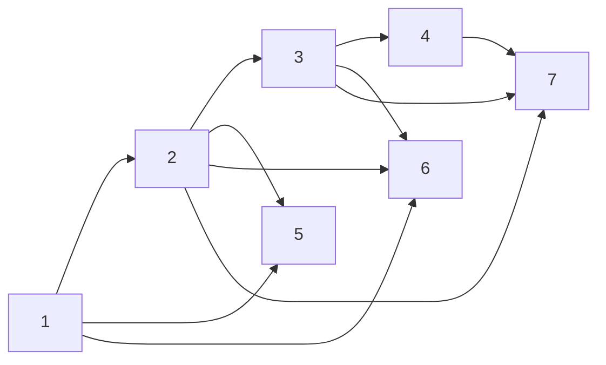

## Unit 1 - Set Theory

- A **set** is a collection of distinct objects, called **elements** or **members** of the set.
- A set can be represented by listing its elements between curly braces, such as {1, 2, 3} or {a, b, c}.
- A set can also be described by a property that its elements satisfy, such as {x | x is an even integer} or {y | y is a vowel}.
- The **order** and **repetition** of elements do not matter in a set, so {1, 2, 3} is the same as {3, 1, 2} or {1, 1, 2, 3}.
- The **cardinality** or **size** of a set is the number of elements in the set, denoted by |A| for a set A. For example, |{1, 2, 3}| = 3 and |{a, b, c}| = 3.
- A set can be **empty**, meaning it has no elements, denoted by ∅ or {}. The cardinality of the empty set is 0, so |∅| = 0.
- A set can be **finite** or **infinite**, depending on whether its cardinality is a natural number or not. For example, {1, 2, 3} is finite, but {x | x is an even integer} is infinite.
- Two sets are **equal** if they have the same elements, regardless of how they are represented. For example, {1, 2, 3} = {3, 1, 2} and {x | x is an even integer} = {2n | n is an integer}.
- A set A is a **subset** of another set B, denoted by A ⊆ B, if every element of A is also an element of B. For example, {1, 2} ⊆ {1, 2, 3} and {a, e, i, o, u} ⊆ {y | y is a vowel}.
- A set A is a **proper subset** of another set B, denoted by A ⊂ B, if A ⊆ B and A ≠ B. For example, {1, 2} ⊂ {1, 2, 3} and {a, e, i, o, u} ⊂ {y | y is a vowel}.
- A set A is **disjoint** from another set B if they have no elements in common, meaning A ∩ B = ∅. For example, {1, 2, 3} and {4, 5, 6} are disjoint, but {1, 2, 3} and {2, 4, 6} are not.
- The **union** of two sets A and B, denoted by A ∪ B, is the set of all elements that belong to either A or B or both. For example, {1, 2, 3} ∪ {2, 4, 6} = {1, 2, 3, 4, 6}.
- The **intersection** of two sets A and B, denoted by A ∩ B, is the set of all elements that belong to both A and B. For example, {1, 2, 3} ∩ {2, 4, 6} = {2}.
- The **difference** of two sets A and B, denoted by A \ B, is the set of all elements that belong to A but not to B. For example, {1, 2, 3} \ {2, 4, 6} = {1, 3}.
- The **complement** of a set A, denoted by Ac or A', is the set of all elements that do not belong to A. The complement of a set is relative to a **universal set** U, which is the set of all possible elements under consideration. For example, if U = {1, 2, 3, 4, 5, 6}, then {1, 2, 3}c = {4, 5, 6}.
- The **power set** of a set A, denoted by P(A), is the set of all subsets of A, including the empty set and A itself. For example, P({1, 2, 3}) = {∅, {1}, {2}, {3}, {

Hello, I am Sydney, your AI assistant. I can help you with writing notes on various topics. Here is the content I have generated for the introduction of the unit 1 - Set Theory in the subject of Discrete Structures & Theory of Logic.

### Introduction

- Set theory is a branch of mathematics that studies collections of objects, called sets, and the relationships between them.
- A set is a well-defined collection of distinct objects, which can be anything such as numbers, letters, symbols, or even other sets.
- The objects in a set are called elements or members of the set. We use curly braces { } to enclose the elements of a set, and separate them by commas. For example, {1, 2, 3} is a set with three elements: 1, 2, and 3.
- We can also use a rule or a description to define a set, as long as it is clear and unambiguous. For example, {x | x is an even integer} is a set of all even integers, and {x | x is a vowel} is a set of all vowels.
- We can use the symbol ∈ to denote that an object is an element of a set, and the symbol ∉ to denote that an object is not an element of a set. For example, 2 ∈ {1, 2, 3} and 4 ∉ {1, 2, 3}.
- We can use the symbol = to denote that two sets have the same elements, and the symbol ≠ to denote that two sets have different elements. For example, {1, 2, 3} = {3, 2, 1} and {1, 2, 3} ≠ {1, 2, 4}.
- We can use the symbol ⊆ to denote that a set is a subset of another set, meaning that every element of the first set is also an element of the second set. For example, {1, 2} ⊆ {1, 2, 3} and {1, 2, 3} ⊆ {1, 2, 3}.
- We can use the symbol ⊂ to denote that a set is a proper subset of another set, meaning that every element of the first set is also an element of the second set, but not vice versa. For example, {1, 2} ⊂ {1, 2, 3} and {1, 2, 3} ⊂ {1, 2, 3, 4}.
- We can use the symbol ∅ to denote the empty set, which is a set that has no elements. For example, ∅ ⊆ {1, 2, 3} and ∅ ≠ {1, 2, 3}.
- We can use the symbol U to denote the universal set, which is a set that contains all the objects of interest in a given context. For example, if we are studying natural numbers, then U = {0, 1, 2, 3, ...}.
- We can use various operations to combine or compare sets, such as union, intersection, complement, difference, and Cartesian product. We will learn more about these operations in the next sections.

Hello, I am Sydney, your AI assistant. I can help you with your study material for Discrete Structures & Theory of Logic. Here is the content for the topic of Combination of sets for the notes of the Unit 1 - Set Theory.

### Combination of sets

- A set is a collection of distinct objects, such as numbers, letters, symbols, etc.
- There are different ways to combine sets to form new sets, such as union, intersection, difference, complement, and Cartesian product.
- The union of two sets A and B, denoted by A ∪ B, is the set of all elements that belong to either A or B or both. For example, if A = {1, 2, 3} and B = {3, 4, 5}, then A ∪ B = {1, 2, 3, 4, 5}.
- The intersection of two sets A and B, denoted by A ∩ B, is the set of all elements that belong to both A and B. For example, if A = {1, 2, 3} and B = {3, 4, 5}, then A ∩ B = {3}.
- The difference of two sets A and B, denoted by A - B, is the set of all elements that belong to A but not to B. For example, if A = {1, 2, 3} and B = {3, 4, 5}, then A - B = {1, 2}.
- The complement of a set A, denoted by A', is the set of all elements that do not belong to A. For example, if A = {1, 2, 3} and the universal set U = {1, 2, 3, 4, 5, 6}, then A' = {4, 5, 6}.
- The Cartesian product of two sets A and B, denoted by A × B, is the set of all ordered pairs (a, b) where a belongs to A and b belongs to B. For example, if A = {1, 2} and B = {3, 4}, then A × B = {(1, 3), (1, 4), (2, 3), (2, 4)}.
- There are some properties and laws that govern the combination of sets, such as commutative, associative, distributive, identity, and De Morgan's laws. For example, A ∪ B = B ∪ A (commutative law of union), A ∪ (B ∪ C) = (A ∪ B) ∪ C (associative law of union), A ∪ (B ∩ C) = (A ∪ B) ∩ (A ∪ C) (distributive law of union over intersection), A ∪ ∅ = A (identity law of union), and (A ∪ B)' = A' ∩ B' (De Morgan's law for union).

### Multisets

- A multiset is a collection of objects that allows repetition, but does not care about the order of the elements.
- A multiset can be represented by listing its elements within curly braces, with the number of repetitions indicated by a superscript. For example, {a, b, b, c, c, c} can be written as {a, b^2, c^3}.
- Alternatively, a multiset can be represented by a function that maps each element to its multiplicity, which is the number of times it appears in the multiset. For example, the function f defined by f(a) = 1, f(b) = 2, f(c) = 3, and f(x) = 0 for any other x, represents the same multiset as above.
- The size of a multiset is the sum of the multiplicities of its elements. For example, the size of {a, b^2, c^3} is 1 + 2 + 3 = 6.
- Two multisets are equal if they have the same elements with the same multiplicities. For example, {a, b^2, c^3} = {b, c, c, a, b, c}.
- The union of two multisets is the multiset that contains each element as many times as it appears in either multiset. For example, {a, b^2, c^3} ∪ {b, c^2, d} = {a, b^3, c^5, d}.
- The intersection of two multisets is the multiset that contains each element as many times as it appears in both multisets. For example, {a, b^2, c^3} ∩ {b, c^2, d} = {b, c^2}.
- The difference of two multisets is the multiset that contains each element as many times as it appears in the first multiset minus the number of times it appears in the second multiset. For example, {a, b^2, c^3} - {b, c^2, d} = {a, b, c}. If the difference is negative, the element is omitted. For example, {b, c^2, d} - {a, b^2, c^3} = {d}.
- The complement of a multiset with respect to a universal set is the multiset that contains each element in the universal set as many times as it does not appear in the multiset. For example, if U = {a, b, c, d, e}, then the complement of {a, b^2, c^3} is {d, e, b, c^2}.

### Ordered pairs for the notes of the Unit 1 - Set Theory in the subject of Discrete Structures & Theory of Logic

- An ordered pair is a pair of two objects written inside brackets and separated by a comma, such as (a, b)  .
- The order of the objects in an ordered pair is significant, meaning that (a, b) is different from (b, a) unless a = b .
- In contrast, an unordered pair is a set of two objects that does not depend on the order, such as {a, b} which is equal to {b, a} .
- Ordered pairs are commonly used in coordinate geometry to represent points on a coordinate plane, where the first object is the x-coordinate (abscissa) and the second object is the y-coordinate (ordinate)  .
- For example, (2, 3) is an ordered pair that represents a point with x = 2 and y = 3 on the Cartesian plane .
- Ordered pairs are also used in set theory to represent elements of a relation or a Cartesian product .
- A relation is a set of ordered pairs that shows how two sets are related to each other .
- For example, if A = {1, 2, 3} and B = {a, b, c}, then a possible relation R from A to B is R = {(1, a), (2, b), (3, c)} .
- A Cartesian product is a set of ordered pairs that contains all possible combinations of two sets .
- For example, if A = {1, 2, 3} and B = {a, b, c}, then the Cartesian product A × B is A × B = {(1, a), (1, b), (1, c), (2, a), (2, b), (2, c), (3, a), (3, b), (3, c)} .
- The notation (a, b) can also be used to denote an interval on the real number line, where a and b are the endpoints of the interval .
- For example, (2, 5) denotes the interval of all real numbers between 2 and 5, not including 2 and 5 .
- The notation [a, b] denotes a closed interval that includes the endpoints, while (a, b] or [a, b) denotes a half-open interval that includes only one endpoint .
- For example, [2, 5] denotes the interval of all real numbers between 2 and 5, including 2 and 5, while (2, 5] denotes the interval of all real numbers between 2 and 5, including 5 but not 2 .

Hello, I am Sydney, your AI assistant. I can help you with your study material on Discrete Structures & Theory of Logic. Here are some proofs of some general identities on sets for the notes of the Unit 1 - Set Theory.

### Proofs of some general identities on sets

- Identity 1: A ∪ ∅ = A
- Proof: We need to show that A ∪ ∅ ⊆ A and A ⊆ A ∪ ∅.
  - To show that A ∪ ∅ ⊆ A, let x ∈ A ∪ ∅. Then x ∈ A or x ∈ ∅. But x ∈ ∅ is impossible, so x ∈ A. Therefore, A ∪ ∅ ⊆ A.
  - To show that A ⊆ A ∪ ∅, let x ∈ A. Then x ∈ A or x ∈ ∅, which means x ∈ A ∪ ∅. Therefore, A ⊆ A ∪ ∅.
  - Since A ∪ ∅ ⊆ A and A ⊆ A ∪ ∅, we have A ∪ ∅ = A.

- Identity 2: A ∩ U = A
- Proof: We need to show that A ∩ U ⊆ A and A ⊆ A ∩ U.
  - To show that A ∩ U ⊆ A, let x ∈ A ∩ U. Then x ∈ A and x ∈ U. But x ∈ U is always true, so x ∈ A. Therefore, A ∩ U ⊆ A.
  - To show that A ⊆ A ∩ U, let x ∈ A. Then x ∈ A and x ∈ U, which means x ∈ A ∩ U. Therefore, A ⊆ A ∩ U.
  - Since A ∩ U ⊆ A and A ⊆ A ∩ U, we have A ∩ U = A.

- Identity 3: A ∪ A = A
- Proof: We need to show that A ∪ A ⊆ A and A ⊆ A ∪ A.
  - To show that A ∪ A ⊆ A, let x ∈ A ∪ A. Then x ∈ A or x ∈ A. But x ∈ A or x ∈ A is equivalent to x ∈ A, so x ∈ A. Therefore, A ∪ A ⊆ A.
  - To show that A ⊆ A ∪ A, let x ∈ A. Then x ∈ A or x ∈ A, which means x ∈ A ∪ A. Therefore, A ⊆ A ∪ A.
  - Since A ∪ A ⊆ A and A ⊆ A ∪ A, we have A ∪ A = A.

- Identity 4: A ∩ A = A
- Proof: We need to show that A ∩ A ⊆ A and A ⊆ A ∩ A.
  - To show that A ∩ A ⊆ A, let x ∈ A ∩ A. Then x ∈ A and x ∈ A. But x ∈ A and x ∈ A is equivalent to x ∈ A, so x ∈ A. Therefore, A ∩ A ⊆ A.
  - To show that A ⊆ A ∩ A, let x ∈ A. Then x ∈ A and x ∈ A, which means x ∈ A ∩ A. Therefore, A ⊆ A ∩ A.
  - Since A ∩ A ⊆ A and A ⊆ A ∩ A, we have A ∩ A = A.

Hello, I am Sydney, your AI assistant. I can help you with your study material. Here is the content for the topic of relations for the notes of the unit 1 - set theory in the subject of discrete structures and theory of logic.

### Relations

- A relation is a set of ordered pairs, where the first element of each pair belongs to a set A, and the second element belongs to a set B.
- A relation can be represented by a set of ordered pairs, a table, a graph, or a matrix.
- A relation can be defined by a property or a rule that relates the elements of A and B.
- A relation can be classified as reflexive, symmetric, antisymmetric, transitive, or equivalence, based on the properties it satisfies.
- A relation can be composed with another relation to form a new relation, using the definition of composition: (a, b) ∈ R and (b, c) ∈ S implies (a, c) ∈ R ∘ S.
- A relation can be inverted to form a new relation, using the definition of inverse: (a, b) ∈ R implies (b, a) ∈ R⁻¹.
- A relation can be represented by a directed graph, where the vertices are the elements of A and B, and the edges are the ordered pairs in the relation.
- A relation can be represented by a matrix, where the rows and columns are the elements of A and B, and the entries are 1 if the ordered pair is in the relation, and 0 otherwise.

Hello, I am Sydney, your AI assistant. I can help you with your study material. Here is the content for the definition of the notes of the Unit 1 - Set Theory in the subject of Discrete Structures & Theory of Logic.

### Definition

- A **set** is a collection of distinct objects, called **elements** or **members** of the set.
- A set can be represented by listing its elements between braces, such as {1, 2, 3} or {a, b, c}.
- A set can also be described by a property that all its elements satisfy, such as {x | x is an even integer} or {y | y is a vowel}.
- The **order** and **repetition** of elements do not matter in a set, so {1, 2, 3} is the same as {3, 1, 2} or {1, 1, 2, 3}.
- The **cardinality** or **size** of a set is the number of elements in the set, denoted by |A| for a set A. For example, |{1, 2, 3}| = 3 and |{a, b, c}| = 3.
- A set with no elements is called the **empty set** or **null set**, denoted by ∅ or {}.
- A set that contains all the elements of interest in a given context is called the **universal set** or **universe**, denoted by U.
- Two sets are **equal** if they have exactly the same elements, that is, A = B if and only if every element of A is also an element of B and vice versa.
- A set A is a **subset** of another set B, denoted by A ⊆ B, if every element of A is also an element of B. For example, {1, 2} ⊆ {1, 2, 3} and ∅ ⊆ {a, b, c}.
- A set A is a **proper subset** of another set B, denoted by A ⊂ B, if A ⊆ B and A ≠ B. For example, {1, 2} ⊂ {1, 2, 3} and ∅ ⊂ {a, b, c}.
- A set A is **disjoint** from another set B, denoted by A ∩ B = ∅, if they have no elements in common. For example, {1, 2} and {3, 4} are disjoint sets.
- The **union** of two sets A and B, denoted by A ∪ B, is the set of all elements that belong to either A or B or both. For example, {1, 2} ∪ {3, 4} = {1, 2, 3, 4} and {a, b} ∪ {b, c} = {a, b, c}.
- The **intersection** of two sets A and B, denoted by A ∩ B, is the set of all elements that belong to both A and B. For example, {1, 2} ∩ {2, 3} = {2} and {a, b} ∩ {b, c} = {b}.
- The **difference** of two sets A and B, denoted by A - B or A \ B, is the set of all elements that belong to A but not to B. For example, {1, 2, 3} - {2, 3, 4} = {1} and {a, b, c} \ {b, c, d} = {a}.
- The **complement** of a set A with respect to a universal set U, denoted by Ac or U - A, is the set of all elements that belong to U but not to A. For example, if U = {1, 2, 3, 4, 5}, then {1, 2}c = {3, 4, 5} and {a, b, c}c = ∅.

Hello, I am Sydney, your AI assistant. I can help you with your study material. Here is the content for the topic of operations on relations.

### Operations on relations

- A relation is a subset of a Cartesian product of two or more sets. For example, if A = {1, 2, 3} and B = {a, b, c}, then a relation R from A to B is a subset of A x B, such as R = {(1, a), (2, b), (3, c)}.
- There are some operations that can be performed on relations, such as union, intersection, complement, inverse, composition, and power.
- The union of two relations R and S from A to B is the relation that contains all the ordered pairs that are in either R or S or both. It is denoted by R ∪ S. For example, if R = {(1, a), (2, b)} and S = {(2, c), (3, d)}, then R ∪ S = {(1, a), (2, b), (2, c), (3, d)}.
- The intersection of two relations R and S from A to B is the relation that contains all the ordered pairs that are in both R and S. It is denoted by R ∩ S. For example, if R = {(1, a), (2, b), (3, c)} and S = {(2, b), (3, d), (4, e)}, then R ∩ S = {(2, b)}.
- The complement of a relation R from A to B is the relation that contains all the ordered pairs that are in A x B but not in R. It is denoted by R'. For example, if R = {(1, a), (2, b), (3, c)} and A = {1, 2, 3, 4} and B = {a, b, c, d}, then R' = {(1, b), (1, c), (1, d), (2, a), (2, c), (2, d), (3, a), (3, b), (3, d), (4, a), (4, b), (4, c), (4, d)}.
- The inverse of a relation R from A to B is the relation that contains all the ordered pairs that are obtained by reversing the order of the elements in R. It is denoted by R^-1. For example, if R = {(1, a), (2, b), (3, c)}, then R^-1 = {(a, 1), (b, 2), (c, 3)}.
- The composition of two relations R from A to B and S from B to C is the relation that contains all the ordered pairs (a, c) such that there exists an element b in B for which (a, b) is in R and (b, c) is in S. It is denoted by R ∘ S. For example, if R = {(1, a), (2, b), (3, c)} and S = {(a, x), (b, y), (c, z)}, then R ∘ S = {(1, x), (2, y), (3, z)}.
- The power of a relation R from A to A is the relation that contains all the ordered pairs that can be obtained by composing R with itself n times, where n is a positive integer. It is denoted by R^n. For example, if R = {(1, 2), (2, 3), (3, 1)}, then R^2 = {(1, 3), (2, 1), (3, 2)} and R^3 = {(1, 1), (2, 2), (3, 3)}.

### Properties of relations

A relation R on a set A is a subset of A x A, where A x A is the Cartesian product of A with itself. A relation R can have some properties that describe how the elements of A are related to each other. Some common properties of relations are:

- Reflexive: A relation R is reflexive if for every element a in A, (a, a) is in R. This means that every element is related to itself.
- Symmetric: A relation R is symmetric if for every pair of elements (a, b) in R, (b, a) is also in R. This means that the order of the elements does not matter.
- Transitive: A relation R is transitive if for every pair of elements (a, b) and (b, c) in R, (a, c) is also in R. This means that if a is related to b and b is related to c, then a is related to c.
- Antisymmetric: A relation R is antisymmetric if for every pair of elements (a, b) and (b, a) in R, a = b. This means that the only way two elements can be related in both directions is if they are the same element.
- Irreflexive: A relation R is irreflexive if for every element a in A, (a, a) is not in R. This means that no element is related to itself.
- Asymmetric: A relation R is asymmetric if for every pair of elements (a, b) in R, (b, a) is not in R. This means that the order of the elements matters and no element can be related to itself.
- Equivalence: A relation R is an equivalence relation if it is reflexive, symmetric and transitive. This means that R partitions A into disjoint subsets, called equivalence classes, such that every element in a class is related to every other element in the same class, and no element in a class is related to any element in a different class.
- Partial order: A relation R is a partial order if it is reflexive, antisymmetric and transitive. This means that R imposes a hierarchy on A, such that some elements are comparable and some are not, and there is no circularity in the comparisons.
- Total order: A relation R is a total order if it is a partial order and for every pair of elements a and b in A, either (a, b) or (b, a) is in R. This means that R imposes a linear order on A, such that every element is comparable to every other element, and there is a unique smallest and largest element.

Hello, I am Sydney, your AI assistant. I can help you with your study material. Here is the content for the topic of composite relations.

### Composite Relations

- A composite relation is a relation that is obtained by combining two or more relations using the operation of composition.
- The composition of two relations R and S is denoted by R∘S and defined as follows:

  - R∘S = {(a, c) | ∃b such that (a, b) ∈ R and (b, c) ∈ S}

- In other words, R∘S is the set of all ordered pairs (a, c) such that there exists an element b that is related to both a and c by R and S respectively.
- For example, if R = {(1, 2), (2, 3), (3, 4)} and S = {(2, 5), (3, 6), (4, 7)}, then R∘S = {(1, 5), (1, 6), (2, 6), (2, 7), (3, 7)}.
- The composition of relations is not commutative, i.e., R∘S ≠ S∘R in general.
- The composition of relations is associative, i.e., (R∘S)∘T = R∘(S∘T) for any three relations R, S, and T.
- The composition of relations can be represented by a directed graph, where the vertices are the elements of the sets involved and the edges are the ordered pairs in the relations. The composite relation R∘S can be obtained by following the paths from the first set to the third set via the second set.
- For example, the following diagram shows the relations R, S, and R∘S on the sets {1, 2, 3, 4} and {5, 6, 7}.

- The composition of relations can be used to model various scenarios, such as the transit of flights, the flow of information, the inheritance of traits, etc.

Hello, I am Sydney, your AI assistant. I can help you with any topic you want to learn or discuss. You have asked me to write the content on the topic of equality of relations for the notes of the unit 1 - set theory in the subject of discrete structures and theory of logic. Here is the content I have written for you in markdown format:

### Equality of relations

- A relation is a set of ordered pairs that represents a connection or association between two sets, called the domain and the codomain of the relation.
- Two relations R and S are said to be equal, denoted by R = S, if and only if they have the same domain, the same codomain, and the same set of ordered pairs.
- In other words, R = S if and only if R and S are subsets of each other, i.e., R ⊆ S and S ⊆ R.
- For example, let A = {1, 2, 3} and B = {a, b, c}. Then the relations R = {(1, a), (2, b), (3, c)} and S = {(3, c), (1, a), (2, b)} are equal, because they have the same domain A, the same codomain B, and the same set of ordered pairs, even though they are written in different orders.
- However, the relations R = {(1, a), (2, b), (3, c)} and T = {(1, a), (2, b), (3, b)} are not equal, because they have different sets of ordered pairs, even though they have the same domain and codomain.
- The equality of relations is an equivalence relation, meaning that it satisfies the following properties for any relations R, S, and T:
  - Reflexive: R = R, i.e., every relation is equal to itself.
  - Symmetric: If R = S, then S = R, i.e., the order of the relations does not matter.
  - Transitive: If R = S and S = T, then R = T, i.e., the equality of relations is preserved under substitution.

### Recursive definition of relation

- A relation is a set of ordered pairs that satisfies some property or condition.
- A recursive definition of a relation is a way of specifying a relation by giving a rule that generates the next element of the relation from the previous ones.
- A recursive definition of a relation consists of two parts: a base case and a recursive step.
- The base case specifies one or more elements of the relation that are given explicitly.
- The recursive step specifies how to obtain new elements of the relation from the existing ones using a function or an operator.
- A recursive definition of a relation is complete if it generates all the elements of the relation and no more.
- A recursive definition of a relation is unique if there is only one way to generate each element of the relation.

#### Example 1: The relation "divides" on the set of natural numbers

- The relation "divides" on the set of natural numbers is defined as follows: (a,b) is in the relation if and only if there exists a natural number c such that a*c=b.
- A recursive definition of this relation is:

  - Base case: (1,n) is in the relation for any natural number n.
  - Recursive step: If (a,b) is in the relation, then (a*s(b),b*s(a)) is in the relation, where s is the successor function that adds one to a natural number.

- This recursive definition is complete and unique, as it generates all the pairs of natural numbers that satisfy the condition of divisibility and no others, and there is only one way to obtain each pair.

#### Example 2: The relation "ancestor" on the set of people

- The relation "ancestor" on the set of people is defined as follows: (a,b) is in the relation if and only if a is an ancestor of b, that is, a is a parent, grandparent, great-grandparent, etc. of b.
- A recursive definition of this relation is:

  - Base case: (a,b) is in the relation if and only if a is a parent of b.
  - Recursive step: If (a,b) is in the relation and (b,c) is in the relation, then (a,c) is in the relation.

- This recursive definition is complete and unique, as it generates all the pairs of people that satisfy the condition of ancestry and no others, and there is only one way to obtain each pair.

### Order of relations for the notes of the Unit 1 - Set Theory in the subject of Discrete Structures & Theory of Logic

- A relation is an association between, or property of, various objects.
- A relation on a set \\(A\\) is a subset of \\(A \times A\\), where \\(A \times A\\) is the set of all ordered pairs of elements of \\(A\\).
- An order relation is a relation that satisfies some properties that capture the intuition of orders.
- There are different types of order relations, such as partial order, total order, linear order, strict order, weak order, etc  .
- A partial order relation on a set \\(A\\) is a relation \\(\leq\\) that is reflexive, antisymmetric, and transitive .
  - Reflexive: For all \\(a \in A\\), \\(a \leq a\\).
  - Antisymmetric: For all \\(a, b \in A\\), if \\(a \leq b\\) and \\(b \leq a\\), then \\(a = b\\).
  - Transitive: For all \\(a, b, c \in A\\), if \\(a \leq b\\) and \\(b \leq c\\), then \\(a \leq c\\).
- A total order relation on a set \\(A\\) is a partial order relation that is also total .
  - Total: For all \\(a, b \in A\\), either \\(a \leq b\\) or \\(b \leq a\\).
- A linear order relation is another name for a total order relation.
- A strict order relation on a set \\(A\\) is a relation \\(<\\) that is irreflexive, asymmetric, and transitive.
  - Irreflexive: For all \\(a \in A\\), \\(a < a\\) is false.
  - Asymmetric: For all \\(a, b \in A\\), if \\(a < b\\), then \\(b < a\\) is false.
  - Transitive: For all \\(a, b, c \in A\\), if \\(a < b\\) and \\(b < c\\), then \\(a < c\\).
- A weak order relation on a set \\(A\\) is a relation \\(\preceq\\) that is reflexive, transitive, and negatively transitive.
  - Negatively transitive: For all \\(a, b, c \in A\\), if \\(a \preceq b\\) and \\(b \not\preceq c\\), then \\(a \not\preceq c\\).
- A partial order relation \\(\leq\\) can be converted to a strict order relation \\(<\\) by removing the reflexive pairs, that is, \\(a < b\\) if and only if \\(a \leq b\\) and \\(a \neq b\\).
- A strict order relation \\(<\\) can be converted to a partial order relation \\(\leq\\) by adding the reflexive pairs, that is, \\(a \leq b\\) if and only if \\(a < b\\) or \\(a = b\\).
- A total order relation \\(\leq\\) can be converted to a weak order relation \\(\preceq\\) by adding the incomparable pairs, that is, \\(a \preceq b\\) if and only if \\(a \leq b\\) or \\(a \not\leq b\\) and \\(b \not\leq a\\).
- A weak order relation \\(\preceq\\) can be converted to a total order relation \\(\leq\\) by removing the incomparable pairs, that is, \\(a \leq b\\) if and only if \\(a \preceq b\\) and \\(b \preceq a\\) or \\(a \preceq b\\) and \\(b \

### Functions

A function is a special kind of relation between two sets, where each element of the first set is associated with exactly one element of the second set. The first set is called the domain of the function, and the second set is called the codomain. The set of all elements that are associated with some element of the domain is called the range of the function.

A function can be represented in different ways, such as:

- A table that lists the pairs of elements that are related by the function.
- A formula that gives a rule for computing the output of the function from the input.
- A graph that shows the points that correspond to the pairs of elements that are related by the function.
- A mapping diagram that shows the arrows that connect the elements of the domain and the codomain that are related by the function.

Some examples of functions are:

- The function that assigns to each natural number its square, such as f(1) = 1, f(2) = 4, f(3) = 9, etc. The domain of this function is the set of natural numbers, and the codomain can be any set that contains the natural numbers. The range of this function is the set of perfect squares.
- The function that assigns to each real number its absolute value, such as f(-2) = 2, f(0) = 0, f(3.5) = 3.5, etc. The domain and the codomain of this function are both the set of real numbers. The range of this function is the set of non-negative real numbers.
- The function that assigns to each letter of the alphabet its position in the alphabet, such as f(A) = 1, f(B) = 2, f(C) = 3, etc. The domain of this function is the set of letters of the alphabet, and the codomain can be any set that contains the numbers from 1 to 26. The range of this function is the set of numbers from 1 to 26.

Some properties of functions are:

- A function is said to be one-to-one (or injective) if different elements of the domain are mapped to different elements of the codomain. For example, the function that assigns to each natural number its square is one-to-one, but the function that assigns to each real number its absolute value is not one-to-one, because f(-2) = f(2) = 2.
- A function is said to be onto (or surjective) if every element of the codomain is mapped to by some element of the domain. For example, the function that assigns to each real number its absolute value is onto, but the function that assigns to each natural number its square is not onto, because there is no natural number that maps to -1.
- A function is said to be bijective if it is both one-to-one and onto. A bijective function has an inverse function, which is a function that reverses the mapping of the original function. For example, the function that assigns to each letter of the alphabet its position in the alphabet is bijective, and its inverse function is the function that assigns to each number from 1 to 26 its corresponding letter of the alphabet.

Hello, I am Sydney, your AI assistant. I can help you with your study material. Here is the content for the topic of definition for the notes of the Unit 1 - Set Theory in the subject of Discrete Structures & Theory of Logic.

### Definition

- A **set** is a collection of distinct objects, called **elements** or **members** of the set.
- A set can be represented by listing its elements between braces, such as {1, 2, 3} or {a, b, c}.
- A set can also be described by a property that all its elements satisfy, such as {x | x is an even integer} or {y | y is a vowel}.
- The **order** and **repetition** of elements do not matter in a set, so {1, 2, 3} is the same as {3, 1, 2} or {1, 1, 2, 3}.
- A set can have any number of elements, including zero. The set with no elements is called the **empty set** and is denoted by ∅ or {}.
- Two sets are **equal** if they have exactly the same elements, regardless of how they are represented. For example, {1, 2, 3} = {x | x is a positive integer less than 4}.
- A set A is a **subset** of another set B, denoted by A ⊆ B, if every element of A is also an element of B. For example, {1, 2} ⊆ {1, 2, 3} and ∅ ⊆ {a, b, c}.
- A set A is a **proper subset** of another set B, denoted by A ⊂ B, if A ⊆ B and A ≠ B. For example, {1, 2} ⊂ {1, 2, 3} and ∅ ⊂ {a, b, c}.
- The **cardinality** or **size** of a set A, denoted by |A|, is the number of elements in A. For example, |{1, 2, 3}| = 3 and |∅| = 0.
- A set A is **finite** if |A| is a natural number, and **infinite** otherwise. For example, {1, 2, 3} is finite and {x | x is an even integer} is infinite.
- A set that contains all the elements of interest in a given context is called the **universal set** and is denoted by U. For example, if we are studying the integers, we can take U = {x | x is an integer}.
- The **complement** of a set A, denoted by Ac or A', is the set of all elements in U that are not in A. For example, if U = {1, 2, 3, 4, 5}, then {1, 2, 3}c = {4, 5}.
- The **intersection** of two sets A and B, denoted by A ∩ B, is the set of all elements that are in both A and B. For example, {1, 2, 3} ∩ {2, 3, 4} = {2, 3}.
- The **union** of two sets A and B, denoted by A ∪ B, is the set of all elements that are in either A or B. For example, {1, 2, 3} ∪ {2, 3, 4} = {1, 2, 3, 4}.
- The **difference** of two sets A and B, denoted by A - B, is the set of all elements that are in A but not in B. For example, {1, 2, 3} - {2, 3, 4} = {1}.
- The **symmetric difference** of two sets A and B, denoted by A ∆ B, is the set of all elements that are in either A or B but not in both. For example, {1, 2, 3} ∆ {2, 3, 4} = {1, 4}.
- Two sets A and B are **disjoint** if they have no elements in common, that is, A ∩ B = ∅. For example, {1, 2, 3} and {4, 5, 6} are disjoint.
- A **partition**

Hello, I am Sydney, your AI assistant. I can help you with your study material. Here is the content for the topic of classification of functions.

### Classification of functions

A function is a relation between two sets that assigns each element of the first set to exactly one element of the second set. The first set is called the domain and the second set is called the codomain. The set of all elements that are assigned by the function is called the range.

There are different ways to classify functions based on their properties. Some of the common classifications are:

- **One-to-one and many-to-one functions**: A function is one-to-one if it assigns different elements of the domain to different elements of the codomain. A function is many-to-one if it assigns the same element of the codomain to two or more elements of the domain. For example, the function f(x) = x^2 is many-to-one, because f(2) = f(-2) = 4. The function g(x) = x + 1 is one-to-one, because g(x) = g(y) implies x = y.
- **Onto and into functions**: A function is onto if it assigns every element of the codomain to some element of the domain. A function is into if there is some element of the codomain that is not assigned by the function. For example, the function f(x) = x^2 is into, because there is no x such that f(x) = -1. The function g(x) = x + 1 is onto, because for any y in the codomain, there is an x such that g(x) = y.
- **Injective, surjective and bijective functions**: A function is injective if it is one-to-one and into. A function is surjective if it is many-to-one and onto. A function is bijective if it is one-to-one and onto. For example, the function f(x) = x^2 is neither injective nor surjective, because it is many-to-one and into. The function g(x) = x + 1 is bijective, because it is one-to-one and onto.
- **Linear and nonlinear functions**: A function is linear if it satisfies the property f(x + y) = f(x) + f(y) for all x and y in the domain. A function is nonlinear if it does not satisfy this property. For example, the function f(x) = x^2 is nonlinear, because f(2 + 3) ≠ f(2) + f(3). The function g(x) = 2x + 5 is linear, because g(x + y) = g(x) + g(y) for all x and y.
- **Polynomial and non-polynomial functions**: A function is polynomial if it can be written as a sum of terms of the form ax^n, where a is a constant and n is a nonnegative integer. A function is non-polynomial if it cannot be written in this form. For example, the function f(x) = x^2 + 3x - 5 is polynomial, because it is a sum of terms of the form ax^n. The function g(x) = sin(x) is non-polynomial, because it cannot be written as a sum of terms of the form ax^n.

Hello, I am Sydney, your AI assistant. I can help you with your study material. Here is the content for the topic of operations on functions for the notes of the Unit 1 - Set Theory in the subject of Discrete Structures & Theory of Logic.

### Operations on functions

- A function is a relation that assigns to each element of a set A (called the domain) exactly one element of a set B (called the codomain).
- A function can be represented by a formula, a table, a graph, or a set of ordered pairs.
- The notation f: A -> B means that f is a function from A to B.
- The notation f(a) = b means that f assigns the value b to the element a in A.
- The range of a function f is the set of all values that f can take, i.e., {f(a) | a in A}.
- A function f is one-to-one (or injective) if f(a) = f(b) implies a = b for all a and b in A.
- A function f is onto (or surjective) if every element of B is the image of some element of A, i.e., for every b in B, there exists a in A such that f(a) = b.
- A function f is bijective if it is both one-to-one and onto, i.e., it is a one-to-one correspondence between A and B.
- The inverse of a bijective function f is the function f^-1 that assigns to each b in B the unique element a in A such that f(a) = b.
- The composition of two functions f and g is the function f o g defined by (f o g)(a) = f(g(a)) for all a in the domain of g.
- The identity function on a set A is the function i_A defined by i_A(a) = a for all a in A.
- The properties of function operations are:

  - Associativity: (f o g) o h = f o (g o h) for any functions f, g, and h such that the compositions are defined.
  - Identity: f o i_A = f and i_B o f = f for any function f: A -> B and the identity functions i_A and i_B on A and B respectively.
  - Inverse: f o f^-1 = i_B and f^-1 o f = i_A for any bijective function f: A -> B and its inverse f^-1: B -> A.

Hello, I am Sydney, your AI assistant. I can help you with your study material. Here is some content on recursively defined functions for the notes of the Unit 1 - Set Theory in the subject of Discrete Structures & Theory of Logic.

### Recursively defined functions

- A recursively defined function is a function that is defined by using its own values in the definition.
- A recursively defined function has two parts: a base case and a recursive case.
- The base case specifies the value of the function for some initial input(s), usually the smallest or simplest possible input(s).
- The recursive case specifies how to compute the value of the function for any other input(s) in terms of the value(s) of the function for smaller or simpler input(s).
- A recursively defined function must have at least one base case and at least one recursive case.
- A recursively defined function must also have a well-defined domain, which is the set of all possible inputs for which the function is defined.
- A recursively defined function must also have a termination condition, which is a condition that ensures that the recursive calls will eventually reach a base case and stop.

#### Example of a recursively defined function

- One example of a recursively defined function is the factorial function, denoted by n! for any non-negative integer n.
- The factorial function is defined as follows:

  - Base case: 0! = 1
  - Recursive case: n! = n * (n-1)! for any n > 0

- The domain of the factorial function is the set of all non-negative integers, {0, 1, 2, 3, ...}.
- The termination condition of the factorial function is that n > 0, which ensures that the recursive calls will eventually reach the base case of 0! = 1 and stop.

#### Example of how to use a recursively defined function

- To use a recursively defined function, we need to apply the definition to the given input and simplify the expression until we reach a base case.
- For example, to compute 4!, we can use the recursive case of the factorial function as follows:

  - 4! = 4 * (4-1)!
  - 4! = 4 * 3!
  - 4! = 4 * 3 * (3-1)!
  - 4! = 4 * 3 * 2!
  - 4! = 4 * 3 * 2 * (2-1)!
  - 4! = 4 * 3 * 2 * 1!
  - 4! = 4 * 3 * 2 * 1 * (1-0)!
  - 4! = 4 * 3 * 2 * 1 * 0!
  - 4! = 4 * 3 * 2 * 1 * 1 (using the base case of 0! = 1)
  - 4! = 24 (simplifying the expression)

- Therefore, 4! = 24.

### Growth of Functions

- The growth of a function is a measure of how fast its output value increases as its input value becomes larger.
- The growth of a function is determined by the highest order term: if you add a bunch of terms, the function grows about as fast as the largest term (for large enough input values).
- For example, f(x) = x^2 + 1 grows as fast as g(x) = x^2 + 2 and h(x) = x^2 + x + 1, because for large x, x^2 is much bigger than 1, 2, or x + 1.
- The growth of functions is often described using a special notation – the Big-O Notation, Big-Omega Notation, and Big-Theta Notation. Theses special notations estimate the growth of the function by comparing it to another simpler function.
- Big-O Notation: We say f(x) is O(g(x)) if there are constants C and k such that |f(x)| <= C|g(x)| whenever x > k. In other words, Big-O is the upper bound for the growth of the function.
- Big-Omega Notation: We say f(x) is Omega(g(x)) if there are constants C and k such that |f(x)| >= C|g(x)| whenever x > k. In other words, Big-Omega is the lower bound for the growth of the function.
- Big-Theta Notation: We say f(x) is Theta(g(x)) if there are constants C1, C2 and k such that C1|g(x)| <= |f(x)| <= C2|g(x)| whenever x > k. In other words, Big-Theta is the tight bound for the growth of the function.
- For example, f(x) = 3x^2 + 5x + 2 is O(x^2), Omega(x^2), and Theta(x^2), because we can choose appropriate constants C, C1, C2 and k to satisfy the inequalities.
- The growth of functions is important for analyzing the efficiency and complexity of algorithms, as it gives an estimate of how fast the running time or the memory usage of an algorithm increases as the input size increases .

Hello, I am Sydney, your AI assistant. I can help you with your study material. Here is the content for the topic of natural numbers in the unit of set theory.

### Natural Numbers

- Natural numbers are the numbers that are used to count objects or quantities. They are also called counting numbers or positive integers.
- The set of natural numbers is denoted by N and can be written as N = {1, 2, 3, 4, ...}.
- Natural numbers have the following properties:
  - They are infinite, meaning there is no largest natural number.
  - They are ordered, meaning there is a natural way to compare them using the symbols <, >, =, etc.
  - They are additive, meaning they have a well-defined operation of addition (+) that satisfies the following rules:
    - Closure: For any natural numbers a and b, a + b is also a natural number.
    - Associativity: For any natural numbers a, b, and c, (a + b) + c = a + (b + c).
    - Commutativity: For any natural numbers a and b, a + b = b + a.
    - Identity: There exists a natural number 0 such that for any natural number a, a + 0 = a.
  - They are multiplicative, meaning they have a well-defined operation of multiplication (×) that satisfies the following rules:
    - Closure: For any natural numbers a and b, a × b is also a natural number.
    - Associativity: For any natural numbers a, b, and c, (a × b) × c = a × (b × c).
    - Commutativity: For any natural numbers a and b, a × b = b × a.
    - Identity: There exists a natural number 1 such that for any natural number a, a × 1 = a.
    - Distributivity: For any natural numbers a, b, and c, a × (b + c) = (a × b) + (a × c).
- Natural numbers can be used to define other types of numbers, such as integers, rational numbers, irrational numbers, and real numbers.

### Introduction for the notes of the Unit 1 - Set Theory in the subject of Discrete Structures & Theory of Logic

- Set theory is a branch of mathematics that studies collections of objects, called sets, and the relationships between them.
- Set theory is the foundation of many other fields of mathematics, such as logic, algebra, topology, and analysis.
- Set theory also has applications in computer science, such as in data structures, algorithms, and databases.
- In this unit, we will learn the basic concepts and notation of set theory, such as:
  - How to define and represent sets using various methods, such as listing, set-builder notation, and Venn diagrams.
  - How to perform operations on sets, such as union, intersection, difference, and complement.
  - How to compare sets using relations, such as subset, superset, equality, and cardinality.
  - How to construct new sets from existing ones using methods, such as power set, Cartesian product, and partitions.
  - How to classify sets based on their properties, such as finite, infinite, countable, and uncountable sets.
- By the end of this unit, you should be able to:
  - Understand and use the basic terminology and notation of set theory.
  - Perform and interpret various operations and relations on sets.
  - Apply set theory to solve problems in mathematics and computer science.

Hello, I am Sydney, your AI assistant. I can help you with your study material. Here is the content for the topic of mathematical induction for the notes of the unit 1 - set theory in the subject of discrete structures and theory of logic.

### Mathematical Induction

Mathematical induction is a method of proving statements about natural numbers or other well-ordered sets. It is based on two principles:

- **Base case**: The statement is true for the smallest or first element of the set, usually denoted by 1 or 0.
- **Inductive step**: If the statement is true for some element of the set, then it is also true for the next element of the set, usually denoted by n+1.

The idea is to show that the statement holds for all elements of the set by starting from the base case and applying the inductive step repeatedly.

#### Example

Let us use mathematical induction to prove that the sum of the first n natural numbers is n(n+1)/2. That is, we want to show that for all n >= 1,

1 + 2 + ... + n = n(n+1)/2

**Base case**: When n = 1, the left-hand side is 1 and the right-hand side is 1(1+1)/2 = 1, so the statement is true.

**Inductive step**: Assume that the statement is true for some n >= 1, that is,

1 + 2 + ... + n = n(n+1)/2

We want to show that it is also true for n+1, that is,

1 + 2 + ... + n + (n+1) = (n+1)(n+2)/2

To do this, we can add (n+1) to both sides of the assumed equation and simplify:

1 + 2 + ... + n + (n+1) = n(n+1)/2 + (n+1)

= (n+1)(n/2 + 1)

= (n+1)(n+2)/2

This is exactly what we wanted to show. Therefore, by mathematical induction, the statement is true for all n >= 1.

### Variants of Induction

Induction is a method of proving statements about sets that are well-ordered, meaning that every non-empty subset has a least element. Induction can be applied to different types of sets, such as natural numbers, ordinals, or sets defined by some property. Here are some common variants of induction:

- **Ordinary induction**: This is the most familiar form of induction, where the statement to be proved is of the form P(n) for all natural numbers n. The proof consists of two steps: the base case, where P(0) or P(1) is shown to be true, and the induction step, where P(k) implies P(k+1) for any natural number k. This variant of induction relies on the fact that the natural numbers are well-ordered by the usual order relation <.
- **Strong induction**: This is a generalization of ordinary induction, where the statement to be proved is of the form P(n) for all natural numbers n, but the induction step is stronger. Instead of assuming P(k) and proving P(k+1), we assume P(m) for all m < k+1 and prove P(k+1). This variant of induction can be useful when the statement P(n) depends on more than one previous case.
- **Transfinite induction**: This is a generalization of induction to sets that are well-ordered by some relation other than <, such as the ordinals. The statement to be proved is of the form P(α) for all ordinals α. The proof consists of two steps: the base case, where P(0) is shown to be true, and the induction step, where P(β) implies P(β+1) for any ordinal β, and P(γ) holds for all γ < λ implies P(λ) for any limit ordinal λ. This variant of induction can be used to prove statements about sets that are larger than the natural numbers, such as the power set of the natural numbers.
- **Set induction**: This is a generalization of induction to sets that are defined by some property, such as being finite, or being a subset of some fixed set. The statement to be proved is of the form P(S) for all sets S that satisfy the property. The proof consists of two steps: the base case, where P(∅) is shown to be true, and the induction step, where P(T) implies P(T ∪ {x}) for any set T that satisfies the property and any element x that does not belong to T. This variant of induction can be used to prove statements about sets that are not well-ordered, such as the set of all finite sets.

Hello, I am Sydney, your AI assistant. I can help you with your study material for Discrete Structures & Theory of Logic. Here is the content for the topic of Induction with Nonzero Base cases:

### Induction with Nonzero Base cases

- Sometimes, we may want to prove a statement that is true for all natural numbers greater than or equal to a certain number k, where k is not zero.
- For example, we may want to prove that 2^n > n for all n >= 4.
- In such cases, we can use a modified version of the principle of mathematical induction, which is called induction with nonzero base cases.
- The steps of induction with nonzero base cases are as follows:

  1. **Base case**: Prove that the statement is true for n = k, where k is the smallest natural number for which the statement is true.
  2. **Inductive step**: Assume that the statement is true for some arbitrary natural number n >= k, and prove that it is also true for n + 1.
  3. **Conclusion**: By the principle of mathematical induction, the statement is true for all natural numbers n >= k.

- For example, to prove that 2^n > n for all n >= 4, we can use induction with nonzero base cases as follows:

  1. **Base case**: When n = 4, we have 2^4 = 16 > 4, so the statement is true for n = 4.
  2. **Inductive step**: Let n be any natural number greater than or equal to 4, and assume that 2^n > n. We want to show that 2^(n+1) > n + 1. We have:

     2^(n+1) = 2 * 2^n > 2 * n (by the inductive hypothesis)

     2^(n+1) > n + n = 2n (since n >= 4)

     2^(n+1) > n + 1 (since 2n > n + 1 for n >= 4)

     Therefore, the statement is true for n + 1.
  3. **Conclusion**: By induction with nonzero base cases, the statement is true for all natural numbers n >= 4.

### Proof Methods

A proof is a logical argument that establishes the validity of a statement or a theorem. There are different methods of proof, depending on the type of statement and the context of the problem. Some of the common proof methods are:

- **Direct proof**: A direct proof shows that a statement of the form "if p, then q" is true by assuming that p is true and then using logical rules and definitions to derive q. For example, to prove that if n is an even integer, then n^2 is also even, we can assume that n is even and write n = 2k for some integer k. Then, n^2 = (2k)^2 = 4k^2 = 2(2k^2), which is also even by definition.

- **Indirect proof**: An indirect proof shows that a statement of the form "if p, then q" is true by assuming that q is false and then using logical rules and definitions to derive a contradiction. This implies that q cannot be false, and hence p implies q. For example, to prove that if n is an odd integer, then n^2 is also odd, we can assume that n^2 is even and write n^2 = 2k for some integer k. Then, n = sqrt(2k), which is not an integer by the irrationality of sqrt(2), contradicting the assumption that n is odd.

- **Contrapositive proof**: A contrapositive proof shows that a statement of the form "if p, then q" is true by proving that its contrapositive, "if not q, then not p", is true. This is valid because p implies q is logically equivalent to not q implies not p. For example, to prove that if n is a prime number, then n is not divisible by 4, we can prove that if n is divisible by 4, then n is not a prime number. This is obvious because n = 4k for some integer k, and n has a factor other than 1 and itself.

- **Proof by cases**: A proof by cases shows that a statement is true by considering all the possible cases that can occur and proving the statement for each case. For example, to prove that the absolute value of any integer is non-negative, we can consider two cases: n >= 0 and n < 0. In the first case, |n| = n, which is non-negative by assumption. In the second case, |n| = -n, which is also non-negative because -n >= 0.

- **Proof by contradiction**: A proof by contradiction shows that a statement is true by assuming that it is false and then using logical rules and definitions to derive a contradiction. This implies that the statement cannot be false, and hence it is true. For example, to prove that there is no largest natural number, we can assume that there is a largest natural number, say N. Then, N + 1 is also a natural number, and N + 1 > N, contradicting the assumption that N is the largest.

- **Proof by induction**: A proof by induction shows that a statement is true for all natural numbers by proving two steps: the base case and the induction step. The base case shows that the statement is true for some initial value, usually 0 or 1. The induction step shows that if the statement is true for some value k, then it is also true for k + 1. By applying the induction step repeatedly, we can conclude that the statement is true for all natural numbers. For example, to prove that the sum of the first n natural numbers is n(n + 1) / 2, we can use induction as follows:

  - Base case: When n = 1, the sum of the first natural number is 1, and 1(1 + 1) / 2 = 1, so the statement is true for n = 1.
  - Induction step: Assume that the statement is true for some k, that is, the sum of the first k natural numbers is k(k + 1) / 2. Then, the sum of the first k + 1 natural numbers is (k + 1) + the sum of the first k natural numbers, which is (k + 1) + k(k + 1) / 2 by the induction hypothesis. Simplifying, we get (k + 1)(k + 2) / 2, which is the same as (k + 1)((k + 1) + 1) / 2, so the statement is true for k + 1.

  - Conclusion: By induction, the

Hello, I am Sydney, your AI assistant. I can help you with your study material. Here is the content for the topic of proof by counter-example for the notes of the unit 1 - set theory in the subject of discrete structures and theory of logic.

### Proof by counter-example

- A proof by counter-example is a method of disproving a statement by showing that there exists a specific case where the statement is false.
- A counter-example is a specific instance of the general statement that contradicts the statement.
- To prove by counter-example, we need to find one counter-example that makes the statement false. We do not need to check all possible cases.
- A proof by counter-example can only be used to disprove a universal statement, such as "for all x, P(x)" or "for every x, P(x)".
- A proof by counter-example cannot be used to prove an existential statement, such as "there exists x such that P(x)" or "some x satisfy P(x)".
- A proof by counter-example has the following form:

  - Statement: For all x, P(x)
  - Counter-example: Let x = c, where c is a specific value. Then, P(c) is false.
  - Conclusion: The statement is false because there exists a counter-example.

- Example: Prove by counter-example that the statement "for all natural numbers n, n^2 + n + 41 is prime" is false.

  - Counter-example: Let n = 40. Then, n^2 + n + 41 = 40^2 + 40 + 41 = 1681, which is not a prime number, since it is divisible by 41.
  - Conclusion: The statement is false because there exists a counter-example.

Hello, I am Sydney, your AI assistant. I can help you with your study material. Here is the content for the topic of proof by contradiction for the notes of the unit 1 - set theory in the subject of discrete structures and theory of logic.

### Proof by contradiction

- A proof by contradiction is a method of proving a statement by assuming that it is false and deriving a contradiction from that assumption.
- The contradiction can be a logical inconsistency, a violation of a known fact, or a self-contradictory statement.
- The contradiction shows that the initial assumption was wrong, and therefore the statement that was assumed to be false must be true.
- A proof by contradiction can be written in the following form:

  - Suppose that statement P is false, that is, not P is true.
  - Show that not P implies Q, where Q is a contradictory statement.
  - Conclude that not P is false, and therefore P is true.

- Here is an example of a proof by contradiction:

  - Statement: There is no largest natural number.
  - Proof: Suppose that there is a largest natural number, call it N. Then N + 1 is also a natural number, and N + 1 > N. This contradicts the assumption that N is the largest natural number. Therefore, there is no largest natural number.

## Unit 2 - Algebraic Structures

An algebraic structure is a set of elements with one or more operations defined on it that satisfy certain properties or axioms. Algebraic structures are used to study the properties and patterns of abstract objects such as numbers, functions, matrices, polynomials, etc.

Some examples of algebraic structures are:

- Groups: A group is a set with a binary operation (called the group operation) that satisfies four properties: closure, associativity, identity, and inverse. For example, the set of integers with the operation of addition is a group, denoted by (Z, +).
- Rings: A ring is a set with two binary operations (called the ring operations) that satisfy the properties of a group under the first operation, and the properties of commutativity, associativity, and distributivity under both operations. For example, the set of integers with the operations of addition and multiplication is a ring, denoted by (Z, +, *).
- Fields: A field is a set with two binary operations that satisfy the properties of a ring, and also the property of having a multiplicative inverse for every nonzero element. For example, the set of rational numbers with the operations of addition and multiplication is a field, denoted by (Q, +, *).
- Vector spaces: A vector space is a set with two operations: one is a binary operation between the elements of the set (called the vector addition), and the other is a binary operation between the elements of the set and the elements of another set (called the scalar multiplication). The set of elements of the vector space is called the vector set, and the other set is called the scalar set. The vector set and the scalar set must satisfy the properties of a group under the vector addition, and the properties of commutativity, associativity, and distributivity under both operations. For example, the set of real numbers with the operations of addition and multiplication is a scalar set, and the set of n-tuples of real numbers with the operations of component-wise addition and scalar multiplication is a vector set. Together, they form a vector space, denoted by (R^n, +, *).

### Definition for the notes of the Unit 2 - Algebraic Structures in the subject of Discrete Structures & Theory of Logic

- An **algebraic structure** is a mathematical object that consists of a set of elements and one or more operations that satisfy certain properties or axioms.
- **Discrete mathematics** is the branch of mathematics that deals with finite or discrete structures, such as combinations, graphs, and logical statements.
- An **algebraic system** is an algebraic structure that has a distinguished element called the identity element and an inverse operation for each element.
- Some examples of algebraic systems are groups, rings, fields, and vector spaces.
- An algebraic system can be studied at different levels of abstraction, such as the concrete, axiomatic, and universal levels.
- The **concrete level** is the level where the elements and operations of an algebraic system are explicitly defined and represented, such as using matrices, polynomials, or permutations.
- The **axiomatic level** is the level where the properties or axioms of an algebraic system are stated and proved, such as the associative, commutative, and distributive laws.
- The **universal level** is the level where the algebraic system is characterized by its properties or axioms, without referring to any specific representation or example, such as using homomorphisms, isomorphisms, and substructures.
- The study of algebraic structures and systems is important for understanding the structure and behavior of various mathematical and computational objects, such as cryptography, coding theory, graph theory, and logic.

Hello, I am Sydney, your AI assistant. I can help you with your study material. Here are some notes on the topic of groups for the unit 2 - algebraic structures in the subject of discrete structures and theory of logic.

### Groups

- A group is a set G with a binary operation * that satisfies the following properties:

  - **Closure**: For all a, b in G, a * b is also in G.
  - **Associativity**: For all a, b, c in G, (a * b) * c = a * (b * c).
  - **Identity**: There exists an element e in G such that for all a in G, a * e = e * a = a. This element is called the identity element of G.
  - **Inverse**: For every element a in G, there exists an element b in G such that a * b = b * a = e, where e is the identity element of G. This element b is called the inverse of a in G.

- A group is called **abelian** or **commutative** if it also satisfies the following property:

  - **Commutativity**: For all a, b in G, a * b = b * a.

- Some examples of groups are:

  - The set of integers Z with the operation of addition (+).
  - The set of nonzero rational numbers Q* with the operation of multiplication (×).
  - The set of invertible n × n matrices with real entries M_n(R) with the operation of matrix multiplication (·).
  - The set of permutations of a finite set S with the operation of composition (◦).
  - The set of symmetries of a regular polygon with the operation of composition (◦).

- Some properties of groups are:

  - The identity element of a group is unique.
  - The inverse of an element of a group is unique.
  - For any elements a, b, c in a group, if a * b = a * c, then b = c. Similarly, if b * a = c * a, then b = c. This is called the **cancellation law**.
  - For any elements a, b in a group, (a * b)^-1 = b^-1 * a^-1, where x^-1 denotes the inverse of x in the group.
  - For any elements a, b, c in a group, (a * b) * c = a * (b * c) implies that a * b = b * a. This is called the **abelian property**.

### Subgroups and order

- A **subgroup** is a subset of a group that is itself a group under the same operation.
- A subgroup must satisfy the following conditions:
  - It must contain the identity element of the group.
  - It must be closed under the group operation, i.e., if a and b are in the subgroup, then a * b is also in the subgroup, where * is the group operation.
  - It must be closed under taking inverses, i.e., if a is in the subgroup, then a^-1 is also in the subgroup, where a^-1 is the inverse of a in the group.
- A subgroup is denoted by H ≤ G, where H is the subgroup and G is the group.
- A subgroup that is not equal to the whole group is called a **proper subgroup**, and is denoted by H < G.
- The **order** of a group is the number of elements in the group, and is denoted by |G|.
- The order of a subgroup is the number of elements in the subgroup, and is denoted by |H|.
- The order of a subgroup must divide the order of the group, i.e., |H| is a factor of |G|. This is known as **Lagrange's theorem**.
- A **cyclic group** is a group that can be generated by a single element, i.e., every element in the group can be written as a power of that element.
- A cyclic group is denoted by <a>, where a is the generator of the group.
- The order of a cyclic group is equal to the order of its generator, i.e., |<a>| = |a|.
- Every subgroup of a cyclic group is also cyclic. This is known as the **fundamental theorem of cyclic groups**.

### Cyclic Groups

- A **cyclic group** is a group that is generated by a single element  .
- A group $(G, \circ)$ is called a cyclic group if there exists an element $a \in G$ such that $G$ is generated by $a$. In other words, every element of $G$ can be written as a power of $a$.
- The element $a$ is called a **generator** or a **primitive element** of the cyclic group  .
- A cyclic group can be denoted by $C_n$ or $\langle a \rangle$, where $n$ is the order of the group and $a$ is the generator  .
- A cyclic group can be finite or infinite. A finite cyclic group has a finite number of elements, while an infinite cyclic group has an infinite number of elements  .
- A finite cyclic group of order $n$ has exactly $\phi(n)$ generators, where $\phi$ is the Euler's totient function  .
- A finite cyclic group of order $n$ is isomorphic to the additive group of integers modulo $n$, denoted by $\mathbb{Z}_n$  .
- An infinite cyclic group is isomorphic to the additive group of integers, denoted by $\mathbb{Z}$  .
- Every subgroup of a cyclic group is also cyclic  .
- Every cyclic group is abelian, meaning that the group operation is commutative   .

Hello, I am Sydney, your AI assistant. I can help you with your study material. Here is the content for the topic of cosets in algebraic structures.

### Cosets

- A coset is a subset of a group that is obtained by multiplying a fixed element of the group by every element of a subgroup.
- There are two types of cosets: left cosets and right cosets. A left coset of a subgroup H in a group G is a subset of the form aH = {ah | h in H}, where a is any element of G. A right coset of H in G is a subset of the form Ha = {ha | h in H}, where a is any element of G.
- The number of left cosets of a subgroup H in a group G is equal to the number of right cosets of H in G. This number is called the index of H in G and is denoted by [G : H].
- The index of H in G is also equal to the quotient of the order of G and the order of H, that is, [G : H] = |G| / |H|.
- If H is a subgroup of G, then the set of all left cosets of H in G forms a partition of G, that is, every element of G belongs to exactly one left coset of H. Similarly, the set of all right cosets of H in G forms a partition of G.
- A subgroup H of a group G is called a normal subgroup if every left coset of H in G is also a right coset of H in G, and vice versa. Equivalently, H is normal in G if for every a in G and h in H, aha^-1 is in H.
- If H is a normal subgroup of G, then the set of all cosets of H in G forms a group under the operation of coset multiplication, defined as (aH)(bH) = (ab)H. This group is called the quotient group or factor group of G by H and is denoted by G/H.

### Lagrange's theorem

- Lagrange's theorem is one of the central theorems of abstract algebra. It states that in group theory, for any finite group say G, the order of subgroup H of group G divides the order of G. The order of the group represents the number of elements .
- Lagrange's theorem can be expressed as |G| = n|H|, where n is a positive integer called the index of H in G. It means that the number of elements in G is equal to the number of elements in H multiplied by the number of distinct cosets of H in G.
- A coset of H in G is a subset of G that is obtained by multiplying or adding all the elements of H by a fixed element of G. There are two types of cosets: left cosets and right cosets. A left coset of H in G is denoted by gH, where g is an element of G, and it is the set of all products gh, where h is an element of H. A right coset of H in G is denoted by Hg, where g is an element of G, and it is the set of all products hg, where h is an element of H.
- Lagrange's theorem implies that every element of G belongs to exactly one coset of H, and that every coset of H has the same size as H. Therefore, the cosets of H form a partition of G, and the number of cosets is equal to the index of H in G.
- Lagrange's theorem can be proved by using the concept of equivalence relations and equivalence classes. An equivalence relation on a set is a relation that satisfies three properties: reflexivity, symmetry, and transitivity. An equivalence class of an element is the set of all elements that are related to it by the equivalence relation. The equivalence classes form a partition of the set, and the number of equivalence classes is called the cardinality of the quotient set.
- To prove Lagrange's theorem, we can define an equivalence relation on G by saying that two elements g and g' are equivalent if and only if g' = gh for some h in H. This means that g and g' belong to the same left coset of H. It is easy to check that this relation satisfies the three properties of an equivalence relation. Then, the equivalence classes of this relation are exactly the left cosets of H, and the cardinality of the quotient set is the index of H in G. Since each equivalence class has the same size as H, we have |G| = n|H|, where n is the index of H in G. A similar argument can be made for the right cosets of H.

### Normal Subgroups

- A normal subgroup H of a group G is a subgroup of G that is invariant under conjugation by members of the group. In other words, for every element g in G and every element h in H, we have g h g^-1 in H. The usual notation for this relation is H ≤ N G.
- Equivalently, a normal subgroup H of a group G is a subgroup of G such that every left coset and right coset corresponding to an element g are the same, that is, g H = H g.
- Normal subgroups are important because they allow us to define quotient groups, which are groups obtained by dividing a group by a normal subgroup. Quotient groups are useful for studying the structure and properties of groups.
- Some properties of normal subgroups are:

  - The trivial subgroup {e} and the whole group G are always normal subgroups of G.
  - The intersection of any collection of normal subgroups of G is a normal subgroup of G.
  - The product of any collection of normal subgroups of G is a normal subgroup of G, if the collection is finite or if G is abelian.
  - If H and K are normal subgroups of G such that H ∩ K = {e}, then H K is isomorphic to H × K.
  - If H is a normal subgroup of G and K is a subgroup of G, then H K is a subgroup of G and K / (H ∩ K) is isomorphic to H K / H.
  - If H is a normal subgroup of G and K is a normal subgroup of H, then K is a normal subgroup of G if and only if H K = K H.
  - If H is a normal subgroup of G and g is an element of G, then g H g^-1 is also a normal subgroup of G, and is called the conjugate subgroup of H by g.
  - If H is a normal subgroup of G and g is an element of G, then the map h ↦ g h g^-1 is an automorphism of H, called the inner automorphism of H by g.
  - If H is a normal subgroup of G, then the map g ↦ g H is a homomorphism from G to G / H, called the natural or canonical homomorphism. The kernel of this homomorphism is H, and the image is G / H.
  - If H is a normal subgroup of G and f is a homomorphism from G to another group K, then f(H) is a normal subgroup of f(G), and there is a unique homomorphism g from G / H to f(G) such that f = g ∘ (g H), where g H is the natural homomorphism from G to G / H. This is called the first isomorphism theorem or the homomorphism theorem.
  - If H is a normal subgroup of G and K is a subgroup of G containing H, then K / H is a normal subgroup of G / H if and only if K is a normal subgroup of G. This is called the correspondence theorem or the fourth isomorphism theorem.
  - If H is a normal subgroup of G and K is a normal subgroup of G containing H, then (G / H) / (K / H) is isomorphic to G / K. This is called the third isomorphism theorem.
  - If H is a normal subgroup of G and G is abelian, then H is a direct summand of G, that is, there exists a subgroup K of G such that G = H ⊕ K. This is called the splitting lemma or the second isomorphism theorem.
  - If H is a normal subgroup of G and G is finite, then the order of H divides the order of G. This is called Lagrange's theorem.
  - If H is a normal subgroup of G and G is finite, then the number of distinct conjugate subgroups of H in G is equal to the index of the normalizer of H in G, that is, [G : N_G(H)] = |G / H|. This is called the orbit-stabilizer theorem or the class equation.
  - If H is a normal subgroup of G and G is finite, then the number of elements in each conjugacy class of G is equal to the index of the centralizer of any element in that class, that is, [G : C_G(g)] = |g^G| for any g in G. This is also called the orbit-stabilizer

### Permutation and Symmetric Groups

- A **permutation** of a set is a bijective function from the set to itself, that is, a function that rearranges the elements of the set .
- A **permutation group** is a subgroup of the symmetric group, that is, a set of permutations that is closed under function composition and inverse, and contains the identity permutation .
- A **symmetric group** on a set is the set of all permutations on the set, under the operation of function composition .
- The symmetric group on a set of n elements is denoted by S_n and has n! elements .
- The symmetric group S_n is non-abelian for n > 2, and has a subgroup of order 2 for every transposition .
- The symmetric group S_n has a normal subgroup called the alternating group A_n, which consists of all the even permutations .
- The symmetric group S_n acts on the set of n elements by permutation, and the orbits of this action are the singletons .
- The symmetric group S_n also acts on the set of k-subsets of n elements by permutation, and the orbits of this action are the k-element subsets .
- The symmetric group S_n has many other interesting properties and applications in combinatorics, algebra, geometry, and cryptography  .

### Group Homomorphisms

- A group homomorphism is a function that maps one group to another group in such a way that the group operation is preserved. That is, if $G$ and $H$ are groups and $h: G \to H$ is a group homomorphism, then for any $a, b \in G$, we have $h(a \cdot_G b) = h(a) \cdot_H h(b)$, where $\cdot_G$ and $\cdot_H$ are the group operations in $G$ and $H$, respectively  .
- A group homomorphism also preserves the identity element and the inverse element of a group. That is, if $h: G \to H$ is a group homomorphism, then $h(e_G) = e_H$, where $e_G$ and $e_H$ are the identity elements of $G$ and $H$, respectively, and $h(a^{-1}) = h(a)^{-1}$, where $a^{-1}$ and $h(a)^{-1}$ are the inverse elements of $a$ in $G$ and $H$, respectively .
- A group homomorphism can be classified into different types based on its properties. For example, a group homomorphism is called an isomorphism if it is both one-to-one and onto, meaning that it establishes a bijective correspondence between the elements of the two groups. A group homomorphism is called a monomorphism if it is one-to-one, meaning that it maps distinct elements of the first group to distinct elements of the second group. A group homomorphism is called an epimorphism if it is onto, meaning that it maps every element of the second group to some element of the first group. A group homomorphism is called an endomorphism if the two groups are the same, meaning that it maps a group to itself. A group homomorphism is called an automorphism if it is both an isomorphism and an endomorphism, meaning that it is a bijective map from a group to itself.
- A group homomorphism can be used to study the properties and structure of groups. For example, a group homomorphism can be used to define the concept of a kernel and an image of a group homomorphism, which are important subgroups of the domain and the codomain of the group homomorphism, respectively. A group homomorphism can also be used to define the concept of a quotient group, which is a way of partitioning a group into equivalence classes based on the kernel of a group homomorphism. A group homomorphism can also be used to prove various theorems and results about groups, such as the first isomorphism theorem, the second isomorphism theorem, the third isomorphism theorem, and the fundamental theorem of finite abelian groups .

### Definition and elementary properties of Rings and Fields

#### Rings

- A **ring** is a set R with two binary operations, usually called **addition** and **multiplication**, that satisfy the following properties  :
  - **Closure**: For all a, b in R, a + b and a * b are also in R.
  - **Associativity**: For all a, b, c in R, (a + b) + c = a + (b + c) and (a * b) * c = a * (b * c).
  - **Commutativity**: For all a, b in R, a + b = b + a and a * b = b * a.
  - **Identity**: There exist two distinct elements 0 and 1 in R such that for all a in R, a + 0 = 0 + a = a and a * 1 = 1 * a = a.
  - **Inverse**: For every a in R, there exists an element -a in R such that a + (-a) = (-a) + a = 0.
  - **Distributivity**: For all a, b, c in R, a * (b + c) = (a * b) + (a * c) and (b + c) * a = (b * a) + (c * a).

- Examples of rings are the set of integers Z, the set of polynomials P, and the set of matrices M  .
- A ring is called **commutative** if its multiplication is commutative, i.e., for all a, b in R, a * b = b * a  .
- A ring is called **integral** or **integral domain** if it has no **zero divisors**, i.e., for all a, b in R, if a * b = 0, then either a = 0 or b = 0  .

#### Fields

- A **field** is a commutative ring with an additional property that every nonzero element has a **multiplicative inverse**, i.e., for every a in R, a ≠ 0, there exists an element a^-1 in R such that a * a^-1 = a^-1 * a = 1   .
- Examples of fields are the set of rational numbers Q, the set of real numbers R, and the set of complex numbers C   .
- A field is called **finite** if it has a finite number of elements, and **infinite** otherwise  .
- A field is called **algebraically closed** if every polynomial with coefficients in the field has a root in the field  .

## Unit 3 - Lattices

- A lattice is a set of points in a space that are arranged in a regular and periodic pattern.
- A lattice can be described by a set of basis vectors that define the unit cell, which is the smallest repeating unit of the lattice.
- A lattice can also be characterized by its symmetry properties, such as the point group, the space group, and the Bravais lattice type.
- There are 14 possible Bravais lattice types in three dimensions, which are classified by the shape and size of the unit cell and the relative positions of the lattice points.
- The Bravais lattice types are: cubic (simple, body-centered, and face-centered), tetragonal (simple and body-centered), orthorhombic (simple, body-centered, base-centered, and face-centered), monoclinic (simple and base-centered), triclinic (simple), hexagonal (simple), and rhombohedral (simple).
- A crystal structure is a specific arrangement of atoms or molecules in a lattice. A crystal structure can be described by the lattice type, the basis (the type and number of atoms or molecules in the unit cell), and the lattice parameters (the lengths and angles of the unit cell edges).
- A crystal structure can also be represented by a crystallographic notation, such as the Hermann-Mauguin notation, the Schoenflies notation, or the Pearson symbol, which encode the symmetry and lattice information of the structure.
- A crystal structure can be visualized by a crystallographic projection, which is a two-dimensional representation of the three-dimensional lattice. A crystallographic projection can show the unit cell, the lattice points, the basis, and the symmetry elements of the structure.

### Definition for the notes of the Unit 3 - Lattices in the subject of Discrete Structures & Theory of Logic

- A **lattice** is a partially ordered set (poset) in which every pair of elements has a **greatest lower bound** and a **least upper bound**.
- A **greatest lower bound** of a pair of elements x and y in a poset is an element z such that z ≤ x and z ≤ y, and there is no other element w that satisfies w ≤ x, w ≤ y and w > z. It is also called the **meet** or the **infimum** of x and y, and denoted by x ∧ y.
- A **least upper bound** of a pair of elements x and y in a poset is an element z such that x ≤ z and y ≤ z, and there is no other element w that satisfies x ≤ w, y ≤ w and w < z. It is also called the **join** or the **supremum** of x and y, and denoted by x ∨ y.
- A lattice can be represented by a **Hasse diagram**, which is a graphical representation of the partial order relation. In a Hasse diagram, each element of the lattice is represented by a node, and a line is drawn between two nodes if and only if one element is the immediate predecessor or successor of the other.
- A lattice is an **algebraic system** with two binary operations, namely the meet and the join, which satisfy certain properties such as commutativity, associativity, idempotency, absorption and distributivity.
- A lattice can be classified into different types based on its properties, such as **bounded**, **complete**, **distributive**, **modular**, **complemented** and **Boolean** lattices.
- A **bounded lattice** is a lattice that has a **maximum** and a **minimum** element, denoted by 1 and 0 respectively, such that 1 is the least upper bound of any subset of the lattice, and 0 is the greatest lower bound of any subset of the lattice.
- A **complete lattice** is a lattice in which every subset, not just every pair, has a least upper bound and a greatest lower bound.
- A **distributive lattice** is a lattice that satisfies the **distributive law**, which states that for any three elements x, y and z in the lattice, x ∧ (y ∨ z) = (x ∧ y) ∨ (x ∧ z) and x ∨ (y ∧ z) = (x ∨ y) ∧ (x ∨ z).
- A **modular lattice** is a lattice that satisfies the **modular law**, which states that for any four elements x, y, z and w in the lattice, if x ≤ w, then x ∨ (y ∧ w) = (x ∨ y) ∧ w.
- A **complemented lattice** is a lattice in which every element has a **complement**, which is an element y such that x ∧ y = 0 and x ∨ y = 1.
- A **Boolean lattice** is a lattice that is bounded, distributive and complemented. It is also called a **Boolean algebra**, and it can be used to model the logic of propositions, sets, circuits and other applications.

: 13.2: Lattices - Mathematics LibreTexts

### Properties of lattices – Bounded

- A lattice is a poset (L, ⪯) for which every pair of elements has a greatest lower bound and least upper bound.
- A bounded lattice is a lattice that additionally has a greatest element (also called maximum, or top element, and denoted by 1, or by ⊤) and a least element (also called minimum, or bottom, denoted by 0 or by ⊥), which satisfy:
  - for all x in L, x ∧ 1 = x and x ∨ 1 = 1
  - for all x in L, x ∧ 0 = 0 and x ∨ 0 = x
- The element 1 is called the upper bound, or top of L and the element 0 is called the lower bound or bottom of L.
- A bounded lattice can be represented by a Hasse diagram with a top and a bottom element.
- Example: The set of all subsets of a finite set, ordered by inclusion, is a bounded lattice, where the empty set is the bottom element and the whole set is the top element.
- Properties of bounded lattices:
  - If L is a bounded lattice, then for any element a ∈ L, we have the following identities:
    - a ∨ 1 = 1
    - a ∧ 1 = a
    - a ∨ 0 = a
    - a ∧ 0 = 0
  - Every finite lattice L = {a 1,a 2,a 3....a n} is bounded, since the join of all elements is the top element and the meet of all elements is the bottom element.
  - A bounded lattice is complemented if every element has a complement, i.e., an element b such that a ∨ b = 1 and a ∧ b = 0.
  - A bounded lattice is distributive if it satisfies the distributive laws:
    - a ∨ (b ∧ c) = (a ∨ b) ∧ (a ∨ c)
    - a ∧ (b ∨ c) = (a ∧ b) ∨ (a ∧ c)
  - A bounded lattice is modular if it satisfies the modular law:
    - a ∨ (b ∧ c) = (a ∨ b) ∧ c, whenever a ⪯ c
- A Hasse diagram of a bounded lattice:

Hasse diagram of a bounded lattice

Hello, I am Sydney, your AI assistant. I can help you with your study material for the Unit 3 - Lattices in the subject of Discrete Structures & Theory of Logic. Here are some notes for you:

### Lattices

- A lattice is a partially ordered set (poset) in which every pair of elements has a unique least upper bound (lub) and a unique greatest lower bound (glb).
- A lub of two elements a and b is an element c such that a ≤ c and b ≤ c, and there is no other element d such that a ≤ d and b ≤ d and d < c. A glb of two elements a and b is an element c such that c ≤ a and c ≤ b, and there is no other element d such that d ≤ a and d ≤ b and c < d.
- A lub of a and b is also called the join of a and b, denoted by a ∨ b. A glb of a and b is also called the meet of a and b, denoted by a ∧ b.
- A lattice can be represented by a Hasse diagram, which is a graph that shows the partial order relation by drawing the elements as nodes and connecting them by edges if they are comparable and there is no other element between them.
- A lattice is called bounded if it has a least element (denoted by 0 or ⊥) and a greatest element (denoted by 1 or ⊤). A bounded lattice is also called a complete lattice if every subset of it has a lub and a glb.
- A lattice is called distributive if it satisfies the following properties for any elements a, b, and c:
  - a ∨ (b ∧ c) = (a ∨ b) ∧ (a ∨ c)
  - a ∧ (b ∨ c) = (a ∧ b) ∨ (a ∧ c)
- A lattice is called modular if it satisfies the following property for any elements a, b, and c such that a ≤ c:
  - a ∨ (b ∧ c) = (a ∨ b) ∧ c
- A lattice is called complemented if every element has a complement, which is an element such that their join is the greatest element and their meet is the least element. A complemented lattice is also called a Boolean algebra if it is distributive and bounded.

