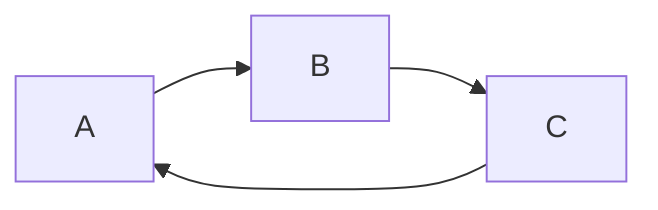
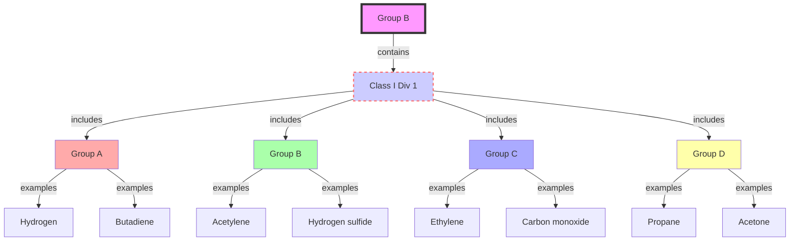

There are different types of diagrams that can be drawn with markdown, such as flowcharts, sequence diagrams, class diagrams, gantt charts, pie charts, etc. One of the tools that can be used to draw diagrams with markdown is Mermaid, which is supported by some markdown editors and platforms, such as Typora and GitHub.

To draw a diagram with Mermaid, you need to use the following syntax:

This will produce a simple directed graph with three nodes and three edges.

To draw a more detailed diagram, you can use different shapes, colors, labels, links, and styles. For example, the following syntax:

This will produce a more detailed diagram for Group B, based on the information from :

#### Group B
