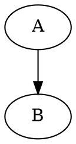
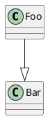

There are several ways to draw ASCII diagrams, depending on the tools and formats you prefer. Here are some possible options:

- You can use Graphviz to create diagrams in the DOT language, and then use Graph::Easy to convert them to ASCII. For example, to draw a simple graph with two nodes and an edge, you can write:



And then use the command:

```bash
cat graph.dot | graph-easy --from=dot --as_ascii
```

To get the output:

```ascii
+---+     +---+
| A | --> | B |
+---+     +---+
```

- You can use Asciidoctor Diagram to create diagrams in various plain-text formats, such as ditaa, PlantUML, Graphviz, etc. and then render them as images or ASCII. For example, to draw a simple class diagram with PlantUML, you can write:



And then use the command:

```bash
asciidoctor-diagram -a imagesdir=images -a asciimath -a stem document.adoc
```

To get the output:

```ascii
+-----+
| Foo |
+-----+
  ^
  |
+-----+
| Bar |
+-----+
```

- You can use ASCIIFlow, a web-based tool that lets you draw ASCII diagrams interactively. You can use the mouse to draw boxes, lines, arrows, text, etc. and then export the diagram as plain text or HTML. For example, to draw a simple flowchart, you can use the tool as shown below:


And then export the diagram as:

```ascii
  +------+   y   +------+
  |      | ----> |      |
  | Foo  |       | Bar  |
  |      | <---- |      |
  +------+   n   +------+
```

- You can use a text editor that supports ASCII drawing, such as Vim with the DrawIt plugin. This plugin lets you draw boxes, lines, ellipses, arrows, etc. inside a text file using keyboard shortcuts. For example, to draw a simple table, you can use the plugin as shown below:


And then get the output as:

```ascii
+--------+--------+--------+
| Header | Header | Header |
+--------+--------+--------+
| Cell   | Cell   | Cell   |
+--------+--------+--------+
| Cell   | Cell   | Cell   |
+--------+--------+--------+
```

I hope this helps you draw detailed ASCII diagrams. If you have any questions or feedback, please let me know.