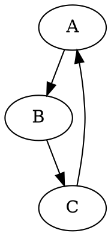

There are several tools and methods to draw ASCII diagrams. One of them is using Graphviz and Graph::Easy modules. Another one is using Asciidoctor Diagram, which supports various diagram types such as ditaa, PlantUML and Graphviz. A third option is using ASCIIFlow, a web-based tool that allows freeform drawing and exporting to text or HTML.

To draw a detailed ASCII diagram, you need to choose a tool that suits your needs and preferences, and follow the syntax and commands of that tool. For example, if you use Graphviz and Graph::Easy, you need to write a dot file that describes the nodes and edges of your graph, and then pipe it to graph-easy with the --from=dot and --as_ascii options. If you use Asciidoctor Diagram, you need to write a diagram block in your AsciiDoc document, and specify the type and attributes of your diagram. If you use ASCIIFlow, you can draw your diagram with your mouse and keyboard, and export it as text or HTML.

Here is an example of a simple ASCII diagram drawn with Graphviz and Graph::Easy:



```ascii
+---+     +---+     +---+
| A | --> | B | --> | C |
+---+     +---+     +---+
  ^                   |
  |                   |
  +-------------------+
```