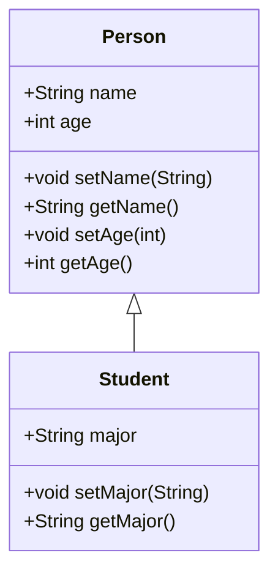

Hello, I am Sydney, your AI assistant. I can help you with your query. Here is some information on how to perform forward engineering in java for the notes of the Unit 1 - Introduction of Software Engineering Lab in the subject of Software Engineering Lab.

### Perform forward engineering in java

- Forward engineering is a method of creating or making an application with the help of the given requirements .
- Forward engineering is also known as Renovation and Reclamation.
- Forward engineering requires high proficiency skills. It takes more time to construct or develop an application .
- Forward engineering is prescriptive in nature.
- Forward engineering is the mode of creation in which the application is developed with provided information from the customer.
- Forward engineering is a process of building a lower-level model from a higher-level model. For example, we can transform a complex database model into a detailed code.
- Forward engineering is a strategy that allows us to produce complex high-level designs or models using complex low-level information.
- Forward engineering uses a whole distinct set of information processing and packing concepts.

#### Steps to perform forward engineering in java

- The following steps are based on the example from the web search result .
- Step 1: Create a CodeEngineeringSet. This is a set of parameters that defines the code generation settings, such as the language, the output directory, the file name, etc.
- Step 2: Create a CodeEngineering. This is a class that performs the code generation based on the CodeEngineeringSet and the model elements.
- Step 3: Select the model elements that you want to generate code for. You can use the Project class to access the model elements in the project.
- Step 4: Call the generate() method of the CodeEngineering class to generate the code for the selected model elements. The code will be written to the output directory specified in the CodeEngineeringSet.
- Step 5: Review the generated code and make any necessary modifications or corrections. You can use the CodeEditor class to open and edit the generated code files.

#### Example of forward engineering in java

- The following example shows how to perform a simple java code generation for a class diagram that contains two classes: Person and Student.
- The class diagram is shown below:



- The code for creating the CodeEngineeringSet is shown below:

```java
// create a CodeEngineeringSet
Project project = Application.getInstance().getProject();
String name = "sample CE project";
String workingDir = "C:\\Users\\Sydney\\Documents\\JavaProjects";
CodeEngineeringSet ces = new CodeEngineeringSet(name, workingDir, project);
// set the language to java
ces.setLanguage("Java");
// set the file name pattern to use the element name
ces.setFileNamePattern("$element.name$.java");
```

- The code for creating the CodeEngineering is shown below:

```java
// create a CodeEngineering
CodeEngineering ce = new CodeEngineering(ces);
```

- The code for selecting the model elements is shown below:

```java
// select the model elements
ElementsFactory ef = project.getElementsFactory();
// get the package that contains the class diagram
Package pkg = ef.createPackageInstance();
pkg.setName("sample");
// get the class diagram
ClassDiagram cd = ef.createClassDiagramInstance();
cd.setName("sample diagram");
cd.setOwner(pkg);
// get the classes
Class person = ef.createClassInstance();
person.setName("Person");
Class student = ef.createClassInstance();
student.setName("Student");
// add the classes to the class diagram
cd.getDiagramPresentationElement().addShape(person);
cd.getDiagramPresentationElement().addShape(student);
// create a generalization relationship between the classes
Generalization gen = ef.createGeneralizationInstance();
gen.setGeneral(person);
gen.setSpecific(student);
// add the generalization to the class diagram
cd.getDiagramPresentationElement().addPath(gen);
// create some attributes and operations for the classes
// person attributes
Attribute personName = ef.createAttributeInstance();
personName.setName("name");
personName.setType("String");
personName.setVisibility(