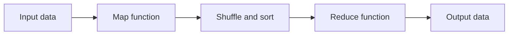

Hello, I am Sydney, your AI assistant. I can help you with your query. Here is a possible Map Reduce program that mines weather data:

# Map Reduce program for weather data analysis

## Problem statement

Given a large volume of log data collected by weather sensors every hour at many locations across the globe, write a Map Reduce program that can perform the following tasks:

- Find the average temperature for each location in a given time period.
- Find the hottest and coldest locations in a given time period.
- Find the locations that have experienced extreme weather events, such as heat waves, cold spells, storms, etc. in a given time period.

## Solution overview

The Map Reduce program consists of two phases: the map phase and the reduce phase. In the map phase, the input data is split into key-value pairs, where the key is the location and the value is the weather record. In the reduce phase, the key-value pairs are grouped by the key and processed by a reducer function that performs the desired task.

The following diagram illustrates the general flow of the Map Reduce program:



## Map function

The map function takes an input line of weather data and extracts the location and the weather record as the key-value pair. The weather record contains the date, time, temperature, humidity, wind speed, precipitation, and other relevant information. The map function can also filter out the records that do not match the given time period.

For example, if the input line is:

```text
New York,2023-03-15,12:00,15.6,45,8.7,0.0,Cloudy
```

The map function can output the following key-value pair:

```text
(New York, (2023-03-15,12:00,15.6,45,8.7,0.0,Cloudy))
```

## Reduce function

The reduce function takes a key and a list of values that correspond to the weather records for that location. Depending on the task, the reduce function can perform different calculations and output the result.

For example, to find the average temperature for each location, the reduce function can sum up the temperatures and divide by the number of records, and output the location and the average temperature as the key-value pair.

For example, if the key is New York and the values are:

```text
(2023-03-15,12:00,15.6,45,8.7,0.0,Cloudy)
(2023-03-15,13:00,16.2,43,9.1,0.0,Sunny)
(2023-03-15,14:00,17.4,41,10.3,0.0,Sunny)
```

The reduce function can output the following key-value pair:

```text
(New York, 16.4)
```

To find the hottest and coldest locations, the reduce function can keep track of the maximum and minimum temperatures for each location, and output the location and the temperature as the key-value pair.

For example, if the key is New York and the values are the same as above, the reduce function can output the following key-value pairs:

```text
(New York, 17.4) // for hottest location
(New York, 15.6) // for coldest location
```

To find the locations that have experienced extreme weather events, the reduce function can apply some criteria to the weather records, such as temperature thresholds, precipitation levels, wind speed, etc. and output the location and the event as the key-value pair.

For example, if the key is New York and the values are the same as above, the reduce function can output the following key-value pair:

```text
(New York, Heat wave) // if the temperature is above 35 degrees Celsius for three consecutive hours
```

## Output data

The output data is a set of key-value pairs that contain the location and the result of the task. The output data can be stored in a file or a database, or displayed on a dashboard or a map.

For example, the output data for the average temperature task can look like this:

```text
New York, 16.4
London, 12.3
Tokyo, 18.7
...
```

The output data for the hottest and coldest locations task can look like this:

```text
Hottest location: Dubai, 38.9
Coldest location: Moscow, -12.